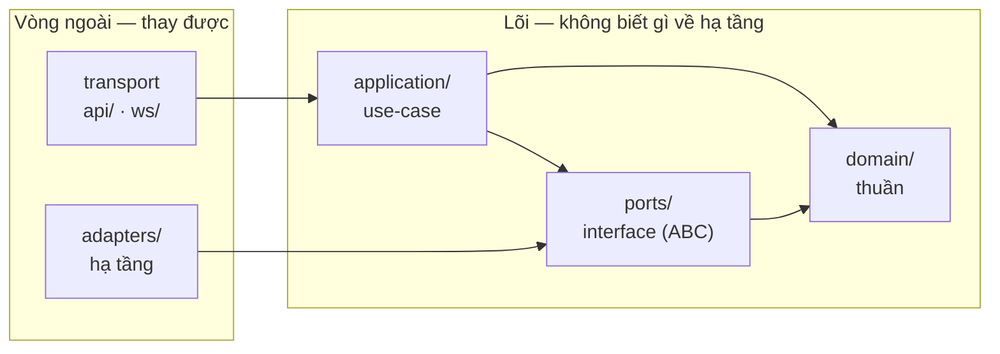
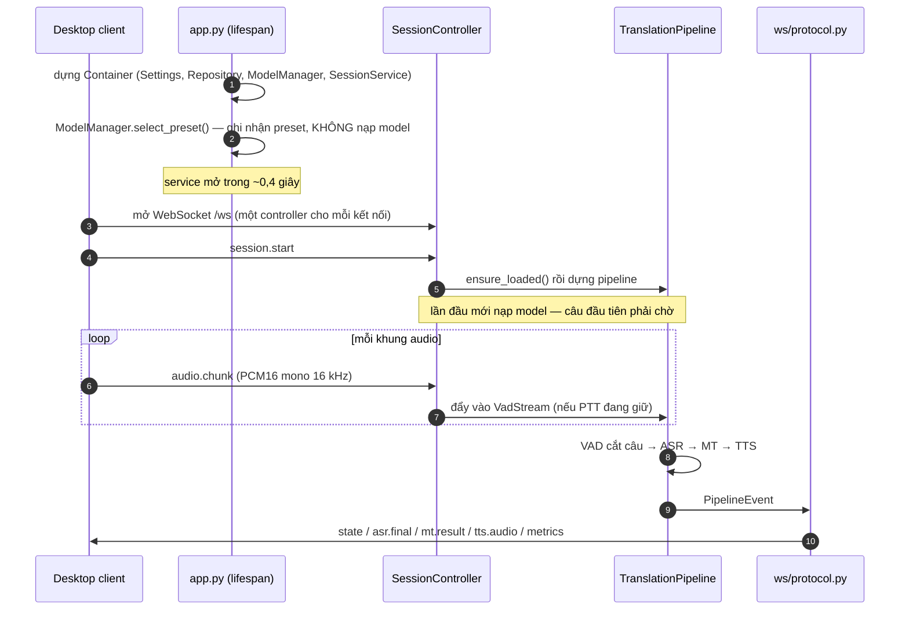
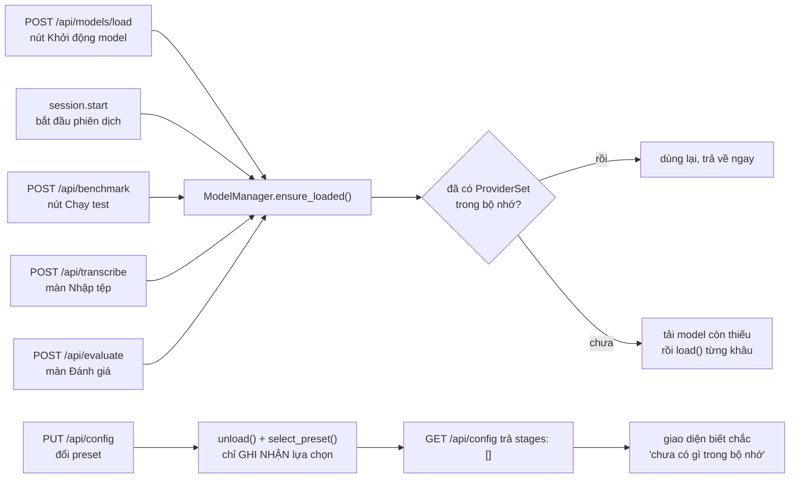
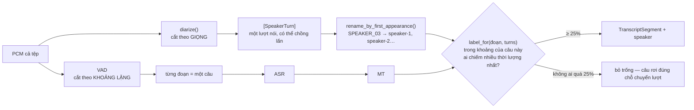

# Kiến trúc AI Service — Hexagonal (Ports & Adapters)

Mục tiêu: đổi được model/runtime (whisper.cpp ↔ MLX ↔ faster-whisper, NLLB ↔ Qwen…) và
test dễ mà không sửa logic pipeline. Đạt được bằng cách cô lập nghiệp vụ khỏi hạ tầng.

Tài liệu này giải thích **vì sao mã nguồn có hình dạng như hiện tại**. Phần "đã làm gì,
tuần nào" nằm ở [`docs/03`](../../docs/03_nhat-ky-tuan-1-8.md) và
[`docs/04`](../../docs/04_cac-dot-bo-sung.md); phần bẫy cục bộ của từng thư viện nằm ở
docstring của chính adapter đó.

## Quy tắc phụ thuộc

**Chiều phụ thuộc luôn hướng vào trong.** `domain` không import gì; `application` chỉ biết
`ports` + `domain`; `adapters` và `transport` là vòng ngoài, có thể thay.

## Các tầng

| Tầng        | Thư mục                        | Vai trò                                                                                    | Được phép import     |
| ----------- | ------------------------------ | ------------------------------------------------------------------------------------------ | -------------------- |
| Domain      | `domain/`                      | Model + enum + event thuần                                                                 | (không gì)           |
| Ports       | `ports/`                       | Interface (ABC) cho VAD/ASR/MT/TTS/Diarization/Repository                                  | domain               |
| Application | `application/`                 | Pipeline, ModelManager, SessionService, HistoryPolicy, Container                           | ports, domain        |
| Adapters    | `adapters/`                    | Hiện thực port: whisper.cpp, MLX, CTranslate2, NLLB, sherpa-onnx, Kokoro, pyannote, SQLite | ports, domain        |
| Config      | `config/`                      | Settings + preset → chọn adapter/model                                                     | domain               |
| Transport   | `api/`, `ws/`                  | REST + WebSocket mỏng, gọi application                                                     | application, schemas |
| Schemas     | `schemas.py`, `ws/protocol.py` | DTO/wire format (tách khỏi domain)                                                         | domain               |

## Luồng runtime

Model blocking không chạy trên event loop — xem "Hai loại executor" bên dưới.

## Chín quyết định định hình mã nguồn

### 1. VAD tách "model" khỏi "state theo luồng"

`ProviderSet` dùng chung cho mọi kết nối, nhưng VAD có state **theo từng luồng** — buffer và
hidden-state RNN của Silero. Hai pipeline incoming/outgoing dùng chung một VAD thì hỏng state
của nhau. Nên port VAD tách hai vai:

| Khái niệm                          | Vai trò                        | Vòng đời                   |
| ---------------------------------- | ------------------------------ | -------------------------- |
| `VoiceActivityDetector` (Provider) | `load()`/`unload()` model      | 1 lần, dùng chung          |
| `VadStream`                        | `accept()`/`reset()`/`flush()` | 1 stream/nguồn audio/phiên |

`TranslationPipeline` mở `vad.open_stream()` riêng trong `__init__`. `flush()` tồn tại vì khi
nhả Push-to-talk, client ngừng gửi audio nên VAD sẽ không bao giờ thấy đoạn im lặng để chốt câu.

### 2. Hai loại executor, không thay nhau được

Model blocking không được chạy trên event loop. Nhưng hai runtime đòi hai kiểu thread khác nhau:

- `SerialExecutor` — `asyncio.to_thread` + lock. Mặc định, dùng cho **mọi adapter trừ MLX**
  (whisper.cpp, faster-whisper, NLLB, sherpa-onnx, Kokoro, pyannote): chúng chỉ cần được
  **tuần tự hoá** vì context không thread-safe, còn chạy ở thread nào thì không quan trọng.
- `PinnedExecutor` — pool đúng **một** worker cố định. Bắt buộc cho MLX: nó gắn GPU stream vào
  chính thread đã tạo ra stream đó, nên `load()` và `transcribe()` rơi vào hai thread khác nhau
  là ném `RuntimeError: There is no stream (gpu,0) in current thread`.

### 3. Nạp theo yêu cầu, và `stages: []` là tín hiệu ở mức giao thức

Nạp lúc khởi động làm service mất ~45 giây mới mở. Giờ **mọi** đường cần tới model đều đi qua
đúng một cửa là `ModelManager.ensure_loaded()` — thêm một màn hình cần model thì gọi cửa đó
chứ không tự nạp. **Chọn preset không nằm trong số đó**:

Năm lối vào ở trên là con số **tại thời điểm viết** — đếm lại bằng
`grep -rn ensure_loaded src/`, đừng tin con số này. Hai lối cuối (Nhập tệp, Đánh giá) ra đời
sau ba lối đầu, và tài liệu đã có lúc nói "ba lối vào" trong khi code đã là năm.

`LLVT_PRELOAD_MODELS=true` khôi phục hành vi nạp sẵn cho lần chạy headless. Mảng `stages`
**rỗng** là tín hiệu ở mức giao thức — giao diện đọc nó chứ không đoán.

### 4. Một model có đúng một chuỗi định danh: đường dẫn thật ở thượng nguồn

Khoá của mọi `MODEL_MAP` là đường dẫn thật — HF repo id với MLX/faster-whisper/NLLB/pyannote,
tên file trong repo với GGML (`ggml-small-q5_1.bin`, vì whisper.cpp phân phối theo file). Chuỗi
đó dùng ở mọi chỗ: danh mục, ô "Tự chọn", preset, `POST /api/models/download`, và (bỏ đuôi
`.bin`) chính là tên `GET /api/models` báo về trên đĩa. Tên ngoài danh sách truyền thẳng xuống
adapter nên repo tương thích khác vẫn nạp được.

**Ba runtime ASR không dùng chung model nào** — GGML là _file_, MLX và CTranslate2 là _repo_ đã
chuyển đổi sẵn. Nên `custom.asrModelChoices` là `dict[adapter → models]`, `PUT /api/config` từ
chối tổ hợp chéo bằng 400, và đổi runtime thì model đang lưu tự xoá nếu không thuộc runtime mới.
Preset là một **mức chất lượng**, không phải một model: `PresetConfig.asr_alternatives` giữ bảng
tương đương giữa ba runtime.

### 5. Nhập tệp là use case riêng, không phải một chế độ của pipeline

`application/transcribe.py` đứng cạnh `pipeline.py` chứ không phải một nhánh `if` bên trong nó.
Đầu vào là cả tệp (biết trước độ dài) thay vì luồng khung; chốt câu bằng `flush()` ở cuối tệp
thay vì chờ khoảng lặng; **không** có TTS; trả một response thay vì chảy event. Điểm chung được
giữ: cùng `ProviderSet`, cùng `ModelManager`, cùng kiểu ghi lịch sử.

Đây cũng là nơi duy nhất gọi diarization.

### 6. Chính sách nằm ở application, không nằm ở adapter

Hai lớp cùng một khuôn — chúng hiện thực **chính cái port** mà chúng bọc, nên pipeline không biết
mình đang nói chuyện với ai:

| Lớp                 | Bọc port               | Quyết định gì                                         |
| ------------------- | ---------------------- | ----------------------------------------------------- |
| `HistoryPolicy`     | `SessionRepository`    | Có được phép GHI không (SPEC 14.4) — đọc/xoá vẫn chạy |
| `LanguageRoutedTts` | `TextToSpeechProvider` | Ngôn ngữ đích nào thì gọi engine nào                  |

Adapter biết _cách_ làm, không biết _có được phép_ làm hay _khi nào nên_ làm.

### 7. Diarization là port tuỳ chọn, và nhãn người nói là một hàm thuần

`ports/diarization.py` tách riêng khỏi `SpeechToTextProvider`: hai bài toán độc lập, đổi model
diarization không được đụng ASR. `ProviderSet.diarizer` là `Optional` — bản cài không có nó vẫn
chạy đủ, và khâu `DIA` nạp hỏng thì bị đánh dấu `failed` chứ không kéo bốn khâu kia theo.

`application/speaker_labels.py` là hàm thuần vì đây là chỗ **hai cách cắt âm thanh gặp nhau và
chúng không trùng nhau** — nhìn rõ nhất ở chỗ hai nhánh dưới đây chập lại:

Vì hai nhánh cắt khác nhau nên **không tra được theo mốc bắt đầu**; phải hỏi theo độ chồng lấn
thời lượng. Tách thành hàm thuần nên test được mà không cần tải model gated về.

### 8. Duyệt trước khi gửi cắt pipeline làm hai

`TranslationPipeline` tách bước tổng hợp giọng thành `_speak()`. Bật `review` thì luồng dừng sau
MT, treo câu lại và báo `WaitingForConfirmation`; TTS chỉ chạy khi có `control.confirm`. Chỉ áp
cho chiều **outgoing** — `review and synthesize` trong hàm dựng nói thẳng điều đó thay vì để
người gọi tự nhớ.

### 9. Cấu hình có hai nguồn, env luôn thắng

`Settings` đọc env var, nhưng người dùng cuối không đặt được env var còn lựa chọn của họ phải
sống sót qua lần mở app sau. Nên `config/runtime_config.py` thêm `~/.llvt/settings.json` làm
nguồn thứ hai, xếp **dưới** env trong pydantic-settings. Đặt `LLVT_MODELS_DIR` là có chủ ý rõ
ràng → API trả `modelsDirEditable: false` và `PUT` trả 409.

File này ghi quyền `0600` vì nó giữ HF token — bí mật duy nhất của ứng dụng. Token không bao giờ
đi ngược về renderer; `publish_hf_token()` chép nó vào `os.environ["HF_TOKEN"]`, đủ cho cả ba
đường tải model vì `huggingface_hub.get_token()` đọc biến đó tại thời điểm gọi.

## Thêm một backend mới

1. Tạo `adapters/asr/<tên>.py` implement `SpeechToTextProvider`.
2. Đăng ký **một dòng** trong `application/model_manager.py` (`ASR_REGISTRY[...] = ...`).
3. Thêm model tương đương vào `asr_alternatives` của từng preset trong `config/presets.py`.

Không đụng `application/pipeline.py`, `application/transcribe.py` hay transport. Đó là mục tiêu
của kiến trúc này, và `adapters/asr/mlx_whisper.py` là ví dụ đã làm thật.

Khi so hai runtime, đặt **tham số giải mã đối xứng** (tắt fallback nhiệt độ, không mang ngữ cảnh
sang câu sau ở cả hai) — so sánh chỉ có nghĩa khi chính sách giải mã giống nhau.

## Trạng thái hiện tại

Mọi adapter đã chạy model thật, **không còn stub nào**: VAD Silero, ASR whisper.cpp
(`whisper_cpp.py`) + MLX (`mlx_whisper.py`, extra `mlx`) + CTranslate2 (`faster_whisper.py`,
extra `ctranslate2`), MT NLLB-200, TTS sherpa-onnx cho vi/en/zh + Kokoro/OpenJTalk cho ja,
diarization pyannote (extra `diarization`, mặc định tắt), lịch sử phiên SQLite.

Hợp đồng REST/WS được định nghĩa **hai lần** và phải đồng bộ tay: `ws/protocol.py` +
`schemas.py` phía Python, `apps/desktop/src/renderer/src/domain/` phía TypeScript.
