# Bổ sung SPEC: Hệ điều hành, Technology Stack và AI Models

---

> **Điều chỉnh phạm vi — 10/09/2026: bỏ phần tích hợp Google Meet qua microphone ảo.**
>
> Văn bản SPEC bên dưới giữ nguyên như đã viết, nên mọi chỗ nói tới microphone ảo,
> BlackHole/VB-CABLE hoặc định tuyến âm thanh vào Google Meet đều là **bản ghi của
> thiết kế ban đầu**, không mô tả bản đang chạy. Bản hiện tại phát bản dịch ra
> loa/tai nghe; thu microphone, thu âm thanh hệ thống và sáu chiều dịch giữ nguyên.
> Lý do bỏ và cách bật lại: [`13_google-meet-and-virtual-mic.md`](13_google-meet-and-virtual-mic.md).

---

## 1. Phân tích TranscriptionSuite

### 1.1. Kiến trúc hiện tại

TranscriptionSuite sử dụng kiến trúc desktop client kết hợp local AI backend:

| Thành phần              | Công nghệ                              |
| ----------------------- | -------------------------------------- |
| Desktop shell           | Electron                               |
| Frontend                | React, TypeScript                      |
| Build frontend          | Vite                                   |
| UI styling              | Tailwind CSS                           |
| State management        | Zustand                                |
| Server-state management | TanStack Query                         |
| Local backend           | Python                                 |
| API                     | FastAPI REST API                       |
| Realtime communication  | WebSocket                              |
| Database                | SQLite, FTS5                           |
| Packaging               | electron-builder                       |
| Windows installer       | NSIS                                   |
| macOS installer         | DMG                                    |
| VAD                     | Silero VAD và WebRTC VAD               |
| Audio processing        | FFmpeg, NumPy, SoundFile, TorchAudio   |
| Model runtime           | PyTorch, CTranslate2, whisper.cpp, MLX |

Frontend và backend được tách thành hai process. Electron phụ trách giao diện, trong khi Python backend quản lý model, transcription, lưu trữ và xử lý tác vụ AI.

### 1.2. Các model được TranscriptionSuite hỗ trợ

Trên Windows và Linux, TranscriptionSuite hỗ trợ:

- WhisperX.
- faster-whisper.
- whisper.cpp.
- NVIDIA NeMo Parakeet.
- NVIDIA NeMo Canary.
- VibeVoice-ASR.

Trên máy Mac Apple Silicon, ứng dụng sử dụng các implementation dựa trên MLX:

- MLX Whisper.
- MLX Parakeet.
- MLX Canary.
- MLX VibeVoice.

Live Mode hiện chủ yếu sử dụng Whisper hoặc whisper.cpp; các backend NeMo và VibeVoice không được dùng cho Live Mode.

### 1.3. Hạn chế đối với đồ án

TranscriptionSuite chưa đáp ứng đầy đủ bài toán của đồ án vì:

1. Chức năng chính là speech-to-text và quản lý transcription.
2. Whisper chỉ hỗ trợ chức năng dịch giọng nói sang tiếng Anh.
3. Canary chỉ hỗ trợ một số hướng dịch thuộc nhóm ngôn ngữ châu Âu.
4. Không đáp ứng đầy đủ:
   - Việt ↔ Anh.
   - Việt ↔ Nhật.
   - Việt ↔ Trung.

5. Trong kiến trúc và dependency công khai chưa thấy pipeline Text-to-Speech hoàn chỉnh.
6. Chưa có luồng đưa âm thanh dịch vào virtual microphone.
7. Chưa có cơ chế hội thoại dịch hai chiều dành cho Google Meet.

Do đó, đồ án nên tái sử dụng các ý tưởng sau:

- Electron frontend kết hợp Python local backend.
- FastAPI và WebSocket.
- Model adapter cho nhiều AI backend.
- Silero VAD.
- Quản lý model local.
- Theo dõi CPU, RAM, GPU và VRAM.
- Đóng gói ứng dụng riêng cho từng hệ điều hành.

Phần Translation, TTS, audio routing và virtual microphone cần được xây dựng thêm.

---

# 2. Hệ điều hành MVP

## 2.1. Windows

Phạm vi hỗ trợ chính thức:

```text
Windows 11
CPU architecture: x86_64
```

Các cấu hình phần cứng:

| Cấu hình   | Mức hỗ trợ                                |
| ---------- | ----------------------------------------- |
| NVIDIA GPU | Tối ưu                                    |
| AMD GPU    | Hỗ trợ qua Vulkan khi runtime tương thích |
| Intel GPU  | Hỗ trợ thử nghiệm qua Vulkan              |
| CPU only   | Hỗ trợ nhưng độ trễ cao hơn               |

## 2.2. macOS

Phạm vi hỗ trợ chính thức:

```text
macOS 13 trở lên
Apple Silicon: M1, M2, M3, M4 hoặc mới hơn
Architecture: arm64
```

Apple Silicon là mục tiêu hiệu năng chính vì có thể sử dụng Metal, MLX hoặc whisper.cpp được tối ưu cho kiến trúc ARM của Apple. whisper.cpp hỗ trợ Metal và Core ML, trong khi TranscriptionSuite sử dụng MLX cho các backend native trên Apple Silicon.

### macOS Intel

Ứng dụng có thể được đóng gói cho macOS x64, nhưng macOS Intel chỉ được xem là chế độ:

```text
Best-effort / CPU only
```

Theo phạm vi đề cương, macOS chính thức chỉ giới hạn ở Apple Silicon; Mac Intel nằm ngoài phạm vi MVP và không áp dụng tiêu chí độ trễ realtime chính thức. TranscriptionSuite cũng chỉ cung cấp hướng CPU cho Intel Mac và cảnh báo hiệu năng thấp hơn so với Apple Silicon.

---

# 3. Technology Stack được lựa chọn

## 3.1. Desktop application

```text
Electron
React
TypeScript
Vite
Tailwind CSS
Zustand
TanStack Query
electron-builder
```

### Trách nhiệm

Electron application phụ trách:

- Hiển thị giao diện.
- Chọn thiết bị âm thanh.
- Điều khiển phiên dịch.
- Hiển thị subtitle.
- Hiển thị trạng thái pipeline.
- Quản lý cài đặt.
- Hiển thị lịch sử hội thoại.
- Phát audio TTS đến output device.
- Giao tiếp với local AI service.

### Lý do lựa chọn

Stack này tương tự TranscriptionSuite, có khả năng đóng gói cho cả Windows NSIS và macOS DMG từ cùng một codebase. Electron cũng cung cấp MediaDevices API và khả năng tích hợp native module khi cần xử lý audio đặc thù của hệ điều hành.

---

## 3.2. Local AI Service

```text
Python 3.11 hoặc Python 3.12
FastAPI
WebSocket
Pydantic
uv
SQLite
SQLAlchemy
Alembic
```

### Trách nhiệm

Local AI Service phụ trách:

- Voice Activity Detection.
- Speech-to-Text.
- Machine Translation.
- Text-to-Speech.
- Quản lý model.
- Hàng đợi xử lý.
- Theo dõi latency.
- Theo dõi CPU, RAM, GPU và VRAM.
- Lưu lịch sử phiên.
- Trả kết quả realtime cho Electron.

### Giao tiếp

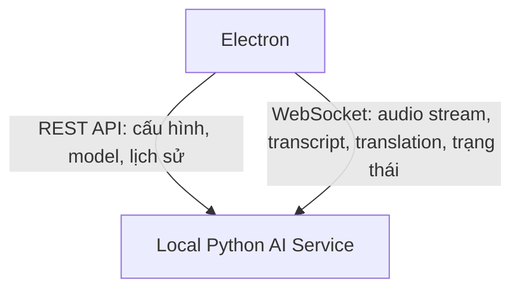

Service chỉ được bind vào:

```text
127.0.0.1
```

Không mở cổng truy cập từ mạng LAN hoặc Internet.

TranscriptionSuite cũng sử dụng FastAPI kết hợp REST API và WebSocket giữa Electron frontend và Python backend.

---

## 3.3. Không sử dụng Docker trong bản desktop MVP

Khác với cách TranscriptionSuite triển khai một số backend trên Windows, ứng dụng của đồ án không nên yêu cầu người dùng cài Docker hoặc Podman.

AI Service sẽ được đóng gói thành native sidecar đi kèm ứng dụng.

### Lý do

- Dễ truy cập microphone và system audio.
- Dễ định tuyến audio đến virtual device.
- Không cần cấu hình GPU passthrough.
- Không yêu cầu người dùng cài Docker Desktop.
- Giảm độ phức tạp khi cài đặt.
- Phù hợp với sản phẩm desktop dành cho người dùng cuối.

Cấu trúc đóng gói:

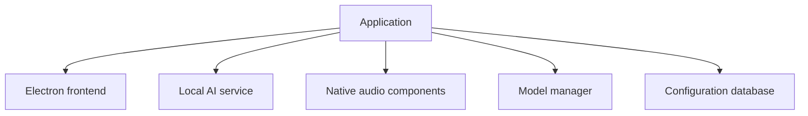

---

# 4. Audio Architecture

## 4.1. Audio format nội bộ

Đầu vào ASR:

```text
Format: PCM signed 16-bit
Channels: Mono
Sample rate: 16.000 Hz
Frame duration: 20–100 ms
```

Đầu ra TTS:

```text
Format: PCM signed 16-bit hoặc Float32
Channels: Mono
Sample rate: phụ thuộc TTS model
```

Audio module chịu trách nhiệm resample về định dạng model yêu cầu.

---

## 4.2. Windows audio capture

### Thu âm thanh từ Google Meet

Sử dụng:

```text
Windows Audio Session API — WASAPI Loopback
```

WASAPI loopback cho phép capture âm thanh đang được phát qua output endpoint của Windows mà không yêu cầu Google Meet cung cấp API riêng.

Luồng:

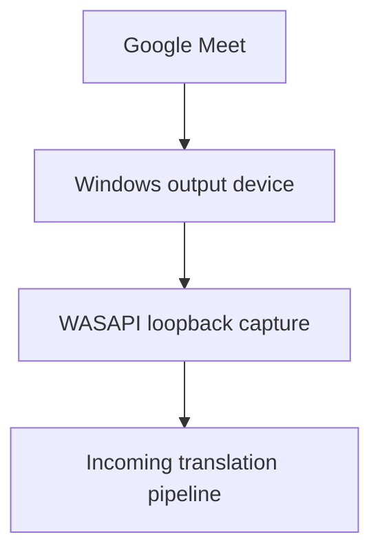

### Truyền giọng nói đã dịch vào Google Meet

MVP sử dụng VB-CABLE:

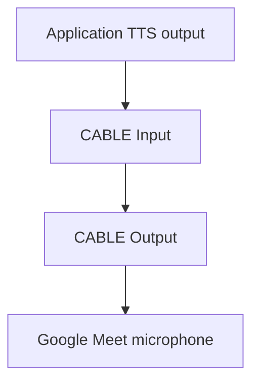

VB-CABLE hoạt động như một thiết bị âm thanh ảo: âm thanh phát đến CABLE Input sẽ được chuyển sang CABLE Output để ứng dụng khác nhận như microphone.

---

## 4.3. macOS audio capture

### Thu âm thanh từ Google Meet

Sử dụng:

```text
ScreenCaptureKit
```

ScreenCaptureKit hỗ trợ capture nội dung màn hình cùng audio của ứng dụng hoặc hệ thống. Audio capture module phải bật cơ chế loại trừ âm thanh do chính ứng dụng phát để giảm nguy cơ nhận diện lại TTS.

Luồng:

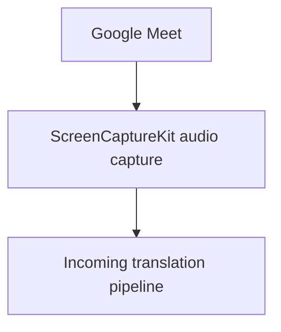

Ứng dụng cần yêu cầu các quyền:

- Microphone permission.
- Screen and System Audio Recording permission.

### Truyền giọng nói đã dịch vào Google Meet

MVP sử dụng BlackHole 2ch:

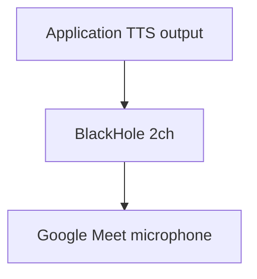

BlackHole là virtual audio loopback driver dành cho macOS và có thể đưa audio output của một ứng dụng thành input cho ứng dụng khác.

---

## 4.4. Audio Engine

Audio Engine được tách thành interface chung:

```text
AudioCaptureAdapter
AudioOutputAdapter
AudioDeviceManager
AudioResampler
AudioBuffer
```

Implementation theo nền tảng:

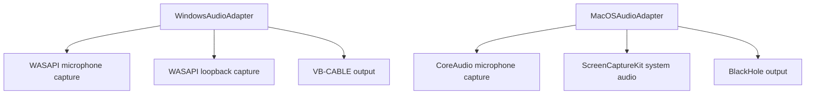

Electron không được phụ thuộc trực tiếp vào logic riêng của từng hệ điều hành. Các implementation phải nằm phía sau một abstraction layer.

---

# 5. Voice Activity Detection

## Model mặc định

```text
Silero VAD
```

Silero VAD được sử dụng để:

- Phát hiện thời điểm bắt đầu nói.
- Phát hiện kết thúc câu.
- Loại bỏ khoảng lặng.
- Tạo utterance trước khi gửi vào ASR.
- Giảm số lượng audio frame phải xử lý.

WebRTC VAD có thể được sử dụng như:

- Energy gate ban đầu.
- Fallback khi Silero không load được.
- Bộ lọc tiếng ồn nhẹ trước Silero.

Cách kết hợp Silero và WebRTC VAD cũng được sử dụng trong kiến trúc TranscriptionSuite.

---

# 6. Speech-to-Text Model

## 6.1. Model family

Model ASR chính:

```text
OpenAI Whisper
```

Whisper chỉ được sử dụng để nhận diện giọng nói, không sử dụng chức năng `translate to English`.

Model phải chạy với task:

```text
task = transcribe
```

Ngôn ngữ đầu vào được truyền cụ thể:

```text
vi
en
ja
zh
```

Sau đó kết quả text mới được chuyển sang Translation Module độc lập.

---

## 6.2. Runtime mặc định

### Runtime chung cho Windows và macOS

```text
whisper.cpp
```

whisper.cpp phù hợp làm runtime nền tảng vì hỗ trợ:

- macOS Apple Silicon thông qua Metal và Core ML.
- CPU x86 với các instruction được tối ưu.
- Quantized model.
- NVIDIA GPU.
- Vulkan cho một số GPU AMD và Intel.
- C/C++ API để tích hợp với desktop application.

### Preset model

| Preset   | Model                                        |
| -------- | -------------------------------------------- |
| Fast     | Whisper small hoặc medium, quantized Q5      |
| Balanced | Whisper large-v3-turbo, quantized Q5         |
| Quality  | Whisper large-v3-turbo Q8 hoặc non-quantized |

Preset mặc định:

```text
Whisper large-v3-turbo Q5
```

Lý do:

- Hỗ trợ đủ bốn ngôn ngữ.
- Nhanh hơn model large-v3 đầy đủ.
- Phù hợp với near-realtime processing.
- Có thể chạy trên cả Windows và macOS thông qua cùng một runtime.

Kết quả thực tế về latency và độ chính xác phải được benchmark trên các máy mục tiêu trước khi cố định model trong bản release.

---

## 6.3. Optimized backend mở rộng

Kiến trúc phải hỗ trợ thêm các backend sau mà không thay đổi pipeline chính.

### macOS Apple Silicon

```text
MLX Whisper
```

### Windows với NVIDIA GPU

```text
faster-whisper
CTranslate2
CUDA
```

faster-whisper sử dụng CTranslate2 để thực thi Whisper và phù hợp làm backend tăng tốc cho máy Windows có NVIDIA GPU.

Interface:

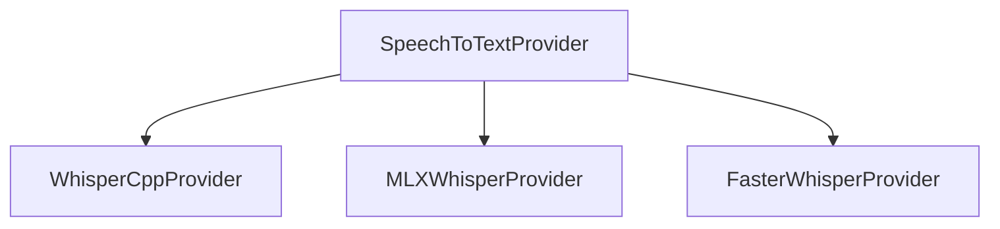

Trong MVP đầu tiên chỉ bắt buộc hoàn thiện `WhisperCppProvider`. Hai provider còn lại thuộc giai đoạn tối ưu.

---

# 7. Translation Model

## 7.1. Model mặc định

```text
facebook/nllb-200-distilled-600M
```

NLLB-200 hỗ trợ dịch giữa gần 200 ngôn ngữ, bao gồm bốn ngôn ngữ mục tiêu của đồ án. Model được dùng theo dạng text-to-text và tách biệt hoàn toàn với Whisper.

Language code:

| Ngôn ngữ             | NLLB code  |
| -------------------- | ---------- |
| Tiếng Việt           | `vie_Latn` |
| Tiếng Anh            | `eng_Latn` |
| Tiếng Nhật           | `jpn_Jpan` |
| Tiếng Trung giản thể | `zho_Hans` |

Nhờ đó hệ thống hỗ trợ:

```text
Vietnamese ↔ English
Vietnamese ↔ Japanese
Vietnamese ↔ Chinese
```

Ngoài sáu chiều dịch MVP, kiến trúc này cũng có thể mở rộng sang:

```text
English ↔ Japanese
English ↔ Chinese
Japanese ↔ Chinese
```

mà không cần thay model.

---

## 7.2. Cách xử lý

NLLB được sử dụng theo từng utterance:

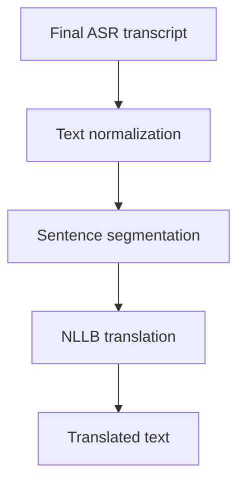

Không gửi partial transcript liên tục vào model dịch. Chỉ dịch khi:

- ASR trả kết quả final.
- Hoặc utterance đạt giới hạn thời lượng và được hệ thống tự ngắt.

NLLB được thiết kế chủ yếu cho dịch câu hoặc đoạn ngắn; model card cũng lưu ý giới hạn với tài liệu dài và nội dung thuộc lĩnh vực nhạy cảm.

---

## 7.3. Giấy phép

NLLB-200 distilled 600M sử dụng giấy phép:

```text
CC-BY-NC-4.0
```

Model phù hợp với:

- Đồ án.
- Nghiên cứu.
- Demo phi thương mại.

Không được mặc định chọn cho sản phẩm thương mại. Khi thương mại hóa, dự án phải đánh giá và thay bằng model có giấy phép phù hợp hơn.

---

## 7.4. Translation model mở rộng

Preset `Quality` có thể bổ sung:

```text
Qwen3-4B-Instruct
```

Qwen3 hỗ trợ hơn 100 ngôn ngữ và phương ngữ, trong đó có Việt, Anh, Nhật và Trung. Model có thể tận dụng ngữ cảnh hội thoại để tạo bản dịch tự nhiên hơn, nhưng sẽ tốn tài nguyên và có độ trễ cao hơn NLLB-600M.

Qwen không được dùng làm model mặc định trong MVP vì:

- Là generative model.
- Có nguy cơ thêm hoặc bỏ nội dung.
- Cần prompt kiểm soát nghiêm ngặt.
- Tốn RAM hoặc VRAM hơn.
- Khó đạt độ trễ ổn định trên máy yếu.

---

# 8. Text-to-Speech Model

## 8.1. Runtime

```text
sherpa-onnx
```

sherpa-onnx hỗ trợ chạy offline và cung cấp các chức năng ASR, VAD và TTS dựa trên ONNX trên nhiều nền tảng. Danh sách model TTS của dự án bao gồm tiếng Việt, Anh, Nhật và Trung.

Một runtime chung được sử dụng để giảm số lượng dependency native cần đóng gói.

---

## 8.2. Model đề xuất theo ngôn ngữ

| Ngôn ngữ    | Model đề xuất                      |
| ----------- | ---------------------------------- |
| Tiếng Việt  | `vits-piper-vi_VN-vais1000-medium` |
| Tiếng Anh   | `vits-piper-en_US-lessac-medium`   |
| Tiếng Nhật  | `supertonic-3-ja`                  |
| Tiếng Trung | `vits-piper-zh_CN-xiao_ya-medium`  |

Các model này xuất hiện trong danh sách TTS model tương ứng của sherpa-onnx.

Trước khi đóng gói và phân phối, dự án phải kiểm tra riêng giấy phép của từng voice model. Runtime và model không nhất thiết sử dụng cùng một giấy phép.

---

## 8.3. TTS interface

```text
TextToSpeechProvider
├── initialize()
├── loadVoice()
├── synthesize()
├── cancel()
├── unloadVoice()
└── dispose()
```

Input:

```json
{
  "text": "この問題を確認します。",
  "language": "ja",
  "voice": "supertonic-3-ja",
  "speed": 1.05
}
```

Output:

```json
{
  "format": "pcm_s16le",
  "sampleRate": 24000,
  "channels": 1,
  "durationMs": 2300
}
```

---

# 9. Model Presets

## 9.1. Fast

Phù hợp máy CPU-only hoặc cấu hình thấp.

```text
ASR:
  Whisper small/medium Q5

Translation:
  NLLB-200 distilled 600M INT8

TTS:
  Low hoặc medium quality ONNX voice
```

Mục tiêu:

- Giảm độ trễ.
- Giảm RAM.
- Chấp nhận chất lượng nhận diện thấp hơn.

## 9.2. Balanced

Cấu hình mặc định.

```text
ASR:
  Whisper large-v3-turbo Q5

Translation:
  NLLB-200 distilled 600M

TTS:
  Medium quality ONNX voice
```

Mục tiêu:

- Cân bằng chất lượng và tốc độ.
- Phù hợp Apple Silicon và Windows có GPU phổ thông.

## 9.3. Quality

```text
ASR:
  Whisper large-v3-turbo Q8 hoặc non-quantized

Translation:
  NLLB hoặc Qwen3-4B-Instruct

TTS:
  Voice model chất lượng cao nhất đã được kiểm thử
```

Mục tiêu:

- Chất lượng nội dung cao hơn.
- Chấp nhận độ trễ và mức sử dụng tài nguyên cao hơn.

---

# 10. Kiến trúc hoàn chỉnh được lựa chọn

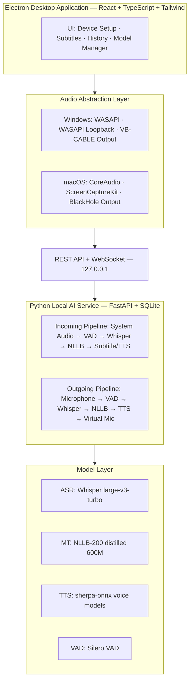

---

# 11. Model Adapter Interface

Không viết pipeline phụ thuộc trực tiếp vào một thư viện cụ thể.

```text
SpeechToTextProvider
TranslationProvider
TextToSpeechProvider
VoiceActivityDetectionProvider
```

Ví dụ:

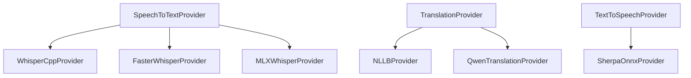

Cách tổ chức này được tham khảo từ mô hình multi-backend của TranscriptionSuite, nơi từng backend ASR có khả năng và giới hạn riêng.

---

# 12. Cấu hình Google Meet

## Windows

```text
Speaker:
  Tai nghe hoặc speaker vật lý

Microphone:
  CABLE Output

Ứng dụng:
  TTS output → CABLE Input
```

## macOS

```text
Speaker:
  Tai nghe hoặc speaker vật lý

Microphone:
  BlackHole 2ch

Ứng dụng:
  TTS output → BlackHole 2ch
```

Khuyến nghị bắt buộc sử dụng tai nghe trong quá trình kiểm thử để hạn chế:

- Echo.
- Acoustic feedback.
- TTS bị nhận diện lại.
- Âm thanh remote bị microphone vật lý thu lại.

---

# 13. Quyết định kỹ thuật chính thức cho MVP

| Hạng mục                   | Quyết định                |
| -------------------------- | ------------------------- |
| Desktop framework          | Electron                  |
| Frontend                   | React + TypeScript        |
| Styling                    | Tailwind CSS              |
| Local backend              | Python + FastAPI          |
| Realtime protocol          | WebSocket                 |
| Database                   | SQLite                    |
| VAD                        | Silero VAD                |
| ASR runtime mặc định       | whisper.cpp               |
| ASR model mặc định         | Whisper large-v3-turbo Q5 |
| Translation model          | NLLB-200 distilled 600M   |
| TTS runtime                | sherpa-onnx               |
| Windows system audio       | WASAPI Loopback           |
| Windows virtual microphone | VB-CABLE                  |
| macOS system audio         | ScreenCaptureKit          |
| macOS virtual microphone   | BlackHole 2ch             |
| Windows target             | Windows 11 x64            |
| macOS target               | macOS 13+, Apple Silicon  |
| Deployment                 | Native desktop package    |
| Docker                     | Không sử dụng trong MVP   |
| Cloud API                  | Không sử dụng             |
| Audio storage              | Tắt mặc định              |

---

# 14. Những thành phần tham khảo hoặc tái sử dụng từ TranscriptionSuite

Có thể tham khảo:

- Cấu trúc Electron dashboard.
- FastAPI backend.
- WebSocket realtime communication.
- Model manager.
- Job queue.
- SQLite schema.
- Silero VAD integration.
- whisper.cpp integration.
- Cách phát hiện phần cứng.
- Cách hiển thị tiến trình model.
- Cách đóng gói NSIS và DMG.

Không thể chỉ sao chép và sử dụng như thư viện đóng vì TranscriptionSuite được phát hành theo GPLv3. Nếu sử dụng hoặc chỉnh sửa trực tiếp source code và phân phối sản phẩm, dự án phải tuân thủ các nghĩa vụ tương ứng của GPLv3.

Đối với đồ án, lựa chọn an toàn về kiến trúc là:

```text
Tham khảo thiết kế
+
Tự xây dựng source code
+
Sử dụng trực tiếp các model/runtime mã nguồn mở theo giấy phép riêng
```
