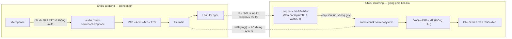

# Nhật ký tuần 1–8

**Nguồn kế hoạch:** bảng tiến độ ở đề cương [`00`](00_project-outline.md) §5.
**Phạm vi:** từ khảo sát công nghệ (16/07) tới đo đạc đầu-cuối (09/09/2026).

> Tài liệu này gộp tám ghi chú tuần rời trước đây thành một bản ghi liên tục. Mỗi tuần
> giữ lại ba thứ: **mục tiêu**, **làm được gì**, và **quyết định kỹ thuật đáng nhớ** —
> tức những chỗ phải chọn giữa nhiều đường và lý do chọn. Các mục "còn nợ" đã đóng thì
> bỏ; phần còn treo tới hôm nay nằm ở [`08_viec-con-lai.md`](08_viec-con-lai.md).
>
> Việc phát sinh **ngoài lịch tuần** (lịch sử phiên, nhập tệp, backend ASR thứ hai/thứ
> ba, tách người nói…) ở [`04_cac-dot-bo-sung.md`](04_cac-dot-bo-sung.md).

---

## Tổng quan

| Tuần | Nội dung            | Kết quả                                                               |
| ---- | ------------------- | --------------------------------------------------------------------- |
| 1    | Khảo sát + nền tảng | Chốt Silero / whisper.cpp / NLLB-200 / sherpa-onnx; dựng 2 tiến trình |
| 2    | Thu audio + VAD     | Mic → PCM16 16 kHz → Silero cắt utterance có timestamp                |
| 3    | ASR                 | whisper.cpp qua pywhispercpp (Metal); vi/en kiểm chứng thật           |
| 4    | MT                  | NLLB-200 distilled 600M qua transformers (MPS); sáu chiều chạy được   |
| 5    | TTS                 | sherpa-onnx cho vi/en/zh + Kokoro cho ja; đủ bốn ngôn ngữ             |
| 6    | Desktop             | 4 màn hình React, REST + WS, phát TTS ra loa                          |
| 7    | Hai chiều           | Thu âm thanh hệ thống, PTT/mute, chống vòng lặp âm thanh              |
| 8    | Thực nghiệm         | `/api/benchmark`, `/api/resources`, script soak + đo độ chính xác     |

Ghi chú lịch: Tuần 7 và 8 **hiện thực sớm hơn kế hoạch** (22/07 và 30/07), số đo Tuần 8
cập nhật lại 18/08.

---

## Tuần 1 — Khảo sát và chuẩn bị nền tảng

**16/07 – 22/07** · Mục tiêu: khảo sát giải pháp local cho từng khâu, chốt kiến trúc sơ bộ,
dựng môi trường chạy được trên cả Windows và macOS.

### Yêu cầu cốt lõi rút từ đề cương

| Nhóm      | Yêu cầu                                                                             |
| --------- | ----------------------------------------------------------------------------------- |
| Chức năng | Thu microphone + system audio → VAD → ASR → MT → subtitle / TTS                     |
| Ngôn ngữ  | 6 chiều: Việt ↔ Anh, Việt ↔ Nhật, Việt ↔ Trung (giản thể)                           |
| Nền tảng  | Windows 11 x64; macOS 13+ Apple Silicon                                             |
| Riêng tư  | Không cloud trong lúc dịch; không lưu audio mặc định                                |
| Độ trễ    | Theo từng utterance; outgoing ~≤4 s, subtitle incoming ~≤3 s                        |
| Ổn định   | Chạy liên tục ≥60 phút, không rò rỉ RAM                                             |
| Kiến trúc | 2 tiến trình: Electron client + Python AI service, REST + WebSocket qua `127.0.0.1` |

### Khảo sát và lựa chọn

**VAD.** Silero VAD (nhẹ, đa ngôn ngữ, chạy CPU tốt) làm bộ phát hiện chính; WebRTC VAD
chỉ để làm cổng năng lượng sơ bộ vì nó chỉ dựa trên năng lượng nên dễ nhầm tiếng ồn.

**ASR.** Ba runtime cùng đứng sau một port:

| Runtime                      | Mạnh ở              | Vai trò                                                          |
| ---------------------------- | ------------------- | ---------------------------------------------------------------- |
| **whisper.cpp**              | Cả hai OS           | **Mặc định** — một runtime cho cả 2 nền tảng, có model quantized |
| faster-whisper (CTranslate2) | Windows + CUDA      | Backend tăng tốc tùy chọn                                        |
| MLX Whisper                  | macOS Apple Silicon | Backend tối ưu tùy chọn                                          |

Chỉ dùng task `transcribe`, **không** dùng `translate` của Whisper — việc dịch giao cho
module MT riêng để đổi model dịch mà không đụng ASR.

**MT.** NLLB-200 distilled 600M: bao phủ đủ 4 ngôn ngữ, dịch câu ngắn ổn định, nhẹ. Hạn chế
đã biết: giấy phép CC-BY-NC-4.0 (phi thương mại) và yếu với văn bản dài. Qwen3-4B-Instruct
để dành cho preset Quality nhưng là model generative nên có nguy cơ thêm/bớt nội dung.
Mã ngôn ngữ FLORES-200: `vie_Latn`, `eng_Latn`, `jpn_Jpan`, `zho_Hans`. Chỉ dịch transcript
**final**, không dịch partial liên tục.

**TTS.** sherpa-onnx làm runtime chung để giảm dependency native. Danh sách voice ban đầu
(`vits-piper-vi_VN-vais1000-medium`, `vits-piper-en_US-lessac-medium`, `supertonic-3-ja`,
`vits-piper-zh_CN-xiao_ya-medium`) về sau **phải đổi hai cái** — xem Tuần 5.

**Audio theo nền tảng.** Thu mic: WASAPI / CoreAudio. Thu system audio: WASAPI Loopback /
ScreenCaptureKit. Logic đặc thù OS phải nằm sau abstraction layer để Electron không phụ
thuộc trực tiếp API của OS.

### Kiến trúc chốt ở tuần này

Hai tiến trình, mỗi khâu AI nằm sau một **provider port** (`VoiceActivityDetector`,
`SpeechToTextProvider`, `TranslationProvider`, `TextToSpeechProvider`) để đổi model/runtime
không ảnh hưởng pipeline. Mỗi utterance có `id` duy nhất, theo dõi xuyên suốt
Audio → ASR → MT → TTS → Output qua máy trạng thái
`Idle → Listening → SpeechDetected → Recognizing → Translating → (WaitingForConfirmation) → Synthesizing → Queued → Speaking → Completed`.

Chi tiết kiến trúc hiện tại: [`apps/ai-service/ARCHITECTURE.md`](../apps/ai-service/ARCHITECTURE.md).
Hợp đồng REST/WS hiện tại: `ws/protocol.py` + bản mirror TypeScript ở `domain/`.

**Rủi ro nhận diện được từ tuần 1:** khác biệt audio loopback giữa 2 OS, độ trễ trên máy
CPU-only, và giấy phép voice model. Cả ba đều thành vấn đề thật về sau.

---

## Tuần 2 — Thu audio và VAD

**23/07 – 29/07** · Mục tiêu: thu microphone ổn định, chuẩn hóa PCM 16 kHz mono, tích hợp
Silero VAD, phân đoạn utterance có timestamp.

> Phạm vi đợt này chỉ có **microphone**. Thu system audio cần code native theo OS nên hoãn
> sang Tuần 7.

### Làm được

Luồng `mic → audio.chunk → VAD → utterance → pipeline` đã thông: desktop thu qua WebAudio
→ PCM signed 16-bit mono 16 kHz → gửi `audio.chunk` qua WebSocket → `SileroVad` cắt
utterance kèm timestamp.

### Quyết định: tách "model" khỏi "state theo luồng"

Đây là quyết định kiến trúc đáng nhớ nhất của tuần. `ProviderSet` dùng chung cho mọi kết
nối, nhưng VAD có **state theo từng luồng** — buffer và hidden-state RNN của Silero. Hai
pipeline incoming/outgoing dùng chung một VAD thì hỏng state của nhau.

Cách giải: port VAD tách hai vai.

| Khái niệm                          | Vai trò                                           | Vòng đời                   |
| ---------------------------------- | ------------------------------------------------- | -------------------------- |
| `VoiceActivityDetector` (Provider) | `load()`/`unload()` model                         | 1 lần, dùng chung          |
| `VadStream`                        | `accept()`/`reset()` — buffer + trạng thái speech | 1 stream/nguồn audio/phiên |

`TranslationPipeline` mở `vad.open_stream()` riêng trong `__init__`, nên mic và system
không đụng state của nhau.

### Thuật toán phân đoạn

Gói PCM đến (khung 20–100 ms) thành **cửa sổ 512 mẫu** — yêu cầu của Silero ở 16 kHz; phần
dư giữ lại cho lần sau. Bọc `VADIterator` của Silero (đã lo hysteresis + `min_silence` +
`speech_pad`), nhận event `start`/`end` theo chỉ số mẫu tuyệt đối rồi cắt đúng đoạn
`[start, end]` và tính timestamp theo offset mẫu — xác định, dễ test. Bổ sung hai luật:
**ép cắt** khi câu vượt `max_speech_ms`, **bỏ đoạn** ngắn hơn `min_speech_ms`.

Tham số mặc định: `threshold=0.5`, `min_silence_ms=300`, `speech_pad_ms=120`,
`min_speech_ms=250`, `max_speech_ms=20000`.

### Thu microphone (desktop)

`getUserMedia` (mono, AEC/NS/AGC) → `AudioContext({ sampleRate: 16000 })` — ép sample rate
ở đây nên **không cần resample thủ công** — → `AudioWorklet` gom khung ~100 ms, Float32 →
Int16. Main process cấp quyền `media` (macOS: `askForMediaAccess`).

### Kiểm thử

Logic phân đoạn test qua **iterator giả** (xác định): cắt đúng lát + timestamp, bỏ đoạn
ngắn, ép cắt `max_speech`, gộp khung lệch nửa cửa sổ, sai sample rate → `ValueError`. Kèm
một test tích hợp Silero thật bằng tín hiệu giọng tổng hợp offline.

---

## Tuần 3 — ASR (whisper.cpp)

**30/07 – 05/08** · Mục tiêu: tích hợp whisper.cpp + model quantized, hỗ trợ vi/en/ja/zh,
trả transcript theo từng utterance.

### Làm được

Adapter thật qua **`pywhispercpp`** (nhúng whisper.cpp, wheel dựng sẵn kèm **Metal** trên
Apple Silicon). Model GGML tự tải lần đầu từ HF `ggerganov/whisper.cpp`, sau đó chạy offline.

Kiểm thử thật (small-q5, Metal), giọng tổng hợp bằng `say` — transcribe khớp nguyên văn:

- `[en]` "Hello, how are you doing today?" — **~237 ms/utterance**, conf ≈ 0,72
- `[vi]` "Xin chào, hôm nay bạn khỏe không?" — **~226 ms/utterance**, conf ≈ 0,72

### Vì sao pywhispercpp

Đề cương chốt runtime whisper.cpp; `pywhispercpp` là binding được bảo trì tốt, nhúng thẳng
whisper.cpp và **có wheel dựng sẵn cho macOS arm64 (Metal)** nên không cần bước build khi
`uv add`. Nó cũng tự tải model GGML từ đúng repo `ggerganov/whisper.cpp`.

### Bốn vấn đề của adapter

| Vấn đề                            | Cách xử lý                                                                                                     |
| --------------------------------- | -------------------------------------------------------------------------------------------------------------- |
| whisper.cpp **không thread-safe** | `SerialExecutor` nội bộ (lock + `to_thread`) → nhiều pipeline dùng chung 1 model instance vẫn tuần tự, an toàn |
| Định dạng audio                   | VAD trả PCM16; adapter đổi `int16 → float32 / 32768.0` vì whisper.cpp cần float chuẩn hóa                      |
| Nạp model nặng                    | `load()` chạy `asyncio.to_thread` để không chặn event loop                                                     |
| Confidence                        | Bật `extract_probability=True`, lấy **trung bình** `probability` các segment (bỏ NaN)                          |

Adapter **là nơi duy nhất** biết pywhispercpp; pipeline/preset chỉ thấy port.

### Kiểm thử: cái bẫy của test dựa trên `TestClient`

`conftest.py` có fixture **autouse** thay `_default_loader` bằng `FakeWhisperModel`. Không
có nó thì mọi test dùng `TestClient` (lifespan nạp preset) sẽ tải model thật — chậm, cần
mạng, không xác định. Test tích hợp thật là **opt-in** qua `LLVT_RUN_ASR_INTEGRATION=1` và
phải truyền loader thật tường minh để bỏ qua fake. Cùng khuôn này lặp lại ở Tuần 4 và 5.

---

## Tuần 4 — MT (NLLB-200)

**06/08 – 12/08** · Mục tiêu: tích hợp NLLB-200 distilled 600M, mapping mã ngôn ngữ +
normalization, kiểm thử sáu chiều dịch.

### Làm được

Adapter thật qua **`transformers` (PyTorch)**: `AutoModelForSeq2SeqLM` + `AutoTokenizer`,
tải `facebook/nllb-200-distilled-600M`. Thiết bị tự dò MPS → CPU. Dịch text→text theo từng
utterance, chỉ trên transcript final.

Kiểm thử thật sáu chiều (MPS): sau warmup ~1,8 s, mỗi câu ~300–400 ms.

- `vi→en` "Xin chào, hôm nay bạn khỏe không?" → "Hi, how are you today?"
- `en→vi` "Please confirm this issue." → "Xin hãy xác nhận vấn đề này."
- `vi→ja` "Cuộc họp bắt đầu lúc chín giờ sáng." → 「会議は午前9時から始まります。」
- `vi→zh` "Tôi cần một tách cà phê." → 「我需要一杯咖啡。」

### Quyết định adapter

Ép hướng dịch bằng `tokenizer.src_lang` + `forced_bos_token_id = convert_tokens_to_ids(tgt)`.
Hai lối tắt đáng giá ở `_normalize`: câu **rỗng** trả `""` và **cùng ngôn ngữ** trả nguyên
văn, cả hai đều không gọi model.

Một cái tên đã bị bỏ: `facebook/nllb-200-distilled-600M-int8` từng nằm trong `MODEL_MAP`
nhưng trỏ về đúng repo gốc — nó chỉ là một cái tên chứ không phải một model. Chuyện đặt
tên model được giải quyết dứt điểm về sau, xem [`04` §5](04_cac-dot-bo-sung.md).

---

## Tuần 5 — TTS (sherpa-onnx)

**13/08 – 19/08** · Mục tiêu: tổng hợp giọng offline phía AI service, speed control.

### Làm được

Adapter `OfflineTts` (VITS/Piper) trả **PCM signed 16-bit mono** kèm `sample_rate` và
`duration_ms`. Voice model tự tải từ GitHub releases của k2-fsa (tag `tts-models`), giải
nén an toàn (`filter="data"`), tải vào `.tmp` rồi mới dùng. **Nạp lười theo ngôn ngữ**:
voice chỉ tải + khởi tạo khi synthesize lần đầu cho ngôn ngữ đó.

Từ tuần này pipeline outgoing chạy trọn vẹn VAD→ASR→MT→**TTS** tới `Completed`.

### Hai cái bẫy tích hợp

**Pin `sherpa-onnx==1.10.46`.** Wheel này **bundle sẵn** `libonnxruntime` + C-API dylib.
Bản mới hơn (1.13.x) tham chiếu `libonnxruntime.1.27.0.dylib` không kèm trong wheel →
`dlopen` lỗi trên macOS. Nâng version phải kiểm tra lại dylib.

**Voice model của sherpa-onnx không ở trên HF** (khác whisper.cpp/NLLB) → phải tự viết
downloader bằng stdlib `urllib` + `tarfile`, không thêm dependency runtime.

### Bổ sung 18/08 — tiếng Nhật và tiếng Trung cùng hỏng vì một loại nguyên nhân

Hai voice chọn từ Tuần 1 đều không dùng được, và **cùng một gốc**: model có tồn tại, nhưng
phần chuyển **chữ → âm vị** (G2P) mà chúng cần thì sherpa-onnx không có. Cả hai đều phát
hiện bằng cách cho **ASR nghe lại** chính audio do TTS sinh ra, chứ không phải bằng đọc
tài liệu — đây là kỹ thuật kiểm chứng đáng nhớ nhất của tuần.

**Tiếng Nhật.** Bản phát hành `tts-models` không có model VITS tiếng Nhật nào (đối chiếu đủ
642 asset). Kokoro v1.0 có 5 giọng Nhật nhưng tài liệu sherpa-onnx ghi rõ _"we only add
English and Chinese support for it"_, và metadata của chính file model ghi `voice = en-us`.
Hậu quả đo được: 「こんにちは、今日はプロジェクトの会議です。」 ra **18,5 giây** audio cho
một câu ~3 giây, ASR nghe lại thành 「日本語の字幕を作成しています。」 — không liên quan gì.
Chữ Nhật bị phiên âm bằng espeak tiếng Anh.

Cách xử lý: giữ nguyên trọng số Kokoro nhưng **thay G2P** — adapter `tts/kokoro_ja.py` dùng
`misaki.ja` (gọi OpenJTalk, đúng bộ G2P mà Kokoro gốc dùng). Vì khâu TTS giờ chạy hai
engine, `LanguageRoutedTts` chọn engine theo ngôn ngữ đích; pipeline vẫn chỉ thấy một
provider. Round-trip TTS → ASR sau khi sửa: đúng cả kanji, số và katakana, 3/3 câu.

Chọn **fp32 chứ không phải int8**: cùng một câu, int8 (92 MB) mất **1497 ms**, fp32
(326 MB) chỉ **706 ms** — ARM không có kernel int8 tối ưu nên bản "nhẹ hơn" lại chậm gấp
đôi. Máy x86 có AVX-VNNI nhiều khả năng ngược lại, nên tên file để đổi được qua tham số.

**Tiếng Trung.** `vits-piper-zh_CN-xiao_ya-medium` chết ngay khi tổng hợp với
`RuntimeError: Non-zero status code returned while running Conv node. Invalid input shape: {0}`.
`{0}` nghĩa là **mảng token rỗng** — thông báo lỗi ở tầng Conv không hề nhắc tới nguyên nhân
thật. MODEL_CARD của voice đó ghi nó cần g2pW, thứ sherpa-onnx không có.

Đổi sang **`sherpa-onnx-vits-zh-ll`** (kèm từ điển jieba + lexicon) và sửa engine loader
truyền thêm `dict_dir` khi voice có thư mục `dict/` (thiếu nó thì tra từ điển không ra chữ
nào và lại rơi vào đúng lỗi trên) cùng `rule_fsts` (`date.fst`, `number.fst`, `phone.fst` —
thiếu thì model đọc "2026" thành từng chữ số rời).

Từ đợt này **cả bốn ngôn ngữ trong phạm vi đồ án đều tổng hợp được giọng**.

---

## Tuần 6 — Tích hợp ứng dụng desktop

**20/08 – 26/08** · Mục tiêu: 4 màn hình, kết nối REST/WebSocket, luồng mic → ASR → dịch →
TTS phát ra loa.

### Làm được

Bốn màn hình dạng tab (React + Zustand + Tailwind):

- **Setup** — chế độ (speak/listen/two_way), cặp ngôn ngữ outgoing/incoming, preset; health REST.
- **Session** — Bắt đầu/Dừng, Push-to-talk, badge trạng thái pipeline, phụ đề trực tiếp.
- **Subtitle** — lịch sử phụ đề song ngữ cỡ lớn.
- **Diagnostics** — health, trạng thái WS, độ trễ ASR/MT, nhật ký event thô.

Phát TTS ra loa: nhận `tts.audio` (base64 PCM16) → WebAudio phát **tuần tự** để không chồng tiếng.

### Giữ hexagonal ở renderer

Phụ thuộc hướng vào trong: `ui/hooks → application → ports ← adapters`, `domain` không phụ
thuộc gì. Tuần này thêm port `AudioOutput` cạnh `AudioCapture`/`SessionChannel`/`AiClient`,
adapter `TtsPlayer` (WebAudio), và `session-store` gom event → `pipelineState` +
`utterances` (upsert theo `utteranceId`).

Contract WS được mirror sang TypeScript: `session.start` khớp `parse_session_config` phía
Python, event server→client dùng đúng field camelCase của `ws/protocol.py`.

---

## Tuần 7 — Hoàn thiện dịch hai chiều

**27/08 – 02/09** (hiện thực 22/07 và 30/07, chạy trước kế hoạch) · Mục tiêu: kết hợp
incoming + outgoing, hoàn thiện PTT/mute/hàng đợi.

> **Phần Google Meet của tuần này đã bỏ khỏi phạm vi, chốt 10/09/2026.** Đường
> TTS → microphone ảo → Meet đã hiện thực và chạy được thật; bản hiện tại phát bản dịch ra
> loa/tai nghe. Thu âm thanh hệ thống, PTT, mute và chống vòng lặp thì giữ nguyên. Lý do bỏ
> và cách bật lại: [`11`](11_pham-vi-da-bo-google-meet.md).

### Thu âm thanh hệ thống

| Vấn đề                                | Cách xử lý                                                                                                                      |
| ------------------------------------- | ------------------------------------------------------------------------------------------------------------------------------- |
| Electron từ chối `getDisplayMedia`    | `session.setDisplayMediaRequestHandler` ở main trả `{video: screen, audio: 'loopback'}`; không có handler thì API bị chặn thẳng |
| Không muốn chọn nguồn mỗi lần bắt đầu | `useSystemPicker: false` — luôn lấy loopback toàn hệ thống                                                                      |
| Chromium bắt buộc kèm video           | Nhận stream xong bỏ track video ngay, chỉ giữ audio                                                                             |
| Trùng code với thu mic                | Tách `Pcm16Stream`; `MicCapture` và `SystemAudioCapture` chỉ khác chỗ lấy stream                                                |
| Thu hệ thống lỗi thì mất cả phiên     | Bọc riêng: lỗi chỉ báo lên UI, chiều outgoing vẫn chạy                                                                          |

Cùng một API cho hai hệ điều hành: macOS 13+ đi qua ScreenCaptureKit, Windows qua WASAPI
loopback, Chromium lo phần khác biệt.

### Push-to-talk, mute và câu nói dở

PTT trở thành **cổng bắt buộc** của chiều mic: `SessionController.on_audio` chỉ đẩy khung
vào pipeline khi `_ptt_active and not _muted`. Client chặn trước khi gửi, server chặn lần
nữa — không tin client.

**Nhả nút phải chốt câu.** Client ngừng gửi audio nên VAD sẽ không bao giờ thấy đoạn im lặng
để kết thúc câu → thêm `VadStream.flush()` cắt đoạn đang dở rồi reset. Đây là loại lỗi chỉ
lộ ra khi ghép hai phần đúng-riêng-lẻ lại với nhau.

`control.mute` bỏ luôn đoạn đang nói dở và **cắt TTS đang phát** ở client — bật mute giữa
lúc bản dịch đang đọc mà vẫn đọc nốt thì vô lý.

Quyết định giữ nguyên: chiều incoming **không** tổng hợp giọng. Đọc bản dịch của phía kia
thì tiếng máy sẽ chồng lên tiếng người thật đang nói.

### Chống vòng lặp âm thanh

Rủi ro lớn hơn tiếng vọng qua mic: loopback thu **toàn bộ** đầu ra hệ điều hành, nên nếu TTS
phát ra loa thì chính bản dịch của mình quay lại chiều incoming và được dịch tiếp — vòng lặp
không có điểm dừng.

`AudioOutput` thêm `isPlaying(tailMs)`, suy ra từ mốc kết thúc của đoạn cuối đã xếp lịch cộng
300 ms bù trễ thiết bị. Khung audio hệ thống thu trong lúc đó bị **bỏ**, UI hiện "Tạm ngưng
thu (đang phát bản dịch)" để người dùng biết vì sao phụ đề phía kia khựng lại. Cách chắc chắn
nhất vẫn là đeo tai nghe; phần trên chỉ để tránh vòng lặp khi người dùng quên.

### Số đo độ trễ thật

Pipeline đo từng khâu bằng `perf_counter`, điền `processingMs` vào `asr.final`/`mt.result` và
phát thêm event `metrics`. Trước đó client tự ước lượng bằng khoảng cách giữa các event — con
số ấy gồm cả thời gian truyền WS nên bị đánh dấu "client"; giờ nhãn đó tự tắt khi có số thật.

---

## Tuần 8 — Thực nghiệm, đo đạc và đánh giá

**03/09 – 09/09** (hiện thực 30/07, số đo cập nhật 18/08) · Mục tiêu: đo độ trễ đầu-cuối và
tài nguyên, kiểm tra độ chính xác, chạy thử trên hai nền tảng.

> Nguyên tắc của cả tuần: **mọi con số phải đo trên máy, không ước lượng**. Trước tuần này
> màn Chẩn đoán hiển thị vài giá trị chép tay.

### Bộ đồ nghề

| Công cụ               | Đo cái gì                                    | Gọi bằng                                      |
| --------------------- | -------------------------------------------- | --------------------------------------------- |
| `POST /api/benchmark` | Độ trễ từng khâu VAD/ASR/MT/TTS              | nút "Chạy test" ở màn Chẩn đoán, `make bench` |
| `GET /api/resources`  | CPU% và RSS của chính tiến trình service     | màn Chẩn đoán (hỏi lại mỗi 2 s)               |
| `scripts/accuracy.py` | WER cho ASR, chrF cho MT trên bộ câu tự dựng | `make accuracy`                               |
| `scripts/soak.py`     | Chạy liên tục nhiều giờ                      | `make soak MINUTES=60`                        |

### Hai cái bẫy khi đo độ trễ

**Bẫy 1 — đo nguội.** Lần chạy đầu gồm cả nạp model và dựng graph suy luận: đo nguội cho
**34,7 s**; sau khi bắt buộc warm-up thì lần đầu 1,67 s ≈ lần hai 1,65 s. Vì vậy
`run_benchmark` **luôn** warm-up trước khi bấm giờ, và con số công bố là độ trễ mỗi câu khi
máy đã chạy ổn định, **không** gồm thời gian khởi động.

**Bẫy 2 — khâu sau ăn theo khâu trước.** Nếu đưa transcript vừa nhận vào MT thì khi ASR trả
chuỗi rỗng, MT sẽ "nhanh" một cách giả tạo. Nên mỗi khâu chạy với **đầu vào cố định, độc
lập**: VAD/ASR dùng một đoạn sóng tổng hợp 3 giây (whisper.cpp phụ thuộc **độ dài** audio
chứ gần như không phụ thuộc nội dung, nên khỏi phải đính wav vào repo); MT/TTS dùng một câu
mẫu cố định theo ngôn ngữ.

### Số đo tham chiếu

Máy dev MacBook Apple Silicon, preset Balanced, audio vào 3 giây, đơn vị mili giây:

| Chiều dịch | VAD | ASR  | MT  | TTS | Tổng |
| ---------- | --- | ---- | --- | --- | ---- |
| vi → en    | 46  | 1060 | 569 | 141 | 1819 |
| en → vi    | 46  | 991  | 579 | 148 | 1766 |
| vi → ja    | 48  | 1056 | 460 | 772 | 2338 |
| vi → zh    | 46  | 1038 | 558 | 969 | 2613 |

- **ASR là khâu nặng nhất** cho hai chiều Việt–Anh (~1 s cho 3 giây audio).
- vi→en tổng 1,82 s cho 3 giây tiếng nói → **≈ 0,6 lần thời gian thực**, tức pipeline theo
  kịp người nói bình thường.
- TTS tiếng Nhật (Kokoro) và tiếng Trung (VITS zh-ll) đắt hơn Piper 5–7 lần; hai chiều đó
  tổng vẫn dưới 3 s nhưng là chỗ tối ưu đầu tiên nếu cần.

**Tài nguyên:** sau khi nạp cả 4 giọng + whisper + NLLB, service chiếm **2055 MB RSS** với
32 luồng. Không đo VRAM: Apple Silicon dùng bộ nhớ hợp nhất (đã nằm trong RSS), còn card rời
cần thư viện riêng theo hãng. Renderer nằm trong sandbox Chromium nên không tự đọc được phần
này — đó là lý do phải có endpoint `/api/resources` thay vì đọc ở phía UI.

### Đo độ chính xác — và vì sao bộ này về sau bị thay

`scripts/accuracy.py` chạy WER cho ASR và chrF cho MT. Bản dịch được sinh **từ câu tham
chiếu**, không phải từ transcript, để lỗi của ASR không cộng dồn vào điểm của MT. Kết quả
chạy thử với model thật (10 câu, chế độ round-trip qua TTS): WER trung bình 12,5%, chrF 53,4%.

Điểm yếu tự nhận: chế độ round-trip cho **WER lạc quan hơn thực tế** vì giọng máy sạch, không
nhiễu, không giọng vùng miền. Script đánh dấu từng dòng thuộc chế độ nào để hai loại số không
bị trộn.

> **Cập nhật 07/09.** Số cho báo cáo giờ lấy từ **FLEURS** — 3.099 bản thu, tham chiếu do
> người gõ, dữ liệu công khai nên so được với công bố khác:
> vi WER 8,8% · en WER 4,8% · zh CER 8,1% · ja CER 4,7%
> ([`05` §8](05_bo-danh-gia-fleurs.md)). `scripts/accuracy.py` giữ vai trò kiểm tra nhanh
> "pipeline còn sống", không phải nguồn số liệu.

### Chạy liên tục

Bài "chạy ít nhất 60 phút không crash" viết thành script thay vì bấm tay. `scripts/soak.py`
đóng vai client, nói đúng giao thức WebSocket mà desktop dùng, và lặp một lượt nói mỗi vài
giây theo **nhịp thời gian thực** — dồn cục audio thì đo ra một thứ khác hẳn.

| Theo dõi                               | Bắt được gì                                      |
| -------------------------------------- | ------------------------------------------------ |
| WebSocket + `/health` sau khi chạy     | Service chết hoặc rớt kết nối giữa chừng → TRƯỢT |
| RSS lấy định kỳ từ `/api/resources`    | Rò rỉ bộ nhớ                                     |
| Độ trễ 10% câu đầu so với 10% câu cuối | Trôi hiệu năng do hàng đợi/cache tích tụ         |

Rò rỉ và trôi chỉ ra **cảnh báo** kèm số liệu, không tự đánh trượt: quyết định ngưỡng là việc
của người đọc báo cáo.

### Bộ câu giọng thật: công cụ cắt sẵn

WER chỉ có giá trị khi câu tham chiếu do **người** gõ. `scripts/segment_audio.py` lo phần cơ
học: dùng chính Silero VAD của dự án tách các đoạn có tiếng nói, ghi ra wav 16 kHz mono và
sinh khung JSON để điền lời.

Thử trên một vlog tiếng Việt dài 7'59": VAD tách được **115 đoạn**, trong đó 66 đoạn dài
1,5–12 s (vừa một câu nói); trung vị 2,0 s, tổng thời lượng có tiếng nói 362 s trên 479 s —
đúng tỉ lệ nói/nghỉ của hội thoại thật, và cũng là lần đầu VAD chạy trên giọng người thật
thay vì sóng tổng hợp.

Phần còn lại — nghe và gõ đúng lời — **không tự động được**. Lấy đầu ra của ASR làm câu tham
chiếu thì WER luôn ≈ 0% và con số ấy chỉ chứng minh ASR bằng chính nó.

---

## Việc tuần 1–8 để lại

Ba khoản chưa đóng tính tới hôm nay, chi tiết ở [`08_viec-con-lai.md`](08_viec-con-lai.md):

- **Chạy thử trên Windows 11** — toàn bộ số ở trên là của máy macOS. Đặc biệt cần đo lại
  WASAPI loopback và TTS int8 (trên x86 có AVX-VNNI thì bản int8 của Kokoro nhiều khả năng
  nhanh hơn fp32, ngược với kết quả trên ARM).
- **Gõ lời cho bộ câu giọng thật** để có WER trên giọng người, so được với số FLEURS.
- **`make soak MINUTES=60` với model thật.**
