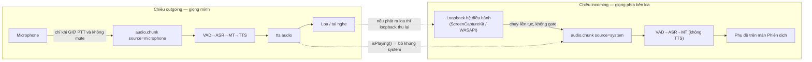

# Nhật ký tuần 1–8

**Nguồn kế hoạch:** bảng tiến độ ở đề cương [`00`](00_project-outline.md) §5.
**Phạm vi:** từ khảo sát công nghệ (16/07) tới đo đạc đầu-cuối (09/09/2026).

> Mỗi tuần ghi ba thứ: **mục tiêu**, **kết quả kiểm chứng được**, và **quyết định đáng
> nhớ** — chỗ phải chọn giữa nhiều đường và lý do chọn.
>
> Tài liệu này cố ý **không** giải thích mã nguồn hiện thực thế nào. Quyết định kiến trúc
> nằm ở [`ARCHITECTURE.md`](../apps/ai-service/ARCHITECTURE.md); bẫy cục bộ của từng thư
> viện nằm ở docstring của chính adapter đó. Việc ngoài lịch tuần ở
> [`04`](04_cac-dot-bo-sung.md), việc còn treo ở [`08`](08_viec-con-lai.md).

---

## Tổng quan

| Tuần | Nội dung            | Kết quả                                                               |
| ---- | ------------------- | --------------------------------------------------------------------- |
| 1    | Khảo sát + nền tảng | Chốt Silero / whisper.cpp / NLLB-200 / sherpa-onnx; dựng 2 tiến trình |
| 2    | Thu audio + VAD     | Mic → PCM16 16 kHz → Silero cắt utterance có timestamp                |
| 3    | ASR                 | whisper.cpp qua pywhispercpp (Metal); vi/en kiểm chứng thật           |
| 4    | MT                  | NLLB-200 distilled 600M qua transformers (MPS); sáu chiều chạy được   |
| 5    | TTS                 | sherpa-onnx cho vi/en/zh + Kokoro cho ja; đủ bốn ngôn ngữ             |
| 6    | Desktop             | 4 màn hình React, REST + WS, phát TTS ra loa                          |
| 7    | Hai chiều           | Thu âm thanh hệ thống, PTT/mute, chống vòng lặp âm thanh              |
| 8    | Thực nghiệm         | `/api/benchmark`, `/api/resources`, script soak + đo độ chính xác     |

Ghi chú lịch: Tuần 7 và 8 **hiện thực sớm hơn kế hoạch** (22/07 và 30/07), số đo Tuần 8
cập nhật lại 18/08.

---

## Tuần 1 — Khảo sát và chuẩn bị nền tảng

**16/07 – 22/07** · Mục tiêu: khảo sát giải pháp local cho từng khâu, chốt kiến trúc sơ bộ,
dựng môi trường chạy được trên cả Windows và macOS.

### Yêu cầu cốt lõi rút từ đề cương

| Nhóm      | Yêu cầu                                                                             |
| --------- | ----------------------------------------------------------------------------------- |
| Chức năng | Thu microphone + system audio → VAD → ASR → MT → subtitle / TTS                     |
| Ngôn ngữ  | 6 chiều: Việt ↔ Anh, Việt ↔ Nhật, Việt ↔ Trung (giản thể)                           |
| Nền tảng  | Windows 11 x64; macOS 13+ Apple Silicon                                             |
| Riêng tư  | Không cloud trong lúc dịch; không lưu audio mặc định                                |
| Độ trễ    | Theo từng utterance; outgoing ~≤4 s, subtitle incoming ~≤3 s                        |
| Ổn định   | Chạy liên tục ≥60 phút, không rò rỉ RAM                                             |
| Kiến trúc | 2 tiến trình: Electron client + Python AI service, REST + WebSocket qua `127.0.0.1` |

### Khảo sát và lựa chọn

**VAD.** Silero VAD (nhẹ, đa ngôn ngữ, chạy CPU tốt) làm bộ phát hiện chính; WebRTC VAD chỉ
làm cổng năng lượng sơ bộ vì nó chỉ dựa trên năng lượng nên dễ nhầm tiếng ồn.

**ASR.** Ba runtime cùng đứng sau một port: **whisper.cpp** làm mặc định (một runtime cho cả
hai nền tảng, có model quantized), faster-whisper cho Windows + CUDA, MLX cho Apple Silicon.
Chỉ dùng task `transcribe`, **không** dùng `translate` của Whisper — việc dịch giao cho module
MT riêng để đổi model dịch mà không đụng ASR.

**MT.** NLLB-200 distilled 600M: bao phủ đủ 4 ngôn ngữ, dịch câu ngắn ổn định, nhẹ. Hạn chế
đã biết và ghi từ đầu: giấy phép CC-BY-NC-4.0 (phi thương mại), yếu với văn bản dài.
Qwen3-4B-Instruct để dành cho preset Quality nhưng là model generative nên có nguy cơ
thêm/bớt nội dung. Chỉ dịch transcript **final**, không dịch partial liên tục.

**TTS.** sherpa-onnx làm runtime chung để giảm dependency native. Danh sách voice chọn ở tuần
này về sau **phải đổi hai cái** (ja và zh) — xem Tuần 5.

**Audio theo nền tảng.** Thu mic: WASAPI / CoreAudio. Thu system audio: WASAPI Loopback /
ScreenCaptureKit. Logic đặc thù OS phải nằm sau abstraction layer để Electron không phụ thuộc
trực tiếp API của OS.

### Kiến trúc chốt ở tuần này

Hai tiến trình; mỗi khâu AI nằm sau một **provider port** để đổi model/runtime không ảnh hưởng
pipeline. Mỗi utterance có `id` duy nhất, theo dõi xuyên suốt Audio → ASR → MT → TTS → Output.
Chi tiết: [`ARCHITECTURE.md`](../apps/ai-service/ARCHITECTURE.md).

**Rủi ro nhận diện từ tuần 1:** khác biệt audio loopback giữa 2 OS, độ trễ trên máy CPU-only,
và giấy phép voice model. Cả ba đều thành vấn đề thật về sau.

---

## Tuần 2 — Thu audio và VAD

**23/07 – 29/07** · Mục tiêu: thu microphone ổn định, chuẩn hóa PCM 16 kHz mono, tích hợp
Silero VAD, phân đoạn utterance có timestamp.

> Phạm vi đợt này chỉ có **microphone**. Thu system audio cần code native theo OS nên hoãn
> sang Tuần 7.

**Kết quả.** Luồng `mic → audio.chunk → VAD → utterance → pipeline` đã thông: desktop thu qua
WebAudio → PCM signed 16-bit mono 16 kHz → `SileroVad` cắt utterance kèm timestamp. Ép sample
rate ngay ở `AudioContext({ sampleRate: 16000 })` nên không phải resample thủ công.

Tham số phân đoạn chốt ở tuần này: `threshold=0.5`, `min_silence_ms=300`, `speech_pad_ms=120`,
`min_speech_ms=250`, `max_speech_ms=20000`.

**Quyết định đáng nhớ — VAD có state theo từng luồng.** `ProviderSet` dùng chung cho mọi kết
nối, nhưng buffer và hidden-state RNN của Silero là của riêng từng luồng audio; hai pipeline
incoming/outgoing dùng chung một VAD thì hỏng state của nhau. Port VAD vì thế tách làm hai vai
`VoiceActivityDetector` (model, dùng chung) và `VadStream` (state, một cái cho mỗi nguồn audio
mỗi phiên). Đây là quyết định kiến trúc đầu tiên của dự án và nó đứng nguyên tới giờ —
[`ARCHITECTURE.md` §1](../apps/ai-service/ARCHITECTURE.md).

---

## Tuần 3 — ASR (whisper.cpp)

**30/07 – 05/08** · Mục tiêu: tích hợp whisper.cpp + model quantized, hỗ trợ vi/en/ja/zh, trả
transcript theo từng utterance.

**Kết quả kiểm chứng thật** (small-q5, Metal, giọng tổng hợp bằng `say`) — transcribe khớp
nguyên văn:

- `[en]` "Hello, how are you doing today?" — **~237 ms/utterance**, conf ≈ 0,72
- `[vi]` "Xin chào, hôm nay bạn khỏe không?" — **~226 ms/utterance**, conf ≈ 0,72

**Vì sao pywhispercpp.** Đề cương chốt runtime whisper.cpp; `pywhispercpp` là binding được bảo
trì tốt, nhúng thẳng whisper.cpp và **có wheel dựng sẵn cho macOS arm64 kèm Metal** nên không
cần bước build khi `uv add`. Nó cũng tự tải model GGML từ đúng repo `ggerganov/whisper.cpp`.

**Quyết định đáng nhớ — model không thread-safe thì tuần tự hoá ở adapter, không ở pipeline.**
whisper.cpp giữ context không thread-safe, nên adapter tự ôm một executor riêng; nhiều pipeline
(mic/system) dùng chung một model instance vẫn an toàn mà pipeline không phải biết gì. Về sau
MLX đòi một kiểu thread khác hẳn và chính chỗ này là nơi hấp thụ khác biệt đó —
[`ARCHITECTURE.md` §2](../apps/ai-service/ARCHITECTURE.md).

**Một khuôn test lặp lại suốt Tuần 3–5.** `conftest.py` có fixture autouse thay loader thật
bằng model giả, nếu không thì mọi test dùng `TestClient` sẽ tải model thật — chậm, cần mạng,
không xác định. Test tích hợp thật là **opt-in** qua biến môi trường.

---

## Tuần 4 — MT (NLLB-200)

**06/08 – 12/08** · Mục tiêu: tích hợp NLLB-200 distilled 600M, mapping mã ngôn ngữ, kiểm thử
sáu chiều dịch.

**Kết quả kiểm chứng thật** (MPS): sau warmup ~1,8 s, mỗi câu ~300–400 ms.

- `vi→en` "Xin chào, hôm nay bạn khỏe không?" → "Hi, how are you today?"
- `en→vi` "Please confirm this issue." → "Xin hãy xác nhận vấn đề này."
- `vi→ja` "Cuộc họp bắt đầu lúc chín giờ sáng." → 「会議は午前9時から始まります。」
- `vi→zh` "Tôi cần một tách cà phê." → 「我需要一杯咖啡。」

**Vì sao transformers + PyTorch.** Đường chính thức của Meta cho NLLB, tự tải model từ HF, chạy
được trên MPS/CPU; `torch` đã là dependency sẵn vì Silero VAD nên chi phí thêm nhỏ.

**Một cái tên bị bỏ.** `facebook/nllb-200-distilled-600M-int8` từng nằm trong danh mục nhưng
trỏ về **đúng repo gốc** — preset Fast quảng cáo "int8" mà nạp y hệt Balanced. Đó là một cái
tên, không phải một model. Chuyện đặt tên model được giải quyết dứt điểm về sau ở
[`04` §6.1](04_cac-dot-bo-sung.md).

---

## Tuần 5 — TTS (sherpa-onnx)

**13/08 – 19/08** · Mục tiêu: tổng hợp giọng offline phía AI service, speed control.

**Kết quả.** Voice model tự tải từ GitHub releases của k2-fsa, nạp **lười theo ngôn ngữ** (chỉ
khởi tạo khi synthesize lần đầu cho ngôn ngữ đó). Từ tuần này pipeline outgoing chạy trọn vẹn
VAD→ASR→MT→**TTS** tới `Completed`.

**Một ràng buộc phải nhớ:** `sherpa-onnx` bị **ghim cứng** ở `1.10.46`; bản mới hơn tham chiếu
một dylib không kèm trong wheel nên hỏng lúc import trên macOS. Lý do đầy đủ ghi cạnh dòng ghim
trong `pyproject.toml`.

### Bổ sung 18/08 — hai voice cùng hỏng vì một loại nguyên nhân

Đây là phát hiện đáng kể nhất của tuần. Hai voice chọn từ Tuần 1 (`supertonic-3-ja` và
`vits-piper-zh_CN-xiao_ya-medium`) đều không dùng được, và **cùng một gốc**: model có tồn tại,
nhưng phần chuyển **chữ → âm vị** (G2P) mà chúng cần thì sherpa-onnx không có.

Cách phát hiện cũng đáng ghi lại: **cho ASR nghe lại chính audio do TTS sinh ra**, chứ không
phải đọc tài liệu. Câu tiếng Nhật 「こんにちは、今日はプロジェクトの会議です。」 ra **18,5
giây** audio cho một câu ~3 giây, và ASR nghe lại thành 「日本語の字幕を作成しています。」 —
không liên quan gì tới câu vào. Voice tiếng Trung thì chết thẳng với một thông báo lỗi ở tầng
Conv (`Invalid input shape: {0}`) không hề nhắc tới từ điển, trong khi nguyên nhân thật là mảng
token rỗng vì thiếu bộ tách từ.

Cách xử lý: tiếng Nhật giữ nguyên trọng số Kokoro nhưng **thay G2P** bằng OpenJTalk (adapter
riêng `tts/kokoro_ja.py`); tiếng Trung đổi sang voice có kèm từ điển jieba. Round-trip TTS → ASR
sau khi sửa: đúng cả kanji, số và katakana, 3/3 câu.

Một con số đi ngược trực giác, đo trên máy dev: bản Kokoro **int8 (92 MB) mất 1497 ms**, còn
**fp32 (326 MB) chỉ 706 ms** — ARM không có kernel int8 tối ưu nên bản "nhẹ hơn" lại chậm gấp
đôi. Máy x86 có AVX-VNNI nhiều khả năng ngược lại, nên chọn được qua tham số.

Từ đợt này **cả bốn ngôn ngữ trong phạm vi đồ án đều tổng hợp được giọng**.

---

## Tuần 6 — Tích hợp ứng dụng desktop

**20/08 – 26/08** · Mục tiêu: 4 màn hình, kết nối REST/WebSocket, luồng mic → ASR → dịch → TTS
phát ra loa.

**Kết quả.** Bốn màn hình dạng tab (React + Zustand + Tailwind): **Setup** (chế độ, cặp ngôn
ngữ, preset), **Session** (bắt đầu/dừng, push-to-talk, phụ đề trực tiếp), **Subtitle** (lịch sử
phụ đề song ngữ), **Diagnostics** (health, độ trễ, nhật ký event). Phát TTS ra loa **tuần tự**
để không chồng tiếng.

Renderer giữ đúng hexagonal như phía service: `ui/hooks → application → ports ← adapters`,
`domain` không phụ thuộc gì. Contract WS được mirror sang TypeScript — hai bản định nghĩa phải
đồng bộ tay, đây là món nợ bảo trì cố ý nhận.

---

## Tuần 7 — Hoàn thiện dịch hai chiều

**27/08 – 02/09** (hiện thực 22/07 và 30/07, chạy trước kế hoạch) · Mục tiêu: kết hợp hai
pipeline incoming + outgoing, hoàn thiện PTT/mute/hàng đợi.

> **Phần Google Meet của tuần này đã bỏ khỏi phạm vi, chốt 10/09/2026.** Đường TTS → microphone
> ảo → Meet đã hiện thực và chạy được thật; bản hiện tại phát bản dịch ra loa/tai nghe. Thu âm
> thanh hệ thống, PTT, mute và chống vòng lặp thì giữ nguyên — lý do bỏ và cách bật lại ở
> [`11`](11_pham-vi-da-bo-google-meet.md).

**Thu âm thanh hệ thống dùng chung một API cho hai hệ điều hành:** macOS 13+ đi qua
ScreenCaptureKit, Windows qua WASAPI loopback, Chromium lo phần khác biệt. Đổi lại phải chấp
nhận ba ràng buộc của Chromium: Electron chặn `getDisplayMedia` nếu main không đặt handler,
API bắt buộc kèm track video (bỏ ngay sau khi nhận), và lỗi thu hệ thống phải bọc riêng để
không kéo sập chiều outgoing.

**Ba quyết định về hành vi:**

**Push-to-talk là cổng bắt buộc, chặn hai lần.** Client chặn trước khi gửi, server chặn lần
nữa — không tin client.

**Nhả nút phải chốt câu.** Client ngừng gửi audio nên VAD sẽ không bao giờ thấy đoạn im lặng để
kết thúc câu. Đây là loại lỗi chỉ lộ ra khi ghép hai phần đúng-riêng-lẻ lại với nhau, và cách
sửa (`VadStream.flush()`) trở thành một phần của port VAD.

**Chiều incoming không tổng hợp giọng.** Đọc bản dịch của phía kia thì tiếng máy sẽ chồng lên
tiếng người thật đang nói.

**Chống vòng lặp âm thanh** là rủi ro lớn hơn tiếng vọng qua mic: loopback thu **toàn bộ** đầu
ra hệ điều hành, nên nếu TTS phát ra loa thì chính bản dịch của mình quay lại chiều incoming và
được dịch tiếp — vòng lặp không có điểm dừng. Khung audio hệ thống thu trong lúc TTS đang phát
bị bỏ, UI hiện "Tạm ngưng thu (đang phát bản dịch)" để người dùng biết vì sao phụ đề khựng lại.
Cách chắc chắn nhất vẫn là đeo tai nghe; phần này chỉ là lưới an toàn cho lúc quên.

**Số đo độ trễ thật** bắt đầu từ tuần này: pipeline đo từng khâu bằng `perf_counter` thay vì để
client ước lượng bằng khoảng cách giữa các event — con số ước lượng ấy gồm cả thời gian truyền
WS nên không dùng được.

---

## Tuần 8 — Thực nghiệm, đo đạc và đánh giá

**03/09 – 09/09** (hiện thực 30/07, số đo cập nhật 18/08) · Mục tiêu: đo độ trễ đầu-cuối và tài
nguyên, kiểm tra độ chính xác, chạy thử trên hai nền tảng.

> Nguyên tắc của cả tuần: **mọi con số phải đo trên máy, không ước lượng**. Trước tuần này màn
> Chẩn đoán hiển thị vài giá trị chép tay.

### Bộ đồ nghề

| Công cụ               | Đo cái gì                                    | Gọi bằng                                      |
| --------------------- | -------------------------------------------- | --------------------------------------------- |
| `POST /api/benchmark` | Độ trễ từng khâu VAD/ASR/MT/TTS              | nút "Chạy test" ở màn Chẩn đoán, `make bench` |
| `GET /api/resources`  | CPU% và RSS của chính tiến trình service     | màn Chẩn đoán (hỏi lại mỗi 2 s)               |
| `scripts/accuracy.py` | WER cho ASR, chrF cho MT trên bộ câu tự dựng | `make accuracy`                               |
| `scripts/soak.py`     | Chạy liên tục nhiều giờ                      | `make soak MINUTES=60`                        |

### Hai cái bẫy khi đo độ trễ

**Bẫy 1 — đo nguội.** Lần chạy đầu gồm cả nạp model và dựng graph suy luận: đo nguội cho
**34,7 s**; sau khi bắt buộc warm-up thì lần đầu 1,67 s ≈ lần hai 1,65 s. Vì vậy con số công bố
là độ trễ mỗi câu khi máy đã chạy ổn định, **không** gồm thời gian khởi động.

**Bẫy 2 — khâu sau ăn theo khâu trước.** Nếu đưa transcript vừa nhận vào MT thì khi ASR trả
chuỗi rỗng, MT sẽ "nhanh" một cách giả tạo. Nên mỗi khâu chạy với **đầu vào cố định, độc lập**.
Với VAD/ASR có thể dùng sóng tổng hợp vì whisper.cpp phụ thuộc **độ dài** audio chứ gần như
không phụ thuộc nội dung — nhờ vậy không phải đính file wav vào repo.

### Số đo tham chiếu

Máy dev MacBook Apple Silicon, preset Balanced, audio vào 3 giây, đơn vị mili giây:

| Chiều dịch | VAD | ASR  | MT  | TTS | Tổng |
| ---------- | --- | ---- | --- | --- | ---- |
| vi → en    | 46  | 1060 | 569 | 141 | 1819 |
| en → vi    | 46  | 991  | 579 | 148 | 1766 |
| vi → ja    | 48  | 1056 | 460 | 772 | 2338 |
| vi → zh    | 46  | 1038 | 558 | 969 | 2613 |

- **ASR là khâu nặng nhất** cho hai chiều Việt–Anh (~1 s cho 3 giây audio).
- vi→en tổng 1,82 s cho 3 giây tiếng nói → **≈ 0,6 lần thời gian thực**, tức pipeline theo kịp
  người nói bình thường.
- TTS tiếng Nhật (Kokoro) và tiếng Trung (VITS zh-ll) đắt hơn Piper 5–7 lần; hai chiều đó tổng
  vẫn dưới 3 s nhưng là chỗ tối ưu đầu tiên nếu cần.

**Tài nguyên:** sau khi nạp cả 4 giọng + whisper + NLLB, service chiếm **2055 MB RSS** với 32
luồng. Không đo VRAM: Apple Silicon dùng bộ nhớ hợp nhất (đã nằm trong RSS), còn card rời cần
thư viện riêng theo hãng. Renderer nằm trong sandbox Chromium nên không tự đọc được phần này —
đó là lý do phải có endpoint `/api/resources` thay vì đọc ở phía UI.

### Đo độ chính xác — và vì sao bộ này về sau bị thay

`scripts/accuracy.py` chạy WER cho ASR và chrF cho MT. Bản dịch được sinh **từ câu tham chiếu**,
không phải từ transcript, để lỗi của ASR không cộng dồn vào điểm của MT. Kết quả với model thật
(10 câu, chế độ round-trip qua TTS): WER trung bình 12,5%, chrF 53,4%.

Điểm yếu tự nhận: chế độ round-trip cho **WER lạc quan hơn thực tế** vì giọng máy sạch, không
nhiễu, không giọng vùng miền.

> **Cập nhật 07/09.** Số cho báo cáo giờ lấy từ **FLEURS** — 3.099 bản thu, tham chiếu do người
> gõ, dữ liệu công khai nên so được với công bố khác: vi WER 8,8% · en WER 4,8% · zh CER 8,1% ·
> ja CER 4,7% ([`05` §8](05_bo-danh-gia-fleurs.md)). `scripts/accuracy.py` giữ vai trò kiểm tra
> nhanh "pipeline còn sống", không phải nguồn số liệu.

### Chạy liên tục và bộ câu giọng thật

Bài "chạy ít nhất 60 phút không crash" viết thành script (`scripts/soak.py`) thay vì bấm tay. Nó
lặp một lượt nói mỗi vài giây theo **nhịp thời gian thực** — dồn cục audio thì đo ra một thứ
khác hẳn. Ba thứ theo dõi: service còn sống không, RSS có tăng đều không, và độ trễ 10% câu đầu
so với 10% câu cuối. Rò rỉ và trôi chỉ ra **cảnh báo** kèm số liệu, không tự đánh trượt —
quyết định ngưỡng là việc của người đọc báo cáo.

WER chỉ có giá trị khi câu tham chiếu do **người** gõ, nên `scripts/segment_audio.py` lo phần cơ
học: dùng chính Silero VAD của dự án tách các đoạn có tiếng nói. Thử trên một vlog tiếng Việt
dài 7'59": VAD tách được **115 đoạn**, trong đó 66 đoạn dài 1,5–12 s; trung vị 2,0 s, tổng thời
lượng có tiếng nói 362 s trên 479 s — đúng tỉ lệ nói/nghỉ của hội thoại thật, và cũng là lần đầu
VAD chạy trên giọng người thật thay vì sóng tổng hợp.

Phần còn lại — nghe và gõ đúng lời — **không tự động được**. Lấy đầu ra của ASR làm câu tham
chiếu thì WER luôn ≈ 0% và con số ấy chỉ chứng minh ASR bằng chính nó.

---

## Việc tuần 1–8 để lại

Ba khoản chưa đóng tính tới hôm nay, chi tiết ở [`08`](08_viec-con-lai.md):

- **Chạy thử trên Windows 11** — toàn bộ số ở trên là của máy macOS. Đặc biệt cần đo lại WASAPI
  loopback và TTS int8 (trên x86 có AVX-VNNI thì bản int8 của Kokoro nhiều khả năng nhanh hơn
  fp32, ngược với kết quả trên ARM).
- **Gõ lời cho bộ câu giọng thật** để có WER trên giọng người, so được với số FLEURS.
- **`make soak MINUTES=60` với model thật.**
