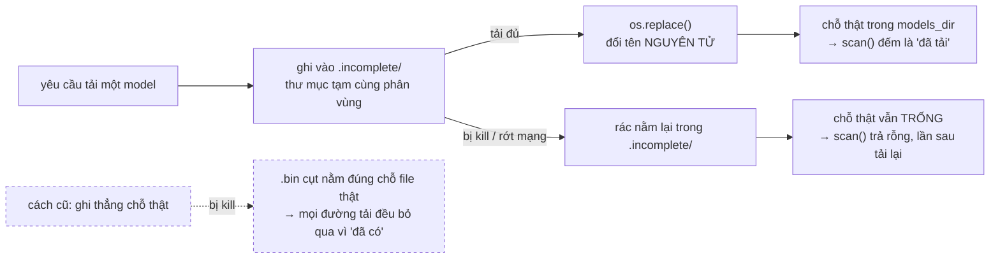

# Các đợt bổ sung ngoài lịch tuần

**Phạm vi:** 18/08 – 19/09/2026 · **Nguồn yêu cầu:** nợ kỹ thuật của Tuần 6–8, SPEC, bản
thiết kế giao diện, và [biên bản họp GVHD 19/08](meetings/bien-ban-hop-GVHD-2026-08-19.md).

> Không việc nào thuộc một tuần trong đề cương [`00`](00_project-outline.md) — chúng phát
> sinh từ việc dùng thử, từ những chỗ giao diện có sẵn mà backend còn thiếu, và từ yêu cầu
> của thầy.
>
> Như [`03`](03_nhat-ky-tuan-1-8.md), tài liệu này ghi **quyết định và kết quả**, không
> giải thích mã nguồn hiện thực thế nào: quyết định kiến trúc ở
> [`ARCHITECTURE.md`](../apps/ai-service/ARCHITECTURE.md), bẫy cục bộ ở docstring của
> adapter tương ứng.

| §   | Đợt   | Nội dung                                               |
| --- | ----- | ------------------------------------------------------ |
| 1   | 18/08 | Lịch sử phiên, đổi thư mục model, khởi động nhanh      |
| 2   | 20/08 | Màn Nhập tệp — audio/video có sẵn thành văn bản        |
| 3   | 05/09 | Backend ASR thứ hai (MLX) + tách người nói             |
| 4   | 05/09 | Duyệt trước khi gửi + bốn nút quản lý model bị vô hiệu |
| 5   | 05/09 | Màn Đánh giá trong app + backend ASR thứ ba            |
| 6   | 06/09 | Ba lần sửa cùng một chỗ: cách đặt tên và tải model     |
| 7   | 19/09 | Bộ cài Windows, whisper.cpp chạy GPU qua Vulkan        |

---

## 1. Lịch sử phiên, thư mục model, khởi động nhanh — 18/08

Ba khoản nợ của Tuần 6–8, đều chặn phần "ứng dụng dùng được thật" chứ không phải phần
pipeline. Hai cái phát sinh trực tiếp từ việc dùng thử: bật app lên chờ 45 giây mới thấy giao
diện, và ổ đĩa hệ thống hết chỗ vì model nằm cứng ở `~/.llvt/models`.

**Lịch sử phiên lưu trong SQLite** (SPEC `01` §7.11; tiêu chí nghiệm thu 16 yêu cầu xoá được).
Trước đó phụ đề chỉ sống trong bộ nhớ renderer: đóng app là mất.

Chỗ đặt dữ liệu là quyết định đáng kể nhất: **service ghi, không phải desktop.** Pipeline biết
chính xác lúc nào một câu kết thúc và mất bao nhiêu mili giây ở từng khâu; để renderer ghi thì
con số đó phải đi vòng qua WebSocket rồi quay lại, và bản ghi mất mỗi khi cửa sổ đóng giữa
chừng. Ba lựa chọn kèm theo, đều theo hướng "chọn thứ đơn giản nhất còn đúng": SQLAlchemy Core
thay vì ORM, `create_all` thay vì Alembic (CSDL chỉ tồn tại trên máy người dùng, không có bản
triển khai nào cần migrate), `LIKE` thay vì FTS5 (một máy, một người dùng, vài nghìn câu).
**Không lưu file âm thanh** — SPEC 14: chỉ văn bản + số đo.

Desktop đọc **thẳng từ REST**, không giữ bản sao trong `localStorage`: hai nguồn sự thật cho
cùng một danh sách là cách chắc chắn nhất để chúng lệch nhau.

**Đổi thư mục lưu model.** Khó ở chỗ `Settings` đọc từ biến môi trường, mà người dùng cuối
không đặt được biến môi trường, còn lựa chọn của họ lại phải sống sót qua lần mở app sau. Giải
bằng một nguồn cấu hình thứ hai xếp **dưới** env — [`ARCHITECTURE.md` §9](../apps/ai-service/ARCHITECTURE.md).
Đổi thư mục thì **unload chứ không reload**: thư mục mới gần như luôn rỗng, reload ngay trong
request nghĩa là tải vài GB trong lúc người dùng đang chờ một cái nút.

**Không nạp model lúc khởi động** đưa thời gian mở service từ **~45 giây xuống ~0,4 giây**. Hệ
quả phải nói rõ với người dùng: bắt đầu phiên khi model chưa nạp thì câu đầu tiên phải chờ hàng
chục giây, nên màn Phiên dịch hiện một ghi chú giải thích để không ai tưởng ứng dụng treo.

**Tiến trình nạp phải đo thứ chắc chắn đúng.** pywhispercpp và transformers đều tự tải bằng
`tqdm` riêng, không có callback nào để cắm vào; vá đè `tqdm` của thư viện thứ ba thì gãy mỗi lần
nâng phiên bản. Nên đo **số byte đã nằm trên đĩa**, trừ đi phần có sẵn từ trước. Giữ nguyên tắc
"không hiển thị số bịa": không biết tổng thì hiện số MB chứ tuyệt đối không đoán phần trăm.

---

## 2. Màn Nhập tệp — 20/08

Màn duy nhất trong bản thiết kế còn ở trạng thái tắt vì thiếu API bên AI service. Cũng có ích
cho phần thực nghiệm: chạy lại một bản ghi cuộc họp nhiều lần với các preset khác nhau mà không
phải nói lại vào micro.

Đây là **use case riêng, không phải một chế độ của pipeline realtime** — lý do ở
[`ARCHITECTURE.md` §5](../apps/ai-service/ARCHITECTURE.md).

### 2.1. Giải mã đặt ở desktop, không đặt ở service

| Phương án                            | Đánh giá                                                                                                          |
| ------------------------------------ | ----------------------------------------------------------------------------------------------------------------- |
| ffmpeg trong service                 | Phải đóng gói thêm binary cho cả hai OS, hoặc bắt người dùng tự cài — trái mục tiêu "cài một lần là chạy offline" |
| **Web Audio của Chromium (đã chọn)** | Electron có sẵn bộ giải mã cho cả tệp audio lẫn container video thông dụng. Không thêm phụ thuộc nào              |

`decodeAudioData` demux luôn container video và chỉ lấy track tiếng, nên "tệp video → văn bản"
dùng đúng đường đã có. Đo thật trên Electron 39 (macOS arm64), không phỏng đoán theo tài liệu:

| Container                              | Kết quả                            |
| -------------------------------------- | ---------------------------------- |
| mp3, m4a, wav, flac, ogg               | ✅                                 |
| webm (vp8 + opus)                      | ✅                                 |
| **mp4 / mov / m4v / 3gp** (h264 + aac) | ✅ tách được tiếng từ tệp có video |
| **mkv** (h264 + aac, và h264 + opus)   | ✅                                 |
| avi, mpeg-ts, flv, wmv                 | ❌ Chromium không có demuxer       |

Nhóm hỏng đều là định dạng cũ, trong khi Google Meet, Zoom và OBS đều xuất ra mp4/mkv/webm — nên
**không** đóng gói `ffmpeg.wasm` (~30 MB) chỉ để cứu vài định dạng hiếm.

### 2.2. Tiến trình đo bằng vị trí trong tệp, không đo bằng đồng hồ

Phần trăm là **vị trí trong tệp đã chạy qua VAD** ÷ độ dài tệp. Đây là số thật: tệp 10 phút chạy
tới giây 300 thì đúng là 50%, máy nhanh hay chậm không ảnh hưởng. Đổi lại, thanh chạy không đều —
đoạn im lặng lướt qua rất nhanh, đoạn dày tiếng nói thì chậm; vẫn trung thực hơn nội suy tuyến
tính theo đồng hồ.

**Dừng giữa chừng phải là một endpoint, không phải đóng kết nối.** `uvicorn` **không huỷ handler
khi client ngắt kết nối** — bỏ request giữa chừng thì service vẫn chạy hết tệp và vẫn giữ cờ
"đang bận", nên tệp kế tiếp lãnh nguyên một cái 409 vô lý. Huỷ cũng không có nghĩa là vứt đi
phần đã dịch: lượt chạy trả về bình thường kèm những đoạn đã xong.

### 2.3. Kết quả vào thẳng lịch sử

Bản ghi lưu thành một phiên trong SQLite, nên tìm kiếm, đổi tên, xuất `.txt`/`.srt` và xoá của
màn Lịch sử dùng lại được nguyên vẹn.

Kèm một giá trị mới cho `AudioSource`: **`file`**. Câu nhập từ tệp không phải giọng của mình cũng
không phải giọng phía cuộc họp; mượn tạm `system` sẽ khiến màn Lịch sử dán nhãn "REMOTE" cho một
thứ không có bên nào.

### 2.4. Đổi tab không được mất việc đang làm

Router cũ tháo bỏ màn cũ mỗi lần đổi tab. Với màn Nhập tệp thì đó không chỉ là mất ô tìm kiếm:
**vòng chạy vẫn tiếp tục ngầm** (service vẫn nghiền tệp) nhưng kết quả đổ vào một component đã bị
tháo, nên quay lại tab thì hàng đợi trống trơn như chưa từng chạy gì.

Sửa: mọi màn dựng một lần và **giữ nguyên**, đổi tab chỉ ẩn/hiện. Đánh đổi phải trả: màn bị ẩn
vẫn chạy hook của nó, nên mọi query có `refetchInterval` phải tự tắt khi khuất.

### 2.5. Bốn chỗ lệch so với mockup

| Chỗ lệch                                              | Vì sao                                                                                    |
| ----------------------------------------------------- | ----------------------------------------------------------------------------------------- |
| Thêm hàng chọn ngôn ngữ tệp / dịch sang / lưu lịch sử | Mockup chỉ giả lập chuyển thành chữ; ASR thật phải biết ngôn ngữ nguồn trước khi chạy     |
| Nút "Phân biệt người nói" để tắt, kèm tooltip         | Lúc đó pipeline chưa có diarization — giữ chỗ theo thiết kế nhưng không bịa tên người nói |
| Bản ghi hiện thêm dòng dịch (`→ …`)                   | Mockup chỉ có một dòng chữ gốc vì không có MT                                             |
| Thêm nút Huỷ và trạng thái "Đã huỷ"                   | Mockup giả lập bằng `setTimeout`; chạy thật thì một tệp dài chiếm model hàng phút         |

---

## 3. Backend ASR thứ hai (MLX) và tách người nói — 05/09

**Nguồn ý tưởng:** danh mục model của TranscriptionSuite (tài liệu tham khảo [1] của đề cương).
Câu hỏi xuất phát: tab _Models_ của TS liệt kê 43 model, danh mục của mình mới có 10 — có gì đáng
lấy sang không?

### 3.1. Lọc danh mục: lấy được bao nhiêu trong 43?

| Họ model trong TS               | Số  | Lấy?   | Lý do                                                                      |
| ------------------------------- | --- | ------ | -------------------------------------------------------------------------- |
| whisper.cpp (GGML)              | 11  | **Có** | Đúng runtime đang chạy; trước đợt này preset mới dùng 3 biến thể           |
| MLX Whisper (Apple Silicon)     | 12  | **Có** | 99 ngôn ngữ, có vi/ja/zh → backend ASR thứ hai                             |
| Diarization (pyannote)          | 1   | **Có** | Không nằm trong pipeline dịch, nhưng hợp với màn Nhập tệp                  |
| Faster Whisper (CTranslate2)    | 10  | Chưa   | Dùng được nhưng adapter còn là stub — làm ở §5                             |
| Parakeet / Canary (NVIDIA NeMo) | 5   | Không  | Chỉ 25 tiếng châu Âu — **không có tiếng Việt, Nhật, Trung**                |
| SenseVoice (FunASR)             | 1   | Không  | zh/en/yue/ja/ko — thiếu đúng tiếng Việt                                    |
| VibeVoice (9B)                  | 4   | Không  | 6–18 GB, thiết kế cho xử lý theo lô — không có cửa chạy gần thời gian thực |

Hơn một nửa danh mục của TS không dùng được ở đây, và lý do luôn là **ngôn ngữ**, không phải chất
lượng model. TS nhắm hội thoại tiếng Anh/châu Âu; đồ án này bắt buộc phải có tiếng Việt ở một đầu.

Sau khi mở rộng: whisper.cpp có 15 mục, MLX có 12, dung lượng lấy thật từ API của HuggingFace chứ
không ước lượng — nhân tiện sửa được hai con số sai trong danh mục cũ
(`ggml-large-v3-turbo-q5_0.bin` là **574 MB** chứ không phải 809 MB; `-q8` là **874 MB** chứ không
phải 1,2 GB). Cố ý **không** đưa vào các biến thể English-only dù whisper.cpp có: ứng dụng luôn
phải nhận cả vi/ja/zh, model English-only sẽ trả rác cho ba thứ tiếng đó.

### 3.2. MLX kiểm chứng rằng kiến trúc hexagonal không chỉ nằm trên giấy

Cả whisper.cpp và MLX đều chạy Whisper trên GPU Apple nhưng bằng hai đường khác nhau: C++ với
Metal shader tự viết, so với framework mảng của Apple dùng unified memory. Câu "chọn cái nào"
phải trả lời bằng số, mà muốn có số thì phải chạy được cả hai.

Thêm backend này tốn đúng ba chỗ và không đụng pipeline, transport hay giao diện — quy trình ghi
ở [`ARCHITECTURE.md`](../apps/ai-service/ARCHITECTURE.md), mục "Thêm một backend mới".

> `uv sync` gỡ mọi nhóm/extra không được nêu trong chính lệnh đó — chạy `make setup-mlx` sau
> `make setup` là mất nhóm `eval` và các backend còn lại.

### 3.3. Bảy model MLX, đo thật để chọn — 06/09

Bảng `asr_alternatives` ban đầu chọn model theo suy đoán ("turbo cho nhanh, fp16 cho chất
lượng"). Đo thật để kiểm chứng: cùng **20 câu đầu tiếng Việt** của FLEURS `test`, cùng tham số
giải mã, bộ lọc câu ma tắt, trên Apple M4.

| Model MLX (`mlx-community/…`)       | Trên đĩa |    WER |   RTF | Ước tính chạy đầy đủ 4 ngôn ngữ |
| ----------------------------------- | -------: | -----: | ----: | ------------------------------- |
| `whisper-large-v3-asr-fp16`         |   2,9 GB |   6,7% |  0,18 | ~110 phút                       |
| `whisper-large-v3-asr-8bit`         |   1,2 GB |   6,7% |  0,14 | ~86 phút                        |
| `whisper-large-v3-asr-4bit`         |   852 MB |   7,2% |  0,13 | ~80 phút                        |
| `whisper-large-v3-turbo-asr-fp16`   |   1,5 GB |   8,1% |  0,08 | ~49 phút                        |
| `whisper-large-v3-turbo-asr-8bit`   |   829 MB |   8,1% |  0,08 | ~49 phút                        |
| `whisper-large-v3-turbo-asr-4bit`   |   447 MB |   8,9% |  0,08 | ~49 phút                        |
| `whisper-small-asr-fp16`            |   490 MB | 133,5% |  0,14 | không dùng được                 |
| _whisper.cpp `large-v3-turbo-q5_0`_ |   570 MB |   8,6% | 0,089 | ~55 phút                        |

**Ba điều rút ra:**

1. **Lượng tử hoá gần như miễn phí.** fp16 → 8bit **không đổi WER** (6,7% cả hai) nhưng nhỏ hơn
   2,3 lần và nhanh hơn 22%. Xuống 4bit mới mất 0,5–0,8 điểm. Không có lý do nào để dùng bản fp16
   của cùng một model.
2. **Turbo mới là chỗ đánh đổi thật:** nhanh gấp ~2 lần (RTF 0,08 so với 0,14) nhưng mất 1,4 điểm
   WER. Đây là quyết định sản phẩm, không phải quyết định kỹ thuật.
3. **Bản `small` không dùng được cho tiếng Việt.** WER 133,5% (vượt 100% được vì lỗi **chèn** cũng
   bị tính) với 10/20 câu trả rỗng, số còn lại rơi vào vòng lặp lặp chữ.

**Họ `whisper-small-asr-*` của mlx-community hỏng — preset Fast phải đổi.** Đo tiếp bản mà preset
Fast đang dùng, và đo thêm bản GGML cùng cỡ để biết lỗi nằm ở đâu:

| Model                                         | Ngôn ngữ |    WER |  RTF | Câu rỗng |
| --------------------------------------------- | -------- | -----: | ---: | -------: |
| MLX `whisper-small-asr-8bit` (preset Fast cũ) | vi       | 125,4% | 0,28 |    10/20 |
| MLX `whisper-small-asr-8bit`                  | en       | 162,1% | 0,38 |     3/20 |
| MLX `whisper-small-asr-fp16`                  | vi       | 133,5% | 0,14 |    10/20 |
| whisper.cpp `ggml-small-q5_1` (cùng cỡ)       | vi       |  20,6% | 0,07 |     0/20 |

Bản GGML cùng cỡ chạy bình thường — kém chính xác nhưng **hoạt động**. Vậy lỗi không phải "model
small quá nhỏ", cũng không phải tham số giải mã của mình, mà là **các bản chuyển đổi
`whisper-small-asr-*` của mlx-community**. Đáng chú ý hơn: bản MLX small còn **chậm hơn** mọi model
lớn — vì kẹt vòng lặp thì nó sinh token tới khi hết hạn mức.

Đã sửa preset Fast trỏ `mlx_whisper` sang `whisper-large-v3-turbo-asr-4bit`: 447 MB (nhỏ hơn bản
small fp16), RTF 0,08, WER 8,9% — thắng bản small ở cả ba trục nên đây không phải một sự đánh đổi.
Danh mục đánh dấu ba bản small là "không khuyến nghị" thay vì gỡ hẳn.

**Hai giới hạn của bảng này**, phải nói kèm khi trích vào báo cáo: chỉ 20 câu và chỉ tiếng Việt,
nên chênh lệch dưới ~1 điểm WER chưa kết luận được; và dòng whisper.cpp khác dòng MLX ở **cả**
runtime lẫn cỡ model, nên nó không phải phép so sánh runtime thuần tuý.

> Một chỗ dễ kết luận nhầm khi so hai runtime: `probability` của pywhispercpp là trung bình **cộng**
> còn `avg_logprob` của mlx-audio quy ra trung bình **nhân**, mà trung bình nhân luôn ≤ trung bình
> cộng. Cùng một ngưỡng độ tin cậy sẽ khắt khe hơn trên MLX — không phải "MLX kém tự tin hơn".

### 3.4. Tách người nói — chỉ cho màn Nhập tệp

**Vì sao không dùng cho phiên trực tiếp.** Không phải vì khó, mà vì không cần và không đúng:
trong phiên hai chiều ai nói đã biết sẵn (mic là người dùng, system audio là phía bên kia); và
model diarization phải gom cụm giọng trên toàn bộ đoạn âm thanh mới ổn định được danh tính, trong
khi mỗi câu realtime chỉ dài vài giây nên `SPEAKER_00` của câu này không có liên hệ gì với
`SPEAKER_00` của câu sau. Thiết kế port và quy tắc gán nhãn ở
[`ARCHITECTURE.md` §7](../apps/ai-service/ARCHITECTURE.md).

Service trả về **mã** (`speaker-1`, `speaker-2`), không trả câu chữ: lịch sử là dữ liệu lưu lâu
dài, người dùng đổi ngôn ngữ giao diện thì bản ghi cũ phải đổi theo chứ không được đóng băng tiếng
Việt trong SQLite.

**Mặc định TẮT, và nói thẳng vì nó đi ngược mục tiêu "hoàn toàn cục bộ":**

1. `pyannote/speaker-diarization-community-1` là repo **gated** — phải đồng ý điều khoản trên
   huggingface.co và có access token mới tải được. Token chỉ dùng cho **lần tải đầu tiên**; sau đó
   model (~33 MB) chạy offline như mọi model khác.
2. `pyannote.audio` kéo theo torchaudio/lightning/optuna — vài trăm MB phụ thuộc cho một tính năng
   của một màn hình.

**Hỏng thì xuống nước, không kéo cả ứng dụng theo.** Nạp model hỏng: khâu `DIA` bị đánh dấu thất
bại kèm lý do, bốn khâu của pipeline dịch vẫn nạp bình thường. Chạy hỏng giữa chừng: bỏ nhãn người
nói, giữ nguyên bản ghi — bản ghi không có nhãn vẫn dùng được, không có bản ghi thì không.

### 3.5. Token HuggingFace — bí mật duy nhất của ứng dụng

Màn Cài đặt vốn đã có ô "Hugging Face Token" từ bản thiết kế nhưng là placeholder: token nằm trong
`localStorage` của renderer và **không đi đâu cả**. Diarization là tính năng đầu tiên thật sự cần
nó, nên nhân tiện sửa luôn vấn đề bảo mật có sẵn — `localStorage` lưu văn bản thường, mọi script
trong renderer đọc được.

Token giờ do service giữ ở quyền `0600` và **không bao giờ đi ngược lại renderer**: API chỉ trả
"đã đặt hay chưa", nguồn nào, và một đoạn che. Log chỉ ghi việc đã đổi chứ không ghi giá trị, và
bản mới **chủ động xoá** khoá `hfToken` còn sót trong localStorage của bản cũ. Ba nguồn token và
thứ tự ưu tiên ở [`ARCHITECTURE.md` §9](../apps/ai-service/ARCHITECTURE.md).

`POST /api/hf/verify` tồn tại vì cách còn lại để phát hiện token sai là **chờ hết một lượt tải
model vài phút** rồi mới thấy 401. Token sai trả **200 kèm `ok: false`** chứ không phải lỗi HTTP:
đó là kết quả bình thường của việc kiểm tra, không phải request hỏng.

---

## 4. Duyệt trước khi gửi + bốn nút quản lý model — 05/09

**Nguồn yêu cầu:** SPEC 7.10 / 7.8 và bản thiết kế giao diện. Đợt này đóng nốt nhóm tính năng **đã
có chỗ trong giao diện hoặc trong contract nhưng chưa có backend**. Rà lại toàn bộ
`DisabledButton`, `notSupported` và các giá trị enum không ai phát ra thì còn đúng năm chỗ.

### 4.1. Chỉnh sửa trước khi gửi (SPEC 7.10)

Đáng chú ý nhất vì nó là một **yêu cầu chức năng có số hiệu**, không phải một nút phụ:
`WaitingForConfirmation` đã nằm trong `PipelineState` của cả hai phía từ Tuần 6 nhưng **không chỗ
nào phát ra nó**. Cách cắt pipeline làm hai ở
[`ARCHITECTURE.md` §8](../apps/ai-service/ARCHITECTURE.md).

**Ba quyết định về dữ liệu:**

- **Ghi lịch sử ngay lúc treo, không đợi bấm gửi.** App tắt giữa lúc đang treo thì câu đã dịch vẫn
  còn, chỉ mất việc chưa đọc ra.
- **Bản đã sửa ghi đè bản dịch máy.** Cái được gửi đi mới là cái đáng lưu; giữ bản máy dịch rồi vứt
  bản người sửa là ghi sai sự thật.
- **Bỏ một câu vẫn giữ nó trong lịch sử.** Người dùng quyết định không gửi cũng là một sự việc có
  thật của cuộc họp.

**Đếm ngược (SPEC 7.8) đặt ở client**, vì đó là thứ người dùng đang nhìn — service giữ timer thì nó
phải đoán khi nào giao diện sẵn sàng. **Gõ vào ô sửa sẽ huỷ đếm ngược**: đang sửa dở mà câu tự bay
đi là hỏng việc, mà đó lại đúng lúc người dùng cần nó nhất.

**Chặn trên số câu treo:** bỏ câu **cũ nhất** chứ không từ chối câu mới — trong hội thoại, câu vừa
nói mới là câu người ta còn muốn gửi.

### 4.2. Bốn nút từng bị vô hiệu

| Nút                    | Trước đây                                | Giờ                                                   |
| ---------------------- | ---------------------------------------- | ----------------------------------------------------- |
| Huỷ khi đang nạp model | vô hiệu — `POST /api/models/load` chặn   | `POST /api/models/load/cancel`, dừng ở ranh giới khâu |
| Ô "Tự chọn"            | vô hiệu — "cần API model bên AI service" | preset `custom` + bảng chọn model từng khâu           |
| Tải model từ danh mục  | vô hiệu — "tải model vẫn làm thủ công"   | `POST /api/models/download`                           |
| Xoá lẻ một model       | vô hiệu — service chỉ xoá được tất cả    | `DELETE /api/models/one?path=`                        |

**Huỷ nạp: nói thẳng cái nó KHÔNG làm được.** Dừng ở **ranh giới khâu kế tiếp**, không dừng được
một lượt tải đang chạy — thư viện tải trong worker thread, mà thread thì không giết ngang được. Vẫn
đáng bấm: chỗ tốn nhất thường là khâu SAU (bấm huỷ trước khi tới NLLB là tiết kiệm ~2,4 GB). Những
khâu đã nạp xong được **giải phóng** khi huỷ — nạp nửa vời còn tệ hơn không nạp. Trạng thái là
`cancelled` chứ không phải `failed`, REST trả **409** chứ không phải 503: dừng theo yêu cầu không
phải lỗi, giao diện không được hiện báo đỏ.

**Preset `custom`** là một giá trị trong enum `Preset` thay vì một cờ riêng, nên `preset` vẫn là bộ
chọn duy nhất trong contract. Khâu nào chưa chọn thì lấy theo **Balanced** — mở ô "Tự chọn" lần đầu
ra một cấu hình chạy được chứ không phải biểu mẫu trống. Chỉ đổi được **ASR và MT**: VAD là ngưỡng
endpointing chứ không phải lựa chọn model, còn TTS đã tự định tuyến theo ngôn ngữ đích.

**Tải một model** định tuyến theo tên rồi gọi lại đúng hàm tải đã có trong adapter tương ứng. Cố ý
không viết lại logic tải: hai đường tải cho cùng một model là hai chỗ để lệch nhau.

**Xoá một model — chỗ duy nhất phải cẩn thận.** Nhận đường dẫn từ REST rồi `rmtree` là cách nhanh
nhất để xoá nhầm thư mục người dùng. Điều kiện xoá bắt buộc **cả hai** vế: nằm trong thư mục do app
quản lý (và không phải chính thư mục gốc đó), **và** là thứ hàm quét thật sự liệt kê. Đường dẫn tuỳ
ý, traversal `..`, hay một file lạ nằm đúng thư mục — đều bị từ chối bằng 400.

---

## 5. Màn Đánh giá trong app + backend ASR thứ ba — 05/09

**Nguồn yêu cầu:** [biên bản GVHD 19/08](meetings/bien-ban-hop-GVHD-2026-08-19.md) mục 3d (Ưu tiên 2) và mục 7 Ưu tiên 3.

### 5.1. Vì sao không dùng jiwer/sacrebleu trong app

Hai gói đó nằm ở nhóm phụ thuộc `eval`, **không có** trong bản cài của người dùng. Tệ hơn:
tokenizer `flores200` của sacrebleu **tải thêm một model** lần đầu dùng — trái với "cài xong là
chạy offline", thứ là toàn bộ lý do tồn tại của đồ án.

Nên phần tính trong app là Levenshtein + chrF thuần Python. Đổi lại phải nói rõ, và giao diện có
nói rõ:

|                                     | Màn Đánh giá trong app              | `make eval-asr` / `make eval-mt`         |
| ----------------------------------- | ----------------------------------- | ---------------------------------------- |
| Độ đo                               | WER/CER + chrF thuần Python         | jiwer + **spBLEU** (tokenizer flores200) |
| Cần mạng                            | không                               | có, lần đầu                              |
| Dùng để                             | thử nhanh, so các cấu hình với nhau | **bảng đưa vào báo cáo**                 |
| So được với số công bố của NLLB-200 | không                               | có                                       |

Bản trong package là **nguồn duy nhất**: `scripts/accuracy.py` bỏ phần chép tay và import từ đây,
`scripts/eval_latency.py` cũng gọi chung hàm percentile — cùng một bộ dữ liệu phải ra cùng một con
số p90, dù đọc ở đâu.

### 5.2. Ba điều màn hình phải nói thật

- **Dịch từ câu tham chiếu, không dịch từ đầu ra ASR** — dịch từ cái ASR vừa nghe được thì lỗi hai
  khâu cộng dồn.
- **Câu không có bản ghi thì chạy bằng giọng tổng hợp**, mà giọng tổng hợp sạch và đều nên số **lạc
  quan hơn thực tế**. Màn hình hiện dải cảnh báo riêng trước khi người đọc kịp chép con số vào báo
  cáo.
- **Khai báo `audio` mà sai đường dẫn thì BÁO LỖI**, không lặng lẽ rơi về giọng tổng hợp — người
  chạy sẽ tưởng mình đang có số đo giọng thật.

**Báo p50/p90, không báo trung bình:** người dùng cảm nhận được đúng những câu chậm nhất; trung bình
thì che mất chúng.

### 5.3. Số đo được khi làm, và cái bẫy khi đọc nó

Chạy 2 câu đầu của bộ mẫu trên MacBook (whisper large-v3-turbo-q5 + NLLB-600M): WER 18,8%, chrF
35,9%, ASR p50/p90 970/1046 ms, MT p50/p90 246/733 ms, RTF p90 1,022.

Cả hai câu đều là **giọng tổng hợp** nên đây chưa phải số dùng được cho báo cáo. Số cho báo cáo ở
[`05` §8](05_bo-danh-gia-fleurs.md). Đừng đặt `RTF p90 1,022` ở đây cạnh `RTF p90 0,395–0,786` của
§8c rồi kết luận hệ thống đã nhanh lên: hai con số khác **phạm vi** (đây là ASR+MT, kia là cả chuỗi
có TTS), khác **model**, và khác cả **dữ liệu**.

Hai điều đáng chú ý: ASR nghe "API" thành "A.V." và "kiểm thử" thành "kiểm thư" — lỗi đúng kiểu
Whisper trên từ mượn và thanh điệu. Và chrF chỉ ~36% dù bản dịch **đúng nghĩa** ("I've completed the
API deployment" so với tham chiếu "I have finished the API implementation") — đây là hành vi đúng
của chrF trên câu ngắn có cách diễn đạt khác, và cũng là lý do bảng báo cáo cần thêm COMET.

### 5.4. faster-whisper — backend thứ ba

Adapter này là stub từ Tuần 3. Giờ hiện thực thật vì hai lý do đều đã đến hạn: **Windows 11 là một
trong hai nền tảng mục tiêu** (ở đó whisper.cpp không có Metal, mà nhân CUDA của nó cũng không bằng
CTranslate2), và thầy giao ở Ưu tiên 3 việc lập bảng so sánh — có ba runtime cho **cùng một model
Whisper** là bảng so sánh sạch nhất có thể, khác nhau đúng ở engine chứ không lẫn khác biệt về model.

|          | whisper.cpp        | MLX                      | faster-whisper                     |
| -------- | ------------------ | ------------------------ | ---------------------------------- |
| Engine   | C++ + Metal shader | framework mảng của Apple | CTranslate2                        |
| Thiết bị | Metal / CPU        | Metal (bắt buộc)         | CUDA fp16 / CPU int8               |
| Nền tảng | cả hai             | macOS Apple Silicon      | cả hai, mạnh nhất ở Windows+NVIDIA |
| Gói      | mặc định           | `--extra mlx`            | `--extra ctranslate2`              |

**VAD riêng của nó phải TẮT:** đoạn vào đây đã do Silero cắt sẵn; cắt thêm lần nữa là bỏ mất phần
đệm đầu/cuối câu mà khâu VAD cố tình chừa. Bảng đo phải ghi kèm kiểu tính toán (`cuda (float16)`,
`cpu (int8)`) — cùng một GPU nhưng fp16 và int8 cho hai con số tốc độ khác hẳn.

---

## 6. Ba lần sửa cùng một chỗ: cách đặt tên và tải model — 06/09

Ba đợt liên tiếp trên màn **Quản lý model**. Gộp lại vì chúng là một chuỗi: đợt đầu sửa cách đặt
tên, đợt hai sửa một lỗi do chính đợt đầu tạo ra, đợt ba sửa thứ mà cả hai đợt trước đều bỏ qua.

### 6.1. Tên model là đường dẫn thật ở thượng nguồn

Danh mục trước đây có **hai hệ tên chồng nhau**, và không nhất quán:

| Khâu               | Danh mục cũ               | Thật ra là                                               |
| ------------------ | ------------------------- | -------------------------------------------------------- |
| ASR whisper.cpp    | `whisper-small-q5`        | file `ggml-small-q5_1.bin` trong `ggerganov/whisper.cpp` |
| ASR MLX            | `mlx-whisper-large-v3`    | repo `mlx-community/whisper-large-v3-asr-fp16`           |
| ASR faster-whisper | `fw-whisper-small`        | repo `Systran/faster-whisper-small`                      |
| MT                 | `nllb-200-distilled-600M` | repo `facebook/nllb-200-distilled-600M`                  |
| DIA                | `pyannote/…-community-1`  | **chính nó** — mục duy nhất đã đúng                      |

Hậu quả đo được:

- **Không tải được bằng đường dẫn thật.** `POST /api/models/download` với
  `mlx-community/whisper-large-v3-asr-fp16` trả lỗi "không biết model", trong khi đó chính là chuỗi
  người dùng đọc được trên HuggingFace.
- **Nhãn "đã tải" của mọi mục whisper.cpp không bao giờ sáng.** Trên đĩa là
  `ggml-large-v3-turbo-q5_0`, danh mục ghi `whisper-large-v3-turbo-q5` — so bằng `===` thì không đời
  nào khớp. Model có sẵn vẫn hiện như chưa tải.

Quy tắc thay thế — một model có đúng một chuỗi định danh, và chuỗi đó là đường dẫn thật ở thượng
nguồn — ghi ở [`ARCHITECTURE.md` §4](../apps/ai-service/ARCHITECTURE.md).

Nhân tiện bỏ `nllb-200-distilled-600M-int8` (trỏ về đúng repo gốc nên preset Fast quảng cáo "int8"
mà nạp y hệt Balanced) và thêm `facebook/nllb-200-1.3B` — vốn đã nằm trong danh mục giao diện nhưng
thiếu ở bảng ánh xạ nên chọn hay tải đều không được.

> **Ảnh hưởng tới người đang dùng:** ai đã lưu bộ "Tự chọn" bằng tên cũ thì lần chạy tới, adapter
> báo lỗi không tìm thấy model. Chọn lại một mục trong ô "Tự chọn" là xong.

### 6.2. Chọn model không phải là nạp model

Ba lỗi cùng một gốc: giao diện cho người dùng _chọn_, còn service hiểu mỗi lần chọn là một mệnh lệnh
_làm ngay_.

**Bấm preset không còn tự nạp model.** Trước, bấm thử một preset để xem nó gồm những model gì là đủ
để service ngồi nạp 4 khâu — đo thực tế **12,9 giây** với model đã có sẵn trên đĩa và hàng phút nếu
chưa tải. Nút "Khởi động model" ngay bên cạnh vì thế thành vô nghĩa. Sau khi sửa: **13 ms**.

Hai test cũ khẳng định hành vi cũ đã được **viết lại theo hợp đồng mới** thay vì sửa cho qua — chúng
đang kiểm đúng thứ vừa cố tình bỏ đi.

**Danh sách model tự chọn phải tách theo runtime.** Trước, đó là **một** danh sách phẳng gộp cả 33
model của ba runtime, nên người dùng chọn được `mlx_whisper` + `ggml-tiny-q5_1.bin`; MLX khi đó đi
hỏi HuggingFace một repo tên đúng theo nghĩa đen là `ggml-tiny-q5_1.bin` → 404 → HTTP 500. Ba runtime
dùng ba định dạng khác hẳn nhau nên **không có model nào dùng chung được** — gộp một danh sách là mời
người dùng chọn sai.

> Đây là lỗi do chính đợt trước tự tạo ra, kèm một comment giải thích _sai_; ghi lại để đừng gộp lại
> lần nữa.

Còn một nửa nữa chỉ lộ ra khi có test ở mức màn hình: đổi runtime thì bản nháp mới chỉ _bỏ_ model cũ
đi, nên ô model rơi về giá trị service đang giữ — model của runtime **cũ**. Người dùng nhìn thấy sẵn
một tổ hợp không tồn tại đang được chọn, bấm Lưu là ăn 400 mà không hiểu vì sao.

**Tìm kiếm model tải được cả repo ngoài danh mục.** Vì tên model **chính là** đường dẫn thật ở thượng
nguồn (§6.1), gõ đường dẫn để tải là việc tự nhiên nhất người dùng sẽ thử. Yêu cầu tải nhận thêm
trường `kind` — thứ service không tự suy ra nổi, vì `org/repo` nhìn từ ngoài thì repo nào cũng như
repo nào, mà nó quyết định model nằm vào thư mục nào và runtime nào sẽ chạy.

| Tình huống                           | Mã  | Vì sao không phải 503                              |
| ------------------------------------ | --- | -------------------------------------------------- |
| Tên ngoài danh mục, không kèm `kind` | 400 | Thiếu thông tin trong yêu cầu                      |
| Đường dẫn không có trên HF (gõ nhầm) | 404 | Repo đó sẽ không bao giờ tồn tại                   |
| Repo _gated_, chưa được cấp quyền    | 403 | Phải xin quyền trên web, không phải sự cố tạm thời |
| Mất mạng, hết đĩa                    | 503 | Đúng nghĩa "thử lại sau"                           |

### 6.3. Tải dở dang không phải là "đã tải"

Tải một model hàng GB bị ngắt giữa chừng vẫn để lại thứ gì đó trên đĩa, và bảng "Model đã tải" đếm
luôn nó. Tệ hơn: **mọi** đường tải trong dự án đều bỏ qua model "đã có", nên bản hỏng đó nằm lại vĩnh
viễn — không có thao tác nào trong app sửa được nó.

Ba việc phải làm, không thay thế được cho nhau:

**(1) Tải xong mới đặt vào chỗ thật.** Thư viện tải của whisper.cpp ghi thẳng vào đường dẫn cuối cùng
và chỉ dọn dẹp khi _bắt được_ exception — bị kill thì không có exception nào để bắt, nên nó để lại một
`.bin` cụt đúng chỗ file thật, và lần sau chính nó thấy file tồn tại là bỏ qua.



Điểm mấu chốt là `os.replace()` trong cùng một phân vùng là **nguyên tử**: file hoặc chưa có, hoặc đã
đủ, không có trạng thái ở giữa. sherpa-onnx cũng đổi sang giải nén vào thư mục tạm rồi đổi tên; cache
HuggingFace vốn đã làm đúng nên không đụng.

**(2) Nhận ra bản dở đã lỡ nằm trên đĩa.** Model dở **vẫn được liệt kê** — giấu đi thì người dùng thấy
đĩa đầy mà không có cách nào xoá — nhưng không được tính là đã tải ở bất cứ đâu.

Điều kiện nhận biết ban đầu viết là "có bất kỳ file `.incomplete` nào". Thư mục model thật trên máy dev
bác bỏ ngay: repo NLLB có hai file `.incomplete` 0 byte nằm cạnh blob 2,4 GB **đã tải xong** — file tạm
của một lượt chết nằm lại vĩnh viễn kể cả sau khi lượt sau thành công. Đếm cả rác cũ là bắt người dùng
tải lại 2,5 GB vô ích.

**Chỗ không bắt được**, nói rõ ra chứ không giấu: chết đúng khe giữa hai file, khi file trước xong hẳn
và file sau chưa kịp tạo dấu vết. Biết được nó thiếu thì phải hỏi HuggingFace, tức phải có mạng, trong
khi hàm này chạy cả lúc offline. Đó là lý do phải có việc thứ ba.

**(3) Nút "Tải lại"** — xoá bản đang có rồi tải lại từ đầu. Không có nó thì một bản hỏng mà máy không
nhận ra được là ngõ cụt hoàn toàn. Model dở hiện nhãn cam "Tải chưa xong" kèm nút "Tải lại"; nút xoá
vẫn ở đó — hai lối thoát.

Kiểm chứng trên service thật, thư mục model tạm:

| Việc                                            | Kết quả                                               |
| ----------------------------------------------- | ----------------------------------------------------- |
| Tải `ggml-tiny-q5_1.bin`                        | 200, 32,2 MB, không sót thư mục tạm                   |
| Giả lập kill giữa chừng (unit test)             | không có `.bin` nào ở thư mục thật, hàm quét trả rỗng |
| Cắt file còn 5 MB rồi tải lại **không** `force` | 200 nhưng vẫn 5,0 MB — đúng cái bug cũ                |
| Cắt file còn 5 MB rồi tải lại **có** `force`    | 32,2 MB                                               |
| Quét thư mục model thật (6 model)               | không có báo nhầm nào                                 |

---

## 7. Bộ cài Windows và whisper.cpp chạy GPU qua Vulkan — 19/09

Bản macOS đã đóng gói xong từ 15/09 ([`09` mục 3a](09_huong-dan-cai-dat.md)). Bản Windows phải
dựng trên chính máy Windows vì torch, sherpa-onnx và pywhispercpp đều mang thư viện native, không
biên dịch chéo được. Script đóng gói vốn đã viết sẵn nhánh Windows nhưng **chưa từng chạy**. Mục này
ghi lại những gì đã làm để biết bộ cài chạy thật, chứ không chỉ build ra được một file `.exe`.

Máy dùng để dựng và kiểm: Windows 11 Pro (build 26200), Intel i5-12500H (16 luồng), hai GPU là Intel
Iris Xe (tích hợp) và NVIDIA RTX 4060 Laptop 8 GB (driver 610.88). Build chạy trong Git Bash.

### 7.1. Kiểm theo bốn tầng, từ trong ra ngoài

Mỗi tầng loại bớt một nhóm nguyên nhân, để khi có lỗi thì biết nó nằm ở đâu:

| Tầng | Kiểm gì                             | Cách kiểm                                                                                                          | Loại được lỗi nào                                   |
| ---- | ----------------------------------- | ------------------------------------------------------------------------------------------------------------------ | --------------------------------------------------- |
| 1    | Bộ Python đóng gói (`dist/service`) | `bundle_service.sh` tự import torch, transformers, sherpa_onnx, pywhispercpp, silero_vad                           | thiếu DLL, wheel sai nền tảng                       |
| 2    | Service chạy từ bộ Python đó        | chạy `python.exe -m llvt_ai_service`, gọi `/health`, `/api/config`, `POST /api/models/load`, `POST /api/benchmark` | model không nạp được, native lib chết lúc chạy thật |
| 3    | Bộ cài `.exe` thật                  | cài im lặng `/S /D=<thư mục tạm>`, mở app, đọc log, đóng app, gỡ cài `/S`                                          | sai đường dẫn Resources, service không tự lên/tắt   |
| 4    | Tốc độ trên chính bản cài           | gọi `/api/models/load` + `/api/benchmark` vào service mà app tự khởi động                                          | chạy được nhưng chậm tới mức không dùng được        |

Tầng 4 không có trong kế hoạch ban đầu. Nó được thêm vào sau khi tầng 2 cho thấy bản cài chạy đúng
mà vẫn không dùng được (lỗi 2 ở mục 7.3).

### 7.2. Kết quả trên bộ cài thật

| Việc                                      | Kết quả                                                                                         |
| ----------------------------------------- | ----------------------------------------------------------------------------------------------- |
| `make dist`                               | `Voice Translator-1.0.0-setup.exe` 371 MB; cài xong 1,8 GB                                      |
| Cài im lặng bằng chính file `.exe`        | exit 0, khoảng 5 phút (bộ Python có hàng chục nghìn file nhỏ)                                   |
| Mở app                                    | service tự chạy, trả lời `/health` sau 12 giây                                                  |
| Renderer nối vào service                  | log service ghi `GET /api/config`, `/api/models`, `/api/sessions` và `WebSocket /ws [accepted]` |
| Log tiếng Việt                            | ghi đúng (`model=chưa nạp (nạp khi cần)`), không còn "Logging error"                            |
| `POST /api/models/load` (preset Balanced) | 34 giây, đủ bốn khâu; ASR báo `accel = Vulkan`                                                  |
| Đóng app                                  | không còn tiến trình `voice-translator` hay `python.exe` nào; cổng 8756 được nhả                |
| Gỡ cài `/S`                               | exit 0                                                                                          |

Benchmark trên chính bản cài, preset Balanced, 3 giây audio (ms):

| Chiều | VAD | ASR | MT   | TTS | Tổng |
| ----- | --- | --- | ---- | --- | ---- |
| vi→en | 122 | 437 | 1742 | 187 | 2489 |
| en→vi | 119 | 480 | 1703 | 190 | 2492 |
| vi→ja | 182 | 362 | 1368 | 912 | 2824 |

Trước khi chuyển sang Vulkan, cùng phép đo vi→en ra ASR 17.573 ms và tổng 19.164 ms.

### 7.3. Bảy lỗi lộ ra nhờ kiểm, đều đã sửa

| #   | Triệu chứng                                                          | Nguyên nhân                                                                                                      | Sửa                                                                                              | Lộ ra ở |
| --- | -------------------------------------------------------------------- | ---------------------------------------------------------------------------------------------------------------- | ------------------------------------------------------------------------------------------------ | ------- |
| 1   | Bước kiểm import của script chết vì dấu `✓`                          | stdout của Python bị pipe trên Windows mặc định là cp1252; log tiếng Việt của service cũng thành "Logging error" | chạy Python với `PYTHONUTF8=1`, cả trong script lẫn lúc `main/service.ts` spawn service          | tầng 1  |
| 2   | ASR mất 17,6 s cho 3 s audio                                         | wheel pywhispercpp trên PyPI chỉ có CPU, mặc định 4 luồng; tăng lên 12 luồng cũng chỉ còn 11,2 s                 | chuyển whisper.cpp sang GPU qua Vulkan (mục 7.4)                                                 | tầng 2  |
| 3   | Build Vulkan báo "No CMAKE_C_COMPILER could be found" dù MSVC đã cài | đường dẫn build vượt 260 ký tự; lỗi thật (`FTK1011`) chỉ nằm trong `CMakeConfigureLog.yaml`                      | build trong thư mục ngắn `C:\llvtvk`                                                             | build   |
| 4   | `tar` báo "Cannot connect to C: resolve failed"                      | `tar` hiểu `C:/…` là `máy:đường-dẫn`                                                                             | dùng đường dẫn dạng `/c/…`                                                                       | build   |
| 5   | Có Vulkan mà ASR vẫn mất ~9,9 s, GPU NVIDIA dùng 0%                  | laptop hybrid: ggml liệt kê Iris Xe trước RTX 4060, whisper.cpp lấy GPU đầu tiên                                 | liệt kê thiết bị ggml trước khi nạp, ưu tiên card rời (`pick_gpu_device`)                        | tầng 4  |
| 6   | Giao diện báo ASR chạy "CPU" dù đang chạy GPU                        | backend Vulkan không khai gì trong `system_info()`                                                               | đọc thiết bị thật từ log whisper.cpp lúc nạp (`gpu_backend_from_log`); ô "Vulkan" bật cho NVIDIA | tầng 4  |
| 7   | Lần transcribe đầu tiên mất 11,7 s                                   | driver biên dịch shader Vulkan ở lần dùng đầu (sau đó có cache trên đĩa, chỉ còn 0,2 s)                          | làm nóng bằng 1 s im lặng ngay lúc nạp model, để khoảng chờ rơi vào bước có thanh tiến trình     | tầng 4  |

Lỗi 1 ảnh hưởng cả người dùng. Log là thứ duy nhất đọc được khi bản cài lỗi trên máy người khác, và
không sửa thì mọi dòng tiếng Việt trong đó đều mất.

### 7.4. Vì sao Vulkan chứ không phải CUDA

| Cách                                            | Bộ cài nặng thêm        | Card chạy được     | Model                  |
| ----------------------------------------------- | ----------------------- | ------------------ | ---------------------- |
| whisper.cpp CUDA dựng sẵn (bản phát hành b5130) | 273–675 MB (kèm cuBLAS) | NVIDIA             | giữ nguyên GGML        |
| faster-whisper + CUDA                           | ~1 GB (cuBLAS + cuDNN)  | NVIDIA             | phải tải bộ model khác |
| **whisper.cpp Vulkan tự build**                 | **6 MB**                | NVIDIA, AMD, Intel | **giữ nguyên GGML**    |

Ý tưởng lấy từ [TranscriptionSuite](https://github.com/homelab-00/TranscriptionSuite): họ chạy
whisper.cpp bản Vulkan cho card AMD/Intel trên Windows. Vulkan có sẵn trong driver của mọi card, nên
không phải mang thư viện runtime nào theo. Cái giá là phải tự build, vì whisper.cpp không phát hành
bản Vulkan cho Windows: máy build cần thêm VS Build Tools và Vulkan SDK, mỗi lần build mất khoảng 6
phút. Máy người dùng không cần gì thêm. Wheel dựng ra nặng 19 MB, so với 1,4 MB của bản CPU.

`repairwheel` gom luôn `vulkan-1.dll` (bộ nạp Vulkan) vào wheel. File này được **giữ lại có chủ ý**:
bộ nạp vẫn tìm driver của máy qua registry như bình thường, còn trên máy không có driver Vulkan thì
thiếu nó là cả whisper.cpp chết ngay lúc import.

### 7.5. Một kết luận sai đã phải rút lại

Lần đo đầu trên Iris Xe ra văn bản `'.'`. Kết luận ban đầu là "GPU tích hợp giải mã ra rác", kèm
theo luật "chỉ có iGPU thì ép chạy CPU". Kiểm lại mới thấy **5 giây đầu của file mẫu là im lặng**
(RMS ≈ 0), và cả CPU lẫn RTX 4060 cũng ra `'.'` trên đúng đoạn đó. Trên đoạn có lời nói (giây 5–12),
GPU và CPU cho cùng một câu: _"Hello? Hello. Oh, hello. I didn't know you were there…"_. Iris Xe cũng
không chậm hơn CPU (khoảng 9,9 s so với 17 s). Luật đã được sửa: có card rời thì dùng card rời, không
có thì để whisper.cpp tự chọn.

Bài học cho các lần đo sau: kiểm đầu vào trước khi đổ lỗi cho thiết bị.

### 7.6. Số đo trung gian

Đo bằng large-v3-turbo-q5_0, cùng máy. Ghi rõ đầu vào vì nó ảnh hưởng thời gian giải mã:

| Cấu hình                   | Đầu vào     | Thời gian ASR                  |
| -------------------------- | ----------- | ------------------------------ |
| CPU, 4 luồng (mặc định)    | 3 s nhiễu   | 17,1 s                         |
| CPU, 8 luồng               | 3 s nhiễu   | 13,2 s                         |
| CPU, 12 luồng              | 3 s nhiễu   | 11,2 s                         |
| Vulkan trên Iris Xe        | 3 s nhiễu   | 9,8–9,9 s                      |
| Vulkan trên RTX 4060       | 5 s im lặng | 0,13 s (GPU 100%, 1,2 GB VRAM) |
| Vulkan trên RTX 4060       | 7 s lời nói | 0,17–0,19 s                    |
| Làm nóng, lần đầu trên máy | 1 s im lặng | 11,7 s                         |
| Làm nóng, các lần sau      | 1 s im lặng | 0,2 s                          |

### 7.7. Chưa kiểm được

Ghi rõ để không bị hiểu là đã kiểm:

- **Chưa chạy một phiên dịch thật trong bản cài** (mic hoặc âm thanh hệ thống, rồi nghe ra loa). Tầng
  4 chỉ gọi `/api/benchmark` qua REST. Đường thu âm WASAPI loopback của bản đóng gói chưa được thử.
- **Chỉ thử trên một máy.** Chưa có máy chỉ có GPU AMD/Intel, máy không có GPU, hay máy ảo không có
  driver Vulkan. Hành vi "không có thiết bị thì chạy CPU" mới suy ra từ mã nguồn ggml, chưa chạy thật.
- **SmartScreen chưa được thử.** Bộ cài chưa ký và mới cài trên chính máy build, nơi file không mang
  cờ "tải từ Internet". Trên máy khác sẽ hiện cảnh báo như [`09` mục 3a](09_huong-dan-cai-dat.md) mô tả.
- **Chỉ cài im lặng**, chưa đi qua các màn hình của trình cài NSIS (chọn thư mục, shortcut).
- **Playwright e2e chưa chạy trên Windows.** _(vitest và pytest thì đã chạy lại ngày 20/09:
  69 và 327 pass — 13 test pytest hỏng sẵn ở đợt này đã sửa, xem [`08` mục 8](08_viec-con-lai.md).)_
- ~~**Khâu dịch (NLLB) vẫn chạy CPU**, khoảng 1,7 s, và giờ là khâu chậm nhất.~~ **Sửa 20/09:**
  adapter thiếu hẳn nhánh `cuda` chứ không chỉ do torch — 789 ms → 181 ms trên cùng bộ câu.
  Xem [`08` mục 8](08_viec-con-lai.md).

### 7.8. Chạy lại

Một lần trên máy build (PowerShell):

```powershell
winget install Microsoft.VisualStudio.2022.BuildTools --override "--quiet --wait --add Microsoft.VisualStudio.Workload.VCTools --includeRecommended"
winget install KhronosGroup.VulkanSDK
```

Sau đó, trong Git Bash:

```bash
make dist                         # wheel Vulkan được giữ ở dist/wheels/vulkan/ cho lần sau
cat dist/service/BUNDLE-INFO.txt  # phải có dòng "vulkan: có"
```

Kiểm bản cài như mục 7.2: cài bằng `"Voice Translator-1.0.0-setup.exe" /S /D=<thư mục>`, mở app, gọi
`POST /api/models/load` rồi `POST /api/benchmark`. Log service nằm ở
`%APPDATA%\voice-translator\ai-service.log`, trong đó phải có dòng `whisper.cpp chạy trên Vulkan`.
