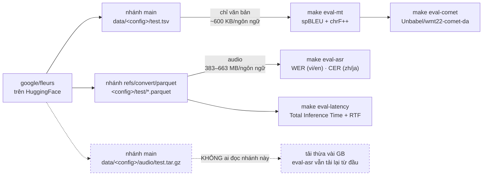

# Bộ đánh giá trên FLEURS — WER/CER, spBLEU/chrF++/COMET, Total Inference Time + RTF

**Giai đoạn:** sau buổi họp GVHD 19/08/2026 · **Hiện thực:** 04/09/2026
**Mục tiêu:** Ưu tiên 1 trong [biên bản họp](meetings/bien-ban-hop-GVHD-2026-08-19.md) —
dựng phần đo đạc thầy giao ở mục 3, chạy được bằng lệnh, kết quả ra bảng và JSON.

> Thay thế `scripts/accuracy.py` (bộ 20 câu tự thu, WER/chrF tự cài) ở vai trò "số liệu
> cho báo cáo". Script cũ vẫn giữ để kiểm tra nhanh pipeline còn sống.

---

## 1. Kiểm tra lại dataset — việc thầy dặn làm trước

Đã kiểm tra `https://huggingface.co/datasets/google/fleurs` bằng API của Hugging Face:

| Ngôn ngữ    | Config FLEURS | Có split `test` | Câu duy nhất ở `test` |
| ----------- | ------------- | --------------- | --------------------- |
| Tiếng Việt  | `vi_vn`       | có              | 347                   |
| Tiếng Anh   | `en_us`       | có              | 347                   |
| Tiếng Trung | `cmn_hans_cn` | có              | 346 (ghép với vi)     |
| Tiếng Nhật  | `ja_jp`       | có              | 318 (ghép với vi)     |

Cả 103 config đều có đủ ba split `train` / `validation` / `test`. Toàn bộ phần đo dùng
**`test`** đúng như thầy dặn.

Hai tính chất của FLEURS quyết định cách viết code:

- FLEURS là **bản tiếng nói của FLoRes**: 2009 câu **song song n chiều**, mỗi câu mang
  một `id` **dùng chung giữa mọi ngôn ngữ**. Ghép `id` là ra ngay cặp câu song ngữ →
  đánh giá MT không cần đi qua ASR, đúng yêu cầu "tách bạch lỗi từng khối".
- Một `id` có **nhiều bản thu** (nhiều người đọc cùng câu). Với ASR đó là các mẫu khác
  nhau; với MT phải khử trùng lặp theo `id` — cột "câu duy nhất" ở trên là sau khi khử.

Con số 318 cặp cho vi↔ja là do bản ghi tiếng Nhật thiếu một ít câu; code lấy **giao**
của hai tập `id` nên không bao giờ so lệch cặp.

---

## 2. Ba nhóm chỉ số, ba lệnh

```bash
make setup                       # cài đầy đủ, gồm cả nhóm eval (hoặc make setup-eval)
make fetch-fleurs                # tải trước dữ liệu FLEURS (một lần, ~2,3 GB)

make eval-asr LIMIT=20           # (a) WER/CER từng ngôn ngữ
make eval-mt LIMIT=30            # (b) spBLEU + chrF++ trên 6 chiều
make eval-comet                  # (b) chấm COMET cho eval-mt.json
make eval-latency LIMIT=20       # (c) Total Inference Time + RTF, một chiều
make eval-latency-all LIMIT=50   # (c) cả sáu chiều, mỗi chiều một file JSON
```

Trên Windows còn hai bước nữa, xem mục 8d: `make setup-vulkan` (không có thì whisper.cpp
chạy CPU) và tiền tố `UV_NO_SYNC=1` cho mọi lệnh đo.

Bỏ `LIMIT` để chạy toàn bộ tập `test` — đó mới là số đưa vào báo cáo. `LIMIT` dùng để
ước lượng thời gian và dung lượng tải trước khi chạy bản đầy đủ.

### Phụ thuộc: vì sao ba lệnh tự mang theo `--group eval`

`uv sync` đồng bộ môi trường về **đúng** những gì lệnh nêu ra: `make setup-mlx` chạy sau
`make setup-eval` sẽ gỡ mất `sacrebleu`, im lặng, không báo gì. Đã mất một lượt chạy
thật vì chuyện này — script dịch xong toàn bộ chiều vi→en (347 câu, 5 phút) rồi mới chết
ở dòng `from sacrebleu.metrics import BLEU`.

Hai lớp chặn:

1. Ba target `eval-asr` / `eval-mt` / `eval-latency` chạy qua `uv run --group eval`, nên
   thư viện đo luôn có mặt dù trước đó đã `uv sync` kiểu gì.
2. Mỗi script gọi `metrics.require(...)` ở dòng đầu của `main_async`, **trước** khi nạp
   model. Thiếu thư viện thì hỏng trong một giây kèm câu "chạy `make setup-eval`", chứ
   không phải sau nửa tiếng chạy.

Lớp 2 cần thiết vì `jiwer`/`sacrebleu` cố tình được import muộn bên trong từng hàm đo
(nhóm `eval` là phụ thuộc tuỳ chọn), nên lỗi thiếu thư viện mặc định nổ ra ở tận bước
chấm điểm — sau khi model đã chạy xong việc nặng nhất.

Mỗi lệnh ghi thêm một file JSON (`eval-asr.json`, `eval-mt.json`, `eval-latency.json`)
kèm đủ tham số của lần chạy — preset, tên model, backend thật (Metal/CUDA/CPU), có bật
bộ lọc câu ma hay không — để về sau đọc lại còn biết con số đó sinh ra trong điều kiện
nào.

### Chi phí tải về

| Phần                      | Tải lần đầu                           |
| ------------------------- | ------------------------------------- |
| Văn bản FLEURS (MT)       | ~600 KB mỗi ngôn ngữ                  |
| Audio FLEURS (ASR)        | 383–663 MB mỗi ngôn ngữ, split `test` |
| Whisper large-v3-turbo q5 | ~570 MB                               |
| NLLB-200 distilled 600M   | ~2,5 GB                               |
| `Unbabel/wmt22-comet-da`  | ~2,3 GB                               |

Phần đánh giá MT cố ý đọc thẳng file `data/<config>/test.tsv` thay vì đi qua thư viện
`datasets`: chỉ cần văn bản thì không có lý do gì tải 2 GB audio.

### Tải dữ liệu trước bằng `make fetch-fleurs`

Ba lệnh `eval-*` tự tải phần chúng thiếu, nhưng nên tải riêng một lần bằng
`scripts/fetch_fleurs.sh`: lượt tải audio là hơn 2 GB, đứt mạng giữa chừng thì mất luôn
cả lượt chạy đánh giá (đã nạp model, đã chạy được một phần). Tải riêng thì chạy lại là
tiếp tục chỗ dở, và file nào đã có sẽ bị bỏ qua.

```bash
make fetch-fleurs                       # cả bốn ngôn ngữ, split test
make fetch-fleurs LANGS="vi en"         # tải lẻ
make fetch-fleurs FLEURS_CACHE=/duong/dan/khac
```

**Dữ liệu nằm ở đâu.** Mặc định là `fleurs-cache/` ở thư mục gốc repo (đã có trong
`.gitignore`), đổi bằng biến `FLEURS_CACHE`. Makefile trỏ **cả hai** biến môi trường của
Hugging Face vào đó cho các lệnh `eval-*`:

| Biến                | Chứa gì                                               |
| ------------------- | ----------------------------------------------------- |
| `HF_HUB_CACHE`      | File tải thẳng từ Hub: `test.tsv` và parquet có audio |
| `HF_DATASETS_CACHE` | Bản arrow mà `datasets` giải nén ra từ parquet        |

Phải đặt cả hai, nếu không dữ liệu đánh giá bị chẻ làm hai nơi — cái thứ hai mặc định
nằm ở `~/.cache`. Model **không** bị ảnh hưởng: adapter truyền `cache_dir` riêng nên
whisper.cpp/NLLB vẫn nằm ở `models_dir`.

**Hai nguồn, hai nhánh khác nhau — không gộp được.** Đây là chỗ dễ tải nhầm nhất, nên vẽ
ra cho rõ nhánh nào nuôi độ đo nào:



`datasets.load_dataset()` đọc bản parquet **tự chuyển đổi**, không đọc tarball audio trên
`main` — đó là nhánh gạch đứt trong sơ đồ, tải về là phí công.

**Vì sao script dùng `snapshot_download` chứ không dùng `hf download --include`:** CLI
nhận `repo_id [filenames...]` là tham số vị trí, nên khi truyền nhiều mẫu sau
`--include` thì một phần rơi vào `filenames` và **toàn bộ `--include` bị bỏ qua** — chỉ
cảnh báo, vẫn thoát mã 0. Lần đầu tải bằng lệnh đó đã thiếu mất đúng tiếng Việt mà không
có dấu hiệu gì, và tiếng Việt là ngôn ngữ trục của cả sáu chiều nên thiếu nó là hỏng
toàn bộ phần MT.

Kiểm tra nhanh dữ liệu đã đủ chưa (đọc offline, không đụng mạng):

```bash
cd apps/ai-service && HF_HUB_CACHE=../../fleurs-cache HF_HUB_OFFLINE=1 \
  uv run python -c "import sys; sys.path.insert(0,'scripts'); import fleurs; \
  from llvt_ai_service.domain.enums import Language as L; \
  print(len(fleurs.parallel(L.vi, L.en)))"
```

Ra `347` là văn bản đủ (346 cho vi↔zh, 318 cho vi↔ja — đúng bảng ở mục 1).

---

## 3. (a) ASR — WER cho vi/en, **CER** cho zh/ja

`scripts/eval_asr.py` chạy Whisper trên audio FLEURS và so với trường `transcription`
(bản đã chuẩn hoá sẵn của FLEURS).

**Vì sao không dùng WER cho cả bốn thứ tiếng.** WER đếm lỗi trên chuỗi _từ_, mà tiếng
Trung và tiếng Nhật không tách từ bằng khoảng trắng. Chấm WER cho hai thứ tiếng đó thực
chất là chấm theo chỗ Whisper tình cờ chèn dấu cách, không phải theo lỗi thật — cùng một
câu đúng nghĩa có thể ra WER 0% hay 100% tuỳ cách chèn. Cách làm chuẩn trong ngành, và
trong chính bài báo FLEURS, là dùng **CER** cho zh/ja. Bảng kết quả ghi rõ từng dòng
đang là chỉ số nào chứ không gộp một cột "WER" cho gọn.

**Đổi runtime hoặc model.** Script dựng adapter qua `ASR_REGISTRY` chứ không import
thẳng `WhisperCppAsr`, nên đo được cả ba backend mà không phải sửa code:

```bash
make eval-asr ADAPTER=mlx_whisper \
  MODEL=mlx-community/whisper-large-v3-asr-fp16 JSON=eval-asr-mlx.json
```

`MODEL` phải đúng tên của runtime đang chọn — GGML là tên file trong repo whisper.cpp,
MLX và CTranslate2 là repo id đã chuyển đổi sẵn, ba loại **không** thay nhau được (mục
đích của `asr_alternatives` trong preset, xem [`04`](04_cac-dot-bo-sung.md)).
Đặt `JSON=` khác đi khi đo backend thứ hai, nếu không nó ghi đè bảng của backend thứ nhất.

Bảng đo bảy model MLX (WER · RTF · dung lượng, trên cùng 20 câu tiếng Việt) nằm ở
[`04` mục 3.3](04_cac-dot-bo-sung.md) — dùng nó để chọn model trước khi
tốn một tiếng rưỡi chạy bản đầy đủ.

Khi so hai dòng kết quả với nhau, nhớ là **đổi backend thường kèm đổi luôn cỡ model**:
`ggml-large-v3-turbo-q5_0` (turbo, lượng tử 5-bit) so với
`mlx-community/whisper-large-v3-asr-fp16` (large-v3 đầy đủ, fp16) là khác cả runtime lẫn
model. Muốn tách riêng ảnh hưởng của runtime thì phải chọn hai model cùng mức.

**Bộ lọc câu ma mặc định TẮT** khi đo. Mục tiêu của mục (a) là chất lượng của _mô hình_
Whisper; bộ lọc ở `adapters/asr/hallucination.py` là một lớp sản phẩm nằm sau nó. Cần
con số của cả hệ thống như người dùng thấy thì thêm `--with-filter`.

**Số WER lặp lại được.** Adapter đặt `temperature_inc = 0` nên Whisper giải mã tất định:
chạy lại hai lần cho ra đúng cùng một con số. Nếu bật fallback nhiệt độ thì mỗi lần chạy
lệch một ít và bảng trong báo cáo sẽ không tái lập được.

Bảng còn có cột `rỗng` — số câu ASR không ra chữ nào. Cột này để phát hiện sớm việc đo
hỏng (ví dụ sai mã ngôn ngữ) thay vì nhận một con số WER cao mà không hiểu vì sao.

---

## 4. (b) MT — spBLEU, chrF++ và COMET trên 6 chiều

`scripts/eval_mt.py` dịch phần `raw_transcription` (văn bản tự nhiên, còn dấu câu) của
ngôn ngữ nguồn và so với `raw_transcription` của ngôn ngữ đích ở cùng `id`.

Dùng bản `raw` chứ không phải bản đã chuẩn hoá vì NLLB được huấn luyện trên văn bản tự
nhiên — đưa chữ thường không dấu câu vào sẽ đo thấp hơn thực tế.

**BLEU nào.** BLEU phụ thuộc bộ tách từ, nên hai bài báo cùng nói "BLEU 30" có thể không
so được với nhau. Ở đây dùng `sacrebleu` với tokenizer `flores200` — tức **spBLEU**,
đúng độ đo bài báo NLLB-200 tự dùng. Hai cái lợi: số của đề tài đặt cạnh số công bố của
NLLB là so sánh được, và một tokenizer duy nhất cho cả 6 chiều khiến 6 con số so được
với nhau. **chrF++** đi kèm làm chỉ số phụ vì nó ổn định hơn BLEU trên tập vài trăm câu.

**COMET phải chạy ở môi trường riêng.** `unbabel-comet` ghim `numpy<2.0` và
`transformers<5.0`, trong khi dịch vụ cần `numpy>=2.4` và `transformers>=5.14` cho NLLB.
Hai bộ ràng buộc này không cùng tồn tại trong một venv được. Vì vậy:

- `eval_mt.py` đo spBLEU/chrF++ và ghi ra JSON **kèm từng câu** (nguồn / bản dịch / tham
  chiếu);
- `scripts/eval_comet.py` là một script độc lập có khối metadata **PEP 723** ở đầu file,
  chạy bằng `uv run --no-project` — uv tự dựng một môi trường riêng cho nó, không đụng
  gì tới `.venv` của dự án. Script đọc file JSON kia, chấm COMET rồi ghi điểm ngược vào.

Việc xuất từng câu ra JSON còn có ích khi viết báo cáo: soi được câu nào dịch sai và sai
kiểu gì, thay vì chỉ có một con số tổng.

Cái giá của môi trường riêng là nó cũ hơn phần còn lại của dự án, và hai chỗ đã hỏng thật
khi chạy trên macOS Apple Silicon — cả hai đều chết **trước khi chấm câu đầu tiên**, nên
đã vá thẳng trong `eval_comet.py`:

| Triệu chứng                                                     | Nguyên nhân                                                                                                               | Cách vá                        |
| --------------------------------------------------------------- | ------------------------------------------------------------------------------------------------------------------------- | ------------------------------ |
| `ModuleNotFoundError: No module named 'pkg_resources'`          | `unbabel-comet` ghim `torchmetrics<0.11`, bản đó còn import `pkg_resources`, mà setuptools từ 81 trở đi đã gỡ hẳn gói này | ghim `setuptools<81` ở PEP 723 |
| `ValueError: multiprocessing_context can only be used with ...` | COMET đặt `multiprocessing_context="fork"` khi thấy MPS khả dụng, nhưng để `num_workers = 2 * gpus` = 0 lúc chấm trên CPU | truyền `num_workers=2`         |

Cái thứ hai chỉ xảy ra trên máy Mac có MPS mà chấm bằng CPU — đúng cấu hình mặc định của
đề tài.

Chấm COMET **không** đắt: đo thật được ~120 câu trong 13 giây, tức toàn bộ 2.022 câu
FLEURS hết khoảng 4 phút, so với 28 phút của bước dịch sinh ra chúng.

---

## 5. (c) Độ trễ — Total Inference Time và RTF

`scripts/eval_latency.py` chạy đủ chuỗi **VAD → Whisper → NLLB → TTS** trên audio thật
của FLEURS.

### Công thức RTF — phần thầy dặn tra lại và báo cáo

> Bản đầy đủ, có trích nguồn cho từng khẳng định, nằm ở
> [`06` mục 6](06_bon-do-do-wer-bleu-comet-rtf.md); phần ngưỡng đề xuất và lý do lấy p90
> ở [báo cáo GVHD mục 3](gvhd/bao-cao-danh-gia.md) — đó mới là phần gửi thầy. Mục này
> giữ lại bản tóm tắt để đọc liền mạch với phần code.

$$\text{RTF} = \frac{\text{thời gian xử lý}}{\text{thời lượng audio đầu vào}}$$

- **RTF < 1** — hệ thống xử lý **nhanh hơn thời gian thực**. Đây là điều kiện **cần** để
  chạy trực tuyến: nếu không, hàng đợi audio dài ra vô hạn và độ trễ tăng không giới hạn
  theo thời gian nói.
- **RTF ≥ 1** — không theo kịp luồng vào.

Lưu ý một cái bẫy khi trích nguồn: **có tài liệu định nghĩa ngược** (thời lượng audio
chia thời gian xử lý), lúc đó "càng lớn càng tốt". Báo cáo phải ghi rõ đang dùng chiều
nào. Dự án dùng chiều **xử lý ÷ audio**, giống Kaldi, whisper.cpp và các bài báo ASR —
JSON kết quả có sẵn khoá `rtf_definition` ghi nguyên câu định nghĩa để không nhầm.

### Ngưỡng "đạt" — đề xuất để thầy duyệt

RTF < 1 mới chỉ là điều kiện cần, chưa đủ để **nói chuyện được**. Đề xuất hai mức:

| Mức       | Điều kiện                                   | Ý nghĩa                                              |
| --------- | ------------------------------------------- | ---------------------------------------------------- |
| Cần       | **RTF p90 < 1**                             | Không dồn hàng đợi trong một cuộc họp dài            |
| Đủ để nói | **RTF p90 ≤ 0,5** và độ trễ cảm nhận ≤ ~2 s | Còn dư nửa ngân sách thời gian cho phần chờ chốt câu |

Lấy **p90 chứ không phải trung bình**: trung bình < 1 mà 10% số câu > 1 thì hệ thống vẫn
dồn hàng đợi ở đúng những câu dài — mà câu dài mới là câu quan trọng.

Về mốc "độ trễ cảm nhận": [ITU-T G.114](https://www.itu.int/rec/T-REC-G.114) đặt ngưỡng
150 ms cho hội thoại thời gian thực, nhưng đó là mốc cho **truyền dẫn thoại**, không áp
được cho phiên dịch — bản thân người phiên dịch cũng trễ vài giây (_ear-voice span_).
Vì vậy đề tài dùng RTF làm chỉ số chính, còn độ trễ cảm nhận báo cáo riêng và **không**
so với 150 ms. Đây là chỗ cần thầy chốt giúp.

### Vì sao bảng có thêm cột "chờ chốt"

Total Inference Time chỉ đếm thời gian **tính toán**. Người dùng còn phải chờ VAD xác
nhận là mình đã nói xong — đó là phần độ trễ do ngưỡng endpointing quyết định (xem
[mục 4.2 biên bản](meetings/bien-ban-hop-GVHD-2026-08-19.md) và bản sửa ở
`adapters/vad/silero.py`). Nó **không** phải thời gian tính toán nên không nằm trong
RTF, nhưng bỏ qua nó thì báo cáo sẽ nói hệ thống nhanh hơn thực tế người dùng cảm nhận.
Bảng in cả hai, có ghi chú rõ cái nào là cái nào.

Dò riêng phần này bằng `make endpointing MEDIA=<bản ghi>.mov`.

---

## 6. Hạn chế đã biết

- **Chưa chuẩn hoá số và viết tắt.** Whisper trả `"2019"` trong khi câu tham chiếu có
  thể ghi `"hai nghìn không trăm mười chín"` → tính là lỗi. WER thật thấp hơn con số đo
  được một chút. Sai lệch này đều nhau ở mọi cấu hình nên không ảnh hưởng phần **so
  sánh** giữa các model — chỉ ảnh hưởng con số tuyệt đối.
- **FLEURS là giọng đọc, không phải giọng hội thoại.** Đọc rõ ràng, ít nhiễu, gần như
  không có từ đệm hay ngắt quãng. WER trên FLEURS sẽ **thấp hơn** WER trong một cuộc họp
  thật. Đây là điểm phải nói trước ở phần bảo vệ chứ không để hội đồng hỏi.
  **Đã đo 22/09 (mục 8f):** cùng model, 25 đoạn hội thoại tự phát cho WER 24,6% so với
  10,4% trên FLEURS — gấp 2,4 lần.
- **RTF gắn với máy chạy.** Đã đo trên hai máy (M4/Metal và RTX 4060/Vulkan) và hai bảng
  lệch nhau nhiều lần, nên mọi con số RTF phải đi kèm cấu hình máy — file JSON ghi sẵn
  `runtimes` (thiết bị từng khâu) và `machine`.
- **Không có đối chứng cloud.** Quyết bỏ ngày 20/09: mục đích của nó đã được phục vụ
  bằng bảng ba runtime ASR (mục 8d) và điểm COMET, còn gọi API cloud thì đi ngược tinh
  thần chạy hoàn toàn cục bộ của đề tài.

---

## 7. Việc còn lại của Ưu tiên 1

- [x] Tải dữ liệu FLEURS về máy (`make fetch-fleurs`) — 4 ngôn ngữ, split `test`, 2,2 GB
- [x] Chạy `make eval-asr` bản đầy đủ trên máy macOS (Metal) → bảng WER/CER (mục 8)
- [x] Chạy `make eval-mt` + `make eval-comet` bản đầy đủ → bảng 6 chiều (mục 8 dưới đây)
- [x] Chạy `make eval-latency` cho ít nhất 2 chiều → Total Inference Time + RTF
      (đã chạy đủ **sáu** chiều, 50 mẫu mỗi chiều — mục 8c)
- [x] Tra công thức RTF, ngưỡng real-time và ba độ đo còn lại, có trích nguồn —
      [`06`](06_bon-do-do-wer-bleu-comet-rtf.md)
- [x] Gửi thầy [báo cáo GVHD](gvhd/bao-cao-danh-gia.md) — mục 3 (công thức RTF + ngưỡng
      đề xuất) và mục 8 (các điểm cần chốt), kèm phụ lục
      [`06`](06_bon-do-do-wer-bleu-comet-rtf.md). **Đã gửi.** Số đo trên Windows có sau
      khi gửi nên nằm ở phần bổ sung cuối báo cáo.

---

## 8. Kết quả mục (a): ASR trên toàn bộ FLEURS `test` — 07/09/2026

> File JSON gốc của cả ba mục 8 / 8b / 8c nằm ở [`docs/results/`](results/README.md),
> kèm bản gộp `eval-summary.json` và các lượt đo 20 câu dùng để chọn model. Bảng dưới
> chỉ là phần tổng hợp.

**3.099 bản thu, 10,22 giờ audio, 86 phút chạy.** Không bỏ câu nào, **0 câu rỗng** ở cả
bốn ngôn ngữ.

| Điều kiện     | Giá trị                                                                                     |
| ------------- | ------------------------------------------------------------------------------------------- |
| Model         | `mlx-community/whisper-large-v3-asr-8bit` (chọn theo [`04` mục 3.3](04_cac-dot-bo-sung.md)) |
| Runtime       | mlx-audio, Metal, Apple M4                                                                  |
| Bộ lọc câu ma | TẮT — đo mô hình, không đo lớp sản phẩm sau nó                                              |

| Ngôn ngữ | Chỉ số | Giá trị |   Bản thu |         Audio |           ASR | RTF       | Câu rỗng |
| -------- | ------ | ------: | --------: | ------------: | ------------: | --------- | -------: |
| vi       | WER    |    8,8% |       857 |      10.814 s |       1.589 s | 0,15      |        0 |
| en       | WER    |    4,8% |       647 |       6.388 s |         911 s | 0,14      |        0 |
| zh       | CER    |    8,1% |       945 |      11.065 s |       1.577 s | 0,14      |        0 |
| ja       | CER    |    4,7% |       650 |       8.511 s |       1.105 s | 0,13      |        0 |
| **Gộp**  |        |         | **3.099** | **10,22 giờ** | **86,4 phút** | **0,141** |    **0** |

### Đọc số

**Cột "câu rỗng" bằng 0 ở cả bốn ngôn ngữ** là thứ phải nhìn trước tiên. Nó là chốt chặn
chống đo hỏng (sai mã ngôn ngữ, sai đường đọc audio — đúng loại lỗi từng làm cả bảng
thành 100%), và nó cũng là bằng chứng model MLX này **không** dính vòng lặp lặp chữ như
họ `small` ở [`04` mục 3.3](04_cac-dot-bo-sung.md).

**Tiếng Việt (8,8%) khó hơn tiếng Anh (4,8%) gần gấp đôi.** Đây là chiều quan trọng nhất
của đề tài, và con số này là mức sàn — FLEURS là giọng đọc rõ ràng, ít nhiễu, không có
từ đệm. WER trong một cuộc họp thật sẽ cao hơn (xem mục 6).

**Đừng so trực tiếp với bảng 20 câu ở [`04` mục 3.3](04_cac-dot-bo-sung.md).**
Cùng model đó, 20 câu đầu cho WER 6,7% còn toàn bộ 857 bản thu cho 8,8% — chênh 2,1
điểm. 20 câu đầu chỉ đủ để **chọn** model (xếp hạng tương đối giữa các bản), không đủ
làm con số báo cáo.

**RTF 0,14 là của riêng khâu ASR**, không phải RTF toàn hệ thống — cái đó đo ở mục (c)
bằng `eval-latency` và sẽ cao hơn vì gồm cả VAD/MT/TTS.

Cột so sánh với whisper.cpp đã chạy đầy đủ — xem mục 8d ngay dưới.

---

## 8d. Cùng mục (a), hai runtime chạy trên Windows — 20/09/2026

Đúng 3.099 bản thu đó, đổi runtime hai lần. Đây là cột còn thiếu để trả lời "chọn
runtime nào", và cũng là lần đầu bộ đánh giá chạy trên Windows.

| Điều kiện | whisper.cpp                                       | faster-whisper                              |
| --------- | ------------------------------------------------- | ------------------------------------------- |
| Model     | `ggml-large-v3-turbo-q5_0.bin`                    | `deepdml/faster-whisper-large-v3-turbo-ct2` |
| Runtime   | pywhispercpp build `GGML_VULKAN=1`                | CTranslate2 4.8.2, CUDA float16             |
| Máy       | Windows 11, i5-12500H, RTX 4060 Laptop, RAM 64 GB | như trên                                    |

Cả hai đều là **large-v3-turbo**, khác nhau ở lượng tử hoá: q5_0 so với float16. Bộ lọc
câu ma TẮT ở cả ba cột, giống mục 8.

| Ngôn ngữ | Chỉ số | whisper.cpp (q5_0) | faster-whisper (fp16) | MLX 8bit — M4, mục 8 |
| -------- | ------ | -----------------: | --------------------: | -------------------: |
| vi       | WER    |          **10,4%** |              **9,2%** |             **8,8%** |
| en       | WER    |               5,0% |                  5,0% |                 4,8% |
| zh       | CER    |               8,6% |                  8,3% |                 8,1% |
| ja       | CER    |               4,9% |                  4,7% |                 4,7% |
| RTF      |        |              0,018 |                 0,034 |                0,141 |
| Câu rỗng |        |                  2 |                     1 |                    0 |
| Tổng ASR |        |            11 phút |               21 phút |              86 phút |

### Đọc số

**Ba runtime xếp cùng một thứ tự ở cả bốn thứ tiếng:** MLX tốt nhất, faster-whisper ở
giữa, whisper.cpp cuối. Chênh lệch nhỏ và đều — 0,2 điểm ở en/ja, 0,3–0,5 ở zh, 1,6 ở
vi. Đều một chiều như vậy là chênh thật chứ không phải nhiễu.

**Nhưng đó không phải chênh giữa ba runtime.** Ba cột là ba **model khác nhau**:
`large-v3` 8bit, `large-v3-turbo` fp16, `large-v3-turbo` q5_0. Không có cách nào so
runtime "sạch" được — ba runtime không dùng chung file model (xem [`04`](04_cac-dot-bo-sung.md)).
Cặp so được gần nhất là hai cột Windows: **cùng `large-v3-turbo`, chỉ khác lượng tử
hoá**, và ở đó q5_0 đắt hơn fp16 đúng 1,2 điểm WER tiếng Việt.

**Đổi lại, q5_0 nhanh gấp đôi** (RTF 0,018 so với 0,034; 11 phút so với 21 phút cho cùng
10,22 giờ audio). Đây chính là đánh đổi mà đề tài cần trình bày: 1,2 điểm WER tiếng Việt
đổi lấy một nửa thời gian ASR. Với RTF p90 toàn chuỗi đang là 0,383 ở chiều xấu nhất
(mục 8e), ngân sách còn dư — nên nếu ưu tiên chất lượng thì đổi sang faster-whisper là
lựa chọn có cơ sở, không phải cảm tính.

**Đừng đọc cột RTF của MLX cạnh hai cột kia**: 0,141 là M4 + Metal, hai cột còn lại là
RTX 4060. Khác máy. Con số so được giữa ba cột là WER/CER, vì giải mã tất định và không
phụ thuộc phần cứng.

**Câu rỗng**: 2 ở whisper.cpp, 1 ở faster-whisper, 0 ở MLX — đều trên tiếng Việt, đều
dưới 0,25%. Không đủ để đổi quyết định, nhưng là mốc để so nếu sau này thấy trả rỗng
nhiều hơn trên giọng thật.

**Thực tế đang dùng:** bản macOS chạy MLX, bản Windows chạy whisper.cpp qua Vulkan.
Bảng này cho biết cái giá của cấu hình Windows là khoảng 1,6 điểm WER tiếng Việt so với
bản macOS, và cho biết có sẵn một nấc đổi lấy chất lượng nếu cần.

**Hai bẫy khi chạy lại:**

- venv dev cài wheel `pywhispercpp` trên PyPI, tức bản CPU — lượt chạy đầu ra RTF 1,5
  (chậm hơn thời gian thực) mà WER vẫn đúng, nên rất dễ tưởng đã đo GPU. Phải
  `make setup-vulkan` trước, rồi chạy với `UV_NO_SYNC=1` để `uv` không đồng bộ ngược.
- faster-whisper cần `nvidia-cublas-cu12`/`nvidia-cudnn-cu12` (đã có trong extra
  `ctranslate2`). Thiếu thì model tải xong, nạp xong, tới câu **đầu tiên** mới chết
  bằng `Library cublas64_12.dll is not found`.

```bash
make setup-vulkan
UV_NO_SYNC=1 make eval-asr JSON=eval-asr-ggml-win-vulkan.json
UV_NO_SYNC=1 make eval-asr ADAPTER=faster_whisper JSON=eval-asr-fasterwhisper-win.json
```

### Phụ: `LLVT_ASR_AUDIO_CTX=768` — đo rồi, và câu trả lời là không

Rút ngắn ngữ cảnh encoder của whisper.cpp (768 thay vì 1500) là một mẹo được nhắc tới
nhiều, với lý do: đoạn VAD chỉ dài vài giây chứ không phải 30 giây, nên bắt encoder chạy
đủ 1500 khung là phí. Tuỳ chọn này có trong mã từ lâu nhưng **mặc định tắt**, và ghi rõ
là "chỉ bật sau khi đo được WER tương ứng". Đây là lượt đo đó — cùng model, cùng máy,
cùng 3.099 bản thu, chỉ đổi một biến môi trường.

| Ngôn ngữ | Chỉ số | Mặc định (1500) | `audio_ctx=768` | Thời gian ASR | Câu rỗng   |
| -------- | ------ | --------------: | --------------: | ------------- | ---------- |
| vi       | WER    |           10,4% |       **33,7%** | 194 s → 182 s | 2 → **13** |
| en       | WER    |            5,0% |       **31,4%** | 114 s → 84 s  | 0 → 0      |
| zh       | CER    |            8,6% |       **45,1%** | 201 s → 178 s | 0 → **38** |
| ja       | CER    |            4,9% |       **46,5%** | 138 s → 121 s | 0 → **5**  |

**Đổi 6–9 lần sai sót để lấy 6–26% thời gian.** Không có gì phải cân nhắc: giữ tắt.

Một điểm cần trung thực khi trình bày: bản thu FLEURS dài trung bình 12,6 giây, tức
phần âm thanh **vẫn nằm gọn** trong 768 khung (~15,4 giây) — nên mức sụt này không phải
do cắt mất tiếng, mà do bản thân model không chịu được ngữ cảnh encoder ngắn hơn lúc
huấn luyện. Vì vậy kết luận nhiều khả năng đúng cả với đoạn 2–8 giây của đường chạy
thật, dù bộ FLEURS không kiểm trực tiếp được trường hợp đó. Và kể cả nếu đoạn ngắn có
chịu được, phần thưởng cũng chỉ là vài phần trăm thời gian ASR — trong khi ASR giờ chỉ
còn chiếm 15–18% toàn chuỗi (mục 8e), nên chỗ đáng tối ưu không nằm ở đây.

---

## 8c. Kết quả mục (c): độ trễ + RTF đủ sáu chiều — 07/09/2026

50 mẫu mỗi chiều, **cùng cấu hình đã đo WER ở mục 8** (`mlx-community/whisper-large-v3-asr-8bit`
trên mlx-audio/Metal) — bảng độ trễ và bảng WER phải nói về cùng một hệ thống.

| Chiều | Mẫu |  VAD |     ASR |      MT |     TTS | Tổng TB  | Tổng p90  | RTF TB | RTF p90   | Chờ chốt |
| ----- | --: | ---: | ------: | ------: | ------: | -------- | --------- | -----: | --------- | -------: |
| vi→en |  50 | 53ms | 4.595ms | 1.129ms |   318ms | 6.095 ms | 10.176 ms |  0,486 | 0,580     |    256ms |
| en→vi |  50 | 46ms | 2.421ms |   953ms |   273ms | 3.693 ms | 5.511 ms  |  0,392 | **0,496** |    202ms |
| vi→zh |  50 | 52ms | 4.598ms | 1.134ms | 1.693ms | 7.478 ms | 12.593 ms |  0,595 | 0,727     |    256ms |
| zh→vi |  50 | 48ms | 2.623ms |   965ms |   274ms | 3.911 ms | 5.460 ms  |  0,375 | 0,509     |    200ms |
| vi→ja |  50 | 55ms | 4.646ms | 1.025ms | 2.261ms | 7.987 ms | 13.256 ms |  0,639 | **0,786** |    256ms |
| ja→vi |  50 | 55ms | 2.859ms | 1.052ms |   290ms | 4.255 ms | 6.367 ms  |  0,324 | **0,395** |    211ms |

### Đọc số

**Đạt ngưỡng "cần" ở cả sáu chiều: RTF p90 < 1**, chiều xấu nhất là vi→ja với 0,786.
Nhưng ngưỡng "đủ để nói chuyện thoải mái" ở mục 5 là **RTF p90 ≤ 0,5**, và chỉ **hai
chiều đạt**: ja→vi (0,395), en→vi (0,496). zh→vi trượt sát mép (0,509) — bản đầu của mục
này tính nó là đạt, sửa ngày 22/09 khi rà số cho khóa luận. Ba chiều **có tiếng Việt ở đầu
vào** đều trượt: 0,580 · 0,727 · 0,786.

**Hai nguyên nhân tách bạch được, và chúng nằm ở hai đầu khác nhau:**

1. **Nguồn là tiếng Việt thì ASR đắt gần gấp đôi** — 4.6 giây so với 2,4–2,9 giây, và
   ASR chiếm 58–75% tổng thời gian ở mọi chiều. Khớp với bảng WER ở mục 8 (vi 8,8% so
   với en 4,8%): tiếng Việt vừa khó hơn vừa tốn hơn cho cùng một model.
2. **Đích là tiếng Trung/Nhật thì TTS đắt gấp 6–8 lần** — 1.693 ms cho zh và 2.261 ms
   cho ja, so với 273–318 ms cho vi/en. Tính theo tỷ trọng: TTS chiếm 22,6% tổng thời
   gian ở vi→zh và **28,3%** ở vi→ja, trong khi ở bốn chiều còn lại chỉ 5–7%. Tiếng Nhật
   đi qua Kokoro + G2P OpenJTalk chứ không phải sherpa-onnx ([`03`](03_nhat-ky-tuan-1-8.md)),
   nên đây là cái giá của việc sherpa-onnx không đọc được tiếng Nhật.

Vậy nếu cần kéo vi→ja xuống dưới 0,5 thì **hai chỗ đáng sửa là ASR cho nguồn tiếng Việt
và TTS cho đích tiếng Nhật** — không phải MT, vốn ổn định 950–1.130 ms ở cả sáu chiều.

**Cột "chờ chốt câu" (200–256 ms) không nằm trong RTF** vì nó là thời gian chờ VAD xác
nhận người nói đã dứt, không phải thời gian tính toán. Nhưng người dùng vẫn phải ngồi
chờ, nên báo cáo phải in cả hai. Con số này chỉ phụ thuộc ngôn ngữ **nguồn** đúng như
mong đợi (vi 256 ms ở cả ba chiều xuất phát từ vi).

**Tổng p90 lên tới 10–13 giây** ở ba chiều nguồn tiếng Việt trông đáng sợ, nhưng đó là
tổng cho **một câu FLEURS dài ~12 giây** — RTF mới là con số so sánh được, và nó vẫn < 1.

### Đừng đối chiếu bảng này với mục 14.1 của SPEC

[SPEC mục 14.1](01_spec-realtime-voice-translation.md) đặt mục tiêu **cho một câu ngắn**:
ASR < 1.500 ms, MT < 1.000 ms, TTS < 1.500 ms, tổng outgoing trung vị < 4 giây. Bảng
trên **không** kiểm chứng được các mốc đó, và đặt cạnh nhau là đọc sai:

- mỗi dòng ở đây là **một phát ngôn FLEURS dài ~12 giây**, bị VAD cắt thành nhiều đoạn,
  và cột ASR/MT/TTS là **tổng cộng dồn** thời gian của tất cả các đoạn đó — không phải
  thời gian cho một câu;
- SPEC nói về **độ trễ người dùng cảm nhận** (từ lúc dứt câu tới lúc có phụ đề), còn cột
  "Tổng" ở đây là **thời gian tính toán**. Hai đại lượng khác nhau — mục 5.4 của
  [`06`](06_bon-do-do-wer-bleu-comet-rtf.md) nói kỹ chỗ này.

Số đối chiếu được với SPEC 14.1 là bộ đo trên **audio 3 giây** ở
[`10` mục 11](10_slides-bao-cao.md): ASR 991–1.060 ms · MT 460–579 ms · TTS 141–969 ms ·
tổng 1,8–2,6 giây — **đạt cả bốn mốc**. Bảng FLEURS trả lời một câu hỏi khác: hệ thống
có theo kịp luồng nói liên tục không (RTF), chứ không phải một câu mất bao lâu.

---

## 8e. Cùng mục (c), chạy trên Windows + RTX 4060 — 20/09/2026

Cùng 50 mẫu mỗi chiều, cùng bộ FLEURS, nhưng là cấu hình **bản cài Windows thật sự
dùng**: whisper.cpp qua Vulkan (mục 8d) và NLLB trên CUDA. Sinh lại bằng một lệnh:
`UV_NO_SYNC=1 make eval-latency-all LIMIT=50 SUFFIX=-win`.

| Chiều | Mẫu |   VAD |   ASR |    MT |     TTS | Tổng TB  | Tổng p90 | RTF TB | RTF p90   | Chờ chốt |
| ----- | --: | ----: | ----: | ----: | ------: | -------- | -------- | -----: | --------- | -------: |
| vi→en |  50 | 129ms | 570ms | 459ms |   373ms | 1.531 ms | 2.330 ms |  0,124 | 0,146     |    256ms |
| en→vi |  50 | 111ms | 308ms | 390ms |   327ms | 1.137 ms | 1.556 ms |  0,121 | 0,148     |    202ms |
| vi→zh |  50 | 130ms | 577ms | 458ms | 1.969ms | 3.133 ms | 4.316 ms |  0,255 | 0,273     |    256ms |
| zh→vi |  50 | 119ms | 330ms | 392ms |   336ms | 1.177 ms | 1.777 ms |  0,113 | 0,147     |    200ms |
| vi→ja |  50 | 205ms | 612ms | 507ms | 2.510ms | 3.833 ms | 5.669 ms |  0,308 | **0,383** |    256ms |
| ja→vi |  50 | 136ms | 360ms | 440ms |   352ms | 1.288 ms | 1.704 ms |  0,099 | **0,114** |    211ms |

### Đọc số

**Cả sáu chiều đều đạt ngưỡng chặt RTF p90 ≤ 0,5.** Trên máy Mac (mục 8c) chỉ hai chiều
đạt, và chiều xấu nhất là 0,786. Ở đây chiều xấu nhất là vi→ja 0,383 — tức còn dư hơn
một nửa ngân sách. Nếu GVHD chốt ngưỡng 0,5 (xem mục 3.5 của
[báo cáo GVHD](gvhd/bao-cao-danh-gia.md)) thì cấu hình Windows đáp ứng được, cấu hình
Mac thì không.

**Cái gì đã đổi.** Ba thay đổi trong cùng một ngày, và chúng cộng dồn:

| Khâu |  Mac (mục 8c) |     Windows | Vì sao                                            |
| ---- | ------------: | ----------: | ------------------------------------------------- |
| ASR  | 2.421–4.646ms |   308–612ms | whisper.cpp chạy GPU qua Vulkan thay vì MLX/Metal |
| MT   |   953–1.134ms |   390–507ms | NLLB có nhánh `cuda` — trước đó luôn rơi về CPU   |
| TTS  |   273–2.261ms | 327–2.510ms | không đổi (sherpa-onnx/Kokoro đều chạy CPU)       |

**TTS giờ là khâu chậm nhất, không còn là ASR.** Ở hai chiều đích tiếng Nhật và tiếng
Trung, TTS chiếm 65% và 63% toàn chuỗi; bốn chiều còn lại (đích vi/en) chỉ 26–29%. Kết
luận về chỗ đáng tối ưu tiếp theo vì vậy đổi hẳn so với mục 8c: không phải ASR nguồn
tiếng Việt nữa, mà là **TTS cho hai đích ja/zh** — và nó đang chạy CPU, chưa thử GPU.

**Chiều ja→vi nhanh nhất (p90 0,114)** còn vi→ja chậm nhất (0,383), chênh gần 4 lần cho cùng
một cặp ngôn ngữ. Toàn bộ khoảng chênh nằm ở TTS: đọc tiếng Việt mất 352 ms, đọc tiếng
Nhật mất 2.510 ms.

---

## 8b. Kết quả mục (b): MT trên toàn bộ FLEURS `test` — 06/09/2026

Lượt chạy đầy đủ đầu tiên. **2.022 cặp câu**, không giới hạn, 27,6 phút.

| Điều kiện | Giá trị                                                        |
| --------- | -------------------------------------------------------------- |
| Model     | `facebook/nllb-200-distilled-600M` (preset `balanced`)         |
| Dữ liệu   | `google/fleurs`, split `test`, ghép theo `id` (không qua ASR)  |
| Máy       | Apple M4, macOS 26.6                                           |
| Độ đo     | spBLEU (tokenizer `flores200`), chrF++, COMET `wmt22-comet-da` |

| Chiều dịch | Câu | spBLEU |  chrF++ | COMET      |
| ---------- | --: | -----: | ------: | ---------- |
| vi→en      | 347 |  35,79 |   57,10 | 0,8525     |
| en→vi      | 347 |  37,13 |   54,69 | 0,8505     |
| vi→zh      | 346 |  17,15 | _16,14_ | **0,7729** |
| zh→vi      | 346 |  22,33 |   42,77 | 0,8213     |
| vi→ja      | 318 |  10,96 | _19,88_ | 0,8239     |
| ja→vi      | 318 |  19,91 |   40,19 | 0,8191     |

### Ba điều bảng này nói, và một điều nó không nói

**1. COMET xếp hạng khác hẳn spBLEU.** Theo spBLEU, vi→ja (10,96) tệ hơn vi→zh (17,15)
tới 6 điểm. Theo COMET thì ngược lại: vi→ja 0,8239 **cao hơn** vi→zh 0,7729. Sáu chiều
nằm gọn trong dải 0,77–0,85 trong khi spBLEU trải từ 10,96 tới 37,13.

Đây là lý do thầy giao cả hai độ đo. spBLEU khớp chuỗi n-gram bề mặt nên phạt rất nặng
những ngôn ngữ có cách viết khác hẳn nguồn; COMET là mô hình chấm ngữ nghĩa nên nói được
"câu này diễn đạt khác nhưng vẫn đúng ý". Kết luận "dịch sang tiếng Nhật kém nhất" rút ra
từ riêng spBLEU là **sai** — chiều yếu nhất thật sự là **vi→zh**, và cả hai độ đo cùng
đồng ý ở điểm đó.

**2. chrF++ ở hai chiều đích zh/ja không so ngang được** (in nghiêng trong bảng). vi→zh
có chrF++ 16,14, _thấp hơn cả_ spBLEU của chính nó, trong khi vi→en là 57,10 so với
35,79. Không phải bản dịch tệ tới mức đó: chrF**++** cộng thêm n-gram **cấp từ**, mà
tiếng Trung/Nhật không tách từ bằng khoảng trắng nên phần đó gần như bằng 0 và kéo tụt
điểm tổng. Đây đúng là phiên bản MT của chuyện WER/CER ở mục 3. Trong báo cáo: cột chrF++
của hai chiều đích zh/ja phải có chú thích, hoặc bỏ hẳn và dựa vào spBLEU + COMET.

**3. Trung bình sáu chiều thì đừng lấy.** Sáu chiều có độ khó rất khác nhau; một con số
gộp (spBLEU 23,88) không nói lên điều gì ngoài việc trộn hai nhóm không cùng thang.

**Điều bảng không nói:** `wmt22-comet-da` được huấn luyện trên phán đoán của người chấm,
chủ yếu ở các cặp ngôn ngữ giàu dữ liệu. Độ tin của nó ở vi↔ja và vi↔zh thấp hơn ở vi↔en,
nên khoảng chênh vài phần nghìn giữa các chiều **không** đủ để kết luận chiều nào hơn
chiều nào. Chỉ khoảng cách lớn như vi→zh (0,77) so với vi→en (0,85) mới đáng nói.

---

## 8f. Giọng người thật — 20–22/09/2026

Mục 6 ghi FLEURS là giọng đọc nên WER đo trên đó sẽ thấp hơn trong cuộc họp thật. Mục
này đo **khoảng cách đó** bằng bản ghi giọng người nói tự phát. Số không thay bảng
FLEURS — 25 đoạn không đủ làm số chính — mà đặt cạnh nó để biết bảng FLEURS lạc quan
tới đâu.

### Tách câu trên ba loại giọng

`make endpointing` trên ba bản ghi YouTube, mỗi bản ≥ 11 phút. Chỉ chạy Silero VAD, nên
không phụ thuộc máy. Bảng đủ bốn cấu hình ở
[`results/endpointing-3-nguon.txt`](results/endpointing-3-nguon.txt); dưới đây là ngưỡng
cũ (trần 20 s) so với preset Balanced (trần 6 s):

| Bản ghi                        | Kiểu giọng         | Độ dài | Đoạn dài p90: cũ → Balanced | Cắt cứng ở Balanced |
| ------------------------------ | ------------------ | -----: | --------------------------: | ------------------: |
| Bản tin VTV24                  | đọc kịch bản       |  688 s |            12,53 s → 5,87 s |                 30% |
| Phỏng vấn thử Intern Fullstack | hội thoại tự phát  | 3596 s |             6,77 s → 5,66 s |                 10% |
| TEDx Hoàng Nam Tiến            | thuyết trình tự do |  669 s |             2,61 s → 2,86 s |                  0% |

**Cải thiện đến từ trần độ dài, không phải từ việc phát hiện im lặng nhanh hơn.** Cột
"chờ chốt" (từ lúc nói xong tới lúc VAD nhả câu) gần như không đổi ở cả ba bản ghi,
0,23–0,30 s: người nói nào cũng có khoảng nghỉ đủ rõ để ngưỡng 300 ms cũ bắt được. Chỗ
ngưỡng cũ làm người dùng phải chờ là **khi người ta nói một mạch không nghỉ** — ở bản
tin, 10% số câu dài hơn 12,5 s, và với trần 20 s câu tệ nhất có thể dài 20 s. Đó là cái
"phải chờ câu dài 5–10 giây" ở mục 4.2 biên bản GVHD.

**Giá phải trả là cắt giữa câu, và nó thấp nhất đúng ở giọng giống cảnh dùng thật.** Ở
bản tin, Balanced cắt cứng 30% số đoạn (Fast 40%) — MT phải dịch mảnh câu. Ở hội thoại
phỏng vấn chỉ còn 10%, và ở TEDx thì 0% ở mọi cấu hình: người nói tự nhiên tự ngắt
thường xuyên nên trần không bao giờ phải ra tay. Hai bảng ghép lại mới đủ lập luận:
ngưỡng mới chỉ can thiệp khi có người nói dài, còn hội thoại bình thường không bị đụng.

### ASR + MT trên 25 đoạn phỏng vấn

| Điều kiện           | Giá trị                                                                                                                                                   |
| ------------------- | --------------------------------------------------------------------------------------------------------------------------------------------------------- |
| Bản ghi             | [Phỏng vấn thử Intern/Fresher Fullstack ReactJS + SpringBoot](https://www.youtube.com/watch?v=Ck9zEm54UlQ) (Việt Trí Đạo), hai người, tiếng Việt, 60 phút |
| Cắt đoạn            | `segment_audio.py --skip-seconds 300 --min-seconds 3 --limit 25` — 25 đoạn đầu tiên dài 3–12 s kể từ phút 5, **không chọn tay**, tổng 149 s tiếng nói     |
| Câu tham chiếu      | Người làm đồ án nghe từng đoạn và sửa tay từ phụ đề tự sinh của YouTube, giữ nguyên chỗ người nói nói nhầm                                                |
| Bản dịch tham chiếu | Claude soạn, bám câu nguồn kể cả chỗ nói nhầm; bản en đã được người làm đồ án duyệt, **ja/zh chưa có người bản ngữ duyệt**                                |
| Model               | preset Balanced: `ggml-large-v3-turbo-q5_0` (whisper.cpp) + `nllb-200-distilled-600M` — cùng model ASR với cột whisper.cpp ở mục 8d                       |
| Độ đo               | WER và chrF bản thuần Python trong `application/evaluation.py` (`scripts/accuracy.py`), MT dịch từ câu tham chiếu để tách lỗi MT khỏi lỗi ASR             |

Kết quả gốc: [`results/accuracy-phongvan-win.json`](results/accuracy-phongvan-win.json),
bộ câu (chỉ phần chữ, kèm lệnh dựng lại file audio):
[`results/phongvan-corpus.json`](results/phongvan-corpus.json).

| Bộ                     | Kiểu giọng        | Số câu | WER tiếng Việt |
| ---------------------- | ----------------- | -----: | -------------: |
| FLEURS `test` (mục 8d) | đọc câu soạn sẵn  |    857 |      **10,4%** |
| Phỏng vấn thật         | hội thoại tự phát |     25 |      **24,6%** |

**Cùng model, cùng máy: giọng nói thật kém gấp 2,4 lần giọng đọc.** Cả hai con số đều là
WER **gộp cả bộ** (tổng lỗi / tổng số từ tham chiếu: 152/618), như `metrics.error_rate`
tính cho FLEURS. `scripts/accuracy.py` in ra con số khác — **27,2%** — vì nó lấy trung
bình WER từng câu, cách tính cho câu ngắn trọng số ngang câu dài; đừng đặt con số đó
cạnh bảng FLEURS. Lỗi do cách viết số ("cấp ba" ↔ "cấp 3", "12 A1" ↔ "12A1") chỉ chiếm
0,7 điểm — gỡ riêng phần đó ra còn 23,9% — nên gần như toàn bộ là nghe sai thật.

**Phần lớn lỗi nằm ở thuật ngữ tiếng Anh đọc theo giọng Việt.** Trong 25 đoạn, "string"
xuất hiện 18 lần; Whisper nghe đúng **1** lần, còn lại ra "stream" (6), "trên" (5),
"chuyên" (3). Người nói đọc "string" gần với "sờ-trinh", và Whisper gán nó vào từ gần
nhất trong tiếng Việt hoặc tiếng Anh. Phụ đề tự sinh của YouTube sai cùng kiểu ("spring
Buffer", "tram Buffer", "cái trên a") — đây là giới hạn chung của ASR đa ngôn ngữ với
code-switching, không riêng whisper.cpp. Hướng khắc phục có sẵn trong Whisper là truyền
danh sách thuật ngữ vào `initial_prompt`; adapter hiện chưa hỗ trợ.

| Chiều | chrF (ký tự) |
| ----- | -----------: |
| vi→en |        38,3% |
| vi→ja |        10,8% |
| vi→zh |        13,4% |

Số chrF ở đây **chỉ để đọc cùng phần phân tích lỗi bên dưới**, không để so với mục 8b:
câu tham chiếu không do người dịch; chrF n-gram ký tự ở chữ Hán/Kana khắt khe hơn nhiều
so với chữ Latin (một n-gram 6 ký tự Hán gần bằng cả một cụm từ), nên đích zh/ja không so
ngang được với đích en; và tham chiếu ja/zh giữ nguyên chữ Latin "string Buffer" trong
khi NLLB dịch ra "缓冲" — bị trừ điểm dù đúng nghĩa.

**Hai lỗi hành vi của MT mà FLEURS không bắt được:**

1. **Vòng lặp mất kiểm soát, 2/75 lượt dịch, đều sang tiếng Nhật.** `pv-02` ("dạ đúng ạ.
   Ừ trong tình huống đó…") ra "そうだ." lặp hơn 50 lần; `pv-16` ra
   "a+b+1+1+2+3+3+3+3…". `adapters/mt/nllb.py` không có chặn lặp nào, chỉ có trần
   `MAX_NEW_TOKENS = 256` nên vòng lặp chạy tới khi chạm trần — và trong phiên trực tiếp
   TTS sẽ đọc to toàn bộ. FLEURS không kích hoạt được lỗi này vì câu đọc không mở đầu
   bằng từ đệm như "dạ", "ừ". Sửa được bằng `no_repeat_ngram_size` hoặc một bộ lọc sau
   khi dịch kiểu `asr/hallucination.py`, **nhưng chưa sửa**: đổi tham số sinh của NLLB
   thì bảng spBLEU/COMET ở mục 8b phải chạy lại mới còn khớp với mã.
2. **Dịch nghĩa đen thuật ngữ.** "spring" (người nói dùng từ này) thành 春天 — mùa xuân —
   ở zh, "春のバッファー" ở ja, và cả "春节器" (thiết bị Tết Nguyên đán). NLLB không có
   khái niệm thuật ngữ nào phải giữ nguyên.

### Điều mục này không nói

Một bản ghi, hai người, một chủ đề (phỏng vấn IT), một điều kiện thu, 25 đoạn, câu tham
chiếu do một người nghe. Con số 24,6% cho thấy **độ lớn** của khoảng cách giữa giọng đọc
và giọng nói thật — không đủ để nói WER trong họp nói chung là 25%. Chủ đề còn làm số
xấu hơn mức trung bình, vì đoạn được cắt rơi đúng vào phần bàn String/StringBuffer dày
đặc thuật ngữ. Muốn có số đại diện thì cần nhiều bản ghi, nhiều chủ đề, và hai người
nghe độc lập để đo mức đồng thuận của chính câu tham chiếu.
