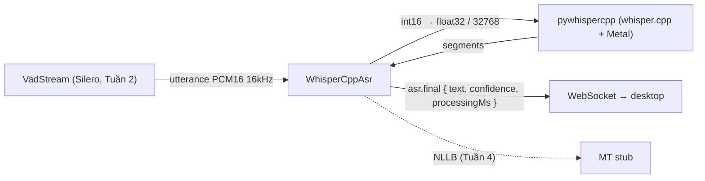

# Tuần 3 — Module ASR (whisper.cpp)

**Giai đoạn:** Tuần 3 (30/07 – 05/08)
**Mục tiêu tuần:** Tích hợp whisper.cpp + model Whisper quantized, hỗ trợ vi/en/ja/zh, trả transcript theo từng đoạn phát ngôn; kiểm tra độ chính xác và độ trễ cơ bản.
**Kết quả mong đợi (đề cương `00` §5):** Module ASR local hoạt động cho các ngôn ngữ trong phạm vi; có kết quả kiểm thử ban đầu.

> Phạm vi đợt này thay stub `WhisperCppAsr` bằng adapter thật. VAD (Tuần 2) đã cắt utterance; đợt này biến utterance → text. MT/TTS vẫn là stub (Tuần 4/5).

---

## 1. Kết quả đạt được

- **Adapter ASR whisper.cpp thật** (`apps/ai-service/.../adapters/asr/whisper_cpp.py`) qua gói **`pywhispercpp`** (nhúng whisper.cpp, wheel dựng sẵn kèm **Metal** trên Apple Silicon).
- Model GGML **tự tải lần đầu** từ HF `ggerganov/whisper.cpp` vào `~/.llvt/models/whisper-cpp/`, sau đó chạy offline.
- Luồng `VAD → ASR → asr.final` đã thông; chỉ chạy task **transcribe** (`translate=False`), giữ đúng ngôn ngữ nguồn — việc dịch là của MT (Tuần 4).
- **Kiểm thử thật (small-q5, Metal):** giọng tổng hợp bằng `say` → transcribe khớp nguyên văn:
  - `[en]` "Hello, how are you doing today?" — **~237 ms/utterance**, conf ≈ 0.72
  - `[vi]` "Xin chào, hôm nay bạn khỏe không?" — **~226 ms/utterance**, conf ≈ 0.72

## 2. Vì sao pywhispercpp

- Đề cương `00` chốt **runtime whisper.cpp**; `pywhispercpp` là binding Python được bảo trì tốt, nhúng thẳng whisper.cpp và có **wheel dựng sẵn cho macOS arm64 (Metal)** → không cần bước build khi `uv add`.
- Tự tải model GGML từ đúng repo `ggerganov/whisper.cpp` (khớp cơ chế đã khảo sát cho weeks 3–5), hợp quy ước "dùng tooling chính thức, quản lý bằng uv".
- Cùng một port `SpeechToTextProvider` vẫn còn adapter `faster_whisper` (tối ưu, chưa bắt buộc) — minh họa nhiều backend sau một port.

## 3. Thiết kế adapter

| Vấn đề                                  | Cách xử lý                                                                                                                                                                                                                  |
| --------------------------------------- | --------------------------------------------------------------------------------------------------------------------------------------------------------------------------------------------------------------------------- |
| Model whisper.cpp **không thread-safe** | Adapter giữ một `SerialExecutor` nội bộ (lock + `to_thread`) → nhiều pipeline (mic/system) dùng chung 1 model instance vẫn tuần tự, an toàn.                                                                                |
| Định dạng audio                         | VAD trả PCM signed 16-bit mono 16 kHz; adapter đổi `int16 → float32 / 32768.0` ([-1, 1]) vì whisper.cpp yêu cầu float chuẩn hóa. Sai sample rate → `ValueError` (pipeline phát `bad_audio`).                                |
| Nạp model nặng (I/O + CPU)              | `load()` chạy `asyncio.to_thread` để không chặn event loop; `transcribe()` trước khi `load()` → `RuntimeError`.                                                                                                             |
| Tên model theo preset                   | `MODEL_MAP` ánh xạ tên logic → id GGML: `whisper-small-q5→small-q5_1`, `whisper-large-v3-turbo-q5→large-v3-turbo-q5_0`, `whisper-large-v3-turbo-q8→large-v3-turbo-q8_0`. Tên lạ giữ nguyên (cho phép truyền thẳng path/id). |
| Ngôn ngữ                                | `Language.value` (`vi`/`en`/`ja`/`zh`) khớp thẳng mã ngôn ngữ của whisper — không cần mapping.                                                                                                                              |
| Confidence                              | Bật `extract_probability=True`, lấy **trung bình** `probability` các segment (bỏ NaN) → `AsrTranscript.confidence`; kèm `processing_ms` để đo độ trễ ASR.                                                                   |
| Testability                             | Loader tiêm được: `WhisperCppAsr(model, models_dir, loader=...)`. Mặc định `_default_loader` dựng `pywhispercpp.model.Model`.                                                                                               |

Adapter **là nơi duy nhất** biết pywhispercpp; pipeline/preset chỉ thấy port. Preset trỏ tên model (Fast=small-q5, Balanced=large-v3-turbo-q5, Quality=large-v3-turbo-q8); registry truyền `models_dir = ~/.llvt/models/whisper-cpp`.

## 4. Kiểm thử

`apps/ai-service/tests/test_asr.py` + `tests/conftest.py` (21 pass, 1 skip toàn suite):

- **Logic adapter (model giả, xác định):** mapping tên→id GGML; loader nhận đúng id + dir; join+strip text; truyền `translate=False` + `language` đúng; chuẩn hóa PCM16→float32; confidence = mean(prob) bỏ NaN, `None` khi không có prob; sai sample rate → `ValueError`; chưa `load()` → `RuntimeError`.
- **`conftest.py` autouse:** thay `_default_loader` bằng `FakeWhisperModel` để mọi test dựa trên `TestClient` (lifespan nạp preset) **không tải model thật** — nhanh, offline, xác định.
- **Tích hợp thật (opt-in):** `LLVT_RUN_ASR_INTEGRATION=1` mới chạy — tải small-q5 và decode qua binding thật; truyền loader thật tường minh để bỏ qua fake của conftest.

## 5. Còn nợ / đợt sau

- Model lớn hơn (large-v3-turbo) cho preset Balanced/Quality: đã map sẵn, chỉ cần tải khi cần; đo lại độ trễ trên máy Windows.
- Đánh giá WER/CER trên bộ câu thoại kiểm thử tự dựng (song hành cùng đánh giá MT ở Tuần 4+).
- `asr.partial` (streaming trong lúc nói) hiện chưa dùng — near-real-time theo utterance là đủ cho phạm vi đề cương; cân nhắc sau nếu cần.
- Tinh chỉnh tham số decode (beam search, `no_speech_thold`, `initial_prompt`) khi tối ưu độ chính xác.
