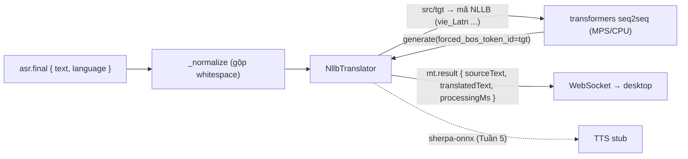

# Tuần 4 — Module Machine Translation (NLLB-200)

**Giai đoạn:** Tuần 4 (06/08 – 12/08)
**Mục tiêu tuần:** Tích hợp NLLB-200 distilled 600M, mapping mã ngôn ngữ + normalization, kiểm thử sáu chiều dịch.
**Kết quả mong đợi (đề cương `00` §5):** Module dịch local hoàn chỉnh; có bộ câu kiểm thử và kết quả đánh giá thủ công.

> Phạm vi đợt này thay stub `NllbTranslator` bằng adapter thật. ASR (Tuần 3) đã cho transcript final; đợt này biến text nguồn → text đích. TTS vẫn là stub (Tuần 5).

---

## 1. Kết quả đạt được

- **Adapter MT NLLB-200 thật** (`apps/ai-service/.../adapters/mt/nllb.py`) qua **`transformers` (PyTorch)**: `AutoModelForSeq2SeqLM` + `AutoTokenizer`, tải `facebook/nllb-200-distilled-600M` từ HF (lần đầu; sau đó offline) vào `~/.llvt/models/nllb/`.
- Dịch **text→text theo từng utterance** (chỉ trên transcript final), tách biệt hoàn toàn với Whisper — đúng thiết kế đề cương/SPEC.
- Thiết bị **tự dò**: MPS (Apple Silicon) → CPU.
- **Kiểm thử thật sáu chiều (MPS):** sau một lần warmup ~1.8s, mỗi câu ~300–400 ms:
  - `vi→en` "Xin chào, hôm nay bạn khỏe không?" → "Hi, how are you today?"
  - `en→vi` "Please confirm this issue." → "Xin hãy xác nhận vấn đề này."
  - `vi→ja` "Cuộc họp bắt đầu lúc chín giờ sáng." → "会議は午前9時から始まります。"
  - `vi→zh` "Tôi cần một tách cà phê." → "我需要一杯咖啡。"

## 2. Vì sao transformers + PyTorch

- Đường chính thức của Meta cho NLLB (text-to-text); tự tải model từ HF, hỗ trợ đủ 4 ngôn ngữ, chạy được trên MPS/CPU.
- `torch` đã là dependency sẵn (Silero VAD) → chi phí thêm nhỏ; đơn giản, chuẩn tắc.
- **INT8/CTranslate2** (khớp ghi chú preset Fast) là tối ưu về sau, đặt **sau cùng port** `TranslationProvider` — giống cách `faster_whisper` đứng cạnh `whisper_cpp` cho ASR. Không đụng pipeline.

## 3. Thiết kế adapter

| Vấn đề                      | Cách xử lý                                                                                                                                                                    |
| --------------------------- | ----------------------------------------------------------------------------------------------------------------------------------------------------------------------------- |
| Mã ngôn ngữ NLLB            | `NLLB_CODE` map `Language`→FLORES-200 (`vie_Latn`/`eng_Latn`/`jpn_Jpan`/`zho_Hans`). Set `tokenizer.src_lang`, ép `forced_bos_token_id = convert_tokens_to_ids(tgt)`.         |
| Tên model theo preset       | `MODEL_MAP`: `nllb-200-distilled-600M` và `...-int8` → cùng repo `facebook/nllb-200-distilled-600M` (INT8 để backend tối ưu sau). Tên lạ giữ nguyên (truyền thẳng repo/path). |
| Model không hẳn thread-safe | Adapter giữ `SerialExecutor` nội bộ (lock + `to_thread`) → nhiều pipeline (mic/system) dùng chung 1 model vẫn tuần tự, an toàn.                                               |
| Nạp model nặng (~2.4GB)     | `load()` chạy `asyncio.to_thread`; `translate()` trước khi `load()` → `RuntimeError`.                                                                                         |
| Đầu vào                     | `_normalize` gộp whitespace + trim. **Rỗng** → trả `""` không gọi model; **cùng ngôn ngữ** → trả nguyên văn không gọi model (tiết kiệm).                                      |
| Kết quả                     | `TranslationResult` kèm `source_text` (đã chuẩn hóa), `translated_text`, `processing_ms` để đo độ trễ MT.                                                                     |
| Testability                 | Backend tiêm được: loader `(repo_id, models_dir, device) → TranslationBackend`. Mặc định `_default_loader` dựng `_TransformersNllb`.                                          |

Adapter **là nơi duy nhất** biết transformers; pipeline/preset chỉ thấy port. Preset trỏ tên model (Fast=…-int8, Balanced/Quality=…-600M); registry truyền `models_dir = ~/.llvt/models/nllb`.

## 4. Kiểm thử

`apps/ai-service/tests/test_mt.py` + `tests/conftest.py` (29 pass, 2 skip toàn suite):

- **Logic adapter (backend giả, xác định):** mapping tên→repo; loader nhận đúng repo/dir/device; **sáu chiều MVP** dùng đúng mã NLLB; truyền src/tgt đúng; normalization whitespace; **rỗng** và **cùng ngôn ngữ** không gọi model; chưa `load()` → `RuntimeError`.
- **`conftest.py` autouse:** thêm `_fake_mt_loader` (cạnh `_fake_asr_loader`) thay `_default_loader` bằng `FakeNllbBackend` để `TestClient` (lifespan nạp preset) **không tải NLLB ~2.4GB**.
- **Tích hợp thật (opt-in):** `LLVT_RUN_MT_INTEGRATION=1` mới chạy — tải NLLB-200 và dịch sáu chiều qua backend thật (truyền loader thật tường minh để bỏ qua fake của conftest).

## 5. Còn nợ / đợt sau

- Đánh giá chất lượng dịch thủ công (đúng nghĩa/đầy đủ/dễ hiểu) trên bộ câu kiểm thử tự dựng; chỉ số tự động (BLEU/COMET) bổ trợ khi phù hợp.
- **Sentence segmentation** cho utterance dài (SPEC §7.2 nêu bước tách câu trước NLLB) — hiện dịch cả utterance một lần; cân nhắc khi câu dài.
- Backend tối ưu **CTranslate2 INT8** cho preset Fast (giảm RAM/độ trễ trên CPU/Windows).
- Đo lại độ trễ + RAM trên máy Windows; cân nhắc `Qwen3-4B-Instruct` cho preset Quality (SPEC §7.4).
- Cảnh báo lành tính `max_new_tokens vs max_length` từ transformers — không ảnh hưởng kết quả.
