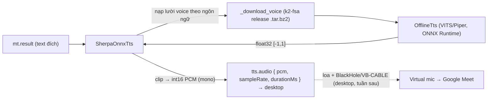

# Tuần 5 — Module TTS (sherpa-onnx)

**Giai đoạn:** Tuần 5 (13/08 – 19/08)
**Mục tiêu tuần:** Tích hợp sherpa-onnx + voice model, tổng hợp giọng nói offline, speed control; (định tuyến ra loa/mic ảo thuộc phần desktop).
**Kết quả mong đợi (đề cương `00` §5):** TTS offline phát được audio đã dịch (âm thanh ra loa và microphone ảo là bước desktop sau).

> Phạm vi đợt này: **tổng hợp TTS phía AI service** (text đích → PCM). MT (Tuần 4) đã cho text đích; đợt này biến text → audio. **Phát ra loa + định tuyến BlackHole/VB-CABLE** là code native phía desktop → để tuần tích hợp (6/7), giống cách Tuần 2 hoãn thu system audio.

---

## 1. Kết quả đạt được

- **Adapter TTS sherpa-onnx thật** (`apps/ai-service/.../adapters/tts/sherpa_onnx.py`): `OfflineTts` (VITS/Piper) tổng hợp offline, trả **PCM signed 16-bit mono** kèm `sample_rate`, `duration_ms`.
- **Tự tải voice model** từ GitHub releases của k2-fsa (tag `tts-models`, tarball `.tar.bz2`) vào `~/.llvt/models/sherpa-tts/`, giải nén an toàn (`filter="data"`), tải vào `.tmp` rồi mới dùng.
- **Nạp lười theo ngôn ngữ**: voice chỉ tải + khởi tạo khi synthesize lần đầu cho ngôn ngữ đó (không tải cả 4 voice khi chỉ dùng 1–2); cache theo tên voice.
- **Pipeline hoàn chỉnh:** với chiều outgoing, luồng VAD→ASR→MT→**TTS** giờ chạy trọn vẹn tới `Completed` và phát `tts.audio` qua WS.
- **Kiểm thử thật (Piper en/vi):** tổng hợp ra audio thật (không phải im lặng):
  - `en` "This is a local text to speech test." → 1892 ms @ 22050 Hz, peak 0.61, rms 0.09
  - `vi` "Đây là bài kiểm tra tổng hợp giọng nói." → 1962 ms @ 22050 Hz, peak 0.65, rms 0.12



## 2. Ghi chú tích hợp sherpa-onnx

- Pin **`sherpa-onnx==1.10.46`**: wheel này **bundle sẵn** `libonnxruntime` + C-API dylib. Bản mới hơn (1.13.x) tham chiếu `libonnxruntime.1.27.0.dylib` không kèm trong wheel → `dlopen` lỗi trên macOS. Nếu nâng version phải kiểm tra lại dylib.
- Voice model của sherpa-onnx **không ở trên HF** (khác whisper.cpp/NLLB) → tự viết downloader (stdlib `urllib` + `tarfile`), không thêm dependency runtime.

## 3. Thiết kế adapter

| Vấn đề                 | Cách xử lý                                                                                                                    |
| ---------------------- | ----------------------------------------------------------------------------------------------------------------------------- |
| Voice theo ngôn ngữ    | `DEFAULT_VOICE` map `Language`→tên voice (SPEC 02 §8.2). `synthesize(voice=...)` cho phép override.                           |
| Nạp lười + cache       | `load()` là no-op; `_ensure_engine(voice)` tải + dựng `OfflineTts` lần đầu, cache theo tên voice; `unload()` xóa cache.       |
| Tải blocking           | `_download_voice` + `generate` chạy trong `SerialExecutor` (worker thread + lock) → an toàn khi nhiều pipeline dùng chung.    |
| Dựng config VITS/Piper | `_default_engine_loader` tự tìm `*.onnx`, `tokens.txt`, gắn `espeak-ng-data` (Piper) và `lexicon.txt` nếu có.                 |
| Đầu ra                 | float32 [-1,1] → `clip` → int16 PCM mono. `duration_ms` tính từ số mẫu / sample rate. Text rỗng → PCM rỗng, không gọi engine. |
| Speed control          | Truyền thẳng `speed` vào `engine.generate`.                                                                                   |
| Testability            | `engine_loader` + `downloader` tiêm được; mặc định `_default_engine_loader`/`_download_voice`.                                |

Adapter **là nơi duy nhất** biết sherpa-onnx; pipeline chỉ thấy port `TextToSpeechProvider`. Registry truyền `models_dir = ~/.llvt/models/sherpa-tts`.

## 4. Kiểm thử

`apps/ai-service/tests/test_tts.py` + cập nhật `test_vad.py`/`conftest.py` (36 pass, 3 skip toàn suite):

- **Logic adapter (engine + downloader giả, xác định):** float32→PCM16 đúng biên độ; chọn voice mặc định theo ngôn ngữ + override; forward `speed`; cache (tải một lần); text rỗng bỏ qua engine; `unload` xóa cache (tải lại).
- **`conftest.py` autouse:** thêm `_fake_tts_engine` (patch `_download_voice` + `_default_engine_loader`) để `TestClient`/pipeline **không tải voice thật**; bỏ qua khi `LLVT_RUN_TTS_INTEGRATION=1`.
- **`test_vad.py` WS contract cập nhật:** pipeline giờ chạy trọn vẹn → khẳng định thấy `asr.final`/`mt.result`/`tts.audio` tới `Completed` (trước đây là `error: not_implemented`).
- **Tích hợp thật (opt-in):** `LLVT_RUN_TTS_INTEGRATION=1` — tải voice Piper en/vi và tổng hợp thật, ghi WAV để nghe.

## 5. Còn nợ / đợt sau

- ~~**Voice ja/zh:** `supertonic-3-ja` và `vits-piper-zh_CN-xiao_ya-medium` trong `DEFAULT_VOICE` cần đối chiếu lại với danh sách release hiện tại của k2-fsa~~ → đã xử lý, xem [mục 6](#6-bổ-sung-18082026--tiếng-nhật-và-tiếng-trung).
- **Phát audio + định tuyến (desktop):** phát `tts.audio` ra loa; đưa vào BlackHole (macOS)/VB-CABLE (Windows) để Google Meet nhận — tuần tích hợp desktop.
- **Hàng đợi phát + cancel** (đề cương §5 Tuần 5): quản lý hàng đợi TTS và hủy câu ở phía phát (desktop) / điều phối phiên.
- Cân nhắc `provider="coreml"` trên Apple Silicon để tăng tốc; hiện dùng `cpu` cho ổn định/di động.

## 6. Bổ sung 18/08/2026 — tiếng Nhật và tiếng Trung

Hai voice còn nợ ở mục 5 hoá ra **cùng hỏng vì một loại nguyên nhân**: model có tồn tại,
nhưng phần chuyển **chữ → âm vị** (G2P) mà chúng cần thì sherpa-onnx không có. Cả hai đều
được phát hiện bằng cách cho ASR **nghe lại** chính audio do TTS sinh ra, chứ không phải
bằng đọc tài liệu.

### 6.1. Tiếng Nhật — đổi sang Kokoro + OpenJTalk

Bản phát hành `tts-models` của k2-fsa không có model VITS tiếng Nhật nào (đối chiếu đủ
642 asset). Kokoro v1.0 **có** 5 giọng Nhật (`jf_alpha`, `jf_gongitsune`, `jf_nezumi`,
`jf_tebukuro`, `jm_kumo`, sid 37–41) nhưng tài liệu sherpa-onnx ghi rõ: _"It is a
multi-lingual model, but we only add English and Chinese support for it."_ Metadata của
chính file model cũng ghi `voice = en-us`.

Hậu quả đo được — đưa 「こんにちは、今日はプロジェクトの会議です。」 vào sherpa-onnx với
giọng jf_alpha:

|              | Kết quả                                                                 |
| ------------ | ----------------------------------------------------------------------- |
| Độ dài audio | **18,5 giây** cho một câu ~3 giây                                       |
| ASR nghe lại | 「日本語の字幕を作成しています。」 — **không liên quan gì** tới câu vào |

Chữ Nhật bị phiên âm bằng espeak tiếng Anh nên model đọc ra tiếng Nhật vô nghĩa.

**Cách xử lý:** giữ nguyên trọng số Kokoro nhưng thay G2P — adapter mới
`adapters/tts/kokoro_ja.py` chuyển câu sang âm vị bằng `misaki.ja` (gọi OpenJTalk, đúng
bộ G2P mà bản Kokoro gốc dùng) rồi mới đưa vào ONNX. Vì khâu TTS giờ chạy hai engine,
`application/tts_router.py` (`LanguageRoutedTts`) chọn engine theo ngôn ngữ đích; pipeline
vẫn chỉ thấy một provider.

Kiểm chứng bằng round-trip TTS → ASR (whisper large-v3-turbo, `language=ja`):

| Câu vào                                    | ASR nghe lại                           | Audio |
| ------------------------------------------ | -------------------------------------- | ----- |
| こんにちは、今日はプロジェクトの会議です。 | こんにちは今日はプロジェクトの会議です | 2,6 s |
| 会議は10時30分に始まります。               | 会議は10時30分に始まります。           | 2,8 s |
| この機能はまだテスト中です。               | この機能はまだテスト中です。           | 2,0 s |

Đúng cả kanji, số và katakana (3/3, chỉ lệch dấu câu).

**Chọn bản fp32 chứ không phải int8.** Đo cùng một câu trên máy dev: int8 (92 MB) mất
**1497 ms**, fp32 (326 MB) chỉ **706 ms** — ARM không có kernel int8 tối ưu nên bản "nhẹ
hơn" lại chậm gấp đôi. Máy x86 có AVX-VNNI nhiều khả năng ngược lại, nên tên file để đổi
được qua tham số `model_file`.

### 6.2. Tiếng Trung — đổi voice, và bổ sung `dict_dir`

`vits-piper-zh_CN-xiao_ya-medium` chết ngay khi tổng hợp:

```text
RuntimeError: Non-zero status code returned while running Conv node.
Status Message: Invalid input shape: {0}
```

`{0}` nghĩa là **mảng token rỗng** — thông báo lỗi ở tầng Conv không hề nhắc tới nguyên
nhân thật. MODEL*CARD của chính voice đó ghi: *"Only works on the Python version of Piper
1.4+ due to a dependency on g2pW"\_ — tức nó cần một bộ G2P mà sherpa-onnx không có.

Đổi sang **`sherpa-onnx-vits-zh-ll`** (đi kèm từ điển jieba + lexicon) và sửa
`_default_engine_loader` truyền thêm:

- `dict_dir` khi voice có thư mục `dict/` — thiếu nó thì tra từ điển không ra chữ nào và
  lại rơi vào đúng lỗi "Invalid input shape: {0}";
- `rule_fsts` (`date.fst`, `number.fst`, `phone.fst`) — thiếu thì model đọc "2026" thành
  từng chữ số rời.

Kiểm chứng round-trip: 你好，今天我们开项目会议。 → nghe lại 您好,今天我们开项目会议。
(lệch một chữ đồng âm nǐ/nín do ASR), và 会议在十点三十分开始。 → khớp nguyên câu.
vi/en kiểm tra lại sau khi đổi loader vẫn đúng.

Từ đợt này, **cả bốn ngôn ngữ trong phạm vi đồ án đều tổng hợp được giọng**; số đo độ
trễ từng chiều xem [`10_week8-experiments.md`](10_week8-experiments.md) mục 2.
