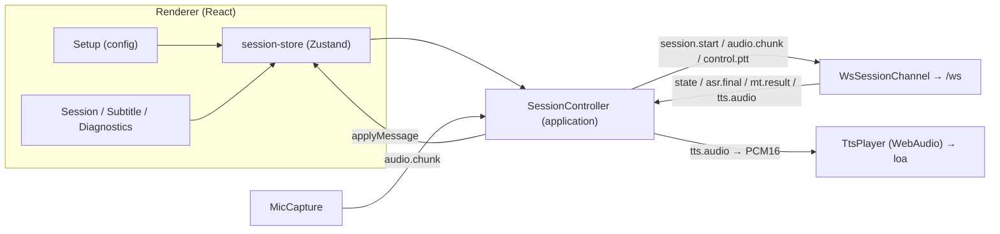

# Tuần 6 — Tích hợp ứng dụng desktop

**Giai đoạn:** Tuần 6 (20/08 – 26/08)
**Mục tiêu tuần:** Xây dựng màn hình Setup/Session/Subtitle/Diagnostics; kết nối REST/WebSocket; hoàn thiện luồng microphone → ASR → dịch → TTS (phát ra loa).
**Kết quả mong đợi (đề cương `00` §5):** Ứng dụng demo có giao diện và luồng xử lý chính hoạt động.

> Phạm vi đợt này: **UI đầy đủ 4 màn hình + phát TTS ra loa**. Định tuyến vào **microphone ảo** (BlackHole/VB-CABLE) và thu **system audio** vẫn là OS-native → để Tuần 7. Backend AI (VAD→ASR→MT→TTS) đã thật từ Tuần 2–5.

---

## 1. Kết quả đạt được

- **4 màn hình dạng tab** trong `apps/desktop` (React + Zustand + Tailwind):
  - **Setup:** chọn chế độ (speak/listen/two_way), cặp ngôn ngữ outgoing/incoming (vi/en/ja/zh), preset (Fast/Balanced/Quality); hiển thị nền tảng + cảnh báo dùng tai nghe; health REST.
  - **Session:** Bắt đầu/Dừng, Push-to-talk (giữ), badge trạng thái pipeline realtime, phụ đề trực tiếp (6 dòng gần nhất).
  - **Subtitle:** lịch sử phụ đề song ngữ cỡ lớn, cuộn theo dòng mới.
  - **Diagnostics:** health, trạng thái WS, độ trễ ASR/MT + thời lượng TTS của utterance gần nhất, nhật ký event thô.
- **Phát TTS ra loa:** nhận `tts.audio` (base64 PCM16) → WebAudio phát tuần tự (không chồng tiếng).
- **Kết nối đầy đủ:** REST `/health` (TanStack Query) + WebSocket `/ws`; `session.start` mang `mode`, cặp ngôn ngữ và `preset` từ Setup.

## 2. Kiến trúc (giữ hexagonal ở renderer)

Phụ thuộc hướng vào trong: `ui/hooks → application → ports ← adapters`, `domain` không phụ thuộc gì.

| Lớp           | Thêm/đổi ở Tuần 6                                                                                                                                                                                        |
| ------------- | -------------------------------------------------------------------------------------------------------------------------------------------------------------------------------------------------------- |
| `domain`      | `events.ts` thêm payload có kiểu (State/AsrFinal/MtResult/TtsAudio/Metrics/Error) mirror `ws/protocol.py`; `models.ts` thêm `SessionConfig`/`LanguagePair`/`Utterance` + nhãn; `enums.ts` thêm `Preset`. |
| `ports`       | thêm `AudioOutput` (phát TTS) cạnh `AudioCapture`/`SessionChannel`/`AiClient`.                                                                                                                           |
| `adapters`    | thêm `TtsPlayer` (WebAudio). `MicCapture`/`WsSessionChannel`/`HttpAiClient` giữ nguyên.                                                                                                                  |
| `application` | `SessionController` nhận thêm `AudioOutput`; dựng payload `session.start` từ `SessionConfig`; giải mã + phát `tts.audio`.                                                                                |
| `stores`      | `session-store` gom event → `pipelineState`, danh sách `utterances` (phụ đề, upsert theo `utteranceId`), `metrics`, `log`; giữ `config`.                                                                 |
| `ui`          | `App` tab-nav; 4 screen + component `Select`/`StateBadge`/`SubtitleList`. Bỏ `SessionCard` cũ.                                                                                                           |

## 3. Đồng bộ contract (WS)

`session.start` gửi lên khớp `parse_session_config` phía Python: `mode`, `preset`, `outgoingSource/Target`, `incomingSource/Target` (camelCase). Event server→client dùng đúng field camelCase của `ws/protocol.py` (`utteranceId`, `processingMs`, `sourceText`, `translatedText`, `sampleRate`, `durationMs`). `asr.partial`/`metrics` hiện chỉ vào log (chưa dùng ở UI).

## 4. Kiểm chứng

- `npm run typecheck` (node + web) ✅, `npm run lint` ✅, `npm run build` (electron-vite) ✅ — renderer bundle 99 module.
- Backend end-to-end đã kiểm thử thật ở Tuần 3–5; contract WS có test ở ai-service (`test_vad.py` chạy trọn VAD→ASR→MT→TTS).
- Chạy GUI thật (mic → loa) cần AI service bật kèm model thật + thiết bị mic → chạy `make dev` để thử tay.

## 5. Còn nợ / đợt sau (Tuần 7)

- **Microphone ảo:** đưa TTS vào BlackHole (macOS)/VB-CABLE (Windows) để Google Meet nhận; **thu system audio** cho chiều incoming (Listen).
- **Push-to-talk hoàn chỉnh:** hiện gửi `control.ptt`; logic gate mic + mute + hàng đợi thuộc Tuần 7.
- **Chọn thiết bị audio** (mic/loa cụ thể) trong Setup; đo mức âm lượng realtime.
- Chống vòng lặp âm thanh (TTS bị mic thu lại) khi không dùng tai nghe; History (SQLite) từ Tuần 6 backend còn để sau.
- Cân nhắc tách bundle renderer (665 kB) nếu cần.
