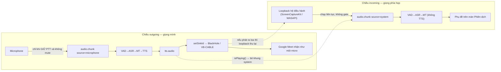

# Tuần 7 — Hoàn thiện dịch hai chiều

**Giai đoạn:** Tuần 7 (27/08 – 02/09) · **Hiện thực:** 22/07 và 30/07/2026 (chạy trước kế hoạch)
**Mục tiêu tuần:** Kết hợp incoming + outgoing pipeline; hoàn thiện Push-to-talk, mute và hàng đợi; kiểm tra audio loopback khi dùng Google Meet.
**Kết quả mong đợi (đề cương `00` §5):** Thực hiện được kịch bản dịch hai chiều gần thời gian thực trong Google Meet.

> Backend đã có sẵn bộ khung hai chiều từ Tuần 6: `SessionController.start()` dựng
> `_incoming` (nguồn system, **không** tổng hợp giọng) và `_outgoing` (nguồn mic, có
> TTS), phân luồng theo `chunk.source`. Tuần này làm phần OS-native còn thiếu ở
> desktop và biến PTT/mute từ "báo trạng thái" thành cổng chặn thật.

---

## 1. Kết quả đạt được

Tuần này chia thành 5 việc nhỏ; **4/5 xong**, việc còn lại chỉ kiểm chứng được trên máy thật.

| Mã       | Việc                               | Trạng thái                      |
| -------- | ---------------------------------- | ------------------------------- |
| **W7-0** | Định tuyến TTS ra microphone ảo    | ✅ xong                         |
| **W7-1** | Thu âm thanh hệ thống (chiều nghe) | ✅ xong                         |
| **W7-2** | Push-to-talk + mute + chốt câu dở  | ✅ xong                         |
| **W7-3** | Chống vòng lặp âm thanh            | ✅ xong                         |
| **W7-4** | Chạy thật trong Google Meet        | ⬜ cần máy thật + người thứ hai |

## 2. W7-0 — Đưa bản dịch vào microphone ảo

- Port `AudioOutput` thêm `setSink(deviceId)`; `TtsPlayer` gọi `AudioContext.setSinkId`
  (Electron 39 / Chromium 136 có hỗ trợ), lỗi thì lùi về thiết bị mặc định chứ không
  làm hỏng phiên.
- Adapter mới `audio-devices.ts` liệt kê thiết bị ra và đoán microphone ảo theo nhãn
  (`blackhole|vb-?cable|cable input|voicemeeter|loopback|soundflower`) — chỉ để **gợi ý**
  trong màn Cài đặt, người dùng vẫn chọn tay.
- `SessionController.start()` trỏ sink **trước** khi phát câu đầu tiên.

Google Meet không nhận audio từ ứng dụng khác; cách duy nhất là giả làm một micro của
hệ điều hành — nên chuỗi là: TTS → thiết bị ảo → Meet chọn thiết bị đó làm mic.

## 3. W7-1 — Thu âm thanh hệ thống

| Vấn đề                                | Cách xử lý                                                                                                                           |
| ------------------------------------- | ------------------------------------------------------------------------------------------------------------------------------------ |
| Electron từ chối `getDisplayMedia`    | `session.setDisplayMediaRequestHandler` ở main trả `{video: screen, audio: 'loopback'}`; không có handler thì API này bị chặn thẳng. |
| Không muốn chọn nguồn mỗi lần bắt đầu | `useSystemPicker: false` — luôn lấy loopback toàn hệ thống.                                                                          |
| Chromium bắt buộc kèm video           | Nhận stream xong bỏ track video ngay, chỉ giữ audio.                                                                                 |
| Trùng code với thu mic                | Tách `Pcm16Stream` (MediaStream → PCM16 mono 16 kHz qua AudioWorklet); `MicCapture` và `SystemAudioCapture` chỉ khác chỗ lấy stream. |
| Thu hệ thống lỗi thì mất cả phiên     | Bọc riêng: lỗi chỉ báo lên UI, chiều outgoing vẫn chạy.                                                                              |

Cùng một API cho hai hệ điều hành: macOS 13+ đi qua **ScreenCaptureKit**, Windows qua
**WASAPI loopback**, Chromium lo phần khác biệt.

## 4. W7-2 — Push-to-talk, mute và câu nói dở

- PTT trở thành **cổng bắt buộc** của chiều mic: `SessionController.on_audio` chỉ đẩy
  khung vào pipeline khi `_ptt_active and not _muted`. Client cũng chặn trước khi gửi,
  server chặn lần nữa (không tin client).
- **Nhả nút phải chốt câu**: client ngừng gửi audio nên VAD sẽ không bao giờ thấy đoạn
  im lặng để kết thúc câu → thêm `VadStream.flush()` cắt đoạn đang dở rồi reset.
- `control.mute` (message WS mới) bỏ luôn đoạn đang nói dở (`discard()`) và **cắt TTS
  đang phát** ở client — bật mute giữa lúc bản dịch đang đọc mà vẫn đọc nốt thì vô lý.
- Quyết định giữ nguyên: chiều incoming **không** tổng hợp giọng. Nếu đọc bản dịch của
  phía kia thì tiếng máy sẽ chồng lên tiếng người thật đang nói.

## 5. W7-3 — Chống vòng lặp âm thanh

Rủi ro lớn hơn tiếng vọng qua mic: loopback thu **toàn bộ** đầu ra hệ điều hành, nên
nếu TTS phát ra loa, chính bản dịch của mình quay lại chiều incoming và được dịch tiếp
— vòng lặp không có điểm dừng.

- `AudioOutput` thêm `isPlaying(tailMs)`; `TtsPlayer` suy ra từ mốc kết thúc của đoạn
  cuối đã xếp lịch, cộng 300 ms bù trễ thiết bị.
- Khung audio hệ thống thu trong lúc đó bị **bỏ**, UI hiện "Tạm ngưng thu (đang phát
  bản dịch)" để người dùng biết vì sao phụ đề phía kia khựng lại.
- Cách chắc chắn nhất vẫn là đeo tai nghe; phần trên chỉ để tránh vòng lặp khi người
  dùng quên.

## 6. Số đo độ trễ thật (chuẩn bị Tuần 8)

Pipeline đo từng khâu bằng `perf_counter`, điền `processingMs` vào `asr.final` /
`mt.result` và phát thêm event `metrics` trước `Completed`. Trước đó client tự ước
lượng bằng khoảng cách giữa các event — con số ấy gồm cả thời gian truyền WS nên bị
đánh dấu "client"; giờ nhãn đó tự tắt khi có số thật.

## 7. Kiểm thử

- `tests/test_ptt.py`: audio mic bị bỏ khi chưa giữ PTT; mute chặn; nhả PTT thì `flush()`
  chốt câu.
- `tests/test_incoming.py`: chiều system chạy **không** cần PTT, **không** sinh `tts.audio`,
  và báo `processingMs` thật.
- Toàn suite lúc chốt tuần: 42 passed, 3 skipped; desktop typecheck/lint/build sạch.
- Phần chỉ máy thật kiểm được: `setSinkId` ra thiết bị ảo, loopback thật, và Meet.

## 8. Còn nợ / việc cần làm trên máy thật

- **W7-4 — kịch bản Google Meet:** cài BlackHole 2ch (macOS) hoặc VB-CABLE (Windows),
  chọn nó ở màn Cài đặt, rồi đặt nó làm micro trong Meet; đeo tai nghe. Lần đầu bắt đầu
  phiên ở chế độ Nghe/Hai chiều, **macOS sẽ hỏi quyền Ghi màn hình** — chưa cấp thì
  `getDisplayMedia` lỗi và chiều incoming không chạy.
- Cấu hình TTS tiếng Nhật hỏng phát hiện trong tuần này (`supertonic-3-ja` không tồn tại)
  đã được xử lý dứt điểm sau đó — xem phần bổ sung trong [`07_week5-tts.md`](07_week5-tts.md).
