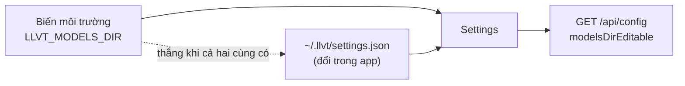

# Đợt bổ sung sau Tuần 8 — Lịch sử phiên, cấu hình và vòng đời model

**Giai đoạn:** ngoài lịch tuần · **Hiện thực:** 18/08/2026
**Mục tiêu:** trả ba khoản nợ còn lại của Tuần 6–8, đều là thứ chặn phần "ứng dụng
dùng được thật" chứ không phải phần pipeline: lịch sử phiên, đổi thư mục model, và
thời gian khởi động.

> Ba việc trong tài liệu này không thuộc một tuần nào trong đề cương `00`. Chúng là
> nợ kỹ thuật đã ghi ở mục "còn nợ" của [`08_week6-desktop.md`](08_week6-desktop.md)
> và phát sinh từ việc dùng thử: bật app lên chờ 45 giây mới thấy giao diện, và ổ
> đĩa hệ thống hết chỗ vì model nằm cứng ở `~/.llvt/models`.

---

## 1. Lịch sử phiên lưu trong SQLite (nợ Tuần 6)

SPEC `01` §7.11 yêu cầu lưu lại nội dung phiên, tiêu chí nghiệm thu 16 yêu cầu xoá
được. Tuần 6 chỉ có phụ đề sống trong bộ nhớ của renderer: đóng app là mất.

**Chỗ đặt dữ liệu.** Service ghi, không phải desktop. Lý do: pipeline biết chính xác
lúc nào một câu kết thúc và mất bao nhiêu mili giây ở từng khâu; nếu để renderer ghi
thì con số đó phải đi vòng qua WebSocket rồi quay lại, và bản ghi sẽ mất mỗi khi cửa
sổ đóng giữa chừng.

| Quyết định                           | Vì sao                                                                                                                                                                   |
| ------------------------------------ | ------------------------------------------------------------------------------------------------------------------------------------------------------------------------ |
| SQLAlchemy **Core**, không dùng ORM  | Hai bảng phẳng (`sessions`, `utterances`), truy vấn đơn giản — không cần identity map hay lazy loading.                                                                  |
| `create_all`, **không Alembic**      | CSDL chỉ tồn tại trên máy người dùng và luôn do đúng phiên bản app đang chạy tạo ra; không có bản triển khai nào cần migrate. Đổi schema sau này: `PRAGMA user_version`. |
| `LIKE`, **không FTS5**               | Một máy, một người dùng, cỡ vài nghìn câu. Đổi lấy việc không phải nuôi bảng ảo + trigger đồng bộ.                                                                       |
| Mọi câu lệnh qua `asyncio.to_thread` | pysqlite là blocking; chạy thẳng sẽ chặn event loop của FastAPI ngay giữa phiên dịch.                                                                                    |
| **Không** lưu file âm thanh          | SPEC 14: chỉ văn bản + số đo. Audio là dữ liệu nhạy cảm nhất và cũng nặng nhất.                                                                                          |

**Quyền riêng tư (SPEC 14.4).** Tắt lưu lịch sử được đặt ở `application/history.py`:
`HistoryPolicy` hiện thực chính port `SessionRepository` và bọc quanh adapter thật.
Chính sách thuộc về application chứ không phải adapter — adapter biết _cách_ lưu, không
biết _có được phép_ lưu. Khi tắt: lệnh ghi thành no-op, còn đọc/xoá vẫn chạy, nên dữ
liệu cũ vẫn xem và xoá được cho tới khi người dùng chủ động xoá.

**Một phiên bị bỏ dở** (app crash, máy sập) sẽ nằm lại với `ended_at_ms = NULL`.
`PATCH /api/sessions/{id}` nhận `close` để đóng nó lại thay vì để rác trong danh sách.

Desktop đọc **thẳng từ REST**, không giữ bản sao trong `localStorage`: hai nguồn sự
thật cho cùng một danh sách là cách chắc chắn nhất để chúng lệch nhau.

## 2. Đổi thư mục lưu model (nợ màn Cài đặt)

Màn Cài đặt trong bản thiết kế có ô "Thư mục lưu model" nhưng trước đợt này nó chỉ
hiển thị — model luôn nằm ở `~/.llvt/models`. Với ~4 GB model trên máy có ổ hệ thống
nhỏ thì đó là vấn đề thật.

Khó ở chỗ: `Settings` đọc từ **biến môi trường**, mà biến môi trường thì người dùng
cuối không đặt được, còn lựa chọn của họ lại phải sống sót qua lần mở app sau.

Cách giải: thêm một **nguồn cấu hình thứ hai** — `~/.llvt/settings.json`, đọc bởi
`config/runtime_config.py` và cắm vào pydantic-settings ở vị trí **dưới** env vars.

- Ai đã đặt `LLVT_MODELS_DIR` khi chạy service là có chủ ý rõ ràng → API trả
  `modelsDirEditable: false`, giao diện khoá ô lại, `PUT` trả **409**.
- File settings **không** nằm trong thư mục model: nếu không, đổi thư mục model xong
  là mất luôn chỗ ghi nhớ vừa đổi.
- Ghi ra file tạm rồi `replace()` — mất điện giữa chừng không để lại JSON cụt.
- Chỉ `models_dir` được phép ghi (`WRITABLE_KEYS`), để file này không dần biến thành
  nơi chứa mọi thứ.

**Đổi thư mục thì unload chứ không reload.** Thư mục mới gần như luôn rỗng, reload
ngay trong request nghĩa là tải vài GB trong lúc người dùng đang chờ một cái nút.
Provider được giải phóng, `ModelManager.ensure_loaded()` nạp lại khi phiên sau bắt đầu.

**Xoá model đã tải** (`DELETE /api/models`) chỉ động vào bốn thư mục do app tạo —
`whisper-cpp/`, `nllb/`, `sherpa-tts/`, `kokoro-ja/` — chứ không xoá sạch `models_dir`:
người dùng hoàn toàn có thể trỏ nó vào một thư mục đang chứa thứ khác. Phải unload
trước khi xoá, nếu không Windows không cho xoá file đang mở.

## 3. Không nạp model lúc khởi động

Trước: lifespan gọi `load_preset()` → mở service mất **~45 giây**, và lần đầu còn
tải vài GB. Người dùng chỉ muốn mở app xem cấu hình cũng phải chờ chừng đó.

Sau: lifespan gọi `select_preset()` — **ghi nhận** preset, không dựng provider nào.
Service mở trong **~0,4 giây**. Model vào bộ nhớ ở đúng ba chỗ, cả ba đều đi qua
`ModelManager.ensure_loaded()`:

| Lối vào                 | Ai gọi                                      |
| ----------------------- | ------------------------------------------- |
| `POST /api/models/load` | nút **Khởi động model** (màn Quản lý model) |
| `session.start` (WS)    | bắt đầu một phiên dịch                      |
| `POST /api/benchmark`   | nút **Chạy test** ở màn Chẩn đoán           |

`LLVT_PRELOAD_MODELS=true` khôi phục hành vi nạp sẵn — cần cho các lần chạy headless
(đo đạc, CI) khi không có ai bấm nút.

**Tín hiệu "chưa có gì trong bộ nhớ"** ở mức giao thức là mảng `stages` **rỗng** trong
`GET /api/config`. Giao diện lấy đúng cái đó làm trạng thái badge, thay vì đoán. Khi
đã nạp, mỗi phần tử `stages` mang model + thiết bị **thật** hỏi từ provider đang chạy.

Hệ quả cần nói rõ với người dùng: bắt đầu phiên khi model chưa nạp thì **câu đầu tiên
phải chờ** hàng chục giây. Màn Phiên dịch hiện một `Notice` giải thích, để không ai
tưởng ứng dụng treo.

### 3.1. Tiến trình nạp (bổ sung sau)

`POST /api/models/load` chặn tới lúc xong nên lần đầu người dùng ngồi nhìn một vòng
xoay vài phút mà không biết còn bao lâu. `GET /api/models/progress` trả tiến trình
**trong lúc** lệnh kia còn đang chạy — được, vì `provider.load()` của mọi adapter đẩy
phần chặn sang thread khác (`asyncio.to_thread`) nên event loop vẫn rảnh trả lời REST.

**Đo bằng cách nào.** pywhispercpp và transformers đều tự tải bằng `tqdm` riêng, không
có callback nào để cắm vào; vá đè `tqdm` của thư viện thứ ba thì gãy mỗi lần nâng
phiên bản. Nên `application/load_progress.py` đo thứ chắc chắn đúng: **số byte đã nằm
trên đĩa** trong thư mục của khâu đó, lấy mẫu 0,5 giây một lần, trừ đi phần đã có sẵn
từ trước (nếu không, lần nạp thứ hai sẽ hiện 100% ngay từ đầu).

Giữ đúng nguyên tắc "không hiển thị số bịa":

| Trường       | Ý nghĩa                                                                    |
| ------------ | -------------------------------------------------------------------------- |
| `doneBytes`  | Số đo thật trên đĩa.                                                       |
| `totalBytes` | Lấy từ bảng `EXPECTED_BYTES`; model không có trong bảng thì `null`.        |
| `percent`    | `null` khi không biết tổng — giao diện hiện số MB, tuyệt đối không đoán %. |
| `estimated`  | Tổng là số xấp xỉ (NLLB lấy theo model card) → giao diện hiện kèm dấu `≈`. |

Phần trăm tổng chia **đều** cho bốn khâu chứ không theo dung lượng: VAD và TTS gần như
tức thì, chia theo dung lượng thì thanh sẽ đứng im ở 0% suốt lúc tải NLLB rồi nhảy vọt.
Khâu TTS cũng ghi rõ "voice tải khi đọc câu đầu" — nạp lười theo ngôn ngữ nên không
nằm trong lượt nạp này.

## 4. Kiểm thử

- `tests/test_history.py` — ghi/đọc/xoá phiên (kể cả sau khi mở lại file), tìm kiếm
  theo tiêu đề và nội dung câu, bật/tắt chính sách lưu, một phiên chạy qua WebSocket
  phải xuất hiện trong lịch sử, và đóng lại phiên bị bỏ dở.
- `tests/test_model_dir.py` — đổi `models_dir` qua API, env var thắng file JSON (409),
  xoá model chỉ đụng thư mục do app tạo.
- `tests/test_model_loading.py` — khởi động không nạp model, `stages` rỗng, ba lối vào
  đều nạp được, `reload=true` dựng lại.
- Toàn suite hiện tại: **88 passed, 4 skipped**; desktop typecheck + eslint + ruff sạch.

## 5. Còn nợ

Không phát sinh nợ mới từ đợt này. Nợ chung của dự án vẫn là phần cần máy thật:
xem [`09_week7-two-way.md`](09_week7-two-way.md) mục 8 và
[`10_week8-experiments.md`](10_week8-experiments.md) mục 5.
