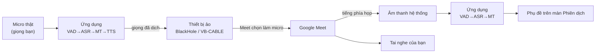

# Tích hợp Google Meet qua microphone ảo — phần đã làm rồi bỏ

> **Trạng thái: ĐÃ BỎ khỏi phạm vi đồ án, chốt 10/09/2026.** Tài liệu này không phải
> hướng dẫn sử dụng. Nó ghi lại phần tích hợp Google Meet đã **hiện thực và chạy được**,
> vì sao bỏ, và cách bật lại — đó là câu trả lời sẵn nếu hội đồng hỏi "sao không đẩy được
> tiếng dịch vào cuộc họp".
>
> Hướng dẫn dùng bản hiện tại: [`09_huong-dan-cai-dat.md`](09_huong-dan-cai-dat.md).

---

## 1. Bỏ cái gì, giữ cái gì

| Đường tín hiệu                                | Trạng thái                                    |
| --------------------------------------------- | --------------------------------------------- |
| Micro của bạn → dịch → phụ đề + đọc ra loa    | **Giữ**                                       |
| Âm thanh hệ thống → dịch → phụ đề             | **Giữ** — vẫn nghe được phía bên kia nói gì   |
| Tiếng dịch → microphone ảo → Google Meet nhận | **Bỏ** — đây là toàn bộ nội dung tài liệu này |

Nói ngắn: ứng dụng vẫn dịch được cả hai chiều của một cuộc gọi, chỉ là **bản dịch không đi
ngược vào cuộc gọi** nữa mà phát ra loa/tai nghe của bạn.

## 2. Vì sao bỏ

Thầy hướng dẫn gợi ý cân nhắc bỏ ràng buộc Google Meet ngay ở buổi họp 19/08/2026 (biên
bản mục 4.3), với lý do: kịch bản **nói liên tục trong cuộc họp** làm lộ rõ hai điểm yếu —
Whisper bịa chữ trên đoạn im lặng, và hệ thống không tìm được điểm ngắt câu hợp lý khi
người ta nói không nghỉ. Mô hình "nói — dừng — dịch" thì ổn định hơn và dễ demo hơn.

Tới 10/09/2026 thì chốt bỏ, vì hai điểm yếu đó **chưa kiểm chứng được trên giọng người
thật**: cần một bản ghi có người nói liên tục ≥ 30 giây, mà tín hiệu tổng hợp không dùng
được (Silero ngừng coi âm thanh nhân tạo là giọng nói sau ~3,5 giây). Giữ một tính năng
chưa chứng minh được là ổn định vào ngày bảo vệ thì rủi ro hơn là bỏ.

Ba lý do phụ, đáng nói nếu bị hỏi sâu:

- **Phụ thuộc driver bên thứ ba.** Người chấm phải cài BlackHole (macOS) hoặc VB-CABLE
  (Windows) rồi khởi động lại máy mới thấy được tính năng — một rào cản không liên quan gì
  tới phần AI, vốn là nội dung của đề tài.
- **Người trong cuộc họp nghe bản dịch thay cho giọng gốc của bạn**, vì micro của Meet lúc
  đó là thiết bị ảo. Đây là hành vi gây khó hiểu, và sửa cho đúng thì phải trộn hai nguồn
  bằng công cụ ngoài (Multi-Output Device trên macOS, VoiceMeeter trên Windows).
- **Không đo được.** Toàn bộ số liệu trong báo cáo dừng ở đầu ra TTS; phần truyền qua mic
  ảo vào Meet không nằm trong RTF và cũng chưa có cách đo.

## 3. Nó đã chạy thế nào

Google Meet chạy trong trình duyệt và chỉ nhận âm thanh từ **một thiết bị microphone của
hệ điều hành** — không có cách nào "đẩy" âm thanh từ ứng dụng khác vào. Nên ứng dụng phát
giọng đã dịch ra một **thiết bị âm thanh ảo**, rồi người dùng chọn đúng thiết bị đó làm
microphone trong Meet; Meet tưởng đó là một cái micro bình thường.

Phía người dùng, việc cài đặt gồm ba bước thủ công: cài driver ảo và khởi động lại máy
(`brew install --cask blackhole-2ch`, hoặc `VBCABLE_Setup_x64.exe` chạy bằng quyền quản
trị); chọn thiết bị ảo ở màn Cài đặt của ứng dụng — nó **gợi ý** theo tên (`blackhole`,
`vb-cable`, `cable input`, `voicemeeter`…) nhưng luôn để người dùng chọn tay, vì đoán sai
mà tự động chọn thì cả buổi họp không ai nghe thấy gì; và trong Meet đặt Micrô = thiết bị
ảo, Loa = tai nghe. Chọn nhầm **Loa** thành thiết bị ảo là lỗi hay gặp nhất, và triệu
chứng của nó là không nghe thấy ai cả.

Chiều incoming cố ý **không** đọc thành tiếng, chỉ hiện phụ đề: đọc bản dịch của phía kia
thì tiếng máy sẽ chồng lên tiếng người thật đang nói.

## 4. Bật lại thì làm gì

Phần hiện thực **vẫn còn nguyên trong mã nguồn**, chỉ tắt ở lớp giao diện:
`TtsPlayer.setSink` (vẫn dùng, giờ để chọn loa), `looksLikeVirtualMic`,
`uiStore.virtualMicDeviceId` và khoá tương ứng trong `StoredPreferences`.

Bật lại = dựng lại một thẻ chọn thiết bị ở màn Thiết bị âm thanh, và cho `SessionController`
ưu tiên `virtualMicDeviceId` khi gọi `setSink`.

Cách làm này áp dụng được cho mọi ứng dụng họp chọn được thiết bị micro (Zoom, Teams…),
nhưng đồ án chỉ kiểm thử với Google Meet.

> **Phần chống vòng lặp âm thanh không nằm trong nhóm bị bỏ** — nó vẫn cần thiết vì ứng
> dụng vẫn thu toàn bộ đầu ra hệ điều hành. Xem [`03` Tuần 7](03_nhat-ky-tuan-1-8.md).
