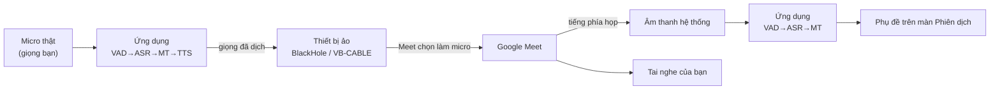

# Hướng dẫn cấu hình microphone ảo và dùng với Google Meet

Tài liệu cho **người dùng cuối** (tiêu chí nghiệm thu 17). Phần cài ứng dụng nằm ở
[`12_install-guide.md`](12_install-guide.md).

---

## 1. Vì sao phải có microphone ảo

Google Meet chạy trong trình duyệt và chỉ nhận âm thanh từ **một thiết bị microphone
của hệ điều hành**. Không có cách nào "đẩy" âm thanh từ ứng dụng khác vào Meet. Nên
ứng dụng này phát giọng đã dịch ra một **thiết bị âm thanh ảo**, rồi bạn chọn đúng
thiết bị đó làm microphone trong Meet — Meet tưởng đó là một cái micro bình thường.



Hệ quả cần biết trước: **người trong Meet nghe bản dịch, không nghe giọng gốc của
bạn** — micro của Meet lúc này là thiết bị ảo, không phải micro thật. Chiều ngược lại
thì ngược lại: giọng phía họp **không** được đọc thành tiếng, chỉ hiện phụ đề (nếu đọc
thành tiếng thì tiếng máy sẽ chồng lên tiếng người thật đang nói).

## 2. Cài thiết bị âm thanh ảo

### macOS — BlackHole 2ch

```bash
brew install --cask blackhole-2ch
```

Không dùng Homebrew thì tải installer từ trang BlackHole của Existential Audio.
**Khởi động lại máy** sau khi cài. Kiểm tra: mở **Audio MIDI Setup**, phải thấy
`BlackHole 2ch` trong danh sách thiết bị.

### Windows — VB-CABLE

Tải VB-CABLE Driver từ vb-audio.com, giải nén, chạy `VBCABLE_Setup_x64.exe` bằng
**Run as administrator**, rồi **khởi động lại máy**. Sau khi cài sẽ có hai thiết bị:

- `CABLE Input (VB-Audio Virtual Cable)` — thiết bị **phát** (ứng dụng đẩy tiếng vào).
- `CABLE Output (VB-Audio Virtual Cable)` — thiết bị **thu** (Meet chọn cái này).

## 3. Cấp quyền (chỉ macOS, lần đầu)

| Quyền            | Vì sao cần                             | Cấp ở đâu                                                                                                          |
| ---------------- | -------------------------------------- | ------------------------------------------------------------------------------------------------------------------ |
| **Microphone**   | Thu giọng của bạn                      | System Settings → Privacy & Security → Microphone                                                                  |
| **Ghi màn hình** | Thu âm thanh hệ thống (tiếng phía họp) | System Settings → Privacy & Security → Screen Recording (macOS 15 đổi tên thành "Screen & System Audio Recording") |

Quyền Ghi màn hình chỉ được hỏi ở **lần đầu bắt đầu phiên** ở chế độ Nghe hoặc Hai
chiều. Chưa cấp thì chiều nghe không chạy (chiều nói vẫn hoạt động bình thường), và
sau khi cấp phải **mở lại ứng dụng**.

Windows không cần bước này: WASAPI loopback không đòi quyền riêng.

## 4. Chọn thiết bị trong ứng dụng

Vào màn **Cài đặt**, bốn thẻ thiết bị:

| Thẻ                   | Chọn gì                                                                     |
| --------------------- | --------------------------------------------------------------------------- |
| **Microphone**        | Micro thật bạn đang nói vào.                                                |
| **Âm thanh hệ thống** | Nguồn tiếng phía họp — lấy loopback toàn hệ thống, không cần chọn từng app. |
| **Loa / Tai nghe**    | **Tai nghe** (xem mục 6 về vòng lặp âm thanh).                              |
| **Microphone ảo**     | `BlackHole 2ch` (macOS) hoặc `CABLE Input` (Windows).                       |

Ứng dụng **gợi ý** thiết bị ảo bằng cách đoán theo tên (`blackhole`, `vb-cable`,
`cable input`, `voicemeeter`…), nhưng luôn để bạn chọn tay — đoán sai mà tự động chọn
thì cả buổi họp không ai nghe thấy gì.

## 5. Cấu hình Google Meet

Trong cuộc họp: **⋮ → Cài đặt → Âm thanh**

| Mục       | Chọn                                               |
| --------- | -------------------------------------------------- |
| **Micrô** | `BlackHole 2ch` (macOS) / `CABLE Output` (Windows) |
| **Loa**   | Tai nghe của bạn — **không** chọn thiết bị ảo      |

Chọn nhầm loa thành thiết bị ảo là lỗi hay gặp nhất: bạn sẽ không nghe thấy ai cả.

## 6. Tránh vòng lặp âm thanh

Ứng dụng thu **toàn bộ** đầu ra của hệ điều hành để lấy tiếng phía họp. Nếu bạn phát
tiếng ra **loa ngoài**, chính bản dịch của mình sẽ bị thu lại, dịch tiếp, đọc tiếp —
vòng lặp không có điểm dừng.

- **Cách chắc chắn: đeo tai nghe.** Màn Cài đặt có mục "Kiểm tra vòng lặp âm thanh" và
  sẽ cảnh báo khi đầu ra đang là loa.
- Ứng dụng còn tự **bỏ các khung âm thanh hệ thống thu được trong lúc TTS đang phát**,
  và hiện "Tạm ngưng thu (đang phát bản dịch)" để bạn biết vì sao phụ đề phía kia
  khựng lại một nhịp. Đây là lưới an toàn cho lúc quên, không thay được tai nghe.

## 7. Một buổi họp diễn ra thế nào

1. **Trước khi vào họp:** mở ứng dụng → màn **Quản lý model** → **Khởi động model**.
   Model nạp mất hàng chục giây; làm trước thì câu đầu tiên không phải chờ.
2. Màn **Phiên dịch**: chọn cặp ngôn ngữ (ngôn ngữ của bạn ↔ ngôn ngữ cuộc họp) và
   chế độ:
   - **Nghe** — chỉ dịch giọng phía họp thành phụ đề.
   - **Nói** — chỉ dịch giọng bạn và đọc vào micro ảo.
   - **Hai chiều** — cả hai cùng lúc.
3. Bấm **Bắt đầu**.
4. Muốn nói: **nhấn giữ** nút "Nhấn giữ để nói", nói xong thì **nhả** — nhả nút mới
   chốt câu và bắt đầu dịch. Không giữ nút thì micro bị chặn hoàn toàn.
5. **Tắt tiếng** khi cần: bỏ luôn câu đang nói dở và cắt ngang bản dịch đang đọc.
6. Kết thúc: **Dừng**. Nội dung phiên nằm ở màn **Lịch sử** (nếu chưa tắt lưu lịch sử).

## 8. Kiểm tra nhanh trước khi họp

- [ ] Đeo tai nghe.
- [ ] Model đã nạp (badge ở màn Quản lý model báo sẵn sàng).
- [ ] Màn Cài đặt: đủ bốn thiết bị, "Microphone ảo" đúng thiết bị vừa cài.
- [ ] Meet: Micrô = thiết bị ảo, Loa = tai nghe.
- [ ] Nói thử một câu ở chế độ **Nói**, nhìn phụ đề cột "ME" và nhờ người kia xác nhận
      có nghe thấy bản dịch không.

## 9. Xử lý sự cố

| Hiện tượng                                      | Nguyên nhân thường gặp                                                                |
| ----------------------------------------------- | ------------------------------------------------------------------------------------- |
| Người trong Meet không nghe thấy gì             | Meet chưa chọn thiết bị ảo làm micro; hoặc ứng dụng chưa chọn micro ảo ở màn Cài đặt. |
| Bạn không nghe thấy ai trong Meet               | Loa trong Meet đang trỏ vào thiết bị ảo — đổi về tai nghe.                            |
| Không có phụ đề của phía họp                    | Chưa cấp quyền Ghi màn hình (macOS), hoặc đang ở chế độ **Nói**.                      |
| Tiếng vọng, dịch đi dịch lại một câu            | Đang phát ra loa ngoài — đeo tai nghe.                                                |
| Phụ đề phía họp khựng mỗi khi bản dịch đang đọc | Đúng như thiết kế (chống vòng lặp), không phải lỗi.                                   |
| Giọng bạn không được dịch                       | Chưa giữ nút "Nhấn giữ để nói", hoặc đang bật Tắt tiếng.                              |
| Câu đầu tiên chờ rất lâu                        | Model đang được nạp — lần sau bấm **Khởi động model** trước.                          |
| Không thấy thiết bị ảo trong danh sách          | Chưa khởi động lại máy sau khi cài driver.                                            |

## 10. Hạn chế đã biết

- Người trong Meet nghe **bản dịch**, không nghe giọng gốc của bạn. Muốn họ nghe cả
  hai thì phải trộn hai nguồn bằng công cụ ngoài (Multi-Output Device trên macOS,
  VoiceMeeter trên Windows) — ngoài phạm vi đồ án.
- Giọng phía họp chỉ có phụ đề, không đọc thành tiếng (cố ý, xem mục 1).
- Nút nói là **giữ chuột**, chưa có phím tắt toàn cục.
- Cách làm này áp dụng được cho mọi ứng dụng họp chọn được thiết bị micro (Zoom, Teams…),
  nhưng đồ án chỉ kiểm thử với Google Meet.
