<!-- markdownlint-disable MD025 MD036 MD052 -->
<!-- Đồ án tốt nghiệp. Cấu trúc theo biểu mẫu của CITD (docs/word/BieuMau.docx, kèm
     thông báo nộp báo cáo HK III 2025-2026), cách trình bày theo Phụ lục 2 "Hình thức
     trình bày khóa luận tốt nghiệp" của Phòng Đào tạo Đại học UIT (bản 03/2024).
     Xuất Word: make docx-khoa-luan → docs/word/24410300_NgoManhHung_DATN.docx; tên tệp
     theo cấu trúc MSSV_HoTen_DATN mà thông báo quy định. Form của ngành nhận hai tệp
     Word + PDF, chỉ nộp được một lần, hạn 27/09/2026.
     [CHÈN HÌNH] là ảnh chụp màn hình phải chụp từ ứng dụng rồi đặt vào
     docs/gvhd/khoa-luan-hinh/. Trích dẫn [n] trỏ tới danh mục cuối tài liệu, xếp theo
     alphabet tác giả. -->

<!-- trang: bìa chính -->

**ĐẠI HỌC QUỐC GIA TP. HỒ CHÍ MINH**

**TRƯỜNG ĐẠI HỌC CÔNG NGHỆ THÔNG TIN**

**KHOA KHOA HỌC VÀ KỸ THUẬT THÔNG TIN**

&nbsp;

**NGÔ MẠNH HÙNG**

&nbsp;

**ĐỒ ÁN TỐT NGHIỆP**

**XÂY DỰNG HỆ THỐNG DỊCH GIỌNG NÓI ĐA NGÔN NGỮ GẦN THỜI GIAN THỰC SỬ DỤNG MÔ HÌNH AI
CHẠY CỤC BỘ**

**A Near Real-Time Speech Translation System Using Locally Hosted AI Models**

&nbsp;

**CỬ NHÂN NGÀNH CÔNG NGHỆ THÔNG TIN**

&nbsp;

**TP. HỒ CHÍ MINH, 2026**

<!-- trang: bìa phụ -->

**ĐẠI HỌC QUỐC GIA TP. HỒ CHÍ MINH**

**TRƯỜNG ĐẠI HỌC CÔNG NGHỆ THÔNG TIN**

**KHOA KHOA HỌC VÀ KỸ THUẬT THÔNG TIN**

&nbsp;

**NGÔ MẠNH HÙNG – 24410300**

&nbsp;

**ĐỒ ÁN TỐT NGHIỆP**

**XÂY DỰNG HỆ THỐNG DỊCH GIỌNG NÓI ĐA NGÔN NGỮ GẦN THỜI GIAN THỰC SỬ DỤNG MÔ HÌNH AI
CHẠY CỤC BỘ**

**A Near Real-Time Speech Translation System Using Locally Hosted AI Models**

&nbsp;

**CỬ NHÂN NGÀNH CÔNG NGHỆ THÔNG TIN**

&nbsp;

**GIẢNG VIÊN HƯỚNG DẪN**

**ThS. NGUYỄN THÀNH LUÂN**

&nbsp;

**TP. HỒ CHÍ MINH, 2026**

<!-- trang: không đánh số -->

# THÔNG TIN HỘI ĐỒNG CHẤM ĐỒ ÁN TỐT NGHIỆP

Hội đồng chấm đồ án tốt nghiệp, thành lập theo Quyết định số ……………………
ngày ………………….. của Hiệu trưởng Trường Đại học Công nghệ Thông tin.

# LỜI CẢM ƠN

Em xin cảm ơn ThS. Nguyễn Thành Luân đã hướng dẫn em trong suốt quá trình làm đồ án.
Buổi làm việc ngày 19/08/2026 là chỗ rẽ của đề tài: thầy yêu cầu đo bằng bộ dữ liệu
chuẩn với WER, BLEU, COMET và RTF thay vì bộ câu tự dựng, và chính yêu cầu đó dẫn tới
toàn bộ Chương 4. Thầy cũng là người đã cùng em cân nhắc và quyết định thu hẹp phạm vi
phần tích hợp Google Meet để tập trung vào chất lượng dịch.

Em xin cảm ơn quý thầy cô Trường Đại học Công nghệ Thông tin đã dạy em trong những năm
vừa qua. Em cảm ơn gia đình và bạn bè đã ủng hộ em trong thời gian làm đồ án.

Đồ án còn nhiều chỗ chưa trọn vẹn, em mong nhận được góp ý của quý thầy cô.

_Thành phố Hồ Chí Minh, tháng 9 năm 2026_

Sinh viên

**Ngô Mạnh Hùng**

<!-- mục lục sinh tự động khi xuất Word -->

# DANH MỤC HÌNH

<!-- danh-muc: hinh — Word dựng từ các chú thích "Hình x.y:", kèm số trang -->

# DANH MỤC BẢNG

<!-- danh-muc: bang — Word dựng từ các chú thích "Bảng x.y:", kèm số trang -->

# DANH MỤC TỪ VIẾT TẮT

| Viết tắt | Tiếng Anh                                                           | Nghĩa                                                |
| -------- | ------------------------------------------------------------------- | ---------------------------------------------------- |
| API      | Application Programming Interface                                   | Giao diện lập trình ứng dụng                         |
| ASR      | Automatic Speech Recognition                                        | Nhận dạng tiếng nói                                  |
| CER      | Character Error Rate                                                | Tỷ lệ lỗi ký tự                                      |
| COMET    | Crosslingual Optimized Metric for Evaluation of Translation         | Độ đo dịch máy dựa trên mô hình neural               |
| FLEURS   | Few-shot Learning Evaluation of Universal Representations of Speech | Bộ dữ liệu giọng đọc đa ngôn ngữ                     |
| G2P      | Grapheme-to-Phoneme                                                 | Chuyển chữ viết thành âm vị                          |
| MT       | Machine Translation                                                 | Dịch máy                                             |
| NLLB     | No Language Left Behind                                             | Họ mô hình dịch máy đa ngôn ngữ của Meta             |
| PCM      | Pulse-Code Modulation                                               | Âm thanh số không nén                                |
| PTT      | Push-to-talk                                                        | Giữ phím để nói                                      |
| REST     | Representational State Transfer                                     | Kiểu API theo tài nguyên qua HTTP                    |
| RSS      | Resident Set Size                                                   | Bộ nhớ thực tế tiến trình đang chiếm                 |
| RTF      | Real-Time Factor                                                    | Hệ số thời gian thực                                 |
| spBLEU   | SentencePiece BLEU                                                  | BLEU tính trên cách tách từ SentencePiece dùng chung |
| TTS      | Text-to-Speech                                                      | Tổng hợp tiếng nói                                   |
| VAD      | Voice Activity Detection                                            | Phát hiện đoạn có giọng nói                          |
| WER      | Word Error Rate                                                     | Tỷ lệ lỗi từ                                         |
| WS       | WebSocket                                                           | Kênh truyền hai chiều liên tục                       |

<!-- trang: bắt đầu đánh số -->

# TÓM TẮT ĐỒ ÁN

Các giải pháp dịch giọng nói trong cuộc họp trực tuyến hiện nay phần lớn chạy trên đám
mây: chúng đòi hỏi kết nối Internet ổn định, phát sinh chi phí theo lượt dùng, và đưa
nội dung hội thoại ra khỏi máy người dùng. Đồ án xây dựng một ứng dụng desktop dịch
giọng nói gần thời gian thực chạy hoàn toàn trên máy tính cá nhân, không gọi dịch vụ đám
mây nào trong lúc dịch. Ứng dụng dịch hai chiều giữa tiếng Việt với tiếng Anh, tiếng Nhật
và tiếng Trung giản thể, cho cả giọng người dùng qua microphone lẫn âm thanh đang phát
trên máy — tức là phía bên kia của một cuộc gọi. Hệ thống chạy trên Windows 11 và macOS
trên chip Apple Silicon, và được đóng gói thành bộ cài tự chứa.

**Hướng tiếp cận.** Đồ án chọn cách dịch theo chuỗi thay vì dùng một mô hình đầu-cuối:
Silero VAD tách câu, Whisper nhận dạng tiếng nói, NLLB-200 distilled 600M dịch văn bản,
sherpa-onnx và Kokoro tổng hợp giọng nói. Cách này cho phép đo lỗi của từng khâu riêng và
thay từng khâu độc lập. Hệ thống gồm hai tiến trình giao tiếp qua `127.0.0.1`: một ứng
dụng Electron lo giao diện và thu âm, và một dịch vụ Python chạy các mô hình. Cả hai theo
kiến trúc lục giác (Ports & Adapters); nhờ đó khâu nhận dạng có ba runtime thay thế được
cho nhau — whisper.cpp, MLX và faster-whisper — và việc thêm hai runtime sau không phải
sửa một dòng nào của chuỗi xử lý.

**Cách giải quyết các vấn đề chính.** Để người dùng không phải chờ khi người nói không
ngắt nghỉ, bộ tách câu dùng hai ngưỡng im lặng và một trần độ dài, cắt ở khung yên nhất
thay vì cắt ngang một từ. Để bản dịch đọc ra loa không bị thu ngược vào chiều nghe và dịch
lại mãi, khung âm thanh hệ thống thu trong lúc đang phát bản dịch bị bỏ. Để ứng dụng mở
trong chưa tới một giây thay vì 45 giây, mô hình chỉ được nạp khi thật sự cần. Để chạy
được trên GPU của mọi hãng ở Windows mà không đóng gói CUDA nặng hơn 1 GB, whisper.cpp
được dựng với Vulkan.

**Kết quả.** Hệ thống được đánh giá trên bộ dữ liệu công khai FLEURS. Nhận dạng 3.099 bản
thu trên bốn ngôn ngữ cho WER tiếng Việt 8,8–10,4% tùy runtime, tiếng Anh 4,8–5,0%, và CER
tiếng Trung, tiếng Nhật dưới 9%. Dịch 2.022 cặp câu trên sáu chiều cho COMET từ 0,77 đến
0,85. Trên cấu hình Windows có GPU rời, cả sáu chiều đạt ngưỡng RTF p90 ≤ 0,5; hệ thống
chạy liên tục 60 phút qua 877 câu mà không lỗi nào, bộ nhớ chỉ tăng 12 MB. Đo thêm trên
giọng người nói tự phát cho thấy WER tiếng Việt tăng từ 10,4% lên 24,6% so với giọng đọc
cùng mô hình — phần lớn do thuật ngữ tiếng Anh được đọc theo giọng Việt — và làm lộ ra hai
lỗi của khâu dịch mà dữ liệu giọng đọc không bắt được.

**Từ khóa:** dịch giọng nói, nhận dạng tiếng nói, dịch máy, Whisper, NLLB-200, xử lý cục
bộ, kiến trúc lục giác.

---

# Chương 1. TỔNG QUAN

## 1.1. Lý do chọn đề tài

Làm việc và học tập trực tuyến giờ là chuyện thường ngày, và cùng với nó là nhu cầu nói
chuyện với người không dùng chung ngôn ngữ qua Google Meet, Microsoft Teams hay Zoom. Với
người Việt, các ngôn ngữ đối tác hay gặp nhất là tiếng Anh, tiếng Nhật và tiếng Trung —
ba thị trường chiếm phần lớn các dự án gia công phần mềm, du học và hợp tác doanh nghiệp.

Các công cụ dịch giọng nói có sẵn hiện nay gần như đều chạy trên đám mây. Cách làm đó
kéo theo ba vấn đề. Thứ nhất, cuộc họp phụ thuộc hoàn toàn vào đường truyền: mạng chập
chờn thì bản dịch trễ hoặc mất. Thứ hai, chi phí tính theo thời lượng hoặc theo gói thuê
bao, và nhiều tính năng chỉ có ở gói trả phí. Thứ ba — quan trọng nhất với cuộc họp nội
bộ — toàn bộ âm thanh của cuộc họp phải được gửi tới máy chủ của bên thứ ba.

Trong khi đó, các mô hình AI mã nguồn mở cho từng khâu của bài toán đã đủ tốt và đủ nhẹ để
chạy trên máy tính cá nhân. Whisper nhận dạng tiếng nói gần 100 ngôn ngữ [19]; NLLB-200
dịch trực tiếp giữa 200 ngôn ngữ [4]; sherpa-onnx tổng hợp giọng nói hoàn toàn offline
[12]. Máy tính phổ thông cũng đã có GPU đủ mạnh — kể cả GPU tích hợp của chip Apple
Silicon. Câu hỏi còn lại vì vậy không nằm ở mô hình, mà ở kỹ thuật hệ thống: ghép các mô
hình đó thành một ứng dụng dùng được thật, đủ nhanh để theo kịp người nói, trên phần cứng
phổ thông, ở cả hai hệ điều hành chính. Đó là lý do đồ án chọn đề tài này.

## 1.2. Mục tiêu

**Mục tiêu tổng quát:** thiết kế và phát triển một ứng dụng demo dịch giọng nói gần thời
gian thực, chạy trên máy tính cá nhân, hỗ trợ giao tiếp hai chiều trong cuộc họp trực
tuyến mà không dùng dịch vụ đám mây trong quá trình dịch.

**Mục tiêu cụ thể:**

- Thiết kế và hiện thực chuỗi xử lý phát hiện giọng nói → nhận dạng → dịch → tổng hợp
  giọng nói, trong đó mỗi khâu thay được mô hình hoặc runtime mà không ảnh hưởng các khâu
  còn lại.
- Thu đồng thời microphone và âm thanh hệ thống, tách bạch hai nguồn, và ngăn bản dịch
  quay vòng trở lại chuỗi nhận dạng.
- Hỗ trợ sáu chiều dịch: Việt ↔ Anh, Việt ↔ Nhật, Việt ↔ Trung giản thể.
- Xây dựng ứng dụng desktop chạy trên Windows và macOS, có giao diện cấu hình thiết bị,
  điều khiển phiên dịch và phụ đề song ngữ, đóng gói thành bộ cài.
- Đánh giá độ chính xác của từng khâu và độ trễ của cả chuỗi bằng các độ đo chuẩn, trên
  dữ liệu công khai và trên giọng người thật.

"Gần thời gian thực" trong đồ án được hiểu là **xử lý theo từng đoạn phát ngôn**: hệ
thống chờ người nói dứt câu hoặc ngắt nghỉ rồi mới dịch cả đoạn đó. Đồ án không đặt
mục tiêu dịch đồng thời theo từng từ trong lúc người dùng vẫn đang nói.

## 1.3. Đối tượng và phạm vi nghiên cứu

### 1.3.1. Đối tượng nghiên cứu

- Các mô hình nhận dạng tiếng nói đa ngôn ngữ, tập trung vào họ Whisper và ba runtime
  whisper.cpp, MLX, faster-whisper.
- Mô hình dịch máy đa ngôn ngữ chạy cục bộ NLLB-200 distilled 600M.
- Các mô hình tổng hợp giọng nói offline chạy trên sherpa-onnx, và Kokoro cho tiếng Nhật.
- Kỹ thuật phát hiện giọng nói, tách câu (endpointing) và xử lý luồng âm thanh.
- Cơ chế thu âm thanh hệ thống trên Windows và macOS.
- Các độ đo đánh giá nhận dạng tiếng nói, dịch máy và độ trễ của hệ thống.

### 1.3.2. Phạm vi nghiên cứu

- **Hệ điều hành:** Windows 11 x64; macOS 13 trở lên trên Apple Silicon.
- **Ngôn ngữ:** tiếng Việt, tiếng Anh, tiếng Nhật, tiếng Trung giản thể; bắt buộc sáu chiều
  dịch giữa tiếng Việt và ba ngôn ngữ còn lại.
- **Nguồn âm thanh:** microphone vật lý và âm thanh hệ thống.
- **Đầu ra:** phụ đề song ngữ và giọng nói tổng hợp phát ra loa hoặc tai nghe.
- Toàn bộ nhận dạng, dịch và tổng hợp giọng nói chạy cục bộ sau khi mô hình đã được tải về.
- Đồ án **không** nghiên cứu mô hình AI mới, không làm nhân bản giọng nói, không xử lý
  nhiều người nói chồng lên nhau, không làm ứng dụng di động hay web.

### 1.3.3. Điều chỉnh phạm vi so với đề cương

Đề cương ban đầu có thêm một hạng mục: đưa giọng nói đã dịch vào Google Meet thông qua một
thiết bị microphone ảo (VB-CABLE trên Windows, BlackHole trên macOS), để người ở phía bên
kia cuộc họp nghe được bản dịch. **Hạng mục này đã được bỏ khỏi phạm vi nghiệm thu ngày
10/09/2026**, sau khi thống nhất với giảng viên hướng dẫn (Bảng 1.1).

Bảng 1.1: Điều chỉnh phạm vi so với đề cương

| Đề cương ghi                                                         | Thực tế chốt lại                                            |
| -------------------------------------------------------------------- | ----------------------------------------------------------- |
| Truyền âm thanh dịch ra VB-CABLE / BlackHole để Google Meet nhận     | **Bỏ.** Bản dịch phát ra loa hoặc tai nghe của người dùng   |
| Kiểm thử các luồng chính với Google Meet                             | **Bỏ.** Đo trên FLEURS và trên bản ghi giọng người thật     |
| Thu microphone và âm thanh hệ thống, phụ đề song ngữ, sáu chiều dịch | **Giữ nguyên** — vẫn dịch được cả hai phía của một cuộc gọi |

Phần này đã được hiện thực và chạy được trước khi bỏ; mã nguồn còn nguyên, chỉ tắt ở lớp
giao diện. Vì vậy đây là **thu hẹp phạm vi nghiệm thu**, không phải một hạng mục bỏ dở. Lý
do chi tiết, cách nó đã hoạt động và việc cần làm để bật lại được trình bày ở mục 3.9.

## 1.4. Tình hình nghiên cứu và các giải pháp liên quan

### 1.4.1. Dịch vụ thương mại trên đám mây

Tháng 5/2025, Google công bố tính năng dịch giọng nói trực tiếp trong Google Meet dựa trên
mô hình Gemini [7]. Tính năng này dịch lời người nói rồi phát lại bằng giọng tổng hợp mô
phỏng giọng gốc, và đây là hướng mà đề tài muốn đạt tới. Nhưng nó chạy hoàn toàn trên
máy chủ của Google, chỉ dành cho gói thuê bao trả phí, và lúc ra mắt chỉ hỗ trợ cặp Anh –
Tây Ban Nha — không có tiếng Việt. Microsoft Teams và Zoom cũng có phụ đề dịch trực tiếp,
đều chạy trên đám mây và đều gắn với gói trả phí.

Điểm chung của nhóm này: chất lượng cao nhờ mô hình lớn, nhưng không đáp ứng được bất kỳ
điều kiện nào trong ba điều kiện ở mục 1.1 — không cần mạng, không tốn phí theo lượt dùng,
và không đưa âm thanh ra khỏi máy.

### 1.4.2. Mô hình dịch giọng nói đầu-cuối

SeamlessM4T [23] của Meta là một mô hình duy nhất làm được nhận dạng, dịch giọng nói sang
văn bản và dịch giọng nói sang giọng nói cho khoảng 100 ngôn ngữ. Cách tiếp cận đầu-cuối
tránh được lỗi cộng dồn giữa các khâu và chạy được cục bộ. Đổi lại, cả hệ thống đứng hay
ngã cùng một mô hình: không thay được riêng phần nghe khi có runtime nhanh hơn cho phần cứng
đang có, và khi kết quả sai thì không biết lỗi nằm ở phần nghe hay phần dịch. Đề tài chọn
hướng chuỗi (mục 2.1) chính vì hai lý do này.

### 1.4.3. Nhận dạng tiếng nói thời gian thực bằng Whisper

Whisper được thiết kế để xử lý từng đoạn âm thanh 30 giây, không phải luồng liên tục.
Macháček và cộng sự [13] đề xuất whisper_streaming: chạy lại Whisper trên một bộ đệm trượt
và chỉ xác nhận phần văn bản ổn định giữa hai lần chạy liên tiếp, đạt độ trễ khoảng 3,3
giây. Cách này cho phụ đề chạy theo lời nói, nhưng phần văn bản đầu ra thay đổi liên tục
trước khi ổn định — không phù hợp để đưa thẳng vào dịch máy, vì mỗi lần văn bản đổi lại
phải dịch lại. Đề tài chọn cách đơn giản hơn: tách câu trước bằng VAD, rồi mới nhận dạng
và dịch từng câu đã chốt.

### 1.4.4. Ứng dụng chạy cục bộ

**TranscriptionSuite** [10] là ứng dụng ghi chép giọng nói chạy hoàn toàn cục bộ, gồm giao
diện Electron và phần mô hình viết bằng Python. Đề tài tham khảo cách tách hai tiến trình
này và mượn ý tưởng dựng whisper.cpp với Vulkan để chạy được trên GPU của mọi hãng thay vì
đóng gói CUDA (mục 3.10.2). TranscriptionSuite chỉ ghi chép: không dịch, không tổng hợp
giọng nói và không có luồng hai chiều.

**LocalVocal** [22] là plugin cho phần mềm phát trực tiếp OBS, nhận dạng tiếng nói bằng
whisper.cpp và dịch bằng CTranslate2, chạy cục bộ trên Windows, macOS và Linux. Nó gần với
đề tài nhất về mặt kỹ thuật, nhưng phục vụ người phát trực tiếp: đầu ra là phụ đề đè lên
video, không có tổng hợp giọng nói, không thu âm thanh của một cuộc gọi, và không phải một
ứng dụng độc lập.

### 1.4.5. Vấn đề còn tồn tại và hướng của đề tài

Bảng 1.2: So sánh các giải pháp liên quan

| Tiêu chí                    | Google Meet [7] | SeamlessM4T [23] | TranscriptionSuite [10] | LocalVocal [22] | **Đề tài** |
| --------------------------- | :-------------: | :--------------: | :---------------------: | :-------------: | :--------: |
| Chạy cục bộ, không cần mạng |      Không      |        Có        |           Có            |       Có        |   **Có**   |
| Có tiếng Việt               |      Không      |        Có        |           Có            |       Có        |   **Có**   |
| Dịch                        |       Có        |        Có        |          Không          |       Có        |   **Có**   |
| Tổng hợp giọng nói          |       Có        |        Có        |          Không          |      Không      |   **Có**   |
| Thu âm thanh cuộc gọi       |       Có        |      Không       |          Không          |      Không      |   **Có**   |
| Ứng dụng desktop độc lập    |      Không      |      Không       |           Có            |      Không      |   **Có**   |
| Đo được lỗi từng khâu       |      Không      |      Không       |            —            |      Không      |   **Có**   |

Chưa có giải pháp nào vừa chạy hoàn toàn cục bộ, vừa có tiếng Việt, vừa đủ cả bốn khâu
thu – nghe – dịch – đọc cho cả hai phía của một cuộc gọi. Đề tài lấp chỗ trống đó, và
không đặt mục tiêu vượt các dịch vụ đám mây về chất lượng — mô hình của họ lớn hơn nhiều
bậc — mà đặt mục tiêu **đủ dùng** trên phần cứng phổ thông, với con số đo được cho từng
khâu để biết "đủ dùng" nghĩa là bao nhiêu.

## 1.5. Phương pháp thực hiện

- **Khảo sát và chọn công nghệ** cho từng khâu dựa trên ba tiêu chí: chạy được cục bộ trên
  cả hai hệ điều hành, bao phủ đủ bốn ngôn ngữ, và có đường đóng gói vào bộ cài.
- **Phát triển lặp theo tuần**, mỗi tuần một khâu của chuỗi xử lý (Tuần 1–8 theo kế hoạch
  của đề cương), mỗi khâu được kiểm chứng bằng mô hình thật trước khi sang khâu sau.
- **Đo trên dữ liệu công khai** (FLEURS) để có con số tái lập được và so được với số công
  bố của các mô hình; **đo thêm trên giọng người thật** để biết con số trên dữ liệu công khai
  lạc quan tới đâu.
- **Ghi lại mọi kết quả đo** dưới dạng tệp JSON cùng mã nguồn, để mọi con số trong đồ án
  đều kiểm lại được.

## 1.6. Kết quả đạt được

- Một ứng dụng desktop chạy được trên Windows 11 và macOS Apple Silicon, đóng gói thành bộ
  cài tự chứa (`.exe` 371 MB, `.dmg` 592 MB): máy người dùng không cần cài Python, Node
  hay trình quản lý gói nào.
- Chuỗi xử lý bốn khâu cho sáu chiều dịch, ba runtime nhận dạng thay thế được cho nhau, ba
  mức cấu hình Nhanh / Cân bằng / Chất lượng.
- Bộ đánh giá tái lập được trên FLEURS cho cả nhận dạng (WER/CER), dịch (spBLEU, chrF++,
  COMET) và độ trễ (RTF), cùng bài chạy liên tục 60 phút.
- Một phép đo trên giọng người nói tự phát, định lượng được khoảng cách giữa giọng đọc và
  giọng nói thật.
- Các chức năng ngoài đề cương: lịch sử phiên dịch, nhập tệp âm thanh/video, duyệt bản dịch
  trước khi đọc, màn hình đánh giá trong ứng dụng, tách người nói cho tệp nhập.

## 1.7. Cấu trúc đồ án

- **Chương 1 — Tổng quan:** lý do chọn đề tài, mục tiêu, phạm vi và các giải pháp liên quan.
- **Chương 2 — Cơ sở lý thuyết:** lý thuyết của từng khâu, các độ đo đánh giá, kiến trúc và
  công nghệ sử dụng.
- **Chương 3 — Phân tích, thiết kế và hiện thực hệ thống:** yêu cầu, thiết kế kiến trúc,
  luồng xử lý, dữ liệu, giao tiếp; hiện thực hai tiến trình; đóng gói và kiểm thử.
- **Chương 4 — Thử nghiệm và đánh giá:** môi trường, dữ liệu, kết quả của từng khâu, độ trễ,
  độ ổn định, đánh giá trên giọng người thật và thảo luận.
- **Chương 5 — Kết luận và hướng phát triển.**

Hình 1.1 tóm tắt chuỗi xử lý mà các chương sau lần lượt đi vào chi tiết.

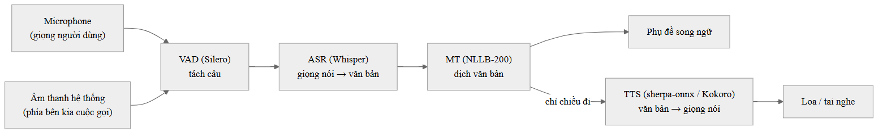

Hình 1.1: Chuỗi xử lý dịch giọng nói của hệ thống

---

# Chương 2. CƠ SỞ LÝ THUYẾT

## 2.1. Dịch giọng nói theo chuỗi

Có hai cách tiếp cận dịch giọng nói. Cách **đầu-cuối** dùng một mô hình duy nhất đi thẳng
từ âm thanh ngôn ngữ nguồn sang văn bản hoặc âm thanh ngôn ngữ đích. Cách **chuỗi**
(cascade) ghép các mô hình chuyên biệt nối tiếp nhau: nhận dạng tiếng nói, dịch văn bản,
rồi tổng hợp giọng nói.

Đồ án chọn cách chuỗi vì ba lý do. Thứ nhất, mỗi khâu có sẵn mô hình mã nguồn mở chất
lượng tốt, chạy được cục bộ và bao phủ đủ bốn ngôn ngữ. Thứ hai, cách chuỗi cho phép **đo
lỗi của từng khâu riêng**: khi bản dịch sai, biết được là do nghe nhầm hay dịch nhầm —
đúng yêu cầu "tách bạch lỗi của từng khối" mà giảng viên hướng dẫn đặt ra ở buổi họp ngày
19/08/2026. Thứ ba, từng khâu thay được độc lập: đổi runtime nhận dạng cho hợp với phần
cứng không đụng tới khâu dịch.

Cách chuỗi có hai cái giá. **Lỗi cộng dồn**: một từ bị nghe nhầm được khâu dịch coi như từ
đúng và dịch luôn cái sai đó. **Độ trễ cộng dồn**: bốn khâu chạy nối tiếp nên tổng thời
gian là tổng của cả bốn. Cả hai được đo cụ thể ở Chương 4.

Khác với văn bản, lời nói không có dấu chấm câu. Một chuỗi xử lý cho lời nói liên tục vì
vậy cần thêm một khâu ở đầu: quyết định **đâu là một câu** để đưa đi dịch. Khâu đó là phát
hiện giọng nói (mục 2.3).

## 2.2. Âm thanh số

Âm thanh thu từ microphone là một chuỗi mẫu biên độ lấy đều theo thời gian. Hai tham số
quyết định dạng dữ liệu: **tần số lấy mẫu** (số mẫu mỗi giây) và **độ sâu bit** (số bit
biểu diễn một mẫu). Toàn bộ chuỗi xử lý của đề tài dùng một định dạng duy nhất: **PCM
16-bit có dấu, một kênh, 16 kHz** — tức 32.000 byte mỗi giây. Whisper và Silero VAD đều
được huấn luyện trên định dạng này, nên chuẩn hóa một lần ở đầu vào giúp các khâu sau không
phải tự chuyển đổi.

Tần số 16 kHz đủ cho tiếng nói vì theo định lý lấy mẫu Nyquist–Shannon, nó biểu diễn được
tần số tới 8 kHz, đã bao trùm dải tần quan trọng của giọng người. Âm thanh hệ thống thường
phát ở 44,1 hoặc 48 kHz hai kênh, nên phải được lấy mẫu lại và trộn về một kênh trước khi
đưa vào chuỗi.

Whisper không nhận trực tiếp sóng âm mà nhận **phổ log-Mel**: âm thanh được chia thành các
khung ngắn chồng lấn, mỗi khung chuyển sang miền tần số bằng biến đổi Fourier, gom theo
thang Mel (thang tần số mô phỏng cách tai người cảm nhận cao độ), rồi lấy logarit. Kết quả
là một "ảnh" hai chiều thời gian × tần số mà encoder Transformer xử lý.

## 2.3. Phát hiện giọng nói

### 2.3.1. Silero VAD

VAD (Voice Activity Detection) quyết định đoạn âm thanh nào có giọng nói. Phương án đơn
giản nhất là so năng lượng tín hiệu với một ngưỡng — cách của WebRTC VAD — nhưng cách đó dễ
coi tiếng quạt, tiếng gõ phím hay nhạc nền là giọng nói.

Silero VAD [24] là một mạng neural nhỏ chạy trên từng cửa sổ 512 mẫu (32 ms ở 16 kHz), giữ
một trạng thái ẩn qua các cửa sổ liên tiếp, và trả về xác suất cửa sổ đó có giọng nói. Mô
hình nhẹ, chạy trên CPU, không phụ thuộc ngôn ngữ, và phân biệt giọng nói với tiếng ồn tốt
hơn hẳn cách dựa trên năng lượng. Vì có trạng thái ẩn, **mỗi luồng âm thanh cần một bản
trạng thái riêng** — chi tiết này quyết định một phần thiết kế ở mục 3.2.3.

### 2.3.2. Tách câu

Silero chỉ cho biết từng cửa sổ 32 ms có giọng hay không. Việc gom các cửa sổ thành một câu
và quyết định khi nào câu kết thúc gọi là **tách câu** (endpointing). Đây là thứ quyết định
người dùng phải chờ bao lâu mới thấy bản dịch, và có một mâu thuẫn cố hữu:

- Chờ khoảng lặng **ngắn** để chốt câu thì phản hồi nhanh, nhưng một câu nói chậm, có ngắt
  nghỉ giữa chừng, bị băm thành nhiều mảnh — khâu dịch nhận các mảnh rời rạc và dịch sai
  nghĩa.
- Chờ khoảng lặng **dài** thì câu trọn vẹn, nhưng người dùng phải chờ lâu; và nếu người nói
  không hề nghỉ thì câu không bao giờ được chốt.

Cách giải quyết phổ biến là thêm một trần độ dài: câu dài quá một ngưỡng thì bị cắt cứng.
Cắt cứng có rủi ro riêng — điểm cắt có thể rơi vào giữa một từ. Mục 3.7.1 trình bày cách đề
tài xử lý cả hai phía của mâu thuẫn này.

## 2.4. Nhận dạng tiếng nói — Whisper

### 2.4.1. Mô hình

Whisper [19] là họ mô hình encoder–decoder Transformer của OpenAI. Bài báo gốc huấn luyện
trên 680.000 giờ âm thanh có phụ đề thu thập từ Internet theo cách giám sát yếu — nhãn là
phụ đề có sẵn chứ không phải bản chép lại được soạn cẩn thận; các bản `large-v3` về sau được
huấn luyện trên tập lớn hơn nữa. Encoder nhận phổ log-Mel của tối đa 30 giây âm thanh;
decoder sinh từng token văn bản dựa trên đầu ra của encoder và các token đã sinh trước đó.

Whisper nhận các token đặc biệt ở đầu chuỗi để chọn ngôn ngữ và tác vụ: `transcribe` ghi lại
đúng ngôn ngữ đang nói, `translate` dịch thẳng sang tiếng Anh. Đồ án **chỉ dùng
`transcribe`**, vì `translate` chỉ ra được tiếng Anh — không ra được tiếng Việt, Nhật hay
Trung — và để việc dịch cho một khâu riêng thì đổi được mô hình dịch mà không đụng khâu
nghe.

Bản dùng trong đề tài là `large-v3` và `large-v3-turbo`. Bản turbo giữ nguyên encoder của
large-v3 nhưng giảm decoder từ 32 xuống 4 lớp. Vì decoder chạy một lần cho mỗi token sinh ra,
giảm số lớp decoder làm tốc độ giải mã tăng nhiều trong khi chất lượng giảm ít.

### 2.4.2. Hai điểm yếu đã biết

- **Bịa câu trên đoạn im lặng** (hallucination). Dữ liệu huấn luyện chứa rất nhiều phụ đề
  video, nên gặp đoạn không có giọng nói Whisper hay sinh ra những câu như "Cảm ơn các bạn
  đã theo dõi", "Hãy đăng ký kênh" hay "Subtitles by the Amara.org community". Trong một ứng
  dụng phiên dịch, câu bịa đó sẽ được dịch và đọc to lên như thể người dùng vừa nói.
- **Vòng lặp khi giải mã.** Bộ giải mã tự hồi quy có thể rơi vào trạng thái mà cụm vừa sinh
  làm tăng xác suất sinh lại chính nó, tạo ra một chuỗi lặp đi lặp lại tới khi chạm giới hạn
  độ dài.

Whisper có sẵn hai cơ chế giảm nhẹ: ngưỡng xác suất "không có tiếng nói" và giải mã lại với
nhiệt độ cao hơn khi phát hiện lặp (temperature fallback). Không cơ chế nào chặn được hết;
mục 3.7.2 trình bày lớp lọc bổ sung của đề tài.

### 2.4.3. Runtime và lượng tử hóa

Cùng một mô hình Whisper có thể chạy trên nhiều **runtime** suy luận khác nhau. Đề tài dùng
ba runtime (Bảng 2.1).

Bảng 2.1: Ba runtime nhận dạng tiếng nói

| Runtime         | Định dạng mô hình          | Tăng tốc phần cứng      | Vai trò trong đề tài                    |
| --------------- | -------------------------- | ----------------------- | --------------------------------------- |
| whisper.cpp [6] | GGML, lượng tử hóa 5–8 bit | Metal, Vulkan, CPU      | Mặc định, chạy trên cả hai hệ điều hành |
| MLX (mlx-audio) | Kho MLX đã chuyển đổi sẵn  | GPU Apple Silicon       | Bản cài macOS                           |
| faster-whisper  | CTranslate2                | CUDA (NVIDIA), CPU int8 | Tùy chọn cho Windows có card NVIDIA     |

Ba runtime **không dùng chung tệp mô hình nào**: GGML là một tệp trong kho
`ggerganov/whisper.cpp`, còn MLX và CTranslate2 là các kho riêng đã chuyển đổi sẵn. Hệ quả
cho thiết kế được trình bày ở mục 3.6, và hệ quả cho việc so sánh ở mục 4.3.

**Lượng tử hóa** (quantization) biểu diễn trọng số bằng ít bit hơn — `q5_0` dùng 5 bit mỗi
trọng số thay vì 16 bit của `float16` — để giảm bộ nhớ và tăng tốc độ, đổi lại một phần độ
chính xác. Mức giảm đó cụ thể là bao nhiêu với tiếng Việt là một trong các câu hỏi Chương 4
trả lời bằng số đo.

**Vulkan** là API đồ họa và tính toán đa nền tảng, có sẵn trong driver của NVIDIA, AMD và
Intel. whisper.cpp dựng với backend Vulkan chạy được trên GPU của cả ba hãng mà không cần bộ
công cụ riêng của hãng nào — khác với CUDA, vốn chỉ chạy trên card NVIDIA và nặng thêm hơn
1 GB khi đóng gói.

## 2.5. Dịch máy — NLLB-200

NLLB-200 [4] là mô hình dịch máy đa ngôn ngữ của Meta, dịch trực tiếp giữa 200 ngôn ngữ bất
kỳ mà không đi qua tiếng Anh làm trung gian. Mô hình có kiến trúc encoder–decoder
Transformer; bản đầy đủ 54 tỷ tham số dùng Mixture-of-Experts, và Meta phát hành kèm các bản
chưng cất (distilled) nhỏ hơn. Đề tài dùng bản **distilled 600M** — bản nhỏ nhất, chạy được
trên CPU và nạp được vào GPU phổ thông.

Ngôn ngữ nguồn được khai báo bằng một token ở đầu câu vào; ngôn ngữ đích được chỉ định bằng
cách **ép token đầu tiên của decoder** là mã ngôn ngữ đó. Bốn mã dùng trong đề tài là
`vie_Latn`, `eng_Latn`, `jpn_Jpan` và `zho_Hans`.

Bản dịch được sinh theo kiểu tự hồi quy giống decoder của Whisper, nên cũng có thể rơi vào
vòng lặp. Thư viện transformers có sẵn cách chặn — cấm lặp lại một n-gram hoặc phạt token đã
xuất hiện — nhưng các cách đó không bật mặc định. Mục 4.7.3 cho thấy đây là một điểm yếu thật
khi dịch lời nói tự phát.

Hai hạn chế được ghi nhận từ đầu: giấy phép CC-BY-NC-4.0 [14] chỉ cho phép dùng phi thương
mại, và mô hình được huấn luyện trên câu đơn nên dịch đoạn văn dài kém. Đề tài chỉ dịch từng
câu đã chốt, không dịch bản nhận dạng tạm thời đang thay đổi.

## 2.6. Tổng hợp tiếng nói

Các mô hình TTS hiện đại gồm hai phần. **G2P** (grapheme-to-phoneme) chuyển chữ viết thành
chuỗi âm vị — với tiếng Anh, đó là tra từ điển phát âm và đoán cách đọc cho từ lạ; với tiếng
Trung, trước hết phải tách từ vì văn bản không có khoảng trắng. Phần thứ hai là **mạng
neural** chuyển chuỗi âm vị thành sóng âm; các họ phổ biến chạy được cục bộ là VITS, Piper
(một biến thể nhẹ của VITS) và Kokoro.

sherpa-onnx [12] là runtime chạy các mô hình TTS định dạng ONNX hoàn toàn offline, có bản
dựng sẵn cho Windows và macOS, kèm phần G2P cho nhiều ngôn ngữ. Đề tài dùng nó cho tiếng
Việt, tiếng Anh và tiếng Trung.

Tiếng Nhật là trường hợp riêng. G2P tiếng Nhật phải tách từ và đọc chữ Kanji theo ngữ cảnh —
cùng một chữ Hán có nhiều cách đọc khác nhau tùy từ ghép — và sherpa-onnx không có phần G2P
đó cho tiếng Nhật. Đề tài giữ mô hình Kokoro [9] nhưng thay khâu G2P bằng OpenJTalk, một bộ
phân tích tiếng Nhật mã nguồn mở (mục 3.7.4).

## 2.7. Thu âm thanh hệ thống

Thu microphone có API sẵn ở mọi nền tảng. Thu **âm thanh đang phát ra loa** thì mỗi hệ điều
hành một cách: Windows có WASAPI loopback [15], cho phép mở thiết bị đầu ra như một nguồn
thu; macOS từ bản 13 có ScreenCaptureKit [1], vốn làm ra cho quay màn hình nhưng thu được cả
âm thanh hệ thống. Chromium — nền của Electron — đã bọc cả hai sau cùng một API
`getDisplayMedia`, nên ứng dụng không phải viết mã native riêng cho từng hệ điều hành.

Thu âm thanh hệ thống đặt ra một vấn đề không có ở microphone: nó thu **toàn bộ** âm thanh
máy phát ra, kể cả giọng đọc bản dịch của chính ứng dụng. Nếu không xử lý, bản dịch quay lại
chiều nghe, được dịch tiếp, rồi lại được đọc ra — một vòng lặp không có điểm dừng (mục
3.3.3).

## 2.8. Độ đo đánh giá

Bốn khâu hỏng theo những kiểu khác nhau nên cần những độ đo khác nhau (Bảng 2.2).

Bảng 2.2: Độ đo cho từng khâu

| Khâu          | Sai kiểu gì                | Độ đo                       | Đầu vào khi đo |
| ------------- | -------------------------- | --------------------------- | -------------- |
| ASR           | Nghe nhầm, thêm, bớt từ    | WER (vi, en) · CER (zh, ja) | Âm thanh       |
| MT            | Dịch sai nghĩa, dịch thiếu | spBLEU · chrF++ · COMET     | Văn bản        |
| Toàn hệ thống | Không theo kịp người nói   | RTF                         | Âm thanh       |

Khâu MT được đo bằng **văn bản tham chiếu có sẵn**, không đi qua ASR, để lỗi của hai khâu
không cộng dồn vào nhau.

### 2.8.1. WER và CER

WER (Word Error Rate) dựa trên khoảng cách Levenshtein giữa câu hệ thống nghe ra và câu tham
chiếu — số phép sửa ít nhất để biến câu này thành câu kia:

$$\text{WER} = \frac{S + D + I}{N}$$

trong đó $S$ là số từ bị nghe nhầm (thay thế), $D$ là số từ bị bỏ sót, $I$ là số từ thừa, và
$N$ là tổng số từ của câu tham chiếu. WER càng thấp càng tốt, và có thể vượt 100% khi hệ
thống thêm nhiều từ thừa.

_Ví dụ._ Câu tham chiếu "độ trễ hiện tại là hai giây" bị nghe thành "vụ trễ hiện tại hai
giây": một thay thế ("độ" → "vụ"), một bỏ sót ("là"), không có từ thừa. $N = 7$, nên
$\text{WER} = (1 + 1 + 0)/7 = 28{,}6\%$.

Khi báo WER cho một tập nhiều câu có hai cách tính, cho ra hai con số khác nhau: **gộp cả
tập** (tổng lỗi của mọi câu chia tổng số từ tham chiếu) và **trung bình từng câu**. Cách thứ
hai cho câu ngắn trọng số ngang câu dài, nên một câu ba từ sai một từ kéo trung bình lên rất
mạnh. Đồ án dùng cách gộp cả tập — cách của thư viện jiwer và của các bài báo — cho mọi
con số đặt cạnh nhau.

Tiếng Trung và tiếng Nhật không tách từ bằng khoảng trắng. Chấm WER cho hai thứ tiếng này
thực chất là chấm theo chỗ mô hình tình cờ chèn dấu cách — cùng một câu đúng nghĩa có thể ra
0% hay 100%. Vì vậy đồ án dùng **CER** (Character Error Rate) — cùng công thức nhưng đếm
trên ký tự — cho zh và ja, theo đúng quy ước của bài báo FLEURS [3] và bài báo Whisper [19].
Hệ quả: WER và CER **không so được với nhau**, và không được lấy trung bình bốn ngôn ngữ khi
hai trong bốn cột là CER.

### 2.8.2. spBLEU và chrF++

BLEU [16] đo mức độ bản dịch máy dùng lại các cụm $n$ từ liên tiếp ($n = 1..4$) của bản dịch
tham chiếu, có hình phạt cho bản dịch quá ngắn:

$$\text{BLEU} = \text{BP} \cdot \exp\left(\sum_{n=1}^{4} \tfrac{1}{4} \log p_n\right), \qquad \text{BP} = \min\left(1, e^{1 - r/c}\right)$$

với $p_n$ là độ chính xác n-gram có giới hạn (mỗi n-gram chỉ được tính tối đa bằng số lần nó
xuất hiện trong tham chiếu), $c$ là độ dài bản dịch máy và $r$ là độ dài tham chiếu. BLEU là
độ đo mức tập, không đáng tin trên từng câu riêng lẻ.

BLEU phụ thuộc mạnh vào cách tách từ: Post [18] đo được chênh lệch tới 1,8 điểm chỉ do khác
bộ tách từ — lớn hơn cả mức cải thiện mà nhiều bài báo công bố — và đề xuất sacreBLEU để
chuẩn hóa cách tính. Với tiếng Trung và tiếng Nhật, bộ tách theo khoảng trắng mặc định là vô
nghĩa. **spBLEU** [8] giải quyết bằng cách tách từ bằng một mô hình SentencePiece dùng chung
cho mọi ngôn ngữ. Đồ án dùng sacreBLEU với tokenizer `flores200` — đúng cấu hình của bài
báo NLLB — nên số đo đặt cạnh số công bố được, và sáu chiều dịch dùng chung một cách tách từ
nên so được với nhau.

chrF++ [17] tính F-score trên n-gram ký tự, cộng thêm 2-gram từ (phần "++"). Nó ổn định hơn
BLEU trên tập nhỏ và là độ đo chính của bài báo NLLB. Tuy nhiên, chính phần n-gram cấp từ
khiến chrF++ thiệt ở đích zh và ja, nơi gần như không có khoảng trắng, nên kết quả chrF++ cho
hai đích này phải đọc có chú thích.

### 2.8.3. COMET

BLEU và chrF++ đếm phần trùng khớp bề mặt: chúng phạt một bản dịch đúng nghĩa nhưng diễn đạt
khác, và có thể cho điểm cao một bản dịch chỉ sai đúng một từ quan trọng. Ví dụ, với tham
chiếu "I do not agree with this proposal", bản dịch "I disagree with this proposal" đúng
nghĩa hoàn toàn nhưng ít trùng n-gram, còn "I do not agree with this purpose" trùng gần hết
nhưng sai nghĩa.

COMET [20] là độ đo dựa trên mô hình neural: nền là mô hình ngôn ngữ đa ngữ XLM-R, được tinh
chỉnh để dự đoán điểm mà người chấm thật sẽ cho. Bản `Unbabel/wmt22-comet-da` [21] dùng trong
đề tài nhận vào bộ ba (câu nguồn, bản dịch máy, bản dịch tham chiếu) và trả về điểm trong
khoảng [0, 1]. Điểm COMET **không phải phần trăm** — 0,85 không có nghĩa là "đúng 85%" — mà
dùng để xếp hạng các hệ thống trên cùng một tập.

Báo cáo WMT22 [5] khuyến nghị dùng độ đo neural thay cho BLEU vì chúng tương quan với đánh
giá của người tốt hơn. Đồ án vẫn giữ spBLEU vì nó minh bạch, tính tay được và so được với
số công bố của NLLB; COMET là độ đo quyết định khi hai cấu hình chênh nhau, còn spBLEU và
chrF++ là kiểm chứng chéo. Khi hai loại độ đo mâu thuẫn nhau, đó là tín hiệu phải đọc lại
chính các câu dịch.

### 2.8.4. Hệ số thời gian thực

$$\text{RTF} = \frac{\text{thời gian xử lý}}{\text{thời lượng âm thanh đầu vào}}$$

RTF (Real-Time Factor) cho biết hệ thống xử lý chậm hơn người nói bao nhiêu lần. RTF < 1 là
điều kiện **cần** để chạy trực tuyến: nếu không, hàng đợi âm thanh dài ra mãi và độ trễ tăng
theo thời gian nói. Có tài liệu định nghĩa theo chiều ngược lại (thời lượng âm thanh chia
thời gian xử lý, thường gọi là RTFx); đồ án dùng chiều xử lý chia âm thanh như Kaldi và
whisper.cpp, với tử số là tổng thời gian tính toán của cả bốn khâu.

Đồ án đề xuất hai ngưỡng (Bảng 2.3), đã báo cáo giảng viên hướng dẫn ngày 07/09/2026.

Bảng 2.3: Ngưỡng RTF đề xuất

| Mức       | Điều kiện     | Ý nghĩa                                             |
| --------- | ------------- | --------------------------------------------------- |
| Cần       | RTF p90 < 1   | Không dồn hàng đợi trong một cuộc họp dài           |
| Đủ để nói | RTF p90 ≤ 0,5 | Còn dư một nửa ngân sách cho thời gian chờ chốt câu |

Ngưỡng lấy theo phân vị 90 thay vì trung bình: trung bình dưới 1 mà 10% số câu trên 1 thì hệ
thống vẫn dồn hàng đợi, và dồn đúng ở những câu dài. Ngưỡng 0,5 dựa trên lập luận rằng RTF ít
nhất 0,5 mới là mục tiêu hợp lý cho nhận dạng trực tuyến trên thiết bị [25].

RTF **không phải** độ trễ người dùng cảm nhận. Người dùng còn phải chờ bộ tách câu xác nhận
là họ đã nói xong; phần này là thời gian chờ, không phải thời gian tính toán, nên không nằm
trong RTF. Đồ án báo cáo nó thành một cột riêng gọi là **chờ chốt**. Đồ án cũng không
so độ trễ với mốc 150 ms của khuyến nghị ITU-T G.114 [11]: đó là mốc cho truyền dẫn thoại hai
chiều, còn bản thân người phiên dịch chuyên nghiệp cũng nói sau người nói vài giây.

## 2.9. Kiến trúc lục giác

Kiến trúc lục giác, hay Ports & Adapters, do Cockburn [2] đề xuất, tách phần nghiệp vụ của ứng
dụng khỏi hạ tầng. Nghiệp vụ chỉ làm việc với các **port** — giao diện trừu tượng như "nhận
dạng tiếng nói" hay "lưu một câu vào lịch sử" — còn việc hiện thực port bằng một thư viện cụ
thể nằm ở các **adapter** bên ngoài. Quy tắc duy nhất: **phụ thuộc luôn hướng vào trong**
(Hình 2.1). Lõi không biết gì về whisper.cpp, PyTorch hay FastAPI.

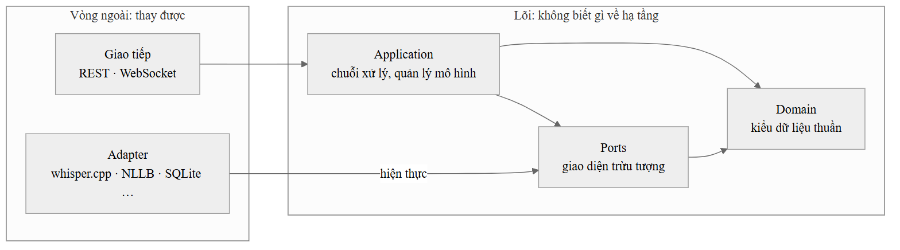

Hình 2.1: Quy tắc phụ thuộc của kiến trúc lục giác

Với bài toán này, kiến trúc đó trả lời trực tiếp một yêu cầu của đề cương: đổi mô hình hoặc
runtime cho từng khâu mà không ảnh hưởng chuỗi xử lý. Nó còn cho một lợi ích quan trọng cho
kiểm thử: thay adapter thật bằng adapter giả thì kiểm thử được toàn bộ logic của chuỗi xử lý
trong vài giây, không cần tải mô hình nặng nhiều gigabyte. Mục 3.7.2 cho thấy lợi ích chính
đã được kiểm chứng trong thực tế khi thêm hai runtime ASR.

## 2.10. Công nghệ phát triển

Bảng 2.4: Công nghệ phát triển

| Thành phần       | Công nghệ                                      | Lý do chọn                                                               |
| ---------------- | ---------------------------------------------- | ------------------------------------------------------------------------ |
| Ứng dụng desktop | Electron, React, TypeScript, Zustand, Tailwind | Một mã nguồn cho hai hệ điều hành; Chromium đã bọc thu âm thanh hệ thống |
| Công cụ dựng     | electron-vite, electron-builder                | Dựng nhanh khi phát triển; đóng gói ra `.dmg` và `.exe`                  |
| Dịch vụ AI       | Python 3.12, FastAPI, Uvicorn                  | Hệ sinh thái mô hình AI nằm ở Python; FastAPI có sẵn WebSocket           |
| Lưu trữ          | SQLite qua SQLAlchemy Core                     | Không cần máy chủ cơ sở dữ liệu; một tệp trên máy người dùng             |
| Quản lý gói      | uv (Python), npm (Node)                        | uv tải được bản Python độc lập dùng để đóng gói bộ cài                   |
| Kiểm thử         | pytest, vitest, Playwright                     | Đơn vị phía Python, đơn vị phía giao diện, đầu-cuối trên ứng dụng thật   |
| Đánh giá         | datasets, jiwer, sacrebleu, unbabel-comet      | Thư viện chuẩn của cộng đồng; số đo so được với công bố                  |

Hai tiến trình giao tiếp bằng **REST** cho các thao tác một lần (cấu hình, quản lý mô hình,
lịch sử) và **WebSocket** cho luồng liên tục (khung âm thanh đi lên; kết quả nhận dạng, bản
dịch và âm thanh tổng hợp đi xuống). WebSocket giữ một kết nối mở suốt phiên dịch nên không
tốn chi phí bắt tay HTTP cho mỗi khung âm thanh 100 ms.

---

# Chương 3. PHÂN TÍCH, THIẾT KẾ VÀ HIỆN THỰC HỆ THỐNG

## 3.1. Phân tích yêu cầu

### 3.1.1. Tác nhân

Hệ thống có một tác nhân chính là **người dùng** — người tham gia một cuộc họp trực tuyến
với người nói ngôn ngữ khác. Ngoài ra có hai tác nhân phụ không phải con người: **hệ điều
hành**, cung cấp âm thanh microphone và âm thanh hệ thống; và **Hugging Face Hub / GitHub
Releases**, nơi tải mô hình về trong lần dùng đầu. Tác nhân thứ ba chỉ xuất hiện khi tải mô
hình, không bao giờ trong lúc dịch.

### 3.1.2. Yêu cầu chức năng

Bảng 3.1: Yêu cầu chức năng

| Mã   | Yêu cầu                                                                                     |
| ---- | ------------------------------------------------------------------------------------------- |
| CN01 | Chọn cặp ngôn ngữ trong sáu chiều Việt ↔ Anh / Nhật / Trung                                 |
| CN02 | Chọn thiết bị microphone và thiết bị phát; kiểm tra microphone trước khi dùng               |
| CN03 | Chọn chế độ: chỉ nghe (dịch âm thanh hệ thống), chỉ nói (dịch microphone), hai chiều        |
| CN04 | Dịch giọng người dùng: nhận dạng, dịch, hiện phụ đề, đọc bản dịch thành tiếng               |
| CN05 | Dịch âm thanh hệ thống: nhận dạng, dịch, hiện phụ đề (không đọc thành tiếng)                |
| CN06 | Giữ phím để nói (push-to-talk), tắt tiếng microphone                                        |
| CN07 | Duyệt và sửa bản dịch trước khi đọc, có đếm ngược tự gửi                                    |
| CN08 | Chọn một trong ba preset Nhanh / Cân bằng / Chất lượng, hoặc tự chọn mô hình từng khâu      |
| CN09 | Tải, nạp, gỡ khỏi bộ nhớ, xóa mô hình; xem dung lượng trên đĩa và tiến độ tải               |
| CN10 | Lưu lịch sử phiên dịch song ngữ; tìm kiếm, đổi tên, xóa từng phiên hoặc tất cả              |
| CN11 | Nhập tệp âm thanh hoặc video có sẵn, chuyển thành văn bản song ngữ; tùy chọn tách người nói |
| CN12 | Đo độ trễ từng khâu và tài nguyên tiến trình; chạy bộ đánh giá độ chính xác trong ứng dụng  |
| CN13 | Đổi thư mục lưu mô hình; nhập token Hugging Face; tắt lưu lịch sử                           |

### 3.1.3. Yêu cầu phi chức năng

Các yêu cầu phi chức năng lấy từ đặc tả hệ thống lập ở Tuần 1 (Bảng 3.2). Mục tiêu hiệu năng
đặt cho máy có GPU phù hợp; trên máy chỉ có CPU hệ thống được phép chậm hơn nhưng phải chạy
ổn định.

Bảng 3.2: Yêu cầu phi chức năng

| Mã    | Nhóm      | Yêu cầu                                                                          |
| ----- | --------- | -------------------------------------------------------------------------------- |
| PCN01 | Hiệu năng | Phát hiện kết thúc câu < 700 ms; ASR một câu ngắn < 1.500 ms                     |
| PCN02 | Hiệu năng | Dịch < 1.000 ms; TTS < 1.500 ms; tổng chiều đi trung vị < 4 s                    |
| PCN03 | Ổn định   | Chạy liên tục tối thiểu 60 phút; bộ nhớ không tăng liên tục                      |
| PCN04 | Ổn định   | Một mô hình lỗi không làm mất cả phiên; giải phóng tài nguyên khi kết thúc phiên |
| PCN05 | Offline   | Sau khi cài mô hình: không cần Internet, không gọi API đám mây nào               |
| PCN06 | Riêng tư  | Không gửi âm thanh ra khỏi máy; không lưu âm thanh; không ghi nội dung vào log   |
| PCN07 | Riêng tư  | Tắt được lịch sử; xóa được toàn bộ dữ liệu; hiện rõ đường dẫn lưu dữ liệu        |
| PCN08 | Nền tảng  | Windows 11 x64; macOS 13+ trên Apple Silicon                                     |
| PCN09 | Bảo trì   | Đổi mô hình hoặc runtime của một khâu không phải sửa chuỗi xử lý                 |
| PCN10 | Bảo mật   | Dịch vụ AI chỉ lắng nghe trên `127.0.0.1`, không mở ra mạng                      |

### 3.1.4. Sơ đồ use case

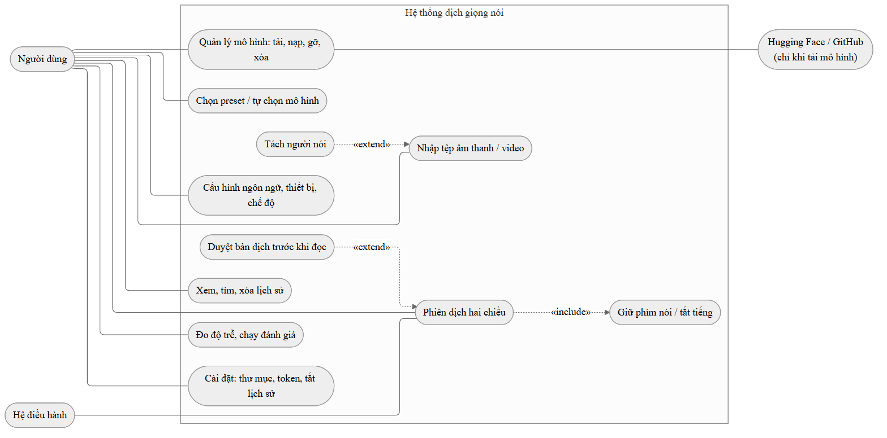

Hình 3.1: Sơ đồ use case của hệ thống

Hai use case trung tâm được đặc tả ở Bảng 3.3 và Bảng 3.4.

Bảng 3.3: Đặc tả use case "Phiên dịch hai chiều"

| Mục               | Nội dung                                                                                                                                                                                                                                                                                                                                                                              |
| ----------------- | ------------------------------------------------------------------------------------------------------------------------------------------------------------------------------------------------------------------------------------------------------------------------------------------------------------------------------------------------------------------------------------- |
| Tác nhân          | Người dùng; hệ điều hành (nguồn âm thanh)                                                                                                                                                                                                                                                                                                                                             |
| Tiền điều kiện    | Đã chọn cặp ngôn ngữ, thiết bị và preset; dịch vụ AI đang chạy                                                                                                                                                                                                                                                                                                                        |
| Luồng chính       | 1. Người dùng bấm "Bắt đầu". 2. Hệ thống nạp mô hình nếu chưa có trong bộ nhớ, hiện tiến độ. 3. Hệ thống bắt đầu thu âm thanh hệ thống liên tục. 4. Người dùng giữ phím nói và nói. 5. Hệ thống tách câu, nhận dạng, dịch, hiện phụ đề, đọc bản dịch. 6. Song song, câu của phía bên kia được nhận dạng, dịch và hiện phụ đề. 7. Người dùng bấm "Dừng"; phiên được đóng trong lịch sử |
| Luồng thay thế    | 5a. Bật "duyệt trước khi đọc": hệ thống dừng sau bước dịch, hiện bản dịch để sửa; người dùng bấm gửi, bỏ, hoặc đếm ngược tự gửi. 3a. Trình duyệt từ chối quyền thu âm thanh hệ thống: chiều đi vẫn chạy, chiều về báo lỗi riêng                                                                                                                                                       |
| Hậu điều kiện     | Mỗi câu đã xong được lưu vào lịch sử (trừ khi người dùng tắt lịch sử)                                                                                                                                                                                                                                                                                                                 |
| Yêu cầu liên quan | CN03–CN07, CN10, PCN01–PCN06                                                                                                                                                                                                                                                                                                                                                          |

Bảng 3.4: Đặc tả use case "Nhập tệp âm thanh/video"

| Mục               | Nội dung                                                                                                                                                                                                                                                                                                              |
| ----------------- | --------------------------------------------------------------------------------------------------------------------------------------------------------------------------------------------------------------------------------------------------------------------------------------------------------------------- |
| Tác nhân          | Người dùng                                                                                                                                                                                                                                                                                                            |
| Tiền điều kiện    | Có tệp âm thanh hoặc video trên máy                                                                                                                                                                                                                                                                                   |
| Luồng chính       | 1. Người dùng kéo thả một hoặc nhiều tệp vào hàng đợi, chọn cặp ngôn ngữ. 2. Ứng dụng tách rãnh âm thanh, chuyển về PCM 16 kHz và gửi lên dịch vụ. 3. Dịch vụ tách câu, nhận dạng và dịch cả tệp, trả tiến độ theo vị trí trong tệp. 4. Kết quả song ngữ hiện theo từng đoạn có mốc thời gian và được lưu vào lịch sử |
| Luồng thay thế    | 3a. Bật tách người nói: dịch vụ chạy thêm một lượt phân tích giọng trên cả tệp, gắn nhãn người nói cho từng đoạn. 3b. Người dùng bấm hủy: dịch vụ dừng ở đoạn kế tiếp và trả về các đoạn đã xong                                                                                                                      |
| Hậu điều kiện     | Một phiên mới trong lịch sử, chế độ "tệp"                                                                                                                                                                                                                                                                             |
| Yêu cầu liên quan | CN11, CN10                                                                                                                                                                                                                                                                                                            |

## 3.2. Thiết kế kiến trúc

### 3.2.1. Hai tiến trình trên một máy

Hệ thống gồm hai tiến trình chạy trên cùng máy người dùng (Hình 3.2). **Ứng dụng desktop**
(Electron) lo giao diện, thu âm thanh và phát giọng đọc. **Dịch vụ AI** (Python) chạy toàn
bộ mô hình, giữ lịch sử và cấu hình. Hai tiến trình nói chuyện qua REST và WebSocket trên
địa chỉ `127.0.0.1`, cổng 8756 — dịch vụ không bao giờ lắng nghe trên địa chỉ mạng.

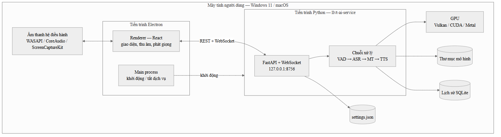

Hình 3.2: Sơ đồ triển khai: hai tiến trình trên một máy

Tách hai tiến trình thay vì nhúng mô hình vào Electron có ba lý do. Hệ sinh thái mô hình AI
— PyTorch, transformers, các binding của whisper.cpp và sherpa-onnx — nằm ở Python. Tiến
trình Python bị treo hay tràn bộ nhớ khi nạp mô hình thì giao diện vẫn sống và báo được lỗi.
Và dịch vụ chạy độc lập được, nên các script đánh giá gọi thẳng vào nó mà không cần mở giao
diện.

Trong bản cài, ứng dụng desktop tự khởi động dịch vụ khi mở và tắt nó khi thoát. Nó kiểm tra
cổng 8756 trước: nếu đã có dịch vụ trả lời thì dùng luôn, không khởi động bản thứ hai. Khi
phát triển thì hai tiến trình được chạy riêng bằng một lệnh.

### 3.2.2. Các tầng của dịch vụ AI

Dịch vụ AI theo kiến trúc lục giác (mục 2.9) với năm tầng (Hình 3.3).

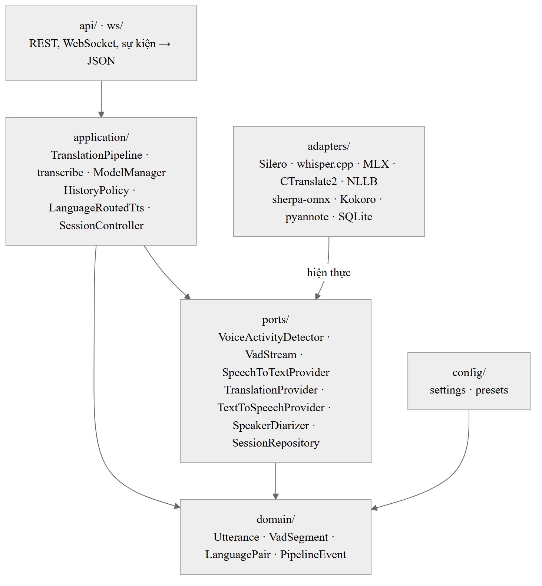

Hình 3.3: Các tầng của dịch vụ AI

- **domain** — các kiểu dữ liệu thuần: câu (`Utterance`), đoạn giọng nói (`VadSegment`),
  cặp ngôn ngữ, các sự kiện của chuỗi xử lý. Không import thư viện nào.
- **ports** — các lớp trừu tượng: `VoiceActivityDetector`, `SpeechToTextProvider`,
  `TranslationProvider`, `TextToSpeechProvider`, `SpeakerDiarizer`, `SessionRepository`.
- **application** — nghiệp vụ: chuỗi xử lý `TranslationPipeline`, tác vụ nhập tệp,
  `ModelManager` quản lý mô hình, các chính sách. Chỉ biết ports và domain.
- **adapters** — hiện thực port bằng thư viện cụ thể: whisper.cpp, MLX, CTranslate2, NLLB,
  sherpa-onnx, Kokoro, pyannote, SQLite.
- **api, ws** — lớp giao tiếp mỏng: nhận yêu cầu REST và thông điệp WebSocket, gọi
  application, chuyển sự kiện thành JSON.

Ứng dụng desktop dùng đúng cách phân tầng đó ở phía renderer: `domain` (kiểu dữ liệu và bản
sao giao thức), `ports` (`AiClient`, `SessionChannel`), `adapters` (REST và WebSocket),
`application` (điều khiển phiên, quy tắc tên mô hình), và `ui`.

### 3.2.3. Các port và adapter

Hình 3.4 là sơ đồ lớp của các port chính và adapter hiện thực chúng.

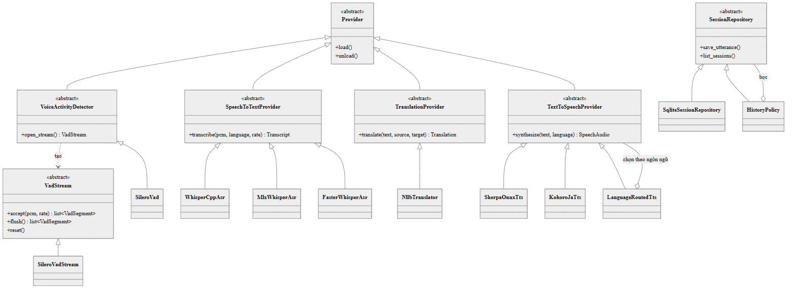

Hình 3.4: Sơ đồ lớp các port và adapter

Có hai quyết định thiết kế đáng chú ý trong sơ đồ này.

**Port VAD tách làm hai vai.** Mọi kết nối dùng chung một bộ mô hình, nhưng Silero giữ trạng
thái ẩn theo từng luồng âm thanh (mục 2.3.1). Nếu chiều đi và chiều về dùng chung một đối
tượng VAD thì trạng thái của hai luồng trộn vào nhau. Vì vậy port tách thành
`VoiceActivityDetector` — nạp mô hình một lần, dùng chung — và `VadStream` — giữ trạng thái,
mỗi nguồn âm thanh của mỗi phiên một bản, tạo bằng `open_stream()`. Đây là quyết định kiến
trúc đầu tiên của dự án, đưa ra ở Tuần 2 và giữ nguyên tới cuối.

**Chính sách là một adapter bọc chính port của nó.** Hai lớp ở tầng application —
`HistoryPolicy` bọc `SessionRepository` để tắt ghi lịch sử theo lựa chọn của người dùng, và
`LanguageRoutedTts` bọc `TextToSpeechProvider` để chọn engine theo ngôn ngữ đích — hiện thực
đúng port mà chúng bọc. Chuỗi xử lý không biết mình đang nói chuyện với lớp chính sách hay
adapter thật. Adapter biết _cách_ làm; lớp chính sách quyết định _có được phép_ làm và _dùng
engine nào_.

## 3.3. Thiết kế luồng xử lý

### 3.3.1. Vòng đời một câu

Mỗi câu có một mã định danh riêng, đi xuyên suốt từ lúc được tách ra tới lúc phát xong, và
đi qua các trạng thái ở Hình 3.5. Mỗi lần đổi trạng thái được gửi về giao diện, nên người
dùng luôn thấy câu của mình đang ở khâu nào.

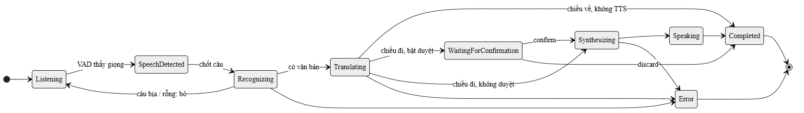

Hình 3.5: Sơ đồ trạng thái của một câu

Trạng thái `WaitingForConfirmation` chỉ xuất hiện ở chiều đi khi bật duyệt trước khi đọc;
chiều về không đọc thành tiếng nên không có gì để duyệt. Một câu lỗi ở bất kỳ khâu nào
chuyển sang `Error` và được lưu kèm mã lỗi, nhưng không làm dừng phiên — câu sau vẫn chạy
bình thường (PCN04).

### 3.3.2. Một phiên dịch

Hình 3.6 là sơ đồ tuần tự của một phiên, từ lúc mở kết nối tới lúc một câu được dịch xong.

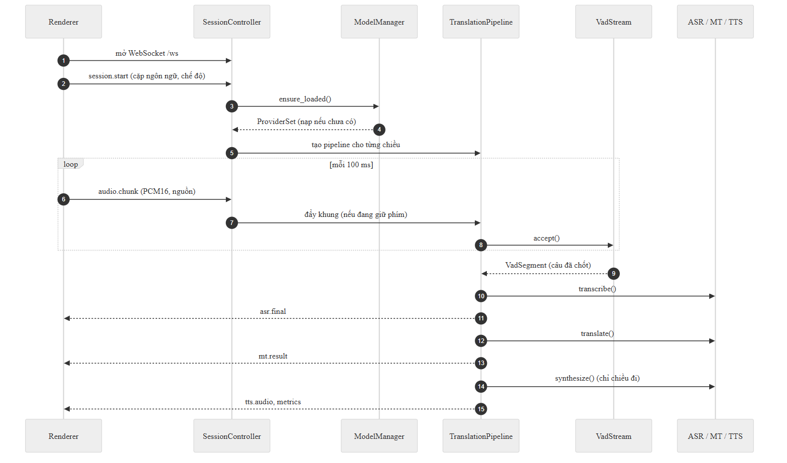

Hình 3.6: Sơ đồ tuần tự một phiên dịch

Mỗi kết nối WebSocket có một `SessionController` riêng; mỗi chiều dịch trong phiên có một
`TranslationPipeline` riêng với một `VadStream` riêng. Ứng dụng gửi khung âm thanh 100 ms một
lần; bộ tách câu gom chúng lại và nhả ra một đoạn khi câu kết thúc. Đoạn đó đi qua ASR, MT và
TTS; mỗi khâu được đo thời gian bằng đồng hồ đơn điệu ngay trong dịch vụ, không để phía giao
diện ước lượng qua khoảng cách giữa các sự kiện — con số ước lượng như vậy gồm cả thời gian
truyền WebSocket nên không dùng được.

Mô hình chạy lâu và chặn luồng, nên không được chạy trên vòng lặp sự kiện của asyncio — nếu
không, trong lúc Whisper đang nhận dạng thì mọi kết nối khác đều treo. Mỗi lần gọi mô hình
được đẩy sang một luồng riêng (mục 3.7.5).

### 3.3.3. Hai chiều dịch và chống vòng lặp âm thanh

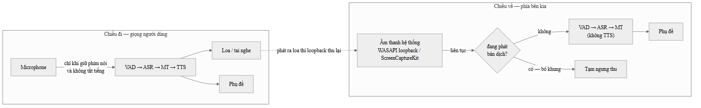

Hình 3.7: Hai chiều dịch và cơ chế chống vòng lặp âm thanh

Hai chiều có hành vi khác nhau có chủ đích:

- **Chiều đi** chỉ gửi âm thanh khi người dùng đang giữ phím nói và không tắt tiếng. Cổng này
  được chặn **hai lần**: ứng dụng không gửi, và dịch vụ cũng bỏ các khung đến ngoài lúc giữ
  phím — không tin phía client. Nhả phím phải chốt câu ngay: khi ứng dụng ngừng gửi âm thanh,
  bộ tách câu sẽ không bao giờ thấy khoảng lặng để kết thúc câu. Lỗi này chỉ lộ ra khi ghép
  hai phần vốn đúng khi đứng riêng, và cách sửa — `VadStream.flush()` — trở thành một phần
  của port VAD.
- **Chiều về** thu liên tục, không cần giữ phím, và **không đọc thành tiếng**: đọc bản dịch
  của phía bên kia thì giọng máy sẽ chồng lên giọng người thật đang nói.

**Chống vòng lặp.** Âm thanh hệ thống thu toàn bộ đầu ra của máy, nên nếu bản dịch được phát
ra loa thì chính nó quay lại chiều về và được dịch tiếp. Ứng dụng biết lúc nào mình đang phát
bản dịch, và **bỏ mọi khung âm thanh hệ thống thu trong khoảng đó**. Giao diện hiện "Tạm ngưng
thu (đang phát bản dịch)" để người dùng hiểu vì sao phụ đề chiều về khựng lại. Cách chắc chắn
nhất vẫn là đeo tai nghe; cơ chế này là lưới an toàn cho lúc người dùng quên.

### 3.3.4. Nạp mô hình theo yêu cầu

Phiên bản đầu nạp toàn bộ mô hình khi dịch vụ khởi động, và mất khoảng 45 giây mới mở. Thiết
kế hiện tại **không nạp gì lúc khởi động** — dịch vụ mở trong khoảng 0,4 giây — và mọi đường
cần tới mô hình đều đi qua đúng một cửa là `ModelManager.ensure_loaded()` (Hình 3.8).

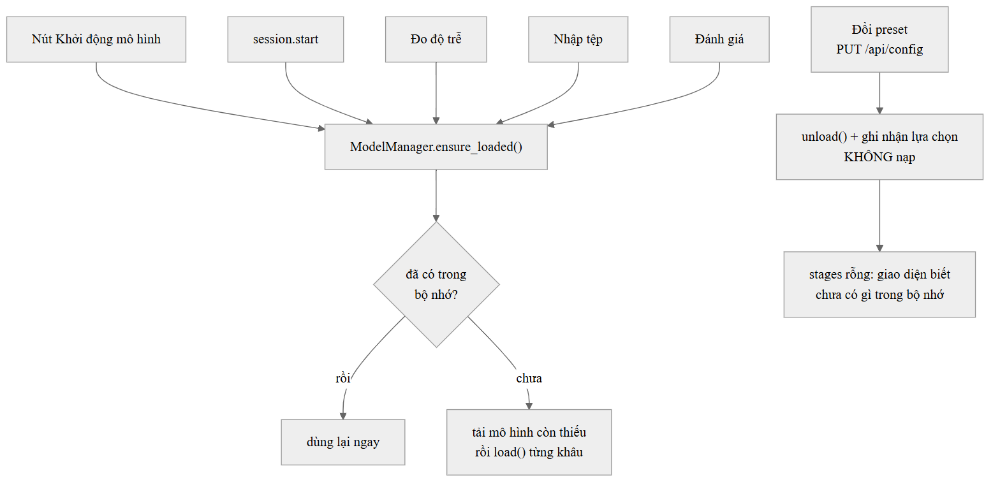

Hình 3.8: Nạp mô hình theo yêu cầu

Năm lối vào gọi cửa đó: nút "Khởi động mô hình", lúc bắt đầu phiên dịch, nút đo độ trễ, màn
hình nhập tệp và màn hình đánh giá. **Chọn preset không nằm trong số đó**: đổi preset chỉ gỡ
mô hình cũ khỏi bộ nhớ và ghi nhận lựa chọn mới, nên người dùng duyệt qua các preset tức thì
thay vì chờ tải vài gigabyte cho mỗi lần bấm. Trạng thái "chưa có gì trong bộ nhớ" được báo
bằng một tín hiệu rõ ràng ở mức giao thức — danh sách khâu đã nạp rỗng — để giao diện không
phải đoán.

## 3.4. Thiết kế giao tiếp

### 3.4.1. REST

Bảng 3.5: Các nhóm API REST

| Nhóm     | Đường dẫn chính                                                                   | Chức năng                                                                        |
| -------- | --------------------------------------------------------------------------------- | -------------------------------------------------------------------------------- |
| Sức khỏe | `GET /health`                                                                     | Kiểm tra dịch vụ còn sống                                                        |
| Cấu hình | `GET/PUT /api/config`, `GET/PUT /api/compute`                                     | Preset, mô hình từng khâu, thư mục mô hình, thiết bị tính toán (tự động/CPU/GPU) |
| Mô hình  | `GET/DELETE /api/models`, `POST /api/models/{load,unload,download}`, `…/progress` | Mô hình trên đĩa kèm dung lượng thật; nạp, gỡ, tải, hủy; tiến độ                 |
| Lịch sử  | `GET/PATCH/DELETE /api/sessions[/{id}]`                                           | Danh sách, tìm kiếm, bản song ngữ, đổi tên, xóa                                  |
| Nhập tệp | `POST /api/transcribe`, `…/progress`, `…/cancel`                                  | Chuyển cả tệp thành văn bản song ngữ                                             |
| Đo đạc   | `POST /api/benchmark`, `GET /api/resources`, `POST /api/evaluate`                 | Độ trễ từng khâu, CPU/RAM tiến trình, chấm bộ câu mẫu                            |
| Bảo mật  | `POST /api/hf/verify`                                                             | Kiểm tra token Hugging Face trước khi tải mô hình cần quyền                      |

Các thao tác chạy lâu — nạp mô hình, nhập tệp, chấm điểm — là một yêu cầu chặn; giao diện hỏi
song song một đường `…/progress` riêng để vẽ thanh tiến độ. Tài liệu API sinh tự động ở
`/docs`, và bộ giao diện Swagger được đóng gói sẵn trong dịch vụ thay vì tải từ CDN — nếu
không, trang tài liệu trắng trơn trên máy không có mạng, trái với chính mục tiêu của đề tài.

### 3.4.2. WebSocket

Mọi thông điệp có cùng một khung `{ type, ts, payload }` (Bảng 3.6).

Bảng 3.6: Thông điệp WebSocket

| Chiều              | Loại                                 | Nội dung                                                         |
| ------------------ | ------------------------------------ | ---------------------------------------------------------------- |
| Ứng dụng → dịch vụ | `session.start`                      | Chế độ, cặp ngôn ngữ, tiêu đề phiên, bật/tắt duyệt trước khi đọc |
|                    | `audio.chunk`                        | Khung PCM 16-bit mono 16 kHz, kèm nguồn (microphone / hệ thống)  |
|                    | `control.ptt`, `control.mute`        | Trạng thái giữ phím nói, tắt tiếng                               |
|                    | `control.confirm`, `control.discard` | Gửi (kèm bản đã sửa) hoặc bỏ một câu đang chờ duyệt              |
|                    | `session.stop`                       | Kết thúc phiên                                                   |
| Dịch vụ → ứng dụng | `state`                              | Trạng thái câu hoặc phiên; mã phiên lúc bắt đầu và kết thúc      |
|                    | `asr.partial`                        | Văn bản nhận dạng tạm thời, chỉ để hiển thị (không đưa đi dịch)  |
|                    | `asr.final`                          | Văn bản nhận dạng đã chốt của một câu                            |
|                    | `mt.result`                          | Bản dịch                                                         |
|                    | `tts.audio`                          | Âm thanh giọng đọc bản dịch                                      |
|                    | `metrics`                            | Thời gian từng khâu của câu đó                                   |
|                    | `error`                              | Lỗi kèm mã                                                       |

Giao thức được định nghĩa hai lần — một bản Python ở phía dịch vụ, một bản TypeScript ở phía
ứng dụng — và phải được đồng bộ bằng tay khi thay đổi. Đây là một khoản nợ bảo trì được chấp
nhận có chủ đích: sinh mã tự động từ một đặc tả chung thì thêm một công cụ và một bước dựng
cho một giao thức chỉ có mười bốn loại thông điệp.

## 3.5. Thiết kế dữ liệu

### 3.5.1. Lịch sử phiên dịch

Lịch sử lưu trong một tệp SQLite gồm hai bảng (Hình 3.9). Mỗi phiên có nhiều câu; mỗi câu lưu
văn bản gốc, bản dịch, thời gian từng khâu và trạng thái. **Không lưu âm thanh** (PCN06).

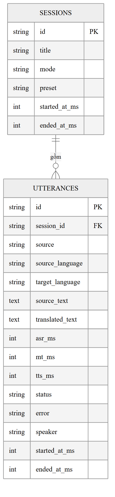

Hình 3.9: Sơ đồ thực thể – liên kết của lịch sử phiên dịch

Hai quyết định:

- **Dịch vụ ghi, không phải ứng dụng.** Chuỗi xử lý biết chính xác lúc nào một câu kết thúc
  và mất bao nhiêu mili giây ở từng khâu. Để phía giao diện ghi thì các con số đó phải đi
  vòng qua WebSocket rồi quay lại, và bản ghi mất mỗi khi cửa sổ bị đóng giữa chừng.
- **Lược đồ có đánh số phiên bản.** Số phiên bản lưu trong `PRAGMA user_version` (hiện là 2),
  và khi mở tệp dịch vụ tự thêm những cột còn thiếu. Lý do: lệnh tạo bảng của SQLAlchemy bỏ
  qua bảng đã tồn tại, nên chỉ dùng nó thì cơ sở dữ liệu cũ trên máy người dùng sẽ lặng lẽ
  thiếu cột mới — như cột `speaker` được thêm khi làm chức năng tách người nói.

### 3.5.2. Cấu hình người dùng

Lựa chọn của người dùng — thư mục mô hình, token Hugging Face, mô hình tự chọn cho từng khâu,
thiết bị tính toán — được ghi vào `~/.llvt/settings.json`. Tệp này là nguồn cấu hình thứ hai,
xếp **dưới** biến môi trường: người quản trị đặt biến môi trường là có chủ ý rõ ràng, nên khi
đó giao diện hiện ô tương ứng ở dạng chỉ đọc.

Token Hugging Face là bí mật duy nhất của ứng dụng. Tệp cấu hình được ghi với quyền `0600`, và
token **không bao giờ đi ngược về giao diện**: API chỉ trả về việc token có được đặt hay không,
nguồn của nó và vài ký tự cuối để nhận ra. Log chỉ ghi rằng token đã thay đổi, không ghi giá
trị.

## 3.6. Thiết kế cấu hình mô hình

Preset là một **mức chất lượng**, không phải một mô hình cụ thể (Bảng 3.7). Mỗi preset mang
một bộ mô hình cho từng khâu, một bộ tham số tách câu riêng, và một bảng mô hình tương đương
cho từng runtime ASR — đổi runtime thì vẫn giữ đúng mức chất lượng người dùng đã chọn.

Bảng 3.7: Cấu hình ba preset (mô hình MLX thuộc kho `mlx-community/`; MT của cả ba là `facebook/nllb-200-distilled-600M`)

| Preset     | ASR — whisper.cpp          | ASR — MLX                         | ASR — faster-whisper                        | MT        | Trần độ dài câu |
| ---------- | -------------------------- | --------------------------------- | ------------------------------------------- | --------- | --------------: |
| Nhanh      | `ggml-small-q5_1`          | `whisper-large-v3-turbo-asr-4bit` | `Systran/faster-whisper-small`              | NLLB-600M |           4,5 s |
| Cân bằng   | `ggml-large-v3-turbo-q5_0` | `whisper-large-v3-turbo-asr-8bit` | `deepdml/faster-whisper-large-v3-turbo-ct2` | NLLB-600M |           6,0 s |
| Chất lượng | `ggml-large-v3-turbo-q8_0` | `whisper-large-v3-turbo-asr-fp16` | `Systran/faster-whisper-large-v3`           | NLLB-600M |           8,0 s |

Preset Nhanh của MLX không dùng bản `small` dù đó mới là bản "cùng cỡ" với `ggml-small`: đo
trên 20 câu FLEURS, cả bản 8-bit lẫn fp16 của `mlx-community/whisper-small` đều hỏng — WER
125–162%, một nửa số câu trả về rỗng, phần còn lại kẹt vòng lặp. Bản GGML cùng cỡ chạy bình
thường (WER 20,6%), nên lỗi nằm ở bản chuyển đổi chứ không ở cỡ mô hình. Preset Nhanh của MLX
vì vậy dùng `large-v3-turbo` 4-bit: nhỏ hơn bản `small` fp16, nhanh hơn và WER 8,9%.

Ngoài ba preset còn có chế độ **tự chọn** mô hình cho từng khâu. Vì ba runtime ASR không dùng
chung mô hình nào (mục 2.4.3), danh sách mô hình ASR là một bảng theo từng runtime; dịch vụ từ
chối tổ hợp chéo — ví dụ runtime MLX với tệp GGML — bằng mã lỗi 400. Runtime nào môi trường
không cài thì không được đưa ra chọn; một lựa chọn đã lưu mà không còn chạy được thì tự lùi về
whisper.cpp thay vì làm hỏng cả chế độ tự chọn.

**Tên mô hình là đường dẫn thật ở nơi phát hành.** Mỗi mô hình có đúng một chuỗi định danh —
mã kho Hugging Face như `facebook/nllb-200-distilled-600M`, hoặc tên tệp trong kho với GGML
như `ggml-small-q5_1.bin`. Chuỗi đó dùng ở mọi nơi: danh mục, ô tự chọn, API tải, và tên thư
mục trên đĩa. Trước khi thống nhất như vậy, một mô hình có ba cách viết ở ba nơi, và danh mục
từng có một mục "NLLB int8" thật ra trỏ về đúng kho gốc — preset quảng cáo một mô hình nhẹ hơn
mà nạp y hệt preset Cân bằng.

## 3.7. Hiện thực dịch vụ AI

### 3.7.1. Bộ tách câu

Bộ tách câu bọc bộ lặp VAD của Silero và thêm phần quyết định khi nào chốt câu (Hình 3.10),
với các tham số ở Bảng 3.8.

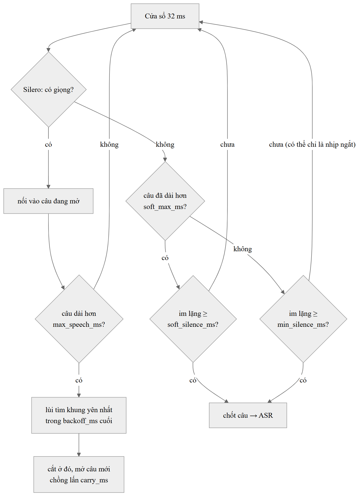

Hình 3.10: Quyết định chốt câu của bộ tách câu

Bảng 3.8: Tham số của bộ tách câu (preset Cân bằng)

| Tham số           |  Giá trị | Ý nghĩa                                                               |
| ----------------- | -------: | --------------------------------------------------------------------- |
| `threshold`       |      0,5 | Ngưỡng xác suất để coi một cửa sổ 32 ms là giọng nói                  |
| `soft_silence_ms` |   140 ms | Im lặng đủ để chốt một câu **đã dài** — chỉ cần hụt hơi một nhịp      |
| `min_silence_ms`  |   320 ms | Im lặng cần có để chốt một câu **còn ngắn**                           |
| `soft_max_ms`     | 3.500 ms | Từ độ dài này trở đi, câu dùng ngưỡng im lặng ngắn                    |
| `max_speech_ms`   | 6.000 ms | Trần cứng: vượt quá mà chưa gặp khoảng lặng nào thì cắt               |
| `backoff_ms`      |   400 ms | Khi cắt cứng, lùi lại tìm khung yên nhất trong khoảng này để cắt ở đó |
| `carry_ms`        |   100 ms | Đoạn mới chồng lấn đoạn cũ một khoảng này để không mất âm đầu của từ  |
| `min_speech_ms`   |   250 ms | Đoạn ngắn hơn bị bỏ — thường là tiếng động chứ không phải lời nói     |

Cơ chế giải quyết cả hai phía của mâu thuẫn ở mục 2.3.2:

- **Hai ngưỡng im lặng.** Bộ lặp của Silero được đặt ở ngưỡng ngắn nên báo "hết giọng" sớm.
  Với câu còn ngắn, bộ tách câu giữ quyết định thêm một khoảng nữa: nếu giọng nói quay lại
  trong khoảng đó thì chỉ là nhịp ngắt giữa câu, nối tiếp vào đoạn cũ. Câu đã dài quá
  `soft_max_ms` thì chốt ngay ở nhịp hụt hơi đầu tiên. Kết quả: người nói chậm không bị băm
  câu, còn người nói liên tục không phải chờ hết câu mới được dịch.
- **Cắt cứng có lùi.** Vượt `max_speech_ms` mà chưa có khoảng lặng nào thì thay vì chặt ngay
  tại vị trí hiện tại — dễ rơi vào giữa một từ — bộ tách câu lùi lại tìm khung 32 ms yên nhất
  trong `backoff_ms` cuối và cắt ở đó, rồi mở đoạn mới chồng lấn `carry_ms`.

Phiên bản đầu dùng một ngưỡng im lặng 300 ms và trần 20 giây: người nói không nghỉ thì 20 giây
mới ra một câu. Đó chính là điều giảng viên hướng dẫn chỉ ra ở buổi họp ngày 19/08/2026 ("phải
chờ câu dài 5–10 giây"). Mục 4.7.1 đo tác dụng của thay đổi trên giọng người thật.

### 3.7.2. Nhận dạng tiếng nói

**Ba adapter, một port.** `WhisperCppAsr` dùng thư viện pywhispercpp; `MlxWhisperAsr` dùng
mlx-audio; `FasterWhisperAsr` dùng CTranslate2. Cả ba hiện thực `SpeechToTextProvider`. Thêm
adapter thứ hai (MLX) và thứ ba (faster-whisper) chỉ cần ba việc: viết lớp adapter, đăng ký
một dòng trong bảng runtime của `ModelManager`, và thêm mô hình tương đương vào từng preset.
**Không phải sửa một dòng nào** trong chuỗi xử lý, tác vụ nhập tệp hay lớp giao tiếp. Đây là
bằng chứng thực tế rằng kiến trúc lục giác không chỉ nằm trên giấy.

Khi so hai runtime, tham số giải mã được đặt **đối xứng**: tắt giải mã lại theo nhiệt độ và
không mang ngữ cảnh của câu trước sang câu sau ở cả ba adapter. So sánh chỉ có nghĩa khi chính
sách giải mã giống nhau; đồng thời việc tắt giải mã lại làm kết quả tất định, nên chạy lại trên
máy khác ra đúng con số WER cũ.

**Chọn GPU trên laptop có hai card.** Laptop phổ thông thường có một GPU tích hợp và một GPU
rời. Thư viện ggml của whisper.cpp liệt kê GPU tích hợp trước, và whisper.cpp mặc định lấy GPU
đầu tiên. Trên máy thử nghiệm (Intel Iris Xe và NVIDIA RTX 4060), cùng một câu mất khoảng
9,9 giây trên GPU tích hợp và 0,13 giây trên GPU rời. Adapter vì vậy liệt kê thiết bị qua thư
viện ggml trước khi nạp và chủ động chọn card rời. Người dùng cũng chọn được thiết bị bằng tay
(tự động, CPU hoặc một GPU cụ thể) ở màn hình Thiết lập — danh sách GPU lấy từ chính dịch vụ
chứ không lấy từ giao diện, vì Chromium chỉ thấy GPU nó dùng để vẽ, thường là GPU tích hợp.

**Làm nóng khi nạp.** Lần nhận dạng đầu tiên trên Vulkan mất khoảng 11,7 giây vì driver biên
dịch shader; các lần sau có bộ đệm trên đĩa nên chỉ còn 0,2 giây. Adapter nhận dạng một giây
im lặng ngay lúc nạp, để khoảng chờ đó rơi vào bước có thanh tiến độ thay vì vào câu nói đầu
tiên của người dùng.

**Lọc câu bịa.** Ngưỡng "không có tiếng nói" của whisper.cpp chặn được phần lớn câu bịa nhưng
không hết, nên có thêm một lớp lọc thuần hàm, dùng chung cho cả ba adapter, dựa trên ba dấu
hiệu độc lập:

1. **Câu quen mặt** — danh sách các câu bịa đã gặp, chỉ gồm những câu **dài và đặc trưng**
   như tên kênh, "Amara.org", "ご視聴ありがとうございました". Danh sách cố ý **không** chứa các
   câu ngắn như "Cảm ơn." hay "Thank you." — trong ứng dụng phiên dịch, đó là câu người ta nói
   thật, chặn nhầm còn tệ hơn để lọt.
2. **Lặp thoái hóa** — một cụm lặp đi lặp lại nhiều lần liên tiếp.
3. **Độ tin cậy thấp** — trung bình nhân xác suất các token dưới ngưỡng.

Câu bị bỏ được ghi vào log kèm lý do, không kèm nội dung.

### 3.7.3. Dịch máy

Adapter NLLB dùng thư viện transformers. Nó chọn thiết bị theo thứ tự CUDA → MPS (GPU Apple)
→ CPU, trừ khi người dùng ép chạy CPU. Bản đầu thiếu hẳn nhánh CUDA nên trên Windows luôn chạy
CPU; bổ sung nhánh đó đưa thời gian dịch trung vị trên máy thử nghiệm từ 789 ms xuống 181 ms.

### 3.7.4. Tổng hợp tiếng nói

`LanguageRoutedTts` chọn engine theo ngôn ngữ đích: sherpa-onnx cho tiếng Việt, tiếng Anh và
tiếng Trung; Kokoro kèm OpenJTalk cho tiếng Nhật. Giọng đọc được nạp **lười theo ngôn ngữ**:
chỉ khởi tạo khi lần đầu cần đọc ra ngôn ngữ đó, nên một phiên Việt → Anh không tốn bộ nhớ cho
giọng Nhật.

Hai giọng chọn ở Tuần 1 cho tiếng Nhật và tiếng Trung đều không dùng được, và cùng một nguyên
nhân: mô hình có tồn tại, nhưng phần G2P mà chúng cần thì sherpa-onnx không có. Cách phát hiện
đáng ghi lại: **cho ASR nghe lại chính âm thanh do TTS sinh ra**. Câu tiếng Nhật
「こんにちは、今日はプロジェクトの会議です。」 sinh ra 18,5 giây âm thanh cho một câu khoảng 3
giây, và ASR nghe lại thành một câu không liên quan gì. Giọng tiếng Trung thì chết với một thông
báo lỗi về hình dạng tensor không hề nhắc tới từ điển, trong khi nguyên nhân thật là mảng token
rỗng do thiếu bộ tách từ. Cách sửa: tiếng Nhật giữ trọng số Kokoro nhưng thay G2P bằng
OpenJTalk; tiếng Trung đổi sang giọng có kèm từ điển tách từ jieba. Sau khi sửa, phép thử
nghe lại đúng cả Kanji, số và Katakana.

Một số đo đi ngược trực giác: trên máy Apple Silicon, bản Kokoro **int8** (92 MB) mất 1.497 ms
trong khi bản **fp32** (326 MB) chỉ mất 706 ms — ARM không có kernel int8 tối ưu nên bản "nhẹ
hơn" lại chậm gấp đôi. Vì vậy loại lượng tử hóa là một tham số chọn được, không cố định.

### 3.7.5. Hai loại bộ thực thi

Mô hình không được chạy trên vòng lặp sự kiện, nhưng các runtime đòi hỏi hai kiểu luồng khác
nhau, không thay nhau được:

- `SerialExecutor` đẩy lời gọi sang một luồng phụ và giữ một khóa. Dùng cho mọi adapter trừ
  MLX: whisper.cpp và các thư viện khác chỉ cần được **tuần tự hóa** vì ngữ cảnh của chúng
  không an toàn khi dùng từ nhiều luồng cùng lúc, còn chạy ở luồng nào thì không quan trọng.
- `PinnedExecutor` là một bể đúng một luồng cố định. Bắt buộc cho MLX, vì MLX gắn luồng tính
  toán GPU vào chính luồng đã tạo ra nó: nạp mô hình ở luồng này rồi nhận dạng ở luồng khác là
  ném lỗi ngay.

Vì việc tuần tự hóa nằm trong adapter, nhiều chuỗi xử lý — chiều đi và chiều về — dùng chung
một bản mô hình vẫn an toàn mà chuỗi xử lý không phải biết gì.

### 3.7.6. Tải mô hình

Mô hình được tải từ Hugging Face Hub (Whisper, NLLB) và GitHub Releases (giọng đọc) trong lần
dùng đầu, vào thư mục người dùng chọn. Hai quy tắc được thêm sau khi gặp lỗi thật:

- **Tải dở không phải là "đã tải".** Một lượt tải bị ngắt để lại thư mục có vẻ đầy đủ; mọi
  đường tải đều bỏ qua mô hình "đã có", nên người dùng kẹt với một mô hình hỏng mà không có
  cách thoát. API liệt kê mô hình giờ trả thêm cờ `complete` — sai nghĩa là lượt tải bị ngắt —
  và tải lại với `force` xóa bản cũ trước.
- **Xóa chỉ trong phạm vi ứng dụng quản lý.** API xóa mô hình từ chối mọi đường dẫn nằm ngoài
  các thư mục do ứng dụng tạo ra.

### 3.7.7. Lịch sử, nhập tệp, tách người nói và duyệt trước khi đọc

**Nhập tệp** là một tác vụ riêng đứng cạnh chuỗi xử lý, không phải một nhánh bên trong nó: đầu
vào là cả tệp đã biết trước độ dài thay vì một luồng khung; câu cuối được chốt khi hết tệp thay
vì chờ khoảng lặng; không có TTS; kết quả trả về một lần thay vì chảy theo sự kiện. Hai phần
dùng chung bộ mô hình, `ModelManager` và cách ghi lịch sử. Việc tách rãnh âm thanh khỏi video
đặt ở phía ứng dụng, dùng bộ giải mã có sẵn của Chromium, nên dịch vụ không cần FFmpeg. Tiến
độ được tính theo **vị trí trong tệp**, không theo thời gian trôi qua, vì tốc độ xử lý thay đổi
theo phần cứng.

**Tách người nói** (diarization) dùng pyannote.audio và chỉ chạy ở tác vụ nhập tệp — trong phiên
trực tiếp, người nói đã được biết từ nguồn âm thanh. Nó tắt mặc định: mô hình pyannote là kho
cần quyền truy cập trên Hugging Face, đi ngược một phần tinh thần "chạy hoàn toàn cục bộ", và
là một thư viện tùy chọn. Kết quả tách người nói và kết quả tách câu cắt âm thanh theo hai cách
khác nhau — một theo giọng, một theo khoảng lặng — nên không tra được theo mốc bắt đầu. Nhãn
người nói cho mỗi câu được gán bằng một hàm thuần: trong khoảng thời gian của câu, người nói
nào chiếm nhiều thời lượng nhất thì nhận câu đó, với điều kiện chiếm ít nhất 25%; không ai đủ
25% thì để trống — câu rơi đúng vào chỗ chuyển lượt.

**Duyệt trước khi đọc** tách chuỗi xử lý làm hai: bật chế độ này thì chiều đi dừng sau bước dịch,
treo câu ở trạng thái chờ duyệt, và chỉ tổng hợp giọng khi nhận `control.confirm`; bản văn bản
gửi kèm lệnh đó thay cho bản máy dịch. Số câu treo cùng lúc có trần (32); vượt trần thì bỏ câu
cũ nhất, vì trong hội thoại câu vừa nói mới là câu người ta còn muốn gửi. Đếm ngược tự gửi nằm
ở phía giao diện, và gõ phím sửa thì hủy đếm ngược.

## 3.8. Hiện thực ứng dụng desktop

### 3.8.1. Thu âm thanh

Ứng dụng thu microphone qua WebAudio, ép tần số lấy mẫu ngay khi tạo `AudioContext` ở 16 kHz
nên không phải tự lấy mẫu lại, chuyển về PCM 16-bit mono và gửi lên dịch vụ theo khung 100 ms.
Âm thanh hệ thống đi qua `getDisplayMedia`, với ba ràng buộc của Chromium phải xử lý: Electron
chặn API này nếu tiến trình chính không đăng ký một bộ xử lý; API bắt buộc kèm một rãnh video,
được bỏ ngay sau khi nhận; và lỗi của luồng thu hệ thống phải được bọc riêng để không kéo sập
chiều đi.

### 3.8.2. Các màn hình

Ứng dụng có mười màn hình dạng thẻ (Bảng 3.9). Mọi màn hình được dựng **một lần và giữ nguyên**
trong suốt thời gian chạy; chuyển thẻ chỉ ẩn hoặc hiện. Nhờ vậy trạng thái riêng của từng màn
hình — hàng đợi tệp đang nhập, ô tìm kiếm, bản nháp đang sửa — không mất khi người dùng chuyển
thẻ. Cái giá là màn hình bị ẩn vẫn chạy, nên mọi truy vấn định kỳ phải kiểm tra màn hình của
mình có đang hiện hay không trước khi gọi dịch vụ.

Bảng 3.9: Các màn hình của ứng dụng desktop

| Màn hình   | Chức năng                                                                       |
| ---------- | ------------------------------------------------------------------------------- |
| Thiết lập  | Chế độ, cặp ngôn ngữ, thiết bị âm thanh, thiết bị tính toán, preset             |
| Phiên dịch | Bắt đầu/dừng, giữ phím nói, phụ đề song ngữ trực tiếp, bảng duyệt trước khi đọc |
| Nhập tệp   | Hàng đợi tệp âm thanh/video, tiến độ, kết quả song ngữ có mốc thời gian         |
| Mô hình    | Danh mục mô hình theo khâu, trên đĩa hay chưa, tải/nạp/gỡ/xóa, tiến độ          |
| Chẩn đoán  | Phần cứng dịch vụ nhìn thấy, CPU/RAM tiến trình, đo độ trễ từng khâu            |
| Đánh giá   | Chạy bộ câu mẫu có bản dịch tham chiếu, ra WER/CER, chrF, độ trễ p50/p90, RTF   |
| Lịch sử    | Danh sách phiên, tìm kiếm, xem bản song ngữ, đổi tên, xóa                       |
| Cài đặt    | Thư mục mô hình, token Hugging Face, tắt lịch sử, dung lượng từng kho dữ liệu   |
| Nhật ký    | Sự kiện của dịch vụ để chẩn đoán lỗi                                            |
| Giới thiệu | Phiên bản, giấy phép của các mô hình                                            |

[CHÈN HÌNH — chụp màn hình ứng dụng sau khi nạp preset Cân bằng, lưu vào
`docs/gvhd/khoa-luan-hinh/` với đúng các tên tệp dưới đây.]

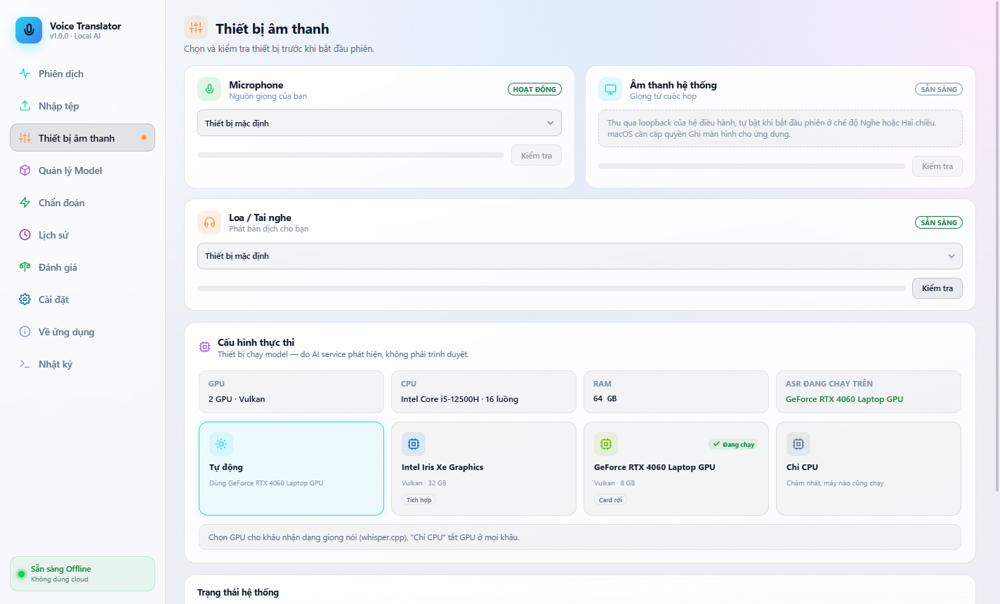

Hình 3.11: Màn hình Thiết lập

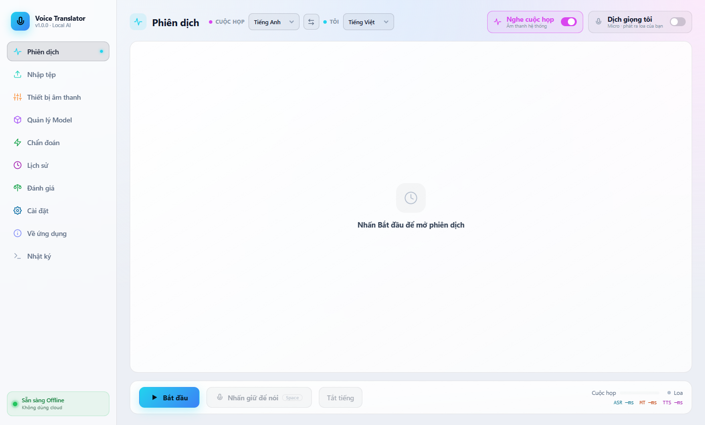

Hình 3.12: Màn hình Phiên dịch

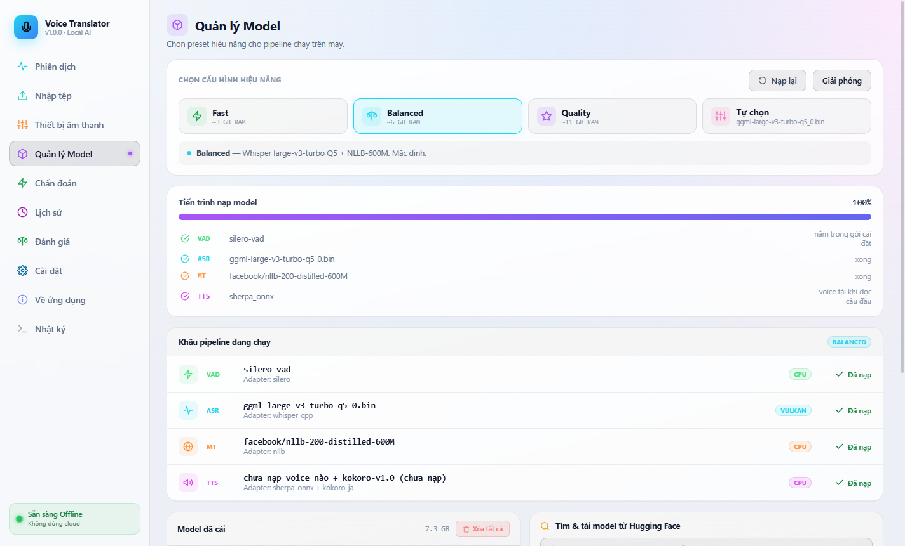

Hình 3.13: Màn hình Quản lý mô hình

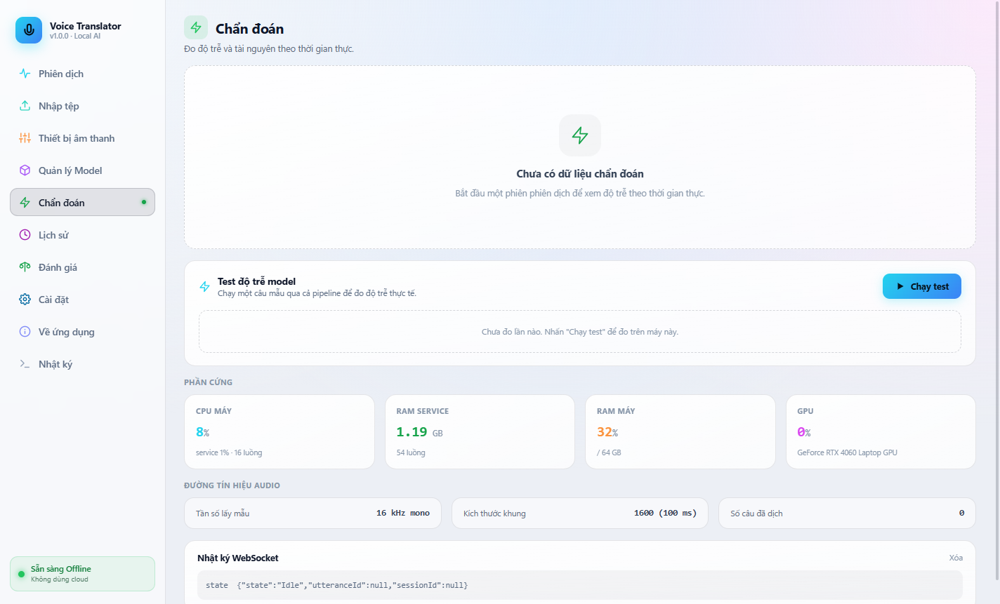

Hình 3.14: Màn hình Chẩn đoán

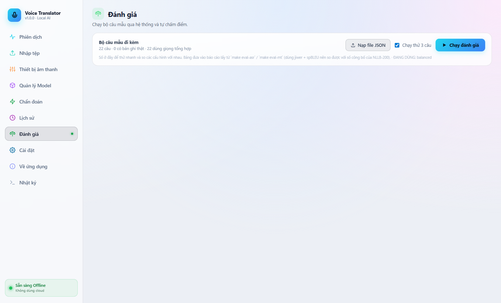

Hình 3.15: Màn hình Đánh giá

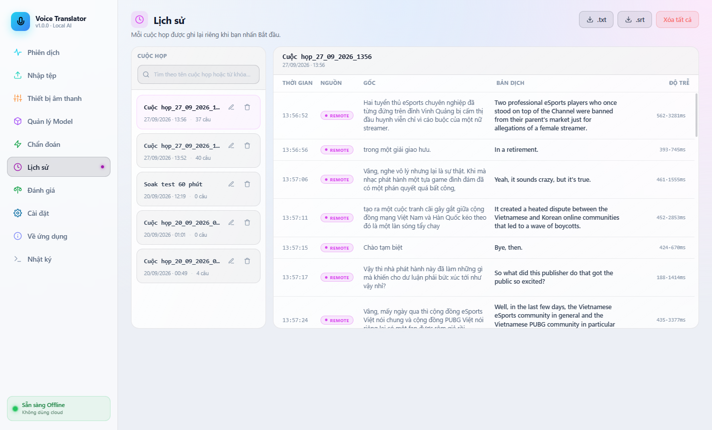

Hình 3.16: Màn hình Lịch sử

## 3.9. Tích hợp Google Meet — đã hiện thực, rồi tắt

### 3.9.1. Cách nó hoạt động

Google Meet chạy trong trình duyệt và chỉ nhận âm thanh từ một thiết bị microphone của hệ điều
hành — không có cách nào đẩy âm thanh từ ứng dụng khác vào. Vì vậy ứng dụng phát giọng đã dịch
ra một **thiết bị âm thanh ảo** (BlackHole trên macOS, VB-CABLE trên Windows), và người dùng
chọn thiết bị đó làm microphone trong Meet; Meet coi nó như một microphone bình thường (Hình
3.17).

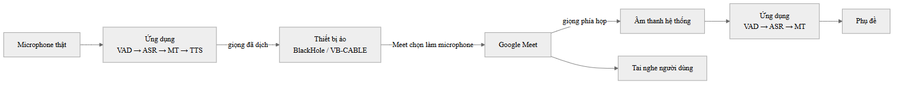

Hình 3.17: Đường tín hiệu của tích hợp Google Meet (đã tắt)

Phần này đã chạy được thật ở Tuần 7. Màn hình Thiết lập gợi ý thiết bị ảo theo tên
(`blackhole`, `vb-cable`, `cable input`, `voicemeeter`…) nhưng luôn để người dùng tự chọn — đoán
sai mà tự động chọn thì cả buổi họp không ai nghe thấy gì.

### 3.9.2. Vì sao tắt

Giảng viên hướng dẫn gợi ý cân nhắc bỏ ràng buộc Google Meet ngay từ buổi họp ngày 19/08/2026:
kịch bản nói liên tục trong cuộc họp làm lộ rõ hai điểm yếu — Whisper bịa câu trên đoạn im lặng,
và hệ thống không tìm được điểm ngắt câu khi người nói không nghỉ. Ngày 10/09/2026 thì chốt bỏ,
vì cả hai điểm yếu đó tuy đã có mã xử lý nhưng **chưa kiểm chứng được trên giọng người thật**:
cần một bản ghi có người nói liên tục ít nhất 30 giây, mà tín hiệu tổng hợp không dùng được —
Silero ngừng coi âm thanh nhân tạo là giọng nói sau khoảng 3,5 giây. Giữ một tính năng chưa
chứng minh được là ổn định vào ngày bảo vệ thì rủi ro hơn là bỏ.

Ba lý do phụ củng cố quyết định:

- **Phụ thuộc driver bên thứ ba.** Người chấm phải cài BlackHole hoặc VB-CABLE rồi khởi động lại
  máy mới thấy được tính năng — một rào cản không liên quan gì tới phần AI, vốn là nội dung của
  đề tài.
- **Người trong cuộc họp nghe bản dịch thay cho giọng gốc**, vì microphone của Meet lúc đó là
  thiết bị ảo. Muốn họ nghe cả hai thì phải trộn hai nguồn bằng công cụ ngoài.
- **Không đo được.** Mọi số đo của đồ án dừng ở đầu ra TTS; phần truyền qua microphone ảo
  vào Meet không có cách đo.

Về sau (mục 4.7.1), điểm yếu thứ hai — tách câu khi người nói không nghỉ — đã được kiểm chứng
trên giọng người thật; điểm yếu thứ nhất thì chưa. Quyết định vì vậy vẫn giữ nguyên.

### 3.9.3. Bật lại

Mã nguồn còn nguyên, chỉ tắt ở lớp giao diện: hàm chọn thiết bị phát của bộ phát giọng (vẫn
được dùng, giờ để chọn loa), hàm nhận diện thiết bị ảo theo tên, và khóa lưu thiết bị ảo trong
cấu hình người dùng. Bật lại chỉ cần dựng lại một thẻ chọn thiết bị ở màn hình Thiết lập và cho
bộ điều khiển phiên ưu tiên thiết bị ảo khi chọn nơi phát. Cơ chế chống vòng lặp (mục 3.3.3)
**không** thuộc phần bị tắt — nó vẫn cần vì ứng dụng vẫn thu toàn bộ âm thanh hệ thống.

## 3.10. Đóng gói và triển khai

### 3.10.1. Bộ Python tự chứa

Bộ cài phải chạy trên máy không có Python, Node hay trình quản lý gói nào. Phần dịch vụ AI được
đóng gói thành **một bản sao của trình thông dịch CPython độc lập** (bản dựng sẵn mà uv phân
phối) với dịch vụ cài thẳng vào đó. Hai cách thông dụng hơn đều bị loại:

- **Môi trường ảo (venv)** không di chuyển được: tệp cấu hình của nó ghi đường dẫn tuyệt đối tới
  trình thông dịch gốc trên máy đóng gói.
- **PyInstaller** phải khai báo tay mọi thư viện động đi kèm PyTorch, sherpa-onnx, pywhispercpp
  và OpenJTalk — dễ sót, và sót thì chỉ lộ ra trên máy người dùng.

Trình thông dịch độc lập tự tìm thư mục của nó từ vị trí tệp chạy, nên chạy được ở bất cứ đâu nó
được đặt vào. Ứng dụng desktop khởi động nó khi mở (chỉ trong bản cài; khi phát triển, dịch vụ
chạy riêng), kiểm tra cổng trước khi khởi động, tắt nó khi thoát — không thì dịch vụ sống sót
thành tiến trình mồ côi giữ cổng 8756 — và ghi log vào thư mục dữ liệu của ứng dụng, vì bản cài
không có cửa sổ dòng lệnh để in ra.

Bản macOS (`.dmg`, 592 MB, gồm cả runtime MLX) được ký ad-hoc thay vì ký bằng chứng chỉ nhà phát
triển Apple: thêm 1,6 GB vào gói ứng dụng làm hỏng chữ ký gốc của Electron, và gói có chữ ký hỏng
bị từ chối thẳng trên máy khác. Ký lại ad-hoc đưa nó về mức "nhấp chuột phải → Mở". Có tài khoản
nhà phát triển Apple thì bỏ bước này và ký, công chứng bình thường.

### 3.10.2. Bộ cài Windows và whisper.cpp trên Vulkan

Bộ cài Windows (`.exe`, 371 MB, khoảng 1,8 GB sau khi cài) phải dựng trên chính máy Windows vì
PyTorch, sherpa-onnx và pywhispercpp đều mang thư viện native, không biên dịch chéo được. Bản
đầu chạy whisper.cpp bằng CPU: khoảng 17,6 giây cho 3 giây âm thanh, tăng số luồng lên 12 cũng
chỉ còn 11,2 giây — không dùng được.

Thay vì đóng gói bản CUDA (thêm khoảng 1 GB và chỉ chạy trên card NVIDIA), bộ cài mang bản
pywhispercpp dựng với **Vulkan**, chỉ thêm khoảng 18 MB. Vulkan có sẵn trong driver của mọi GPU
phổ thông, nên cùng một bộ cài chạy GPU được trên NVIDIA, AMD và Intel. Ý tưởng này lấy từ
TranscriptionSuite [10]. Bản dựng kèm sẵn thư viện nạp Vulkan, để trên máy không có driver
Vulkan thì whisper.cpp không thấy GPU nào và tự lùi về CPU thay vì không khởi động được.

Bộ cài được kiểm theo bốn tầng từ trong ra ngoài (Bảng 3.10); mỗi tầng loại bớt một nhóm nguyên
nhân, để khi có lỗi thì biết nó nằm ở đâu.

Bảng 3.10: Kiểm tra bộ cài Windows theo bốn tầng

| Tầng | Kiểm gì               | Cách kiểm                                                   | Kết quả                                             |
| ---- | --------------------- | ----------------------------------------------------------- | --------------------------------------------------- |
| 1    | Bộ Python đóng gói    | Tự nạp thử PyTorch, transformers, sherpa-onnx, pywhispercpp | Đạt                                                 |
| 2    | Dịch vụ chạy từ bộ đó | Gọi `/health`, nạp preset Cân bằng, đo độ trễ               | Nạp đủ bốn khâu trong 34 s, ASR báo Vulkan          |
| 3    | Bộ cài `.exe` thật    | Cài im lặng, mở ứng dụng, đọc log, đóng ứng dụng, gỡ cài    | Dịch vụ tự lên sau 12 s; đóng ứng dụng thì nhả cổng |
| 4    | Tốc độ trên bản cài   | Đo độ trễ vào dịch vụ mà ứng dụng tự khởi động              | ASR 3 s âm thanh: 17.573 ms → 437 ms                |

Quá trình này làm lộ ra bảy lỗi, đều đã sửa. Hai lỗi đáng nêu vì chúng ảnh hưởng người dùng thật:
luồng xuất chuẩn của Python bị chuyển hướng trên Windows mặc định dùng bảng mã cp1252, nên mọi
dòng log tiếng Việt thành lỗi — mà log là thứ duy nhất đọc được khi bộ cài lỗi trên máy người khác
(sửa bằng cách chạy Python ở chế độ UTF-8); và lỗi chọn nhầm GPU tích hợp đã nêu ở mục 3.7.2.

## 3.11. Kiểm thử phần mềm

Hệ thống có ba lớp kiểm thử (Bảng 3.11); sự phân chia là có chủ đích.

Bảng 3.11: Ba lớp kiểm thử

| Lớp                | Công cụ        | Phạm vi                                                                     | Số bài                     |
| ------------------ | -------------- | --------------------------------------------------------------------------- | -------------------------- |
| Đơn vị — dịch vụ   | pytest         | Chuỗi xử lý, bộ tách câu, lọc câu bịa, quản lý mô hình, API, lịch sử, độ đo | 327 đạt, 6 bỏ qua có lý do |
| Đơn vị — giao diện | vitest + jsdom | Quy tắc tên mô hình, điều khiển phiên, các màn hình trên dịch vụ giả        | 69 đạt                     |
| Đầu-cuối           | Playwright     | Ứng dụng Electron đã dựng thật + dịch vụ thật + tải một mô hình thật        | 11 đạt                     |

Hai lớp đầu **không chạm tới mô hình thật**: phía dịch vụ, một fixture thay bộ nạp mô hình bằng
mô hình giả cho mọi bài kiểm thử; phía giao diện, lời gọi mạng được giả lập và một bộ khung ghi
lại mọi lời gọi tới dịch vụ giả. Nhờ vậy hai lớp này chạy trong vài giây, không cần mạng và cho
kết quả tất định. Lớp đầu-cuối là lớp duy nhất chứng minh được ba phần — tiến trình chính của
Electron, giao diện và dịch vụ Python — thật sự khớp với nhau.

Bộ kiểm thử cũng phải sạch trên cả hai nền tảng. Lần đầu chạy trên Windows có 13 bài hỏng, đều
do môi trường chứ không do mã sai — tạo liên kết tượng trưng cần quyền quản trị, một đường dẫn
viết cứng kiểu Unix, và ba bài chỉ chạy được khi có runtime MLX. Cả 13 đã được sửa, vì một bộ
kiểm thử hỏng sẵn thì lần hỏng thật cũng chìm luôn trong đó.

Có một nhóm lỗi mà không lớp kiểm thử nào bắt được: sáu lỗi lộ ra khi lần đầu chạy bộ đánh giá
trên Windows đều nằm ở chỗ tiếp giáp giữa môi trường và thư viện — một thư viện hỏi sai hàm để
biết có GPU hay không, một thư viện CUDA thiếu ở câu đầu tiên sau khi đã tải xong 1,6 GB — chứ
không nằm trong logic. Chúng chỉ lộ ra khi chạy thật, và đó là lý do Chương 4 coi việc đo trên
máy thật là một phần của kiểm thử chứ không chỉ để lấy số.

---

# Chương 4. THỬ NGHIỆM VÀ ĐÁNH GIÁ

## 4.1. Mục tiêu và phương pháp

Chương này trả lời bốn câu hỏi:

1. Từng khâu **chính xác tới đâu** trên dữ liệu chuẩn — nhận dạng bao nhiêu phần trăm lỗi,
   dịch tốt tới đâu?
2. Cả chuỗi có **theo kịp người nói** không, trên hai cấu hình máy khác nhau?
3. Hệ thống có **chạy ổn định** trong một cuộc họp dài không?
4. Các con số đo trên dữ liệu chuẩn **lạc quan tới đâu** so với giọng người nói thật?

Ba câu đầu dùng bộ dữ liệu công khai FLEURS [3] để kết quả tái lập được và đặt cạnh số công
bố. Câu thứ tư dùng bản ghi giọng người nói tự phát. Mọi lượt đo được chạy bằng script trong
mã nguồn và lưu kết quả gốc dưới dạng JSON cùng mã nguồn; bảng trong chương này là phần tổng
hợp từ các tệp đó.

Ba nguyên tắc đo được giữ xuyên suốt:

- **Đo nóng.** Lần chạy đầu gồm cả thời gian nạp mô hình và dựng đồ thị suy luận: đo nguội
  cho 34,7 giây, trong khi sau khi làm nóng thì lần thứ nhất 1,67 giây, lần thứ hai 1,65 giây.
  Con số công bố là độ trễ khi hệ thống đã chạy ổn định, không gồm thời gian khởi động.
- **Mỗi khâu một đầu vào cố định.** Nếu đưa kết quả nhận dạng vào dịch thì khi ASR trả chuỗi
  rỗng, MT sẽ "nhanh" một cách giả tạo. Khâu dịch vì vậy được đo trên văn bản tham chiếu.
- **Giải mã tất định.** Cả ba runtime ASR tắt giải mã lại theo nhiệt độ, nên chạy lại trên
  máy khác cho đúng con số WER cũ — chỉ thời gian là thay đổi theo phần cứng.

## 4.2. Môi trường và dữ liệu thử nghiệm

Bảng 4.1: Cấu hình máy thử nghiệm

| Máy     | Hệ điều hành                 | CPU                            | GPU                                                    | Runtime ASR · MT · TTS                  |
| ------- | ---------------------------- | ------------------------------ | ------------------------------------------------------ | --------------------------------------- |
| macOS   | macOS 26.6                   | Apple M4                       | GPU tích hợp của M4                                    | MLX/Metal · PyTorch/MPS · CPU           |
| Windows | Windows 11 Pro (build 26200) | Intel Core i5-12500H, 16 luồng | NVIDIA RTX 4060 Laptop 8 GB + Intel Iris Xe (tích hợp) | whisper.cpp/Vulkan · PyTorch/CUDA · CPU |

Máy Windows có 16 GB RAM. Hai cấu hình khác nhau cả phần cứng lẫn runtime, nên **thời gian
và RTF của hai máy không đặt chung một cột**; chỉ WER, CER và điểm dịch — vốn không phụ thuộc
phần cứng — là so được giữa hai máy.

Bảng 4.2: Dữ liệu thử nghiệm

| Dữ liệu                      | Dùng cho                 | Quy mô                                                                  |
| ---------------------------- | ------------------------ | ----------------------------------------------------------------------- |
| FLEURS `test`, âm thanh      | ASR                      | 3.099 bản thu, 10,22 giờ: vi 857 · en 647 · zh 945 · ja 650             |
| FLEURS `test`, văn bản       | MT                       | 2.022 cặp câu, sáu chiều (vi↔en 347, vi↔zh 346, vi↔ja 318 mỗi chiều)    |
| FLEURS `test`, âm thanh      | Độ trễ cả chuỗi          | 50 mẫu mỗi chiều × 6 chiều                                              |
| Sóng tổng hợp theo nhịp thật | Chạy liên tục            | 60 phút, 877 câu                                                        |
| Ba bản ghi YouTube           | Tách câu                 | Bản tin đọc 688 s · phỏng vấn tự phát 3.596 s · thuyết trình TEDx 669 s |
| 25 đoạn phỏng vấn            | ASR + MT trên giọng thật | 149 s tiếng nói, câu tham chiếu nghe và sửa tay                         |

FLEURS là bộ giọng **đọc**: người thu âm đọc các câu văn soạn sẵn từ Wikipedia, rõ ràng, ít
nhiễu, gần như không có từ đệm hay ngắt quãng. Cả bốn ngôn ngữ của đề tài đều có trong bộ, và
bài báo NLLB cũng đánh giá trên cùng họ dữ liệu FLORES, nên số đo so được với công bố. Đó là
lý do chọn nó — và cũng là lý do phải đo thêm trên giọng thật ở mục 4.7.

## 4.3. Nhận dạng tiếng nói

Bảng 4.3 tổng hợp ba lượt nhận dạng trên cùng 3.099 bản thu, mỗi lượt một runtime. Cả ba lượt
tắt bộ lọc câu bịa — tức là đo chính mô hình, không đo lớp xử lý của sản phẩm phía sau.

Bảng 4.3: Nhận dạng tiếng nói trên FLEURS

| Ngôn ngữ       | Độ đo | whisper.cpp — Windows | faster-whisper — Windows |    MLX — macOS |
| -------------- | ----- | --------------------: | -----------------------: | -------------: |
| Mô hình        |       |   large-v3-turbo q5_0 |      large-v3-turbo fp16 | large-v3 8-bit |
| vi             | WER   |             **10,4%** |                 **9,2%** |       **8,8%** |
| en             | WER   |                  5,0% |                     5,0% |           4,8% |
| zh             | CER   |                  8,6% |                     8,3% |           8,1% |
| ja             | CER   |                  4,9% |                     4,7% |           4,7% |
| RTF ASR        |       |                 0,018 |                    0,034 |          0,141 |
| Câu rỗng       |       |                     2 |                        1 |              0 |
| Tổng thời gian |       |               11 phút |                  21 phút |        86 phút |

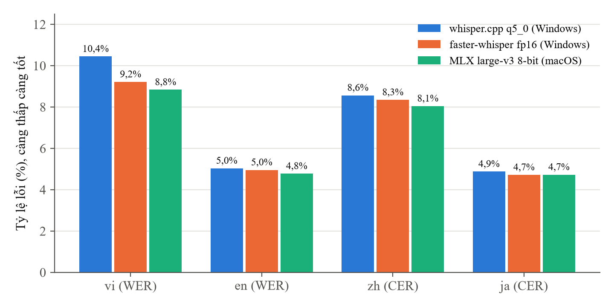

Hình 4.1: WER/CER của ba runtime nhận dạng trên FLEURS

**Tiếng Việt khó gần gấp đôi tiếng Anh** ở cả ba cột: 8,8–10,4% so với 4,8–5,0%. Đây là chiều
quan trọng nhất của đề tài, và con số này là mức sàn vì FLEURS là giọng đọc.

**Ba runtime xếp cùng một thứ tự ở cả bốn thứ tiếng**: MLX tốt nhất, faster-whisper ở giữa,
whisper.cpp cuối. Chênh lệch nhỏ và đều một chiều — 0,2 điểm ở en và ja, 0,3–0,5 ở zh, 1,6 ở
vi — nên là chênh thật chứ không phải nhiễu. Nhưng đó **không phải chênh giữa ba runtime**: ba
cột là ba mô hình khác nhau, vì ba runtime không dùng chung tệp mô hình nào (mục 2.4.3). Cặp so
được gần nhất là hai cột Windows — cùng `large-v3-turbo`, chỉ khác lượng tử hóa — và ở đó q5_0
kém fp16 đúng 1,2 điểm WER tiếng Việt, trong khi tiếng Anh không đổi. Lượng tử hóa mạnh ảnh
hưởng tới tiếng Việt nhiều hơn tiếng Anh.

**Đổi lại, q5_0 nhanh gấp đôi** (RTF 0,018 so với 0,034). Đây là đánh đổi mà cấu hình cần trình
bày cho người dùng: 1,2 điểm WER tiếng Việt đổi lấy một nửa thời gian nhận dạng. Với độ trễ cả
chuỗi còn dư nhiều (mục 4.5), đổi sang faster-whisper trên máy có card NVIDIA là một lựa chọn có
cơ sở nếu ưu tiên chất lượng.

**Cột "câu rỗng"** là chốt chặn chống đo hỏng: sai mã ngôn ngữ hay sai đường đọc âm thanh làm
mô hình trả rỗng hàng loạt và WER thành 100%. Cả ba cột dưới 0,25%, đều ở tiếng Việt.

**Cột RTF của MLX không đặt cạnh hai cột kia**: 0,141 là M4, hai cột còn lại là RTX 4060. Khác
máy.

Có một phép đo phụ đáng ghi lại. whisper.cpp cho phép giảm độ dài ngữ cảnh âm thanh của encoder
(`audio_ctx`) để tăng tốc. Chạy lại đúng lượt whisper.cpp ở trên với `audio_ctx = 768`, WER/CER
tăng từ 10,4% lên 33,7% (vi), 5,0% lên 31,4% (en), 8,6% lên 45,1% (zh) và 4,9% lên 46,5% (ja),
số câu rỗng từ 2 lên 56 — để đổi lấy chỉ 6–26% thời gian nhận dạng. Tùy chọn này vì vậy được giữ
tắt, với số đo làm bằng chứng.

## 4.4. Dịch máy

Bảng 4.4: Dịch máy trên FLEURS (NLLB-200 distilled 600M, máy macOS)

| Chiều | Số câu | spBLEU |  chrF++ | COMET      |
| ----- | -----: | -----: | ------: | ---------- |
| vi→en |    347 |  35,79 |   57,10 | 0,8525     |
| en→vi |    347 |  37,13 |   54,69 | 0,8505     |
| vi→zh |    346 |  17,15 | _16,14_ | **0,7729** |
| zh→vi |    346 |  22,33 |   42,77 | 0,8213     |
| vi→ja |    318 |  10,96 | _19,88_ | 0,8239     |
| ja→vi |    318 |  19,91 |   40,19 | 0,8191     |

Điểm dịch không phụ thuộc phần cứng, nên một lượt trên một máy là đủ. COMET dùng
`Unbabel/wmt22-comet-da`; chrF++ của hai đích zh/ja in nghiêng vì lý do ở mục 2.8.2.

**COMET xếp hạng khác hẳn spBLEU.** Theo spBLEU, vi→ja (10,96) tệ hơn vi→zh (17,15) tới 6 điểm.
Theo COMET thì ngược lại: vi→ja 0,8239 cao hơn vi→zh 0,7729. spBLEU khớp chuỗi bề mặt nên phạt
rất nặng những ngôn ngữ có hệ chữ khác hẳn nguồn; COMET chấm theo nghĩa. Kết luận "dịch sang
tiếng Nhật kém nhất" rút ra từ riêng spBLEU là sai. Chiều yếu nhất thật sự là **vi→zh** — ở đó cả
hai loại độ đo đồng ý.

**chrF++ của hai đích zh/ja không so ngang được.** vi→zh có chrF++ 16,14, thấp hơn cả spBLEU của
chính nó, trong khi vi→en là 57,10 so với 35,79. Nguyên nhân là phần n-gram cấp từ của chrF++
gần như bằng 0 khi không có khoảng trắng — phiên bản dịch máy của chuyện WER/CER ở mục 2.8.1.

**Không lấy trung bình sáu chiều.** Sáu chiều có độ khó rất khác nhau; một con số gộp trộn hai
nhóm không cùng thang và không nói lên điều gì. Tương tự, COMET chỉ có độ tin cao ở các cặp giàu
dữ liệu, nên khoảng chênh vài phần nghìn giữa các chiều không đủ để kết luận — chỉ khoảng cách
lớn như vi→zh (0,77) so với vi→en (0,85) mới đáng nói.

## 4.5. Độ trễ và hệ số thời gian thực

Mỗi chiều được đo trên 50 mẫu FLEURS, chạy đủ chuỗi VAD → ASR → MT → TTS. Cột ASR, MT, TTS là
thời gian trung bình mỗi mẫu; mỗi mẫu là một phát ngôn FLEURS dài trung bình khoảng 12 giây,
thường bị bộ tách câu cắt thành nhiều đoạn, nên các cột này là tổng cộng dồn của các đoạn đó
chứ không phải thời gian cho một câu.

Bảng 4.5: Độ trễ và RTF trên máy macOS (MLX large-v3 8-bit)

| Chiều |      ASR |       MT |      TTS |  Tổng TB | RTF TB | RTF p90   | Chờ chốt |
| ----- | -------: | -------: | -------: | -------: | -----: | --------- | -------: |
| vi→en | 4.595 ms | 1.129 ms |   318 ms | 6.095 ms |  0,486 | 0,580     |   256 ms |
| en→vi | 2.421 ms |   953 ms |   273 ms | 3.693 ms |  0,392 | **0,496** |   202 ms |
| vi→zh | 4.598 ms | 1.134 ms | 1.693 ms | 7.478 ms |  0,595 | 0,727     |   256 ms |
| zh→vi | 2.623 ms |   965 ms |   274 ms | 3.911 ms |  0,375 | 0,509     |   200 ms |
| vi→ja | 4.646 ms | 1.025 ms | 2.261 ms | 7.987 ms |  0,639 | 0,786     |   256 ms |
| ja→vi | 2.859 ms | 1.052 ms |   290 ms | 4.255 ms |  0,324 | **0,395** |   211 ms |

Bảng 4.6: Độ trễ và RTF trên máy Windows (whisper.cpp/Vulkan + NLLB/CUDA)

| Chiều |    ASR |     MT |      TTS |  Tổng TB | RTF TB | RTF p90   | Chờ chốt |
| ----- | -----: | -----: | -------: | -------: | -----: | --------- | -------: |
| vi→en | 570 ms | 459 ms |   373 ms | 1.531 ms |  0,124 | 0,146     |   256 ms |
| en→vi | 308 ms | 390 ms |   327 ms | 1.137 ms |  0,121 | 0,148     |   202 ms |
| vi→zh | 577 ms | 458 ms | 1.969 ms | 3.133 ms |  0,255 | 0,273     |   256 ms |
| zh→vi | 330 ms | 392 ms |   336 ms | 1.177 ms |  0,113 | 0,147     |   200 ms |
| vi→ja | 612 ms | 507 ms | 2.510 ms | 3.833 ms |  0,308 | **0,383** |   256 ms |
| ja→vi | 360 ms | 440 ms |   352 ms | 1.288 ms |  0,099 | **0,114** |   211 ms |

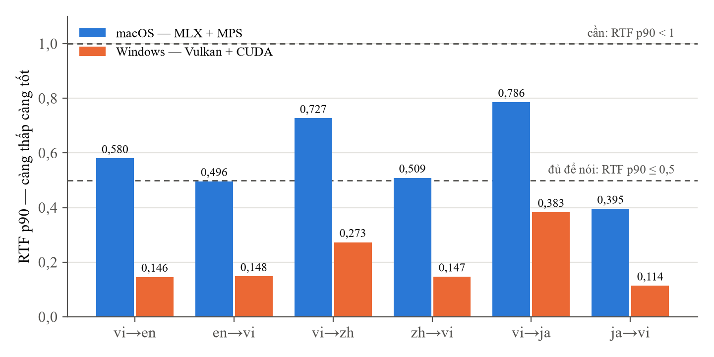

Hình 4.2: RTF p90 của sáu chiều dịch trên hai cấu hình máy

**Cả sáu chiều đạt điều kiện cần RTF p90 < 1 trên cả hai máy.** Ngưỡng "đủ để nói" RTF p90 ≤ 0,5
thì khác nhau: trên máy macOS chỉ hai chiều đạt — en→vi 0,496 và ja→vi 0,395; zh→vi 0,509 trượt
sát mép, và chiều xấu nhất là vi→ja 0,786. Trên máy Windows **cả sáu chiều đều đạt**, chiều xấu
nhất là vi→ja 0,383 — còn dư hơn một nửa ngân sách.

**Trên máy macOS, hai nguyên nhân tách bạch được và nằm ở hai đầu khác nhau.** Nguồn tiếng Việt
làm ASR đắt gần gấp đôi (khoảng 4,6 giây so với 2,4–2,9 giây), khớp với việc tiếng Việt cũng khó
gấp đôi ở Bảng 4.3. Đích tiếng Trung hoặc tiếng Nhật làm TTS đắt gấp 6–8 lần (1.693 ms và 2.261 ms
so với 273–318 ms cho đích vi/en) — cái giá của việc tiếng Nhật phải đi qua Kokoro và OpenJTalk
thay vì sherpa-onnx.

**Trên máy Windows, khâu chậm nhất đã đổi** (Hình 4.3). whisper.cpp chạy GPU qua Vulkan và NLLB
chạy trên CUDA làm ASR và MT giảm 4–8 lần, trong khi TTS — vẫn chạy CPU trên cả hai máy — gần như
giữ nguyên. Ở hai đích tiếng Nhật và tiếng Trung, TTS chiếm 65% và 63% toàn chuỗi. Chỗ đáng tối
ưu tiếp theo vì vậy không còn là nhận dạng tiếng Việt, mà là **tổng hợp giọng cho hai đích ja/zh**.

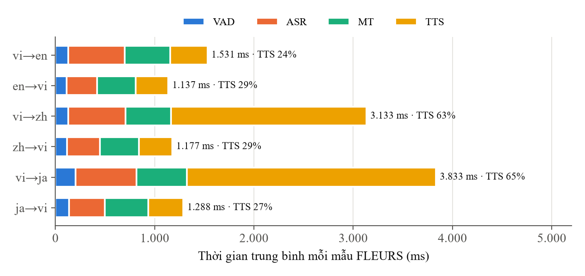

Hình 4.3: Thời gian từng khâu trên cấu hình Windows

**Cột "chờ chốt"** (200–256 ms) là thời gian từ lúc người nói dứt câu tới lúc bộ tách câu nhả câu
ra. Nó không nằm trong RTF vì không phải thời gian tính toán, nhưng người dùng vẫn phải ngồi chờ
nên được in riêng. Nó chỉ phụ thuộc ngôn ngữ **nguồn** — đúng như mong đợi — và giống hệt nhau
trên hai máy, vì bộ tách câu chạy như nhau ở mọi nơi.

**Đối chiếu với mục tiêu cho một câu ngắn.** Hai bảng trên trả lời câu hỏi "có theo kịp luồng nói
liên tục không". Yêu cầu PCN01–PCN02 hỏi một câu khác: một **câu ngắn** mất bao lâu. Bảng 4.7 đo
đúng câu hỏi đó, bằng âm thanh 3 giây qua công cụ đo độ trễ trong ứng dụng.

Bảng 4.7: Độ trễ từng khâu với câu 3 giây so với mục tiêu (máy macOS, preset Cân bằng)

| Chiều        |   VAD |        ASR |         MT |        TTS |       Tổng |
| ------------ | ----: | ---------: | ---------: | ---------: | ---------: |
| vi→en        | 46 ms |   1.060 ms |     569 ms |     141 ms |   1.819 ms |
| en→vi        | 46 ms |     991 ms |     579 ms |     148 ms |   1.766 ms |
| vi→ja        | 48 ms |   1.056 ms |     460 ms |     772 ms |   2.338 ms |
| vi→zh        | 46 ms |   1.038 ms |     558 ms |     969 ms |   2.613 ms |
| **Mục tiêu** |       | < 1.500 ms | < 1.000 ms | < 1.500 ms | < 4.000 ms |

Cả bốn mốc đều đạt ở cả bốn chiều. Trên bản cài Windows, cùng phép đo cho ASR 362–480 ms.

## 4.6. Độ ổn định và tài nguyên

Bài chạy liên tục phát một lượt nói mỗi vài giây theo **nhịp thời gian thực** — dồn cục âm thanh
vào thì đo ra một thứ khác hẳn — với mô hình thật trên máy Windows, trong 60 phút. Ba thứ được theo
dõi: dịch vụ còn sống không, bộ nhớ có tăng đều không, và độ trễ của 10% câu đầu so với 10% câu cuối.

Bảng 4.8: Kết quả chạy liên tục 60 phút

| Chỉ số                           | Giá trị                          |
| -------------------------------- | -------------------------------- |
| Thời gian chạy                   | 3.602 s                          |
| Số câu thành công / lỗi          | **877 / 0**                      |
| Độ trễ p50 · p95 · lớn nhất      | 443 ms · 541 ms · 591 ms         |
| Trôi độ trễ (10% cuối − 10% đầu) | +1,8 ms                          |
| Bộ nhớ RSS của dịch vụ           | 1.110 MB → 1.122 MB (**+12 MB**) |
| Mất kết nối                      | Không                            |

Độ trễ không trôi và bộ nhớ tăng 12 MB trong một giờ là dấu hiệu không có rò rỉ đáng kể: nếu mỗi
câu giữ lại dù chỉ một khung âm thanh 100 ms, 877 câu đã là thêm khoảng 2,8 MB, và một lỗi giữ lại
bản sao đầu vào của mô hình sẽ lộ ra ở mức hàng trăm megabyte.

Về tài nguyên: trên máy macOS, sau khi nạp đủ Whisper, NLLB và cả bốn giọng đọc, dịch vụ chiếm
2.055 MB bộ nhớ. Dịch vụ mở trong khoảng 0,4 giây nhờ nạp mô hình theo yêu cầu (mục 3.3.4); nạp đủ
bốn khâu của một preset mất 13,2 giây trên máy macOS và 34 giây trên bản cài Windows, khi mô hình đã
có sẵn trên đĩa.

## 4.7. Đánh giá trên giọng người thật

FLEURS là giọng đọc, nên con số ở mục 4.3 chắc chắn thấp hơn trong một cuộc họp thật. Mục này đo
khoảng cách đó. Số ở đây **không thay** các bảng FLEURS — quy mô quá nhỏ để làm số chính — mà đặt
cạnh chúng để biết các bảng đó lạc quan tới đâu.

### 4.7.1. Tách câu trên ba loại giọng

Bộ tách câu được chạy trên ba bản ghi, mỗi bản ít nhất 11 phút, đại diện ba kiểu nói: **đọc kịch
bản** (bản tin truyền hình), **hội thoại tự phát** (một buổi phỏng vấn tuyển dụng hai người) và
**thuyết trình tự do** (một bài nói TEDx). Phép đo chỉ chạy Silero VAD, đẩy âm thanh vào theo đúng
khung 100 ms như ứng dụng gửi lên, và so bốn cấu hình: tham số cũ trước khi sửa (một ngưỡng im lặng
300 ms, trần 20 giây) và ba preset.

Bảng 4.9: Tách câu trên ba loại giọng người

| Bản ghi            | Kiểu giọng        | Cấu hình         | Số đoạn | Dài p90 | Cắt cứng | Chờ chốt TB |
| ------------------ | ----------------- | ---------------- | ------: | ------: | -------: | ----------: |
| Bản tin, 688 s     | Đọc kịch bản      | Cũ (trần 20 s)   |      80 | 12,53 s |       3% |      0,27 s |
|                    |                   | Nhanh (4,5 s)    |     185 |  4,39 s |      40% |      0,20 s |
|                    |                   | Cân bằng (6 s)   |     149 |  5,87 s |      30% |      0,23 s |
|                    |                   | Chất lượng (8 s) |     111 |  7,88 s |      24% |      0,22 s |
| Phỏng vấn, 3.596 s | Hội thoại tự phát | Cũ (trần 20 s)   |     936 |  6,77 s |       0% |      0,28 s |
|                    |                   | Nhanh (4,5 s)    |   1.251 |  4,32 s |      16% |      0,22 s |
|                    |                   | Cân bằng (6 s)   |   1.073 |  5,66 s |      10% |      0,25 s |
|                    |                   | Chất lượng (8 s) |     915 |  6,70 s |       5% |      0,31 s |
| TEDx, 669 s        | Thuyết trình      | Cũ (trần 20 s)   |     311 |  2,61 s |       0% |      0,28 s |
|                    |                   | Nhanh (4,5 s)    |     317 |  2,42 s |       0% |      0,25 s |
|                    |                   | Cân bằng (6 s)   |     294 |  2,86 s |       0% |      0,30 s |
|                    |                   | Chất lượng (8 s) |     255 |  3,79 s |       0% |      0,36 s |

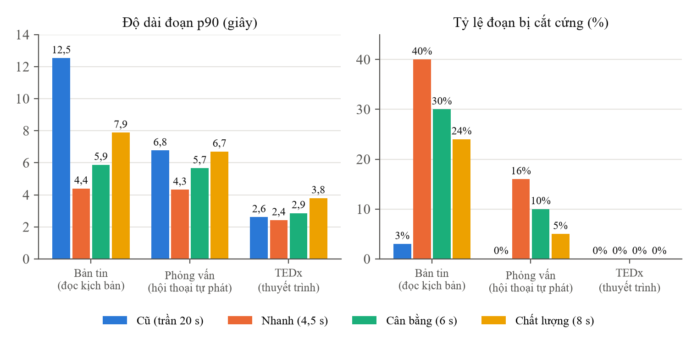

Hình 4.4: Độ dài đoạn p90 và tỷ lệ cắt cứng trên ba loại giọng

Ba điều đọc ra được:

**Vấn đề mà giảng viên hướng dẫn chỉ ra là có thật và đo được.** Với tham số cũ, 10% số câu của bản
tin dài hơn 12,5 giây, và câu tệ nhất có thể dài tới 20 giây — người nghe phải chờ hết chừng đó rồi
mới tới lượt ASR, MT và TTS chạy. Ở hội thoại phỏng vấn, p90 là 6,77 giây — đúng khoảng "phải chờ
câu dài 5–10 giây" trong biên bản họp. Preset Cân bằng kéo hai con số đó xuống 5,87 và 5,66 giây.

**Cải thiện đến từ trần độ dài, không phải từ việc phát hiện im lặng nhanh hơn.** Cột chờ chốt gần
như không đổi ở cả ba bản ghi (0,20–0,36 giây): người nói nào cũng có khoảng nghỉ đủ rõ để ngưỡng
300 ms cũ bắt được. Chỗ tham số cũ làm người dùng phải chờ là khi người ta **nói một mạch không
nghỉ**, và ở đó trần độ dài mới là thứ quyết định.

**Cái giá là cắt giữa câu, và nó thấp nhất đúng ở giọng giống cảnh dùng thật.** Ở bản tin, preset
Cân bằng cắt cứng 30% số đoạn — khâu dịch phải dịch mảnh câu. Ở hội thoại phỏng vấn chỉ còn 10%,
và ở TEDx là 0% với mọi cấu hình: người nói tự nhiên tự ngắt thường xuyên nên trần không bao giờ
phải can thiệp. Ghép ba bản ghi lại mới đủ lập luận: tham số mới chỉ can thiệp khi có người nói
dài, còn hội thoại bình thường gần như không bị ảnh hưởng. Ba preset cũng thể hiện đúng sự đánh đổi
được thiết kế: trần càng ngắn thì câu càng ngắn và cắt cứng càng nhiều.

### 4.7.2. Nhận dạng trên hội thoại tự phát

Từ bản ghi phỏng vấn, 25 đoạn đầu tiên dài 3–12 giây kể từ phút thứ 5 được cắt ra bằng chính bộ
tách câu của hệ thống — **không chọn tay** — tổng cộng 149 giây tiếng nói. Câu tham chiếu được lập
như sau: lấy phụ đề tự sinh của YouTube làm bản nháp, rồi người làm đồ án nghe từng đoạn và sửa
cho khớp lời thật, giữ nguyên cả chỗ người nói nói nhầm. Bước nghe và sửa là bắt buộc: phụ đề tự
sinh cũng là đầu ra của một hệ ASR, và giữ nguyên nó làm câu tham chiếu thì WER đo được chỉ là mức
giống nhau giữa hai hệ ASR. Mô hình là preset Cân bằng — cùng `ggml-large-v3-turbo-q5_0` với cột
whisper.cpp ở Bảng 4.3.

Bảng 4.10: Nhận dạng giọng đọc so với giọng nói tự phát (cùng mô hình, cùng máy)

| Bộ             | Kiểu giọng        | Số câu | WER tiếng Việt |
| -------------- | ----------------- | -----: | -------------: |
| FLEURS `test`  | Đọc câu soạn sẵn  |    857 |      **10,4%** |
| Phỏng vấn thật | Hội thoại tự phát |     25 |      **24,6%** |

Cả hai con số là WER gộp cả tập (152 lỗi trên 618 từ tham chiếu với bộ phỏng vấn). **Giọng nói tự
phát cho WER gấp 2,4 lần giọng đọc.** Lỗi do cách viết số — "cấp ba" so với "cấp 3", "12 A1" so với
"12A1" — chỉ chiếm 0,7 điểm; gỡ riêng phần đó ra còn 23,9%. Gần như toàn bộ phần còn lại là nghe
sai thật. Không đoạn nào bị bộ lọc câu bịa bỏ đi, nên việc bộ lọc bật ở lượt này và tắt ở lượt
FLEURS không ảnh hưởng tới so sánh.

**Phần lớn lỗi nằm ở thuật ngữ tiếng Anh đọc theo giọng Việt.** Buổi phỏng vấn bàn về lập trình
Java, và trong 25 đoạn từ "string" xuất hiện 18 lần. Whisper nghe đúng **một** lần; còn lại nó nghe
thành "stream" (6 lần), "trên" (5 lần) và "chuyên" (3 lần). Người nói đọc "string" gần với
"sờ-trinh", và mô hình gán âm đó vào từ gần nhất trong tiếng Việt hoặc tiếng Anh. Phụ đề tự sinh
của YouTube sai đúng kiểu đó ("spring Buffer", "tram Buffer", "cái trên a"), cho thấy đây là giới
hạn chung của nhận dạng đa ngôn ngữ khi người nói chen từ tiếng Anh vào câu tiếng Việt, không phải
riêng của whisper.cpp.

### 4.7.3. Hai lỗi của khâu dịch mà dữ liệu giọng đọc không bắt được

25 đoạn trên được dịch sang cả ba đích en, ja, zh (75 lượt dịch), với bản dịch tham chiếu bám câu
nguồn, kể cả chỗ người nói nói nhầm. Điểm chrF ký tự đo được là 38,3% (en), 10,8% (ja) và 13,4%
(zh). Các con số này **chỉ dùng để đọc cùng phần phân tích lỗi**, không so với Bảng 4.4: bản dịch
tham chiếu không do dịch giả soạn; chrF ký tự trên chữ Hán và Kana khắt khe hơn nhiều so với chữ
Latin; và tham chiếu ja/zh giữ nguyên các thuật ngữ bằng chữ Latin trong khi NLLB dịch chúng ra —
bị trừ điểm dù đúng nghĩa. Thứ đáng nói ở đây là hai **lỗi hành vi**:

1. **Vòng lặp mất kiểm soát** — 2 trên 75 lượt, đều sang tiếng Nhật. Một đoạn mở đầu bằng từ đệm
   ("dạ đúng ạ. Ừ trong tình huống đó…") được dịch thành "そうだ." lặp lại hơn 50 lần; một đoạn khác
   thành "a+b+1+1+2+3+3+3+3…". Adapter NLLB không bật cơ chế chặn lặp nào (mục 2.5), chỉ có trần 256
   token, nên vòng lặp chạy tới khi chạm trần — và trong phiên trực tiếp, TTS sẽ đọc to toàn bộ.
   FLEURS không kích hoạt được lỗi này vì câu đọc không mở đầu bằng từ đệm.
2. **Dịch nghĩa đen thuật ngữ.** Từ "spring" (người nói dùng từ này) được dịch thành 春天 — mùa
   xuân — ở đích tiếng Trung, "春のバッファー" ở đích tiếng Nhật, và có lần thành "春节器" (thiết bị
   Tết Nguyên đán). NLLB không có khái niệm thuật ngữ cần giữ nguyên.

Lỗi thứ nhất sửa được bằng tham số sinh của NLLB hoặc một bộ lọc sau khi dịch giống bộ lọc câu bịa
của ASR. Nó **chưa được sửa trong đồ án**: đổi tham số sinh của NLLB làm thay đổi hành vi dịch,
nên bảng spBLEU/COMET ở mục 4.4 phải chạy lại mới còn khớp với mã nguồn, và phát hiện này có sau
lượt đo đó. Nó được đưa vào hướng phát triển (mục 5.3).

### 4.7.4. Giới hạn của phép đo trên giọng thật

Một bản ghi, hai người nói, một chủ đề, một điều kiện thu âm, 25 đoạn, câu tham chiếu do một người
nghe. Con số 24,6% cho thấy **độ lớn** của khoảng cách giữa giọng đọc và giọng nói thật; nó không đủ
để nói WER trong một cuộc họp nói chung là 25%. Chủ đề còn làm số xấu hơn mức trung bình, vì các
đoạn được cắt rơi đúng vào phần bàn về String và StringBuffer, dày đặc thuật ngữ. Muốn có số đại
diện cần nhiều bản ghi, nhiều chủ đề, và hai người nghe độc lập để đo mức đồng thuận của chính câu
tham chiếu. Bản ghi lấy từ YouTube nên âm thanh không được đưa vào mã nguồn; bộ câu tham chiếu thì
có, kèm lệnh dựng lại các đoạn âm thanh từ video gốc.

## 4.8. Đối chiếu với yêu cầu phi chức năng

Bảng 4.11: Đối chiếu với yêu cầu phi chức năng

| Mã    | Yêu cầu                                      | Kết quả                                                                                 | Đánh giá                                             |
| ----- | -------------------------------------------- | --------------------------------------------------------------------------------------- | ---------------------------------------------------- |
| PCN01 | Phát hiện kết thúc câu < 700 ms              | Chờ chốt 200–256 ms trên FLEURS, 0,20–0,36 s trên giọng thật                            | Đạt                                                  |
| PCN01 | ASR một câu ngắn < 1.500 ms                  | 991–1.060 ms (macOS), 362–480 ms (Windows) cho câu 3 s                                  | Đạt                                                  |
| PCN02 | Dịch < 1.000 ms; TTS < 1.500 ms              | MT 460–579 ms; TTS 141–969 ms (câu 3 s, macOS)                                          | Đạt                                                  |
| PCN02 | Tổng chiều đi trung vị < 4 s                 | 1,8–2,6 s cho câu 3 s                                                                   | Đạt                                                  |
| —     | Phụ đề chiều về trung vị < 3 s               | Chiều về không có TTS; ASR + MT < 1,2 s trên Windows                                    | Đạt                                                  |
| PCN03 | Chạy liên tục 60 phút, bộ nhớ không tăng đều | 877 câu, 0 lỗi, +12 MB (Bảng 4.8)                                                       | Đạt                                                  |
| PCN04 | Một mô hình lỗi không làm mất cả phiên       | Câu lỗi chuyển `Error`, phiên chạy tiếp; tách người nói nạp hỏng không kéo bốn khâu kia | Đạt (kiểm bằng kiểm thử đơn vị)                      |
| PCN05 | Offline sau khi cài mô hình                  | Không có lời gọi mạng nào trên đường dịch; tài liệu API đóng gói sẵn                    | Đạt theo thiết kế; chưa có bài thử ngắt mạng tự động |
| PCN06 | Không gửi, không lưu âm thanh                | Âm thanh chỉ đi qua `127.0.0.1`; lịch sử chỉ lưu văn bản                                | Đạt                                                  |
| PCN07 | Tắt được lịch sử, xóa được dữ liệu           | Có tùy chọn tắt, xóa từng phiên và xóa tất cả; hiện đường dẫn dữ liệu                   | Đạt                                                  |
| PCN08 | Windows 11 và macOS Apple Silicon            | Có bộ cài và số đo trên cả hai                                                          | Đạt                                                  |
| PCN09 | Đổi runtime không sửa chuỗi xử lý            | Thêm MLX và faster-whisper không sửa dòng nào của chuỗi xử lý                           | Đạt                                                  |
| PCN10 | Chỉ lắng nghe trên `127.0.0.1`               | Dịch vụ gắn cố định vào `127.0.0.1`                                                     | Đạt                                                  |

Một yêu cầu của đặc tả chưa được đo: "người dùng mới hoàn thành cấu hình trong vòng năm phút" —
đo yêu cầu này cần một nhóm người dùng thử, nằm ngoài khả năng của đồ án.

## 4.9. Thảo luận

**Giọng đọc và giọng nói thật.** Kết quả quan trọng nhất của chương có lẽ không phải một con số
FLEURS nào, mà là tỷ lệ 2,4 lần giữa WER trên giọng nói tự phát và trên giọng đọc. Nó cho biết các
bảng FLEURS nên được đọc như **mức sàn** của lỗi, và cho biết lỗi thật tập trung ở đâu: thuật ngữ
tiếng Anh trong câu tiếng Việt. Với người dùng mục tiêu — người Việt họp với đối tác nước ngoài,
thường là trong ngành phần mềm — đây là trường hợp thường gặp chứ không phải ngoại lệ.

**Chọn runtime.** Bảng 4.3 và Bảng 4.6 cho một lời khuyên rõ ràng: trên máy Windows có card NVIDIA,
whisper.cpp trên Vulkan cho độ trễ thấp nhất với WER kém nhất khoảng 1,6 điểm; faster-whisper đổi
gấp đôi thời gian nhận dạng lấy 1,2 điểm WER tiếng Việt, và với ngân sách thời gian còn dư thì đó
là một nấc đáng bật. Trên máy Apple Silicon, MLX cho WER tốt nhất nhưng làm ba chiều nguồn tiếng
Việt trượt ngưỡng RTF p90 ≤ 0,5.

**Điểm nghẽn di chuyển.** Tăng tốc ASR và MT bằng GPU trên Windows không làm cả chuỗi nhanh đều: nó
làm TTS — khâu duy nhất còn chạy CPU — thành điểm nghẽn ở hai đích ja/zh. Đây là một kết luận chỉ có
được nhờ đo từng khâu riêng, và là lý do cách tiếp cận chuỗi (mục 2.1) đáng giá ngay cả khi mô hình
đầu-cuối có sẵn.

**Không so với dịch vụ đám mây.** Kế hoạch ban đầu có một phép đối chứng với API dịch giọng nói trên
đám mây. Phép đối chứng đó được bỏ ngày 20/09/2026, vì hai lẽ: mục đích của nó — có một mốc để đọc
chất lượng — đã được phục vụ bằng bảng ba runtime ASR và điểm COMET; và gọi API đám mây đi ngược
chính tinh thần chạy hoàn toàn cục bộ của đề tài.

**Những yếu tố có thể làm sai lệch kết quả.** WER chưa chuẩn hóa số và chữ viết tắt, nên WER thật
thấp hơn con số đo một chút; sai lệch này đều nhau ở mọi cấu hình nên không ảnh hưởng phần so sánh.
Thời gian và RTF gắn với máy cụ thể và chỉ có hai máy. COMET có độ tin thấp hơn ở các cặp vi↔ja và
vi↔zh so với vi↔en. Và phép đo trên giọng thật có quy mô nhỏ, như đã nêu ở mục 4.7.4.

---

# Chương 5. KẾT LUẬN VÀ HƯỚNG PHÁT TRIỂN

## 5.1. Kết luận

Đồ án đã xây dựng một ứng dụng desktop dịch giọng nói gần thời gian thực chạy hoàn toàn trên
máy tính cá nhân, đối chiếu với các mục tiêu ở mục 1.2 như sau.

- **Chuỗi xử lý bốn khâu thay được từng khâu.** Hệ thống dịch được sáu chiều Việt ↔ Anh / Nhật /
  Trung. Khâu nhận dạng có ba runtime thay thế được cho nhau; hai runtime sau được thêm vào mà
  không sửa một dòng nào của chuỗi xử lý — bằng chứng thực tế cho kiến trúc lục giác.
- **Hai nguồn âm thanh, không vòng lặp.** Microphone và âm thanh hệ thống được thu đồng thời, tách
  bạch theo nguồn, mỗi nguồn một trạng thái tách câu riêng; bản dịch đang phát không bị thu ngược
  vào chiều nghe.
- **Chạy trên hai nền tảng.** Có bộ cài tự chứa cho Windows 11 và macOS Apple Silicon, được kiểm
  từ trong ra ngoài trên chính tệp cài đặt. Trên Windows, whisper.cpp chạy GPU qua Vulkan với chi
  phí đóng gói khoảng 18 MB thay vì hơn 1 GB của CUDA.
- **Đánh giá bằng độ đo chuẩn.** Trên FLEURS: WER tiếng Việt 8,8–10,4%, tiếng Anh 4,8–5,0%, CER
  tiếng Trung và tiếng Nhật dưới 9%; COMET 0,77–0,85 trên sáu chiều. Trên cấu hình Windows có GPU
  rời, cả sáu chiều đạt RTF p90 ≤ 0,5. Hệ thống chạy liên tục 60 phút qua 877 câu, không lỗi, bộ
  nhớ tăng 12 MB. Các mục tiêu hiệu năng cho một câu ngắn đều đạt.
- **Biết con số lạc quan tới đâu.** Trên giọng người nói tự phát, WER tiếng Việt là 24,6% so với
  10,4% trên giọng đọc cùng mô hình. Bộ tách câu mới kéo độ dài câu p90 của giọng đọc liên tục từ
  12,5 giây xuống 5,9 giây, trong khi gần như không đụng tới hội thoại bình thường.

Đóng góp của đồ án không nằm ở mô hình — tất cả mô hình đều có sẵn — mà ở ba chỗ: một kiến trúc
cho phép thay từng khâu và đo từng khâu riêng; một bộ đánh giá tái lập được, với mọi con số trong
đồ án đều có tệp kết quả gốc đi kèm mã nguồn; và những phát hiện chỉ có được khi chạy trên máy
thật — GPU tích hợp được chọn nhầm trên laptop hai card, điểm nghẽn chuyển từ nhận dạng sang tổng
hợp giọng khi có GPU, và lỗi lặp của khâu dịch mà dữ liệu giọng đọc không bao giờ kích hoạt.

Hạng mục đưa bản dịch vào Google Meet qua microphone ảo đã được hiện thực nhưng tắt khỏi phạm vi
nghiệm thu; lý do và cách bật lại được trình bày ở mục 3.9.

## 5.2. Hạn chế

- **Thuật ngữ tiếng Anh trong câu tiếng Việt** là nguồn lỗi nhận dạng lớn nhất trên giọng thật: trong
  bộ phỏng vấn, "string" chỉ được nghe đúng 1 trên 18 lần.
- **Khâu dịch có thể rơi vào vòng lặp** khi câu vào mở đầu bằng từ đệm (2 trên 75 lượt, đích tiếng
  Nhật), và **dịch nghĩa đen** các thuật ngữ trùng với từ thông thường.
- **Chưa kiểm chứng bộ lọc câu bịa trên giọng thật.** Lớp lọc có kiểm thử đơn vị, nhưng chưa có bản
  ghi dài có khoảng lặng và tiếng ồn nền để chứng minh Whisper thật sự bớt bịa trên máy thật.
- **TTS cho đích tiếng Nhật và tiếng Trung chậm**, chiếm gần hai phần ba thời gian cả chuỗi trên
  cấu hình Windows, và vẫn chạy CPU.
- **Phép đo trên giọng thật có quy mô nhỏ**: một bản ghi, hai người nói, một chủ đề, câu tham chiếu
  do một người nghe; bản dịch tham chiếu tiếng Nhật và tiếng Trung chưa được người bản ngữ duyệt.
- **Chưa đo trên máy yếu.** Hai máy thử nghiệm đều có GPU; máy chỉ có CPU chạy được nhưng chưa có
  bảng số đo.
- **Không đưa được bản dịch vào cuộc họp** trong phạm vi nghiệm thu (mục 3.9); người phía bên kia
  không nghe được bản dịch.
- **Giấy phép của NLLB-200 là phi thương mại**, nên ứng dụng ở dạng hiện tại chỉ dùng được cho mục
  đích học tập và nghiên cứu.

## 5.3. Hướng phát triển

- **Chặn vòng lặp ở khâu dịch**, bằng tham số sinh của NLLB hoặc một bộ lọc sau khi dịch giống bộ
  lọc câu bịa của ASR — rồi chạy lại bộ đánh giá dịch máy để bảng số khớp với mã nguồn.
- **Danh sách thuật ngữ cho nhận dạng và dịch.** Whisper nhận một đoạn văn bản gợi ý ở đầu
  (`initial_prompt`) để thiên về các từ trong đó; cho người dùng nhập danh sách thuật ngữ của cuộc
  họp, đồng thời giữ nguyên các thuật ngữ đó khi dịch.
- **Đưa TTS lên GPU** cho hai đích tiếng Nhật và tiếng Trung, khâu đang là điểm nghẽn.
- **Mở rộng bộ đánh giá giọng thật**: nhiều bản ghi, nhiều chủ đề, cả bốn ngôn ngữ nguồn, hai người
  nghe độc lập để đo mức đồng thuận của câu tham chiếu.
- **Bật lại tích hợp microphone ảo** sau khi bộ lọc câu bịa được kiểm chứng trên giọng thật.
- **Thử mô hình dịch khác** — hiện khâu dịch chỉ có NLLB — trên cùng bộ đánh giá, nhờ kiến trúc cho
  phép thay khâu dịch như đã làm với khâu nhận dạng.
- **Lưu token Hugging Face vào kho khóa của hệ điều hành** (Keychain trên macOS, DPAPI trên Windows)
  thay vì một tệp có quyền đọc giới hạn.

---

# TÀI LIỆU THAM KHẢO

**Tài liệu tiếng Anh**

[1] Apple Inc., "ScreenCaptureKit," _Apple Developer Documentation_, 2026. [Online]. Available:
https://developer.apple.com/documentation/screencapturekit

[2] A. Cockburn, "Hexagonal architecture," 2005. [Online]. Available:
https://alistair.cockburn.us/hexagonal-architecture/

[3] A. Conneau _et al._, "FLEURS: Few-shot learning evaluation of universal representations of
speech," in _Proc. IEEE Spoken Language Technology Workshop (SLT)_, 2022. arXiv:2205.12446.

[4] M. R. Costa-jussà _et al._ (NLLB Team), "No language left behind: Scaling human-centered machine
translation," _arXiv preprint_ arXiv:2207.04672, 2022.

[5] M. Freitag _et al._, "Results of WMT22 metrics shared task: Stop using BLEU – neural metrics are
better and more robust," in _Proc. 7th Conf. Machine Translation (WMT)_, 2022, pp. 46–68.

[6] ggml-org, "whisper.cpp: Port of OpenAI's Whisper model in C/C++," GitHub repository, 2026.
[Online]. Available: https://github.com/ggml-org/whisper.cpp

[7] Google, "Speech translation in Google Meet," announced at Google I/O, May 2025, reported by
9to5Google. [Online]. Available: https://9to5google.com/2025/05/20/google-meet-speech-translation/

[8] N. Goyal _et al._, "The FLORES-101 evaluation benchmark for low-resource and multilingual machine
translation," _Trans. Assoc. Comput. Linguistics_, vol. 10, pp. 522–538, 2022.

[9] hexgrad, "Kokoro-82M," Hugging Face model repository, 2025. [Online]. Available:
https://huggingface.co/hexgrad/Kokoro-82M

[10] homelab-00, "TranscriptionSuite: A fully local and private speech-to-text application," GitHub
repository, 2026. [Online]. Available: https://github.com/homelab00/TranscriptionSuite

[11] International Telecommunication Union, "ITU-T Recommendation G.114: One-way transmission time," 2003. [Online]. Available: https://www.itu.int/rec/T-REC-G.114

[12] k2-fsa, "sherpa-onnx: Speech-to-text, text-to-speech and audio processing with ONNX Runtime,"
documentation and GitHub repository, 2026. [Online]. Available: https://k2-fsa.github.io/sherpa/onnx/

[13] D. Macháček, R. Dabre, and O. Bojar, "Turning Whisper into real-time transcription system," in
_Proc. 13th Int. Joint Conf. Natural Language Processing and 3rd Conf. Asia-Pacific Chapter of the
ACL: System Demonstrations_, 2023, pp. 17–24.

[14] Meta AI, "NLLB-200 distilled 600M model card," Hugging Face, 2022. License CC-BY-NC-4.0.
[Online]. Available: https://huggingface.co/facebook/nllb-200-distilled-600M

[15] Microsoft, "Loopback recording — Windows Audio Session API (WASAPI)," _Microsoft Learn_, 2025.
[Online]. Available: https://learn.microsoft.com/windows/win32/coreaudio/loopback-recording

[16] K. Papineni, S. Roukos, T. Ward, and W.-J. Zhu, "BLEU: A method for automatic evaluation of
machine translation," in _Proc. 40th Annu. Meeting Assoc. Comput. Linguistics (ACL)_, 2002,
pp. 311–318.

[17] M. Popović, "chrF++: Words helping character n-grams," in _Proc. 2nd Conf. Machine Translation
(WMT)_, 2017, pp. 612–618.

[18] M. Post, "A call for clarity in reporting BLEU scores," in _Proc. 3rd Conf. Machine Translation
(WMT)_, 2018, pp. 186–191.

[19] A. Radford, J. W. Kim, T. Xu, G. Brockman, C. McLeavey, and I. Sutskever, "Robust speech
recognition via large-scale weak supervision," in _Proc. 40th Int. Conf. Machine Learning (ICML)_,
vol. 202, 2023, pp. 28492–28518.

[20] R. Rei, C. Stewart, A. C. Farinha, and A. Lavie, "COMET: A neural framework for MT evaluation,"
in _Proc. Conf. Empirical Methods in Natural Language Processing (EMNLP)_, 2020, pp. 2685–2702.

[21] R. Rei _et al._, "COMET-22: Unbabel-IST 2022 submission for the metrics shared task," in _Proc.
7th Conf. Machine Translation (WMT)_, 2022, pp. 578–585.

[22] royshil (locaal-ai), "LocalVocal: Local live captions & translation on-the-go (OBS plugin),"
GitHub repository. [Online]. Available: https://github.com/royshil/obs-localvocal

[23] Seamless Communication _et al._, "SeamlessM4T: Massively multilingual & multimodal machine
translation," _arXiv preprint_ arXiv:2308.11596, 2023.

[24] Silero Team, "Silero VAD: Pre-trained enterprise-grade voice activity detector," GitHub
repository, 2026. [Online]. Available: https://github.com/snakers4/silero-vad

[25] M. Xu _et al._, "Conformer-based speech recognition on extreme edge-computing devices,"
_arXiv preprint_ arXiv:2312.10359, 2023.

---

# PHỤ LỤC

## Phụ lục A. Cài đặt và sử dụng

**Cài đặt từ bộ cài.** Trên Windows, chạy `Voice Translator-1.0.0-setup.exe`; trên macOS, mở tệp
`.dmg`, kéo ứng dụng vào thư mục Applications, rồi nhấp chuột phải → Mở ở lần chạy đầu (bản macOS ký
ad-hoc, mục 3.10.1). Máy không cần cài thêm Python, Node hay trình quản lý gói nào. Lần đầu dùng một
preset, ứng dụng tải mô hình về thư mục người dùng chọn ở màn hình Cài đặt; preset Cân bằng cần
khoảng 6 GB trống — đo trên máy Windows: NLLB 4,7 GB, Whisper large-v3-turbo q5_0 0,55 GB, giọng đọc
tiếng Nhật 0,34 GB và ba giọng còn lại 0,29 GB.

**Một phiên dịch hai chiều.**

1. Màn hình Thiết lập: chọn chế độ "Hai chiều", cặp ngôn ngữ, microphone và loa hoặc tai nghe.
2. Chọn preset Cân bằng, bấm "Khởi động mô hình" và chờ bốn khâu báo đã nạp.
3. Màn hình Phiên dịch: bấm "Bắt đầu", cho phép ứng dụng thu âm thanh hệ thống.
4. Giữ phím nói khi nói; nhả phím để câu được dịch và đọc ra. Câu của phía bên kia hiện thành phụ
   đề song ngữ mà không cần làm gì.
5. Nên đeo tai nghe để bản dịch không lọt vào microphone.

## Phụ lục B. Tái lập các thí nghiệm

Các lệnh chạy từ thư mục gốc mã nguồn, cần `uv` và `npm`. Dữ liệu FLEURS khoảng 2,3 GB.

| Thí nghiệm                    | Lệnh                                                                              | Kết quả ở     |
| ----------------------------- | --------------------------------------------------------------------------------- | ------------- |
| Cài môi trường đầy đủ         | `make setup`                                                                      | —             |
| Tải dữ liệu FLEURS            | `make fetch-fleurs`                                                               | —             |
| ASR, whisper.cpp trên Windows | `make setup-vulkan` rồi `UV_NO_SYNC=1 make eval-asr`                              | Bảng 4.3      |
| ASR, faster-whisper           | `UV_NO_SYNC=1 make eval-asr ADAPTER=faster_whisper`                               | Bảng 4.3      |
| ASR, MLX trên macOS           | `make eval-asr ADAPTER=mlx_whisper MODEL=mlx-community/whisper-large-v3-asr-8bit` | Bảng 4.3      |
| Dịch máy, spBLEU + chrF++     | `make eval-mt`                                                                    | Bảng 4.4      |
| Dịch máy, COMET               | `make eval-comet`                                                                 | Bảng 4.4      |
| Độ trễ sáu chiều              | `UV_NO_SYNC=1 make eval-latency-all LIMIT=50`                                     | Bảng 4.5, 4.6 |
| Chạy liên tục 60 phút         | `make soak MINUTES=60` (dịch vụ đang chạy)                                        | Bảng 4.8      |
| Tách câu trên một bản ghi     | `make endpointing MEDIA=<tệp ghi âm>`                                             | Bảng 4.9      |
| Kiểm thử                      | `make test`, `make e2e`                                                           | Bảng 3.11     |

Kết quả gốc của mọi lượt đo trong đồ án nằm ở thư mục `docs/results/` của mã nguồn. Chạy lại trên
máy khác cho thời gian và RTF khác — chúng gắn với phần cứng — nhưng WER, CER và điểm dịch gần như
trùng, vì giải mã là tất định.

`make setup-vulkan` chỉ cần trên Windows: nó thay bản pywhispercpp chỉ có CPU của PyPI bằng bản dựng
với Vulkan. Không làm bước này thì whisper.cpp chạy CPU — WER vẫn đúng nhưng RTF sai, một sai lệch rất
dễ không nhận ra.
